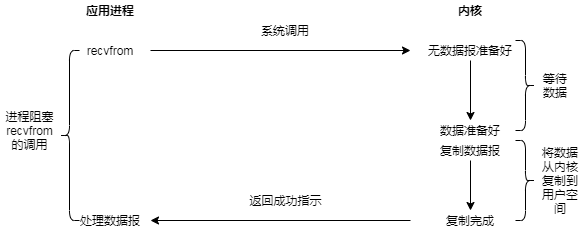
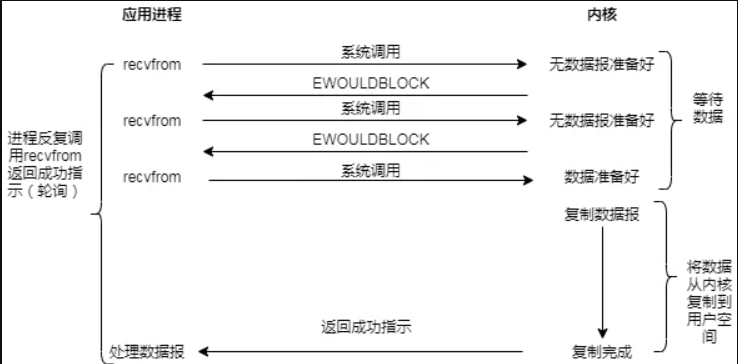
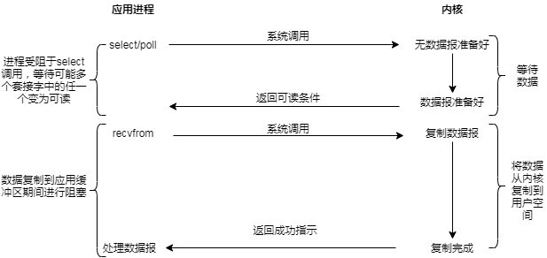
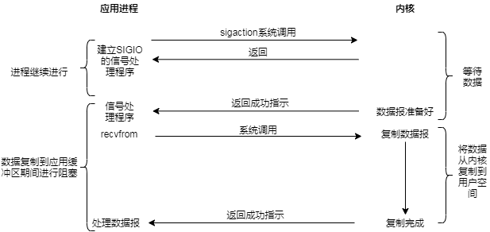
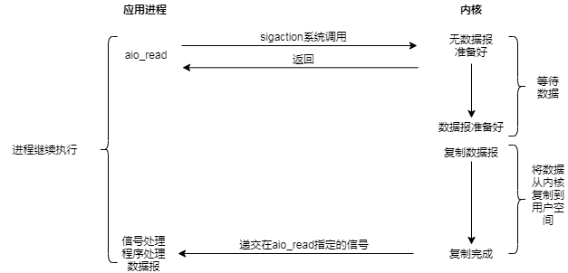

## 文件 ##

 Java 7 引入了 **java.nio.file** 包，过去人们通常把 **nio** 中的 **n** 理解为 **new** 即新的 **io**，现在应该理解为 **non-blocking** 非阻塞 **io**。

 Java 8 新增的 **stream** 与文件结合使得文件操作编程变得更加优雅。文件操作的两个基本组件：

1. 文件或者目录的路径；
2. 文件本身；

### 文件和目录路径 ###

一个 **Path** 对象表示一个文件或者目录的路径，是一个跨操作系统（OS）和文件系统的抽象，目的是在构造路径时不必关注底层操作系统，代码可以在不进行修改的情况下运行在不同的操作系统上。**java.nio.file.Paths** 类包含一个重载方法 **static get()**，该方法接受一系列 **String** 字符串或一个*统一资源标识符*（URI）作为参数，并且进行转换返回一个 **Path** 对象：

```java
public class PathInfo {
    static void show(String id, Object p) {
        System.out.println(id + ": " + p);
    }

    static void info(Path p) {
        show("toString", p);
        show("Exists", Files.exists(p));
        show("RegularFile", Files.isRegularFile(p));
        show("Directory", Files.isDirectory(p));
        show("Absolute", p.isAbsolute());
        show("FileName", p.getFileName());
        show("Parent", p.getParent());
        show("Root", p.getRoot());
        System.out.println("******************");
    }
    public static void main(String[] args) {
        System.out.println(System.getProperty("os.name"));
        info(Paths.get("C:", "path", "to", "nowhere", "NoFile.txt"));
        Path p = Paths.get("PathInfo.java");
        info(p);
        //绝对路径 将 parent 和当前文件或路径 简单拼接
        Path ap = p.toAbsolutePath();
        info(ap);
        info(ap.getParent());
        try {
            //真实绝对路径 文件或目录不存在会抛异常
            info(p.toRealPath());
        } catch(IOException e) {
           System.out.println(e);
        }
        URI u = p.toUri();
        System.out.println("URI: " + u);
        Path puri = Paths.get(u);
        System.out.println(Files.exists(puri));
        File f = ap.toFile(); // Don't be fooled
    }
}
```

#### 选取路径部分片段 ####

**Path** 对象可以非常容易地生成路径的某一部分：

```java
public class PartsOfPaths {
    public static void main(String[] args) {
        System.out.println(System.getProperty("os.name"));
        Path p = Paths.get("PartsOfPaths.java").toAbsolutePath();
        for(int i = 0; i < p.getNameCount(); i++)
            System.out.println(p.getName(i));
        System.out.println("ends with '.java': " +
        p.endsWith(".java"));
        for(Path pp : p) {
            System.out.print(pp + ": ");
            System.out.print(p.startsWith(pp) + " : ");
            System.out.println(p.endsWith(pp));
        }
        System.out.println("Starts with " + p.getRoot() + " " + p.startsWith(p.getRoot()));
    }
}
```

可以通过 **getName()** 来索引 **Path** 的各个部分，直到达到上限 **getNameCount()**。**Path** 也实现了 **Iterable** 接口，因此我们也可以通过增强的 for-each 进行遍历。请注意，即使路径以 **.java** 结尾，使用 **endsWith()** 方法也会返回 **false**。这是因为使用 **endsWith()** 比较的是整个路径部分，而不会包含文件路径的后缀。遍历 **Path** 对象并不包含根路径，只有使用 **startsWith()** 检测根路径时才会返回 **true**。

#### 路径分析 ####

**Files** 工具类包含一系列完整的方法用于获得 **Path** 相关的信息。

```java
public class PathAnalysis {
    static void say(String id, Object result) {
        System.out.print(id + ": ");
        System.out.println(result);
    }

    public static void main(String[] args) throws IOException {
        System.out.println(System.getProperty("os.name"));
        Path p = Paths.get("PathAnalysis.java").toAbsolutePath();
        say("Exists", Files.exists(p));
        say("Directory", Files.isDirectory(p));
        say("Executable", Files.isExecutable(p));
        say("Readable", Files.isReadable(p));
        say("RegularFile", Files.isRegularFile(p));
        say("Writable", Files.isWritable(p));
        say("notExists", Files.notExists(p));
        say("Hidden", Files.isHidden(p));
        say("size", Files.size(p));
        say("FileStore", Files.getFileStore(p));
        say("LastModified: ", Files.getLastModifiedTime(p));
        say("Owner", Files.getOwner(p));
        say("ContentType", Files.probeContentType(p));
        say("SymbolicLink", Files.isSymbolicLink(p));
        if(Files.isSymbolicLink(p))
            say("SymbolicLink", Files.readSymbolicLink(p));
        if(FileSystems.getDefault().supportedFileAttributeViews().contains("posix"))
            say("PosixFilePermissions",
        Files.getPosixFilePermissions(p));
    }
}
```

在调用最后一个测试方法 **getPosixFilePermissions()** 之前我们需要确认一下当前文件系统是否支持 **Posix** 接口，否则会抛出运行时异常。

### 文件系统 ###

使用静态的 **FileSystems** 工具类获取默认的文件系统，但你同样也可以在 **Path** 对象上调用 **getFileSystem()** 以获取创建该 **Path** 的文件系统。你可以获得给定 *URI* 的文件系统，还可以构建新的文件系统(对于支持它的操作系统)。一个 **FileSystem** 对象也能生成 **WatchService** 和 **PathMatcher** 对象。

```java
public class FileSystemDemo {
    static void show(String id, Object o) {
        System.out.println(id + ": " + o);
    }

    public static void main(String[] args) {
        System.out.println(System.getProperty("os.name"));
        FileSystem fsys = FileSystems.getDefault();
        for(FileStore fs : fsys.getFileStores())
            show("File Store", fs);
        for(Path rd : fsys.getRootDirectories())
            show("Root Directory", rd);
        show("Separator", fsys.getSeparator());
        show("UserPrincipalLookupService",
            fsys.getUserPrincipalLookupService());
        show("isOpen", fsys.isOpen());
        show("isReadOnly", fsys.isReadOnly());
        show("FileSystemProvider", fsys.provider());
        show("File Attribute Views",
        fsys.supportedFileAttributeViews());
    }
}
```

### 路径监听 ###

通过 **WatchService** 可以设置一个进程对目录中的更改做出响应。在这个例子中，**delTxtFiles()** 作为一个单独的任务执行，该任务将遍历整个目录并删除以 **.txt** 结尾的所有文件，**WatchService** 会对文件删除操作做出反应：

```java
import static java.nio.file.StandardWatchEventKinds.*;
public class PathWatcher {
    static Path test = Paths.get("test");

    static void delTxtFiles() {
        try {
            Files.walk(test)
            .filter(f ->
                f.toString()
                .endsWith(".txt"))
                .forEach(f -> {
                try {
                    System.out.println("deleting " + f);
                    Files.delete(f);
                } catch(IOException e) {
                    throw new RuntimeException(e);
                }
            });
        } catch(IOException e) {
            throw new RuntimeException(e);
        }
    }

    public static void main(String[] args) throws Exception {
        Files.createFile(test.resolve("Hello.txt"));
        WatchService watcher = FileSystems.getDefault().newWatchService();
        test.register(watcher, ENTRY_DELETE);
        
        Executors.newSingleThreadScheduledExecutor()
        .schedule(PathWatcher::delTxtFiles,
        250, TimeUnit.MILLISECONDS);
        
        WatchKey key = watcher.take();
        for(WatchEvent evt : key.pollEvents()) {
            System.out.println("evt.context(): " + evt.context() +
            "\nevt.count(): " + evt.count() +
            "\nevt.kind(): " + evt.kind());
            System.exit(0);
        }
    }
}
```

注意的是在 **filter()** 中，我们必须显式地使用 **f.toString()** 转为字符串，否则我们调用 **endsWith()** 将会与整个 **Path** 对象进行比较，而不是路径名称字符串的一部分进行比较。

一旦我们从 **FileSystem** 中得到了 **WatchService** 对象，我们将其注册到 **test** 路径以及我们感兴趣的项目的变量参数列表中，可以选择 **ENTRY_CREATE**，**ENTRY_DELETE** 或 **ENTRY_MODIFY**(其中创建和删除不属于修改)。

因为接下来对 **watcher.take()** 的调用会在发生某些事情之前停止所有操作，所以我们希望 **deltxtfiles()** 能够并行运行以便生成我们感兴趣的事件。为了实现这个目的，我通过调用 **Executors.newSingleThreadScheduledExecutor()** 产生一个 **ScheduledExecutorService** 对象，然后调用 **schedule()** 方法传递所需函数的方法引用，并且设置在运行之前应该等待的时间。

此时，**watcher.take()** 将等待并阻塞在这里。当目标事件发生时，会返回一个包含 **WatchEvent** 的 **Watchkey** 对象。展示的这三种方法是能对 **WatchEvent** 执行的全部操作。

查看输出的具体内容。即使我们正在删除以 **.txt** 结尾的文件，在 **Hello.txt** 被删除之前，**WatchService** 也不会被触发。你可能认为，如果说"监视这个目录"，自然会包含整个目录和下面子目录，但实际上：只会监视给定的目录，而不是下面的所有内容。如果需要监视整个树目录，必须在整个树的每个子目录上放置一个 **WatchService**。

### 文件查找 ###

到目前为止，为了找到文件，我们一直使用相当粗糙的方法，在 `path` 上调用 `toString()`，然后使用 `string` 操作查看结果。事实证明，`java.nio.file` 有更好的解决方案：通过在 `FileSystem` 对象上调用 `getPathMatcher()` 获得一个 `PathMatcher`，然后传入您感兴趣的模式。模式有两个选项：`glob` 和 `regex`。`glob` 比较简单，实际上功能非常强大，因此您可以使用 `glob` 解决许多问题。如果您的问题更复杂，可以使用 `regex`。

### 文件读写 ###

我们可以对路径和目录做任何事情。 现在让我们看一下操纵文件本身的内容。

如果一个文件很“小”，也就是说“它运行得足够快且占用内存小”，那么 `java.nio.file.Files` 类中的实用程序将帮助你轻松读写文本和二进制文件。

`Files.readAllLines()` 一次读取整个文件（因此，“小”文件很有必要），产生一个`List<String>`。 对于示例文件，我们将重用`Cheese.dat`：

```java
public class ListOfLines {
    public static void main(String[] args) throws Exception {
        Files.readAllLines(
        Paths.get("Cheese.dat"))
        .stream()
        .filter(line -> !line.startsWith("//"))
        .map(line ->
            line.substring(0, line.length()/2))
        .forEach(System.out::println);
    }
}
```

跳过注释行，其余的内容每行只打印一半。 这实现起来很简单：你只需将 `Path` 传递给 `readAllLines()` （以前的 java 实现这个功能很复杂）。`readAllLines()` 有一个重载版本，包含一个 `Charset` 参数来存储文件的 Unicode 编码。

`Files.write()` 被重载以写入 `byte` 数组或任何 `Iterable` 对象（它也有 `Charset` 选项）：

```java
public class Writing {
    static Random rand = new Random(47);
    static final int SIZE = 1000;

    public static void main(String[] args) throws Exception {
        // Write bytes to a file:
        byte[] bytes = new byte[SIZE];
        rand.nextBytes(bytes);
        Files.write(Paths.get("bytes.dat"), bytes);
        System.out.println("bytes.dat: " + 						 	 	  	      Files.size(Paths.get("bytes.dat")));

        // Write an iterable to a file:
        List<String> lines = Files.readAllLines(
          Paths.get("../streams/Cheese.dat"));
        Files.write(Paths.get("Cheese.txt"), lines);
        System.out.println("Cheese.txt: " + 		  						 	Files.size(Paths.get("Cheese.txt")));
    }
}
```

我们使用 `Random` 来创建一个随机的 `byte` 数组; 你可以看到生成的文件大小是 1000。

一个 `List` 被写入文件，任何 `Iterable` 对象也可以这么做。

如果文件大小有问题怎么办？ 比如说：

1. 文件太大，如果你一次性读完整个文件，你可能会耗尽内存。
2. 您只需要在文件的中途工作以获得所需的结果，因此读取整个文件会浪费时间。

`Files.lines()` 方便地将文件转换为行的 `Stream`：

```java
public class ReadLineStream {
    public static void main(String[] args) throws Exception {
        Files.lines(Paths.get("PathInfo.java"))
          .skip(13)
          .findFirst()
          .ifPresent(System.out::println);
    }
}
/* Output:
    show("RegularFile", Files.isRegularFile(p));
*/
```

这对本章中第一个示例代码做了流式处理，跳过 13 行，然后选择下一行并将其打印出来。

`Files.lines()` 对于把文件处理行的传入流时非常有用，但是如果你想在 `Stream` 中读取，处理或写入怎么办？这就需要稍微复杂的代码：

```java
public class StreamInAndOut {
    public static void main(String[] args) {
        try(
          Stream<String> input =
            Files.lines(Paths.get("StreamInAndOut.java"));
          PrintWriter output =
            new PrintWriter("StreamInAndOut.txt")
        ) {
            input.map(String::toUpperCase)
              .forEachOrdered(output::println);
        } catch(Exception e) {
            throw new RuntimeException(e);
        }
    }
}
```

因为我们在同一个块中执行所有操作，所以这两个文件都可以在相同的 try-with-resources 语句中打开。`PrintWriter` 是一个旧式的 `java.io` 类，允许你“打印”到一个文件，所以它是这个应用的理想选择。如果你看一下 `StreamInAndOut.txt`，你会发现它里面的内容确实是大写的。


## 传统 I/O ##

实现良好的输入/输出（I/O）系统是一项艰难的任务，不仅要覆盖到不同的 I/O 源和 I/O 接收器（如文件、控制台、网络连接等），还要实现多种与它们进行通信的方式（如顺序、随机访问、缓冲、二进制、字符、按行和按字等）。

### 输入流类型 ###

`InputStream` 表示那些从不同数据源产生输入的类，这些数据源包括：

1. 字节数组；
2. `String` 对象；
3. 文件；
4. “管道”，工作方式与实际生活中的管道类似：从一端输入，从另一端输出；
5. 一个由其它种类的流组成的序列，然后我们可以把它们汇聚成一个流；
6. 其它数据源，如 Internet 连接。

每种数据源都有相应的 `InputStream` 子类。另外，`FilterInputStream` 也属于一种 `InputStream`，它的作用是为“装饰器”类提供基类。其中，“装饰器”类可以把属性或有用的接口与输入流连接在一起。

**`InputStream` 的类型：**

| 类                                        | 功能                                                         | 构造器参数                                                   | 如何使用                                                     |
| ----------------------------------------- | ------------------------------------------------------------ | ------------------------------------------------------------ | ------------------------------------------------------------ |
| `ByteArrayInputStream`                    | 允许将内存的缓冲区当做 `InputStream` 使用                    | 缓冲区，字节将从中取出                                       | 作为一种数据源：将其与 `FilterInputStream` 对象相连以提供有用接口 |
| @Deprecated<br/>`StringBufferInputStream` | 将 `String` 转换成 `InputStream`                             | 字符串。底层实现实际使用 `StringBuffer`                      | 作为一种数据源：将其与 `FilterInputStream` 对象相连以提供有用接口 |
| `FileInputStream`                         | 用于从文件中读取信息                                         | 字符串，表示文件名、文件或 `FileDescriptor` 对象             | 作为一种数据源：将其与 `FilterInputStream` 对象相连以提供有用接口 |
| `PipedInputStream`                        | 产生用于写入相关 `PipedOutputStream` 的数据。实现“管道化”概念 | `PipedOutputSteam`                                           | 作为多线程中的数据源：将其与 `FilterInputStream` 对象相连以提供有用接口 |
| `SequenceInputStream`                     | 将两个或多个 `InputStream` 对象转换成一个 `InputStream`      | 两个 `InputStream` 对象或一个容纳 `InputStream` 对象的容器 `Enumeration` | 作为一种数据源：将其与 `FilterInputStream` 对象相连以提供有用接口 |
| `FilterInputStream`                       | 抽象类，作为“装饰器”的接口。其中，“装饰器”为其它的 `InputStream` 类提供有用的功能。 |                                                              |                                                              |


### 输出流类型 ###

`OutputStream` 表示输出所要去往的目标：字节数组、文件或管道。另外，`FilterOutputStream` 为“装饰器”类提供了一个基类，“装饰器”类把属性或者有用的接口与输出流连接了起来。

**`OutputStream` 类型：**

| 类                      | 功能                                                         | 构造器参数                                       | 如何使用                                                     |
| ----------------------- | ------------------------------------------------------------ | ------------------------------------------------ | ------------------------------------------------------------ |
| `ByteArrayOutputStream` | 在内存中创建缓冲区。所有送往“流”的数据都要放置在此缓冲区     | 缓冲区初始大小（可选）                           | 用于指定数据的目的地：将其与 `FilterOutputStream` 对象相连以提供有用接口 |
| `FileOutputStream`      | 用于将信息写入文件                                           | 字符串，表示文件名、文件或 `FileDescriptor` 对象 | 用于指定数据的目的地：将其与 `FilterOutputStream` 对象相连以提供有用接口 |
| `PipedOutputStream`     | 任何写入其中的信息都会自动作为相关 `PipedInputStream` 的输出。实现“管道化”概念 | `PipedInputStream`                               | 指定用于多线程的数据的目的地：将其与 `FilterOutputStream` 对象相连以提供有用接口 |
| `FilterOutputStream`    | 抽象类，作为“装饰器”的接口。其中，“装饰器”为其它 `OutputStream` 提供有用功能。 |                                                  |                                                              |


### 流的装饰器 ###

Java I/O 类库需要多种不同功能的组合，这正是使用**装饰器模式**的原因所在。

#### FilterInputStream ####

`FilterInputStream` 类能够完成两件截然不同的事情。其中，`DataInputStream` 允许我们读取不同的基本数据类型和 `String` 类型的对象（所有方法都以 “read” 开头，例如 `readByte()`、`readFloat()`等等）。搭配其对应的 `DataOutputStream`，我们就可以通过数据“流”将基本数据类型的数据从一个地方迁移到另一个地方。

其它 `FilterInputStream` 类则在内部修改 `InputStream` 的行为方式：是否缓冲，是否保留它所读过的行（允许我们查询行数或设置行数），以及是否允许把单个字符推回输入流等等。

**`FilterInputStream` 类型：**

| 类                                      | 功能                                                         | 构造器参数                                | 如何使用                                                 |
| --------------------------------------- | ------------------------------------------------------------ | ----------------------------------------- | -------------------------------------------------------- |
| `DataInputStream`                       | 与 `DataOutputStream` 搭配使用，按照移植方式从流读取基本数据类型（`int`、`char`、`long` 等） | `InputStream`                             | 包含用于读取基本数据类型的全部接口                       |
| `BufferedInputStream`                   | 使用它可以防止每次读取时都得进行实际写操作。代表“使用缓冲区” | `InputStream`，可以指定缓冲区大小（可选） | 本质上不提供接口，只是向进程添加缓冲功能。与接口对象搭配 |
| @Deprecated<br/>`LineNumberInputStream` | 跟踪输入流中的行号，可调用 `getLineNumber()` 和 `setLineNumber(int)` | `InputStream`                             | 仅增加了行号，因此可能要与接口对象搭配使用               |
| `PushbackInputStream`                   | 具有能弹出一个字节的缓冲区，因此可以将读到的最后一个字符回退 | `InputStream`                             | 通常作为编译器的扫描器，我们可能永远也不会用到           |


#### FilterOutputStream ####

与 `DataInputStream` 对应的是 `DataOutputStream`，它可以将各种基本数据类型和 `String` 类型的对象格式化输出到“流”中，。这样一来，任何机器上的任何 `DataInputStream` 都可以读出它们。所有方法都以 “write” 开头，例如 `writeByte()`、`writeFloat()` 等等。

`PrintStream` 最初的目的就是为了以可视化格式打印所有基本数据类型和 `String` 类型的对象。这和 `DataOutputStream` 不同，后者的目的是将数据元素置入“流”中，使 `DataInputStream` 能够可移植地重构它们。

`PrintStream` 内有两个重要方法：`print()` 和 `println()`。它们都被重载了，可以打印各种各种数据类型。`print()` 和 `println()` 之间的差异是，后者在操作完毕后会添加一个换行符。

**`FilterOutputStream` 类型：**

| 类                     | 功能                                                         | 构造器参数                                                   | 如何使用                                                     |
| ---------------------- | ------------------------------------------------------------ | ------------------------------------------------------------ | ------------------------------------------------------------ |
| `DataOutputStream`     | 与 `DataInputStream` 搭配使用，因此可以按照移植方式向流中写入基本数据类型（`int`、`char`、`long` 等） | `OutputStream`                                               | 包含用于写入基本数据类型的全部接口                           |
| `PrintStream`          | 用于产生格式化输出。其中 `DataOutputStream` 处理数据的存储，`PrintStream` 处理显示 | `OutputStream`，可以用 `boolean` 值指示是否每次换行时清空缓冲区（可选） | 应该是对 `OutputStream` 对象的 `final` 封装。可能会经常用到它 |
| `BufferedOutputStream` | 使用它以避免每次发送数据时都进行实际的写操作。代表“使用缓冲区”。可以调用 `flush()` 清空缓冲区 | `OutputStream`，可以指定缓冲区大小（可选）                   | 本质上并不提供接口，只是向进程添加缓冲功能。与接口对象搭配   |


### Reader 和 Writer ###

Java 1.1 在 I/O 流类库中加入了用于处理字符的`Reader` 和 `Writer` 。 `InputStream` 和 `OutputStream` 在面向字节 I/O 处理发挥着重要的作用，而 `Reader` 和 `Writer` 则提供兼容 Unicode 和面向字符 I/O 的功能。

有时我们必须把来自“字节”层级结构中的类和来自“字符”层次结构中的类结合起来使用。为了达到这个目的，需要用到“适配器（adapter）类”：`InputStreamReader` 可以把 `InputStream` 转换为 `Reader`，而 `OutputStreamWriter` 可以把 `OutputStream` 转换为 `Writer`。

设计 `Reader` 和 `Writer` 继承体系主要是为了国际化。老的 I/O 流继承体系仅支持 8 比特的字节流，并且不能很好地处理 16 比特的 Unicode 字符。由于 Unicode 用于字符国际化（Java 本身的 `char` 也是 16 比特的 Unicode），所以添加 `Reader` 和 `Writer` 继承体系就是为了让所有的 I/O 操作都支持 Unicode。

#### 数据的来源和去处 ####

几乎所有原始的 Java I/O 流类都有相应的 `Reader` 和 `Writer` 类来提供原生的 Unicode 操作。但是在某些场合，面向字节的 `InputStream` 和 `OutputStream` 才是正确的解决方案。`java.util.zip` 类库就是面向字节而不是面向字符的。所以，尽量尝试使用 `Reader` 和 `Writer`，必要时才使用面向字节的类库。

下表展示了在两个继承体系中，信息的来源和去处之间的对应关系：

| 来源与去处：Java 1.0 类             | 相应的 Java 1.1 类                    |
| ----------------------------------- | ------------------------------------- |
| `InputStream`                       | `Reader` 适配器：`InputStreamReader`  |
| `OutputStream`                      | `Writer` 适配器：`OutputStreamWriter` |
| `FileInputStream`                   | `FileReader`                          |
| `FileOutputStream`                  | `FileWriter`                          |
| `StringBufferInputStream`（已弃用） | `StringReader`                        |
| （无相应的类）                      | `StringWriter`                        |
| `ByteArrayInputStream`              | `CharArrayReader`                     |
| `ByteArrayOutputStream`             | `CharArrayWriter`                     |
| `PipedInputStream`                  | `PipedReader`                         |
| `PipedOutputStream`                 | `PipedWriter`                         |

#### 字符流的装饰器 ####

| 装饰器：Java 1.0 类     | 相应 Java 1.1 类                                             |
| ----------------------- | ------------------------------------------------------------ |
| `FilterInputStream`     | `FilterReader`                                               |
| `FilterOutputStream`    | `FilterWriter` (抽象类，没有子类)                            |
| `BufferedInputStream`   | `BufferedReader`（也有 `readLine()`)                         |
| `BufferedOutputStream`  | `BufferedWriter`                                             |
| `DataInputStream`       | 使用 `DataInputStream`（ 如果必须用到 `readLine()`，那你就得使用 `BufferedReader`。否则，一般情况下就用 `DataInputStream` |
| `PrintStream`           | `PrintWriter`                                                |
| `LineNumberInputStream` | `LineNumberReader`                                           |
| `StreamTokenizer`       | `StreamTokenizer`（使用具有 `Reader` 参数的构造器）          |
| `PushbackInputStream`   | `PushbackReader`                                             |


### RandomAccessFile ###

RandomAccessFile 类是 Java IO 体系中功能最为丰富的文件访问类，它提供了众多的文件访问方法。RandomAccessFile 类支持“随机访问”方式，这里的“随机”是指程序可以直接跳到文件的任意位置来读写数据。

RandomAccessFile 用两个方法来操作文件记录指针：

```java
long getFilePointer() //返回文件记录指针的当前位置
void seek(long pos) //将文件记录指针定位到pos位置
```

RandomAccessFile 有两个构造器：

```java
RandomAccessFile(File file ,  String mode)  //创建文件流，文件属性由参数File对象指定
RandomAccessFile(String name ,  String mode) //创建文件流，文件名由参数name指定
```

除了指定文件以外，还需要指定一个 mode 参数，该参数指定 RandomAccessFile 的访问模式，该参数有如下四个值：

```
r：以只读方式打开指定文件。如果试图对该 RandomAccessFile 指定的文件执行写入方法则会抛出IOException。
rw：以读取、写入方式打开指定文件。如果该文件不存在，则尝试创建文件。
rws：以读取、写入方式打开指定文件。相对于rw模式，还要求对文件的内容或元数据的每个更新都同步写入到底层存储设备，默认情形下（rw 模式下）,是使用 buffer 的,只有 cache 满的或者使用 RandomAccessFile.close() 关闭流的时候儿才真正的写到文件。
rwd：与 rws 类似，只是仅对文件的内容同步更新到磁盘，而不修改文件的元数据。
```

在 Java 1.4 中，`RandomAccessFile` 的大多数功能都被 nio 中的**内存映射文件**（mmap）取代。

### I/O 流典型用途 ###

以下例子可以作为 I/O 典型用法的基本参照。

#### 缓冲输入文件 ####

如果想要打开一个文件并且按字符输入，我们可以使用一个 `FileReader` 对象，然后传入一个 `String` 或者 `File` 对象作为文件名。为了提高速度，我们希望对那个文件进行缓冲，那么我们可以将所产生的引用传递给一个 `BufferedReader` 构造器。`BufferedReader` 提供了 `line()` 方法，它会产生一个 `Stream<String>` 对象：

```java
public class BufferedInputFile {
    public static String read(String filename) {
        try (BufferedReader in = new BufferedReader(new FileReader(filename))) 
        {
            return in.lines()
                    .collect(Collectors.joining("\n"));
        } catch (IOException e) {
            throw new RuntimeException(e);
        }
    }

    public static void main(String[] args) {
        System.out.print(
                read("BufferedInputFile.java"));
    }
}
```

如果每次操作都是以一个字节/字符为单位，显然这样的数据传输效率很低。为了提高数据传输效率，通常使用缓冲流，即为一个流配有一个**缓冲区**（Buffer），这个缓冲区就是专门用于传送数据的一块内存。

**当向一个缓冲流写入数据时，系统将数据发送到缓冲区，而不是直接发送到外部设备。缓冲区自动记录数据，当缓冲区满时，系统将数据全部发送到相应的外部设备**。而且当从一个缓冲流中读取数据时，系统实际是从缓冲区中读取数据。当缓冲区空时，系统就会从相关外部设备自动读取数据，并读取尽可能多的数据填满缓冲区。由此可见，缓冲流提供了内存与外部设备之间的数据传输效率。

#### 从内存输入 ####

下面示例中，从 `BufferedInputFile.read()` 读入的 `String` 被用来创建一个 `StringReader` 对象。然后调用其 `read()` 方法，每次读取一个字符，并把它显示在控制台上：

```java
public class MemoryInput {
    public static void main(String[] args) throws IOException {
        StringReader in = new StringReader(
                BufferedInputFile.read("MemoryInput.java"));
        int c;
        while ((c = in.read()) != -1)
            System.out.print((char) c);
    }
}

```

注意 `read()` 是以 `int` 形式返回下一个字节，所以必须类型转换为 `char` 才能正确打印。

#### 基本文件的输出 ####

`FileWriter` 对象用于向文件写入数据。实际使用时，我们通常会用 `BufferedWriter` 将其包装起来以增加缓冲的功能（可以试试移除此包装来感受一下它对性能的影响——缓冲往往能显著地增加 I/O 操作的性能）。在本例中，为了提供格式化功能，它又被装饰成了 `PrintWriter`。按照这种方式创建的数据文件可作为普通文本文件来读取。

```java
public class BasicFileOutput {
    static String file = "BasicFileOutput.dat";
    public static void main(String[] args) {
        try (
            BufferedReader in = new BufferedReader(
                new StringReader(
                     BufferedInputFile.read("BasicFileOutput.java")));
                PrintWriter out = new PrintWriter(
                    new BufferedWriter(new FileWriter(file)))
        ) {
            in.lines().forEach(out::println);
        } catch (IOException e) {
            throw new RuntimeException(e);
        }
        // Show the stored file:
        System.out.println(BufferedInputFile.read(file));
    }
}
```

#### 存储和恢复数据 ####

`PrintWriter` 是用来对可读的数据进行格式化。但如果要输出可供另一个“流”恢复的数据，我们可以用 `DataOutputStream` 写入数据，然后用 `DataInputStream` 恢复数据。

```java
public class StoringAndRecoveringData {
    public static void main(String[] args) {
        try (
            DataOutputStream out = new DataOutputStream(
                new BufferedOutputStream(new FileOutputStream("Data.txt")))
        ) {
            out.writeDouble(3.14159);
            out.writeUTF("That was pi");
            out.writeDouble(1.41413);
            out.writeUTF("Square root of 2");
        } catch (IOException e) {
            throw new RuntimeException(e);
        }
        try (
            DataInputStream in = new DataInputStream(
                new BufferedInputStream(new FileInputStream("Data.txt")))
        ) {
            System.out.println(in.readDouble());
            System.out.println(in.readUTF());
            System.out.println(in.readDouble());
            System.out.println(in.readUTF());
        } catch (IOException e) {
            throw new RuntimeException(e);
        }
    }
}
```

如果我们使用 `DataOutputStream` 进行数据写入，那么 Java 就保证了即便读和写数据的平台多么不同，我们仍可以使用 `DataInputStream` 准确地读取数据，但是我们必须知道流中数据项所在的确切位置。

#### 读写随机访问文件 ####

使用 `RandomAccessFile` 就像是使用了一个 `DataInputStream` 和 `DataOutputStream` 的结合体（因为它实现了相同的接口：`DataInput` 和 `DataOutput`）。另外，我们还可以使用 `seek()` 方法移动文件指针并修改对应位置的值。

在使用 `RandomAccessFile` 时，你必须清楚文件的结构，否则没法正确使用它。`RandomAccessFile` 有一套专门的方法来读写基本数据类型的数据和 UTF-8 编码的字符串：

```java
public class UsingRandomAccessFile {
    static String file = "rtest.dat";
    public static void display() {
        try (
            RandomAccessFile rf = new RandomAccessFile(file, "r")
        ) {
            for (int i = 0; i < 7; i++)
                System.out.println("Value " + i + ": " + rf.readDouble());
            System.out.println(rf.readUTF());
        } catch (IOException e) {
            throw new RuntimeException(e);
        }
    }

    public static void main(String[] args) {
        try (
            RandomAccessFile rf = new RandomAccessFile(file, "rw")
        ) {
            for (int i = 0; i < 7; i++)
                rf.writeDouble(i * 1.414);
            rf.writeUTF("The end of the file");
            rf.close();
            display();
        } catch (IOException e) {
            throw new RuntimeException(e);
        }
        try (
            RandomAccessFile rf = new RandomAccessFile(file, "rw")
        ) { //因为 double 是 8 字节，所以如果要用 seek() 定位到第 5 个 double 值
            //则要传入的地址值应该为 5*8。
            rf.seek(5 * 8);
            rf.writeDouble(47.0001);
            rf.close();
            display();
        } catch (IOException e) {
            throw new RuntimeException(e);
        }
    }
}
```

### 标准 I/O ###

**标准 I/O ：指程序所使用的单一信息流。**

程序的所有输入都可以来自于**标准输入**，其所有输出都可以流向**标准输出**，并且其所有错误信息均可以发送到**标准错误**。标准 I/O 的意义在于程序之间可以很容易地连接起来，一个程序的标准输出可以作为另一个程序的标准输入。

Java 遵循标准 I/O 模型，提供了标准输入流 `System.in`、标准输出流 `System.out` 和标准错误流 `System.err`。

### 从标准输入中读取 ###

我们通常一次一行地读取输入。为了实现这个功能，将 `System.in` 包装成 `BufferedReader` 来使用，这要求我们用 `InputStreamReader` 把 `System.in` 转换成 `Reader` 。

```java
public class Echo {
    public static void main(String[] args) {
        new BufferedReader(new InputStreamReader(System.in))
                .lines()
                .forEach(System.out::println);
    }
}
```

### 将标准输出转换成 PrintWriter ###

`System.out` 是一个 `PrintStream`，而 `PrintStream` 是一个`OutputStream`。 `PrintWriter` 有一个把 `OutputStream` 作为参数的构造器。因此，如果你需要的话，可以使用这个构造器把 `System.out` 转换成 `PrintWriter` 。

```java
public class ChangeSystemOut {
    public static void main(String[] args) {
        PrintWriter out = new PrintWriter(System.out, true);
        out.println("Hello, world");
    }
}
```

要使用 `PrintWriter` 带有两个参数的构造器，并设置第二个参数为 `true`，从而使能自动刷新到输出缓冲区的功能；否则，可能无法看到打印输出。

### 重定向标准 I/O ###

Java 的 `System` 类提供了简单的 `static` 方法调用，从而能够重定向标准输入流、标准输出流和标准错误流：

- setIn(InputStream)
- setOut(PrintStream)
- setErr(PrintStream)

如果我们突然需要在显示器上创建大量的输出，而这些输出滚动的速度太快以至于无法阅读时，重定向输出就显得格外有用，可把输出内容重定向到文件中供后续查看。

```java
public class Redirecting {
    public static void main(String[] args) {
        PrintStream console = System.out;
        try (
                BufferedInputStream in = new BufferedInputStream(
                        new FileInputStream("Redirecting.java"));
                PrintStream out = new PrintStream(
                        new BufferedOutputStream(
                                new FileOutputStream("Redirecting.txt")))
        ) {
            //重定向
            System.setIn(in);
            System.setOut(out);
            System.setErr(out);
            //调用重定向之后的标准 I/O
            new BufferedReader(new InputStreamReader(System.in))
                    .lines()
                    .forEach(System.out::println);
        } catch (IOException e) {
            throw new RuntimeException(e);
        } finally {
            System.setOut(console);
        }
    }
}
```

该程序将文件中内容载入到标准输入，并把标准输出和标准错误重定向到另一个文件。它在程序的开始保存了最初对 `System.out` 对象的引用，并且在程序结束时将系统输出恢复到了该对象上。

I/O 重定向操作的是字节流而不是字符流，因此使用 `InputStream` 和 `OutputStream`，而不是 `Reader` 和 `Writer`。


## NIO ##

Java 在 1.4 版本引入了 `java.nio.*` 类库。

实际上，新 I/O 使用 **NIO**（同步非阻塞）的方式重写了老的 I/O 了，因此它获得了 **NIO** 的种种优点。即使我们不显式地使用 **NIO** 方式来编写代码，也能带来性能和速度的提高。这种提升不仅仅体现在文件读写（File I/O），同时也体现在网络读写（Network I/O）中。例如，网络编程。

速度的提升来自于使用了更接近操作系统 I/O 执行方式的结构：**Channel**（通道） 和 **Buffer**（缓冲区）。我们可以想象一个煤矿：通道就是连接矿层（数据）的矿井，缓冲区是运送煤矿的小车。通过小车装煤，再从车里取矿。

### Channel ###

```
java.nio.channels.Channel 接口：
用于本地数据传输：
    1. FileChannel
用于网络数据传输：
    1. SocketChannel
    2. ServerSocketChannel
    3. DatagramChannel
获取通道
    Java 针对支持通道的类提供了一个 getChannel() 方法。

本地 IO 操作：
    1. FileInputStream/FileOutputStream
    2. RandomAccessFile
网络 IO 操作：
    1. Socket
    2. ServerSocket
    3. DatagramSocket
在 JDK1.7 中的 NIO.2 针对各个通道提供了静态方法 open();
在 JDK1.7 中的 NIO.2 的 Files 工具类的 newByteChannel();
```

### Buffer ###

在 NIO 中，缓冲区的作用也是用来临时存储数据，可以理解为是 I/O 操作中数据的中转站。缓冲区直接为通道（Channel）服务，写入数据到通道或从通道读取数据，这样的操利用缓冲区数据来传递就可以达到对数据高效处理的目的。NIO 为七种基本数据类型（除了布尔类型）提供了对应的 Buffer（如 ByteBuffer、CharBuffer 等），还提供了专门用于内存映射的 **MappedByteBuffer**。

有且仅有 **ByteBuffer**（保存原始字节的缓冲区）这一类型可直接与通道交互。它是相当基础的：通过初始化某个大小的存储空间，再使用一些方法以原始字节形式或原始数据类型来放置和获取数据。但是我们无法直接存放对象，即使是最基本的 **String** 类型数据。这是一个相当底层的操作，也正因如此，使得它与大多数操作系统的映射更加高效。

旧式 I/O 中的三个类分别被更新成 **FileChannel**（文件通道），分别是：**FileInputStream**、**FileOutputStream**，以及用于读写的 **RandomAccessFile** 类。

下面使用上述三种类型的流生成可读、可写、可读/写的通道：

```java
public class GetChannel {
    private static String name = "data.txt";
    private static final int BSIZE = 1024;

    public static void main(String[] args) {
        // 写入一个文件:
        try (
                FileChannel fc = new FileOutputStream(name).getChannel()
        ) {
            fc.write(ByteBuffer.wrap("Some text ".getBytes()));
        } catch (IOException e) {
            throw new RuntimeException(e);
        }
        // 在文件尾添加：
        try (
                FileChannel fc = new RandomAccessFile(name, "rw").getChannel()
        ) {
            fc.position(fc.size()); // 移动到结尾
            fc.write(ByteBuffer.wrap("Some more".getBytes()));
        } catch (IOException e) {
            throw new RuntimeException(e);
        }
        // 读取文件e:
        try (
                FileChannel fc = new FileInputStream(name).getChannel()
        ) {
            ByteBuffer buff = ByteBuffer.allocate(BSIZE);
            fc.read(buff);
            buff.flip();
            while (buff.hasRemaining()) {
                System.out.write(buff.get());
            }
        } catch (IOException e) {
            throw new RuntimeException(e);
        }
        System.out.flush();
    }
}
```

#### 复制文件 ####

```java
//复制文件(使用非直接缓冲区)
public static void testChannel(String src, String dest) {
    try (
            FileInputStream fis = new FileInputStream(src);
            FileOutputStream fos = new FileOutputStream(dest);
            FileChannel in = fis.getChannel();
            FileChannel out = fos.getChannel();
    ) {
        ByteBuffer byteBuffer = ByteBuffer.allocate(1024);
        //读取数据到缓冲区
        while (in.read(byteBuffer) != -1) {
            //转换成写模式
            byteBuffer.flip();
            //将缓冲区中的数据写出去
            out.write(byteBuffer);
            //清除缓冲区
            byteBuffer.clear();
        }
      // 还可以直接连接此通道到彼通道
      // in.transferTo(0, in.size(), out);
      // 或者
      // out.transferFrom(in, 0, in.size());
    } catch (IOException e) {
        e.printStackTrace();
    }
}
```

### 数据转换 ###

 使用 byteBuffer.asCharBuffer() 来转换成 CharBuffer 的时候，默认采用  `UTF-16BE` 来解码。

- UTF-16BE 大端模式：Big-Endian 将高序字节存储在起始地址（高位编址）（默认）。
- UTF-16LE 小端模式：Little-Endian 将低序字节存储在起始地址（低位编址）。

```java
class BufferToText {
    private static final int BSIZE = 1024;
    public static void main(String[] args) {
        try (
                FileChannel fc = new FileOutputStream("data2.txt").getChannel()
        ) {
            // 使用了系统默认的 UTF-8 编码
            byte[] bytes = "Some text".getBytes();
            fc.write(ByteBuffer.wrap(bytes));
        } catch (IOException e) {
            throw new RuntimeException(e);
        }
        ByteBuffer buff = ByteBuffer.allocate(BSIZE);
        try (
                FileChannel fc = new FileInputStream("data2.txt").getChannel()
        ) {
            fc.read(buff);
        } catch (IOException e) {
            throw new RuntimeException(e);
        }
        buff.flip();
        // 出现乱码 --> 默认以 UTF-16BE 来将 ByteBuffer 解码成 CharBuffer，而编码时使用了系统默认的 UTF-8
        System.out.println(buff.asCharBuffer());
        // 使用系统默认编码格式进行解码
        buff.rewind();
        String encoding = System.getProperty("file.encoding");
        System.out.println("Decoded using " + encoding + ": " + Charset.forName(encoding).decode(buff));

        //---------------------------------------------
        // 先编码再打印
        try (
                FileChannel fc = new FileOutputStream("data2.txt").getChannel()
        ) {
            fc.write(ByteBuffer.wrap("Some 			text".getBytes(StandardCharsets.UTF_16BE)));
        } catch (IOException e) {
            throw new RuntimeException(e);
        }
        // 尝试再次读取：
        buff.clear();
        try (
                FileChannel fc = new FileInputStream("data2.txt").getChannel()
        ) {
            fc.read(buff);
        } catch (IOException e) {
            throw new RuntimeException(e);
        }
        buff.flip();
        System.out.println(buff.asCharBuffer());

        //------------------------------------------------
        // 通过 CharBuffer 写入：
        buff = ByteBuffer.allocate(24);
        CharBuffer charBuffer = buff.asCharBuffer();
        // CharBuffer 默认是以 UTF-16BE 编码
        charBuffer.put("Some text");
        try (
                FileChannel fc = new FileOutputStream("data2.txt").getChannel()
        ) {
            fc.write(buff);
        } catch (IOException e) {
            throw new RuntimeException(e);
        }
        // 读取和显示：
        buff.clear();
        try (
                FileChannel fc = new FileInputStream("data2.txt").getChannel()
        ) {
            fc.read(buff);
        } catch (IOException e) {
            throw new RuntimeException(e);
        }
        buff.flip();
        System.out.println(buff.asCharBuffer());
    }
}
```


### 基本类型获取 ###

虽然 **ByteBuffer** 只包含字节，但它包含了一些方法，用于从其所包含的字节中生成各种不同的基本类型数据。代码示例：

```java
public class GetData {
  private static final int BSIZE = 1024;
  public static void main(String[] args) {
    // 自动分配 0 到 ByteBuffer:
    ByteBuffer bb = ByteBuffer.allocate(BSIZE);
    // 保存和读取 char 数组:
    bb.asCharBuffer().put("Howdy!");
    char c;
    while((c = bb.getChar()) != 0)
      System.out.print(c + " ");
    System.out.println();
    bb.rewind();
    // 保存和读取 short:
    bb.asShortBuffer().put((short)471142);
    System.out.println(bb.getShort());
    bb.rewind();
    // 保存和读取 int:
    bb.asIntBuffer().put(99471142);
    System.out.println(bb.getInt());
    bb.rewind();
    // 保存和读取 long:
    bb.asLongBuffer().put(99471142);
    System.out.println(bb.getLong());
    bb.rewind();
    // 保存和读取 float:
    bb.asFloatBuffer().put(99471142);
    System.out.println(bb.getFloat());
    bb.rewind();
    // 保存和读取 double:
    bb.asDoubleBuffer().put(99471142);
    System.out.println(bb.getDouble());
    bb.rewind();
  }
}
```

将基本类型数据插入 **ByteBuffer** 的最简单方法就是使用 `asCharBuffer()`、`asShortBuffer()` 等方法获取该缓冲区适当的“视图”（View），然后调用该“视图”的 `put()` 方法。

### 视图缓冲区 ###

“**视图缓冲区**”（view buffer）是通过特定的基本类型的窗口来查看底层 **ByteBuffer**。**ByteBuffer** 仍然是“支持”视图的实际存储，因此对视图所做的任何更改都反映在对 **ByteBuffer** 中的数据的修改中。一旦底层 **ByteBuffer** 通过视图缓冲区填充了 **int** 或其他基本类型，那么就可以直接将该 **ByteBuffer** 写入通道。你可以轻松地从通道读取数据，并使用视图缓冲区将所有内容转换为特定的基本类型。

```java
class ViewBuffers {
    public static void main(String[] args) {
        ByteBuffer bb = ByteBuffer.wrap(new byte[]{0, 0, 0, 0, 0, 0, 0, 'a'});
        bb.rewind();
        System.out.print("Byte Buffer ");
        while (bb.hasRemaining()) {
            System.out.print(bb.position() + " -> " + bb.get() + ", ");
        }
        System.out.println();

        CharBuffer cb = ((ByteBuffer) bb.rewind()).asCharBuffer();
        System.out.print("Char Buffer ");
        while (cb.hasRemaining()) {
            System.out.print(cb.position() + " -> " + cb.get() + ", ");
        }
        System.out.println();

        FloatBuffer fb = ((ByteBuffer) bb.rewind()).asFloatBuffer();
        System.out.print("Float Buffer ");
        while (fb.hasRemaining()) {
            System.out.print(fb.position() + " -> " + fb.get() + ", ");
        }
        System.out.println();

        IntBuffer ib = ((ByteBuffer) bb.rewind()).asIntBuffer();
        System.out.print("Int Buffer ");
        while (ib.hasRemaining()) {
            System.out.print(ib.position() + " -> " + ib.get() + ", ");
        }
        System.out.println();

        LongBuffer lb = ((ByteBuffer) bb.rewind()).asLongBuffer();
        System.out.print("Long Buffer ");
        while (lb.hasRemaining()) {
            System.out.print(lb.position() + " -> " + lb.get() + ", ");
        }
        System.out.println();

        ShortBuffer sb = ((ByteBuffer) bb.rewind()).asShortBuffer();
        System.out.print("Short Buffer ");
        while (sb.hasRemaining()) {
            System.out.print(sb.position() + " -> " + sb.get() + ", ");
        }
        System.out.println();

        DoubleBuffer db = ((ByteBuffer) bb.rewind()).asDoubleBuffer();
        System.out.print("Double Buffer ");
        while (db.hasRemaining()) {
            System.out.print(db.position() + " -> " + db.get() + ", ");
        }
    }
}
```

**ByteBuffer** 通过“包装”一个 8 字节数组生成，然后通过所有不同基本类型的视图缓冲区显示该数组。下图显示了从不同类型的缓冲区读取数据时，数据显示的差异：


#### 字节存储次序 ####

不同的机器可以使用不同的字节存储顺序（Endians）来存储数据。“高位优先”（Big Endian）：将高位字节放在低内存地址中，而“低位优先”（Little Endian）：将低位字节放在低内存地址中。

当存储大于单字节的数据时，如 **int**、**float** 等，我们可能需要考虑字节排序问题。**ByteBuffer** 以“高位优先”形式存储数据；通过网络发送的数据总是使用“高位优先”形式。我们可以使用 **ByteOrder** 的 `order()` 方法和参数 **ByteOrder.BIG_ENDIAN** 或 **ByteOrder.LITTLE_ENDIAN** 来改变它的字节存储次序。

### 缓冲区数据操作 ###

下图说明了 **nio** 类之间的关系，展示了如何移动和转换数据。


**ByteBuffer** 是将数据移入和移出通道的唯一方法，我们只能创建一个独立的基本类型缓冲区，或者使用 `as` 方法从 **ByteBuffer** 获得一个新缓冲区。也就是说，不能将基本类型缓冲区转换为 **ByteBuffer**。但我们能够通过视图缓冲区将基本类型数据移动到 **ByteBuffer** 中或移出 **ByteBuffer**。

#### 缓冲区细节 ####

缓冲区由数据和四个索引组成，以有效地访问和操作该数据：mark、position、limit 和 capacity（标记、位置、限制和容量）。伴随着的还有一组方法可以设置和重置这些索引，并可查询它们的值。

缓冲区的 4 个索引遵循：**mark <= position <= limit <= capacity**

| 方法                  | 描述                                                         |
| --------------------- | ------------------------------------------------------------ |
| **capacity()**        | 返回缓冲区的 capacity                                        |
| **clear()**           | 清除缓冲区，将 position 设置为零并设 limit 为 capacity；可调用此方法来覆盖现有缓冲区 |
| **flip()**            | 将 limit 设置为 position，并将 position 设置为 0；此方法用于准备缓冲区，以便在数据写入缓冲区后进行读取 |
| **limit()**           | 返回 limit 的值                                              |
| **limit(int limit)**  | 重设 limit                                                   |
| **mark()**            | 设置 mark 为当前的 position                                  |
| **position()**        | 返回 position                                                |
| **position(int pos)** | 设置 position                                                |
| **remaining()**       | 返回 limit 到 position                                       |
| **hasRemaining()**    | 如果在 position 与 limit 中间有元素，返回 `true`             |

### 内存映射文件 ###

内存映射使一个磁盘文件与存储空间的一个缓冲区相映射。于是当从缓冲区取数据，就相当于读文件中的相应字节。与此类似，将数据存入缓冲区，则相应文件就自动写入文件。这样就可以不使用 read() 和 write() 的情况下执行 I/O 。

内存映射文件能让你创建和修改那些因为太大而无法放入内存的文件。有了内存映射文件，你就可以认为文件已经全部读进了内存，然后把它当成一个非常大的数组来访问。

```java
public class LargeMappedFiles {
  static int length = 0x8000000; // 128 MB
  public static void main(String[] args) throws Exception {
    try(
      RandomAccessFile tdat = new RandomAccessFile("test.dat", "rw")
    ) {
      MappedByteBuffer out = tdat.getChannel().map(
        FileChannel.MapMode.READ_WRITE, 0, length);
      for(int i = 0; i < length; i++)
        out.put((byte)'x');
      System.out.println("Finished writing");
      for(int i = length/2; i < length/2 + 6; i++)
        System.out.print((char)out.get(i));
    }
  }
}
```

#### 性能 ####

虽然旧的 I/O 流的性能通过使用 **NIO** 实现得到了改进，但是映射文件访问往往要快得多。

```java
public class MappedIO {
    private static int numOfUbuffInts = 100_000;

    private abstract static class Tester {
        private String name;
        Tester(String name) {
            this.name = name;
        }
        public void runTest() {
            System.out.print(name + ": ");
            long start = System.nanoTime();
            test();
            double duration = System.nanoTime() - start;
            System.out.format("%.3f%n", duration / 1.0e9);
        }
        public abstract void test();
    }

    private static Tester[] tests = {
            new Tester("Stream Read/Write") {
                @Override
                public void test() {
                    try (
                            RandomAccessFile raf =
                                    new RandomAccessFile(
                                            new File("temp.tmp"), "rw")
                    ) {
                        raf.writeInt(1);
                        for (int i = 0; i < numOfUbuffInts; i++) {
                            raf.seek(raf.length() - 4);
                            raf.writeInt(raf.readInt());
                        }
                    } catch (IOException e) {
                        throw new RuntimeException(e);
                    }
                }
            },
            new Tester("Mapped Read/Write") {
                @Override
                public void test() {
                    try (
                            FileChannel fc = new RandomAccessFile(
                                    new File("temp.tmp"), "rw").getChannel()
                    ) {
                        IntBuffer ib =
                                fc.map(FileChannel.MapMode.READ_WRITE,
                                        0, fc.size()).asIntBuffer();
                        ib.put(0);
                        for (int i = 1; i < numOfUbuffInts; i++) {
                            ib.put(ib.get(i - 1));
                        }
                    } catch (IOException e) {
                        throw new RuntimeException(e);
                    }
                }
            }
    };

    public static void main(String[] args) {
        Arrays.stream(tests).forEach(Tester::runTest);
    }
}
```

**Tester** 使用了模板方法（Template Method）模式。文件映射中的所有输出必须使用 **RandomAccessFile**。

### 文件锁定 ###

文件锁定可同步访问，因此文件可以共享资源。但是，争用同一文件的两个线程可能位于不同的 JVM 中，或者一个可能是 Java 线程，另一个可能是操作系统中的本机线程。文件锁对其他操作系统进程可见，因为 Java 文件锁定直接映射到本机操作系统锁定工具。

```java
public class FileLocking {
  public static void main(String[] args) {
    try(
      FileOutputStream fos = new FileOutputStream("file.txt");
      FileLock fl = fos.getChannel().tryLock()
    ) {
      if(fl != null) {
        System.out.println("Locked File");
        TimeUnit.MILLISECONDS.sleep(100);
        fl.release();
        System.out.println("Released Lock");
      }
    } catch(IOException | InterruptedException e) {
      throw new RuntimeException(e);
    }
  }
}
```

通过调用 **FileChannel** 上的 `tryLock()` 或 `lock()`，可以获得整个文件的 **FileLock**。（**SocketChannel**、**DatagramChannel** 和 **ServerSocketChannel** 不需要锁定，因为它们本质上是单进程实体；通常不会在两个进程之间共享一个网络套接字）。

`tryLock()` 是非阻塞的。它试图获取锁，若不能获取（当其他进程已经持有相同的锁，并且它不是共享的），它只是从方法调用返回。

`lock()` 会阻塞，直到获得锁，或者调用 `lock()` 的线程中断，或者调用 `lock()` 方法的通道关闭。使用 **FileLock.**`release()` 释放锁。

还可以使用

> ```
> tryLock(long position, long size, boolean shared)
> ```

或

> ```
> lock(long position, long size, boolean shared)
> ```

锁定文件的一部分，锁住 **size-position** 区域。第三个参数指定是否共享此锁。

虽然零参数锁定方法适应文件大小的变化，但是如果文件大小发生变化，具有固定大小的锁不会发生变化。如果从一个位置到另一个位置获得一个锁，并且文件的增长超过了 position + size ，那么超出 position + size 的部分没有被锁定。零参数锁定方法锁定整个文件，即使它在增长。

#### 映射文件的部分锁定 ####

文件映射通常用于非常大的文件。你可能需要锁定此类文件的某些部分，以便其他进程可以修改未锁定的部分。例如，数据库必须同时对许多用户可用。这里你可以看到两个线程，每个线程都锁定文件的不同部分:

```java
class LockingMappedFiles {
    static final int LENGTH = 0x8FFFFFF; // 128 MB
    static FileChannel fc;

    public static void main(String[] args) throws Exception {
        fc = new RandomAccessFile("test.dat", "rw").getChannel();
        MappedByteBuffer out = fc.map(FileChannel.MapMode.READ_WRITE, 0, LENGTH);

        for (int i = 0; i < LENGTH; i++) {
            out.put((byte) 'x');
        }
        new LockAndModify(out, 0, LENGTH / 3);
        new LockAndModify(out, LENGTH / 2, LENGTH / 2 + LENGTH / 4);
    }

    private static class LockAndModify extends Thread {
        private ByteBuffer buff;
        private int start, end;

        LockAndModify(ByteBuffer mbb, int start, int end) {
            this.start = start;
            this.end = end;
            mbb.limit(end);
            mbb.position(start);
            buff = mbb.slice();
            start();
        }

        @Override
        public void run() {
            try {
                // Exclusive lock with no overlap:
                FileLock fl = fc.lock(start, end, false);
                System.out.println("Locked: " + start + " to " + end);
                // Perform modification:
                while (buff.position() < buff.limit() - 1) {
                    buff.put((byte) (buff.get() + 1));
                }
                fl.release();
                System.out.println("Released: " + start + " to " + end);
            } catch (IOException e) {
                throw new RuntimeException(e);
            }
        }
    }
}
```

**LockAndModify** 线程类设置缓冲区并创建要修改的 `slice()`，在 `run()` 中，锁在文件通道上获取。`lock()` 的调用非常类似于获取对象上的线程锁 —— 现在有了一个“临界区”，可以对文件的这部分进行独占访问。当 JVM 退出或关闭获取锁的通道时，锁会自动释放，但是你也可以显式地调用 **FileLock** 对象上的 `release()`，如上所示。

### 同步和异步 ###

同步与异步主要是从**消息通知**的角度来说的。

- **同步就是当任务 A 的完成需要依赖任务 B 时，只有等到 B 任务完成后，A 才能成功地进行，这是一种可靠的任务队列**。要么都成功，要么都失败，两个任务的状态可以保持一致。
- **异步是不需要等待任务 B 完成，只是通知任务 B 要完成什么工作，任务 A 也立即执行，只要任务 A 自己执行完了那么整个任务就算完成了**。至于任务 B 最终是否真正完成，A 任务无法确定，所以这是**不可靠的一种任务队列**。

举个栗子：假如小明要去银行柜台办事，拿号排队。如果他只盯着号码提示牌，还时不时问是否到他了，这就是**同步**；如果他拿了号之后就去打电话了，等到排到他的时候柜员通知他去办理业务，这就是**异步**。他们之间的区别就在于，等待消息通知的方式不同。

### 阻塞和非阻塞 ###

阻塞与非阻塞主要是从**等待消息通知时的状态**角度来说的。

- **阻塞就是指在调用结果返回之前，当前线程会被挂起，一直处于等待消息通知的状态，不能执行其他业务**。只有当调用结果返回之后才能进行其他操作。
- **非阻塞指不能立即得到结果之前，该函数不会阻塞当前线程，而是会立即返回**。虽然非阻塞的方式看上去可以明显提高 CPU 的利用率，但是也会使系统的线程切换增加，需要好好评估增加的 CPU 执行时间能不能补偿系统的切换成本。

继续用上面的栗子：小明无论是在排队还是拿号等通知，如果在这个等待的过程中，小明除了等待消息通知之外就做不了其他的事情，那么该机制就是阻塞的。如果他可以一边打电话一边等待，这个状态就是非阻塞的。

### 同步、异步与阻塞、非阻塞 ###

对于同步来说，很多时候当前线程还是在激活状态，只是逻辑上当前函数没有返回而已，此时，线程也会去处理其他的消息。也就是说，**同步、阻塞其实是在消息通知机制下从不同角度对当前线程状态的描述**。

- **同步阻塞**

  这是效率最低的一种方式，拿上面的栗子来说，就是**小明心无旁骛地排队，什么别的事都不做**。

  在这里，同步与阻塞体现在：

  - **同步**：小明等待队伍排到他办理业务；
  - **阻塞**：小明在等待队伍排到他的过程中，不做其他任务处理。

- **异步阻塞**（一般不存在这种用法）

  如果小明在银行等待办理业务的时候，**领了号，这时候就采用了异步的方式去等待消息被触发（通知），等着柜员喊他的号而不是时刻盯着是不是排到他了**。但是在这段时间里，**他还是不能离开银行去做其他的事情**，那么很显然，他被阻塞在这个等待喊号的操作上了。

  在这里，异步与阻塞体现在：

  - **异步**：排到小明的话柜员会喊他的号码；
  - **阻塞**：等待喊号的过程中，不能做其他事情。

- **同步非阻塞**

  小明在排队的过程中可以打电话，但是要边打电话边看看还有多久才排到他。如果将打电话和观察排队情况看成是程序中的两个操作的话，这个程序需要在这两个不同的行为之间来回切换。

  在这里，同步与非阻塞体现在：

  - **同步**：排队等待轮到他办理业务；
  - **非阻塞**：可以在排队的过程中打电话，只不过要时不时看看还要多久才排到他办理业务。

- **异步非阻塞**

  小明在拿号之后可以去打电话，只要等待柜员喊号就可以了，在这里打电话是等待者的事情，而通知小明办理业务是柜员的事情。

  在这里，异步和非阻塞体现在：

  - **异步**：柜员喊小明去办理业务；
  - **非阻塞**：在等待喊号的过程中，小明去打电话，只要接收到柜员喊号的通知即可，无需关注是否队伍的进度。

总结：同步和异步仅需关注消息如何通知的机制，而阻塞和非阻塞关注的是在等待消息通知的过程中能不能去做别的事。在同步情况下，是由处理者自己去等待消息是否被触发，而异步情况下是由触发机制来通知处理者处理业务。

### BIO、NIO 和 AIO ###

- BIO：同步阻塞，在服务器中实现的模式为**一个连接一个线程**。也就是说，客户端有连接请求的时候，服务器就需要启动一个线程进行处理，如果这个连接不做任何事情会造成不必要的线程开销，当然这也可以通过线程池机制改善。**BIO 适用于连接数目小且固定的架构**，这种方式对于服务器资源要求比较高，而且并发局限于应用中，是 JDK 1.4 之前的唯一选择。
- NIO：同步非阻塞，在服务器中实现的模式为**一个请求一个线程**，也就是说，客户端发送的连接请求都会注册到**多路复用器**上，多路复用器轮询到有连接 IO 请求时才会启动一个线程进行处理。**NIO 适用于连接数目多且连接比较短（轻操作）的架构**，并发局限于应用中，编程比较复杂，从 JDK 1.4 开始支持。
- AIO：异步非阻塞，在服务器中实现的模式为**一个有效请求一个线程**，也就是说，客户端的 IO 请求都是通过操作系统先完成之后，再通知服务器应用去启动线程进行处理。**AIO 适用于连接数目多且连接比较长（重操作）的架构**，充分调用操作系统参与并发操作，编程比较复杂，从 JDK 1.7 开始支持。

### Linux 的五种 I/O 模型 ###

操作系统将内存分为**用户空间和内核空间**两个部分。如果用户想要操作内核空间的数据，则需要把数据从内核空间拷贝到用户空间。

如果服务器收到了从客户端过来的请求，并且想要进行处理，那么需要经过这几个步骤：

- 服务器的网络驱动接受到消息之后，向内核申请空间，并在收到完整的数据包（这个过程会产生延时，因为有可能是通过分组传送过来的）后，将其复制到内核空间；
- 数据从内核空间拷贝到用户空间；
- 用户程序进行处理。

因此可以将服务器接收消息理解为两个阶段：

- 等待数据到达
- 将数据从内核空间拷贝到用户空间

以 Linux 下的系统调用 recv 为例，是一个用于从套接字上接收一个消息，因为是系统调用，所以**在调用的时候，会从用户空间切换到内核空间运行一段时间后，再切换回来**。在默认情况下 recv 会等到网络数据到达并复制到用户空间或发生错误时返回。

#### 同步阻塞 I/O 模型 ####

从系统调用 recv 到将数据从内核复制到用户空间并返回，在这段时间内进程始终阻塞。用户线程交出 CPU。当数据就绪之后，内核会将数据拷贝到用户空间，并返回结果给用户线程，用户线程才解除 block 状态。例子：data = socket.read();




#### 同步非阻塞 I/O 模型 ####

在这里 recv 不管有没有获得到数据都返回，如果没有数据的话就过段时间再调用 recv 看看，如此循环。用户线程需要不断地询问内核数据是否就绪，也就说非阻塞 I/O 不会交出 CPU，而会一直占用 CPU。




#### I/O 多路复用模型 ####

在 I/O 多路复用模型中，会有一个线程不断去轮询多个 socket 的状态，只有当 socket 真正有读写事件时，才真正调用实际的 I/O 读写操作。因为在这个模型中，只需要使用一个线程就可以管理多个 socket，系统不需要建立新的进程或者线程，也不必维护这些线程和进程，并且只有在真正有 socket 读写事件进行时，才会使用 I/O 资源，所以它大大减少了资源占用。

在 Java NIO 中，是通过 selector.select() 去查询每个通道是否有到达事件，如果没有事件，则一直阻塞在那里，因此这种方式会导致用户线程的阻塞。

在 I/O 多路复用模型中，调用 recv 之前会先调用 **select 或 poll**，这两个系统调用都可以在内核准备好数据（网络数据已经到达内核了）时告知用户进程，它准备好了，这时候再调用 recv 时是一定有数据的。因此在这一模型中，进程阻塞于 select 或 poll，而没有阻塞在 recv 上。**Java NIO 实际上就是多路复用 I/O**。




#### 信号驱动 I/O 模型 ####

在信号驱动 I/O 模型中，当用户线程发起一个 I/O 请求操作，会给对应的 socket 注册一个信号函数，然后用户线程会继续执行，当内核数据就绪时会发送一个信号给用户线程，用户线程接收到信号之后，便在信号函数中调用 I/O 读写操作来进行实际的 I/O 请求操作。这个一般用于 UDP 中，对 TCP 套接口几乎是没用的，原因是该信号产生得过于频繁，并且该信号的出现并没有告诉我们发生了什么事情。

此模型会通过调用 sigaction 注册信号函数，在内核数据准备好的时候系统就中断当前程序，执行信号函数（在这里调用 recv）。




#### 异步 I/O 模型 ####

异步 I/O 模型才是最理想的 I/O 模型，在异步 I/O 模型中，当用户线程发起 read 操作之后，立刻就可以开始去做其它的事。而另一方面，从内核的角度，当它受到一个 asynchronous read 之后，它会立刻返回，说明 read 请求已经成功发起了，因此不会对用户线程产生任何 block。然后，内核会等待数据准备完成，然后将数据拷贝到用户线程，当这一切都完成之后，内核会给用户线程发送一个信号，告诉它 read 操作完成了。也就说用户线程完全不需要关心实际的整个 I/O 操作是如何进行的，只需要先发起一个请求，当接收内核返回的成功信号时表示 I/O 操作已经完成，可以直接去使用数据了。

也就说在异步 I/O 模型中，**I/O 操作的两个阶段都不会阻塞用户线程**，这两个阶段都是由内核自动完成，然后发送一个信号告知用户线程操作已完成。用户线程中不需要再次调用 I/O 函数进行具体的读写。这点是和信号驱动模型有所不同的，在信号驱动模型中，当用户线程接收到信号表示数据已经就绪，然后需要用户线程调用 I/O 函数进行实际的读写操作；而在异步 I/O 模型中，收到信号表示 I/O 操作已经完成，不需要再在用户线程中调用 I/O 函数进行实际的读写操作。




总结：前四种模型都是属于同步 I/O，**因为在内核数据复制到用户空间的这一过程都是阻塞的**。而最后一种异步 I/O，通过将 I/O 操作交给操作系统处理，当前进程不关心具体 I/O 的实现，后来再通过回调函数，或信号量通知当前进程直接对 I/O 返回结果进行处理。

另外 **I/O 多路复用模型**为何比**同步非阻塞 I/O 模型**的效率高是因为在同步非阻塞 I/O 中，不断地询问 socket 状态是通过用户线程去进行的，而在多路复用中，轮询每个 socket 状态是内核在进行的，这个效率要比用户线程要高的多。

两种高性能 I/O 设计模式：**Reactor** 和 **Proactor**。

- 多路复用 I/O 模型就是采用 Reactor 模式（Java NIO）；
- 异步 I/O 模型采用的就是 Proactor 模式（Java AIO）；