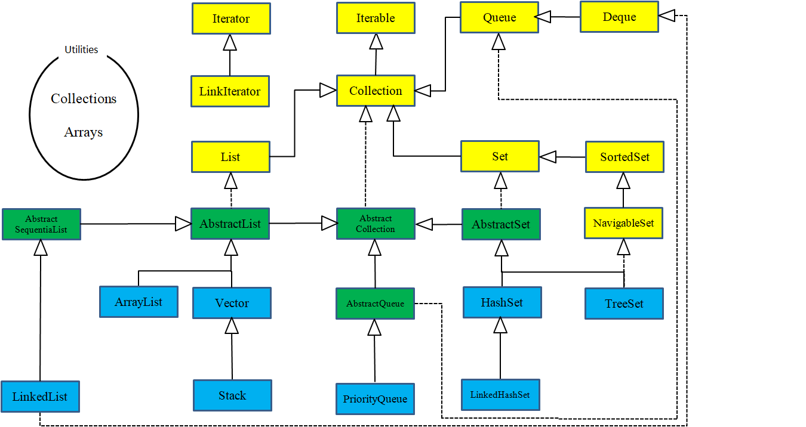

## 对象的概念 ##

编程语言是创建应用程序的思想结构，更是我们思维放大的工具与另一种表达媒介。面向对象编程（Object-Oriented Programming OOP）是一种编程思维方式和编码架构。

### 抽象

所有编程语言都提供抽象机制。从某种程度上来说，问题的复杂度直接取决于抽象的类型和质量。这里的“类型”意思是：抽象的内容是什么？汇编语言是对底层机器的轻微抽象。接着出现的“命令式”语言（如 FORTRAN和 C）是对汇编语言的抽象。与汇编相比，这类语言已有了长足的改进，但它们的抽象原理依然要求我们着重考虑计算机的结构，而非问题本身的结构。  *程序员必须要在机器模型（“解决方案空间”）和实际解决的问题模型（“问题空间”）之间建立起一种关联。*

在面向对象的程序设计中，程序员可利用一些工具表达“问题空间”内的元素。由于这种表达非常具有普遍性，所以不必受限于特定类型的问题。我们将问题空间中的元素以及它们在解决方案空间的表示称作“对象”（**Object**）。当然，还有一些在问题空间没有对应的对象体。通过添加新的对象类型，程序可进行灵活的调整，以便与特定的问题配合。所以当你在阅读描述解决方案的代码时，也是在阅读问题的表述。总之，OOP 允许我们根据问题来描述问题，而不是根据运行解决方案的计算机。然而，它仍然与计算机有联系，每个对象都类似一台小计算机：它们有自己的状态并且可以进行特定的操作。这与现实世界的“对象”或者“物体”相似：它们都有自己的特征和行为。  

 “纯粹”的面向对象程序设计方法的五大基本特征：

> 1. **万物皆对象**。你可以将对象想象成一种特殊的变量。它存储数据，但可以在你对其“发出请求”时执行本身的操作。理论上讲，你总是可以从要解决的问题身上抽象出概念性的组件，然后在程序中将其表示为一个对象。
> 2. **程序是一组对象，通过消息传递来告知彼此该做什么**。要请求调用一个对象的方法，你需要向该对象发送消息。
> 3. **每个对象都有自己的存储空间，可容纳其他对象**。或者说，通过封装现有对象，可制作出新型对象。所以，尽管对象的概念非常简单，但在程序中却可达到任意高的复杂程度。
> 4. **每个对象都有一种类型**。根据语法，每个对象都是某个“类”的一个“实例”。其中，“类”（Class）是“类型”（Type）的同义词。一个类最重要的特征就是“能将什么消息发给它”。
> 5. **同一类所有对象都能接收相同的消息**。由于类型为“圆”（Circle）的一个对象也属于类型为“形状”（Shape）的一个对象，所以一个圆完全能接收发送给"形状”的消息。这意味着可让程序代码统一指挥“形状”，令其自动控制所有符合“形状”描述的对象，其中自然包括“圆”。这一特性称为对象的“可替换性”，是 OOP 最重要的概念之一。


### 封装 ###

我们可以把编程的侧重领域划分为研发和应用。应用程序员调用研发程序员构建的基础工具类来做快速开发。研发程序员开发一个工具类，该工具类仅向应用程序员公开必要的内容，并隐藏内部实现的细节。

使用访问控制的原因有以下两点：

1. 让应用程序员不要触摸他们不应该触摸的部分。
2. 使类库的创建者（研发程序员）在不影响后者使用的情况下完善更新工具库。

Java 有三个显式关键字来设置类中的访问权限：`public`（公开），`private`（私有）和`protected`（受保护）。这些访问修饰符决定了谁能使用它们修饰的方法、变量或类。

1. `public` 表示任何人都可以访问和使用该元素。
2. `private` 除了类本身和类内部的方法，外界无法直接访问该元素。
3. `protected` 子类可以访问 `protected` 的成员，但不能访问 `private` 成员。
4. `default`（默认）被称为包访问，该权限下的资源可以被同一包中其他类的成员访问。

### 复用 ###

一个类经创建和测试后，理应是可复用的。我们可以通过重复使用某个类的对象，也可以通过继承来达到这种复用性。在创建新类时首先要考虑“组合”，因为它更简单灵活，而且设计更加清晰。“组合”和“聚合”的概念：

- **组合**（Composition）经常用来表示“拥有”关系（has-a relationship），整件拥有部件的生命周期，多个整件不可以同时共享同一个部件。例如，“汽车拥有引擎”。
- **聚合**（Aggregation）动态的**组合**，整件不会拥有部件的生命周期，多个整件可以共享同一个部件。例如，“班级拥有学生”。

### 继承 ###

继承是 Java 面向对象编程技术的一块基石，因为它允许创建分等级层次的类。

继承就是子类继承父类的特征和行为，使得子类对象（实例）具有父类的实例域和方法，或子类从父类继承方法，使得子类具有父类相同的行为。

- 子类拥有父类非 private 的属性、方法。
- 子类可以拥有自己的属性和方法，即子类可以对父类进行扩展。
- 子类可以用自己的方式实现父类的方法 （@override）。
- Java 的继承是单继承，但是可以多重继承，单继承就是一个子类只能继承一个父类，多重继承就是，例如 A 类继承 B 类，B 类继承 C 类，所以按照关系就是 C 类是 B 类的父类，B 类是 A 类的父类，这是 Java 继承区别于 C++ 继承的一个特性。
- 提高了类之间的耦合性（继承的缺点，耦合度高就会造成代码之间的联系越紧密，代码独立性越差）。

### 多态 ###

通过继承，程序直到运行时才能确定代码的地址，因此发送消息给对象时，还需要其他一些方案。为了解决这个问题，面向对象语言使用**后期绑定**的概念。当向对象发送信息时，被调用的代码直到运行时才确定。编译器确保方法存在，并对参数和返回值执行类型检查，但是它不知道要执行的确切代码。为了执行后期绑定，Java 使用一个特殊的代码位来代替绝对调用。这段代码使用对象中存储的信息来计算方法主体的地址。

发送消息给对象时，如果程序不知道接收的具体类型是什么，但最终执行是正确的，这就是对象的“多态性”（Polymorphism）。面向对象的程序设计语言是通过“动态绑定”的方式来实现对象的多态性的，编译器和运行时系统会负责对所有细节的控制。

### 单继承结构 ###

Java 是单继承结构的。所有对象都具有的公共接口，它们最终都属于同一个基类，它的名字就是 `Object`。单继承结构使得垃圾收集器的实现更为容易，这是 Java 在 C++ 基础上的根本改进之一。

由于运行期的类型信息会存在于所有对象中，所以我们永远不会遇到判断不了对象类型的情况。这对于系统级操作尤其重要，例如异常处理。

### 对象创建与生命周期 ###

我们在使用对象时要特别注意的是对象的创建和销毁方式。每个对象的生存都需要资源，尤其是内存。为了资源的重复利用，当对象不再被使用时，我们应该及时释放资源，清理内存。

Java 使用动态内存分配，每次创建对象时，使用 `new` 关键字构建该对象的动态实例。Java 的内存管理是建立在垃圾收集器上的，它能自动发现对象不再被使用并释放内存。垃圾收集器的存在带来了极大的便利，它减少了我们之前必须要跟踪的问题和编写相关代码的数量。因此，垃圾收集器提供了更高级别的保险，以防止潜在的内存泄漏问题。结合单继承和仅可在堆中创建对象的机制，Java 的编码过程比用 C++ 要简单得多。我们所要做的决定和要克服的障碍也会少很多！

### 异常处理 ###

异常处理机制将程序错误直接交给编程语言甚至是操作系统。“异常”（Exception）是一个从出错点“抛出”（thrown）后能被特定类型的异常处理程序捕获(catch)的一个对象。异常不像方法返回的错误值和方法设置用来表示发生错误的标志位那样可以被忽略。异常的发生是不会被忽略的，它终究会在某一时刻被处理。“异常机制”提供了一种可靠地从错误状况中恢复的方法，使得我们可以编写出更健壮的程序。


## 万物皆对象 ##

### 对象创建

“引用”用来关联“对象”。在 Java 中，通常我们使用`new`操作符来创建一个新对象。`new` 关键字代表：创建一个新的对象实例。

#### 数据存储

程序在运行时是如何存储的呢？尤其是内存是怎么分配的。有5个不同的地方可以存储数据：

1. **寄存器**（Registers）最快的存储区域，位于 CPU 内部 。然而，寄存器的数量十分有限，所以寄存器根据需求进行分配。我们对其没有直接的控制权，也无法在自己的程序里找到寄存器存在的踪迹。
2. **栈内存**（Stack）存在于常规内存 RAM（随机访问存储器，Random Access Memory）区域中，可通过栈指针获得处理器的直接支持。栈指针下移分配内存，上移释放内存，这是一种快速有效的内存分配方法，速度仅次于寄存器。创建程序时，Java 系统必须准确地知道栈内保存的所有项的生命周期。这种约束限制了程序的灵活性。因此，虽然在栈内存上存在一些 Java 数据，特别是对象引用，但 Java 对象却是保存在堆内存的。
3. **堆内存**（Heap）这是一种通用的内存池（也在 RAM 区域），所有 Java 对象都存在于其中。与栈内存不同，编译器不需要知道对象必须在堆内存上停留多长时间。因此，用堆内存保存数据更具灵活性。创建一个对象时，只需用 `new` 命令实例化对象即可，当执行代码时，会自动在堆中进行内存分配。
4. **常量存储**（Constant storage）常量值通常直接放在程序代码中，因为它们永远不会改变。如需严格保护，可考虑将它们置于只读存储器 ROM （只读存储器，Read Only Memory）中。
5. **非 RAM 存储**（Non-RAM storage）数据完全存在于程序之外，在程序未运行以及脱离程序控制后依然存在。两个主要的例子：（1）序列化对象：对象被转换为字节流，通常被发送到另一台机器；（2）持久化对象：对象被放置在磁盘上，即使程序终止，数据依然存在。这些存储的方式都是将对象转存于另一个介质中，并在需要时恢复成常规的、基于 RAM 的对象。Java 为轻量级持久化提供了支持。而诸如 JDBC 和 Hibernate 这些类库为使用数据库存储和检索对象信息提供了更复杂的支持。

#### 基本类型的存储

Java 的基本类型存储在栈内存中。Java 确定了每种基本类型的内存占用大小。 这些大小不会像其他一些语言那样随着机器环境的变化而变化。这种不变性也是 Java 更具可移植性的一个原因。

| 基本类型 | 大小    | 最小值    | 最大值           | 包装类型  |
| -------- | ------- | --------- | ---------------- | --------- |
| boolean  | —       | —         | —                | Boolean   |
| char     | 16 bits | Unicode 0 | Unicode 2^16^ -1 | Character |
| byte     | 8 bits  | -128      | +127             | Byte      |
| short    | 16 bits | - 2^15^   | + 2^15^ -1       | Short     |
| int      | 32 bits | - 2^31^   | + 2^31^ -1       | Integer   |
| long     | 64 bits | - 2^63^   | + 2^63^ -1       | Long      |
| float    | 32 bits | IEEE754   | IEEE754          | Float     |
| double   | 64 bits | IEEE754   | IEEE754          | Double    |
| void     | —       | —         | —                | Void      |

所有的数值类型都是有正/负符号的。布尔（boolean）类型的大小没有明确的规定，通常定义为取字面值 “true” 或 “false” 。基本类型有自己对应的包装类型，如果你希望在堆内存里表示基本类型的数据，就需要用到它们的包装类。

#### 高精度数值

 `BigInteger` 和 `BigDecimal`可用于高精度计算。这两个类提供的操作与对基本类型执行的操作相似。也就是说，能对 int 或 float 做的运算，在 BigInteger 和 BigDecimal 这里也同样可以，只不过必须要通过调用它们的方法来实现而非运算符。由于涉及到的计算量更多，所以运算速度会慢一些，我们牺牲了速度，但换来了精度。

BigInteger 支持任意精度的整数。可用于精确表示任意大小的整数值，同时在运算过程中不会丢失精度。 BigDecimal 支持任意精度的定点数字。例如，可用它进行精确的货币计算。

### 对象清理

#### 作用域

大多数程序语言都有作用域的概念。作用域决定了在该范围内定义的变量名的可见性和生存周期。在 C、 C++ 和 Java 中，作用域是由大括号 `{}` 的位置决定的。例如：	

```java
{
    int x = 12;
    // 仅 x 变量可用
    {
        int q = 96;
        // x 和 q 变量皆可用
    }
    // 仅 x 变量可用
    // 变量 q 不在作用域内
}
```

#### 对象作用域

Java 对象与基本类型具有不同的生命周期。当我们使用 `new` 关键字来创建 Java 对象时，它的生命周期将会超出作用域。示例：

```java
{
    String s = new String("a string");
} 
// 作用域终点
```

上例中，引用 s 在作用域终点就结束了。但是，引用 s 指向的字符串对象依然还在占用内存。在这段代码中，我们无法在这个作用域之后访问这个对象，因为唯一对它的引用 s 已超出了作用域的范围。

那么问题来了：我们在 Java 中并没有主动清理这些对象，那么它是如何避免 C++ 中出现的内存被填满从而阻塞程序的问题呢？答案是：Java 的垃圾收集器会检查所有 `new` 出来的对象并判断哪些不再可达，继而释放那些被占用的内存，供其他新的对象使用。也就是说，我们不必担心内存回收的问题了。

### 类的创建

#### 基本类型默认值

如果类的成员变量（字段）是基本类型，那么在类初始化时，这些类型将会被赋予一个初始值。

| 基本类型 | 初始值        |
| -------- | ------------- |
| boolean  | false         |
| char     | \u0000 (null) |
| byte     | (byte) 0      |
| short    | (short) 0     |
| int      | 0             |
| long     | 0L            |
| float    | 0.0f          |
| double   | 0.0d          |

这种默认值的赋予并不适用于局部变量，局部变量需要显式为其赋值，否则会编译错误。

#### 方法使用

方法的基本组成部分包括名称、参数、返回类型、方法体。格式如：

```java
 [返回类型] [方法名](/*参数列表*/){
     // 方法体
 }
```

方法名和参数列表统称为**方法签名**（signature of the method）。签名作为方法的唯一标识。

当返回类型为 **void** 时， **return** 关键字仅用于退出方法，因此在方法结束处的 **return** 可被省略。

标准 **main()** 方法的参数是一个 **String** 数组。 参数 **args** 并没有在当前的程序中使用到，但是 Java 编译器强制要求必须要有， 这是因为它们被用于接收从命令行输入的参数。

### 编码风格

类：类名的首字母大写。 如果类名是由多个单词构成的，则每个单词的首字母都应大写。

方法或字段：驼峰命名法，首字母小写，后面每个单词首字母大写。

静态属性：全部大写，多个字母用下划线分割。


## 运算符

几乎所有运算符都只能操作基本类型（Primitives）。唯一的例外是 `=`、`==` 和 `!=`，它们能操作所有对象。除此以外，**String** 类支持 `+` 和 `+=`。

### 字面值常量

当向程序中插入一个字面值常量（**Literal**）时，编译器会确切地识别它的类型。当类型不明确时，必须在字面值常量前后添加特殊字符来帮助编译器识别。

对于 **Long** 型数值，结尾使用大写 `L` 或小写 `l` 皆可（不推荐使用 `l`，因为容易与阿拉伯数值 1 混淆）。大写 `F` 或小写 `f` 表示 **float** 浮点数。大写 `D` 或小写 `d` 表示 **double** 双精度。 

十六进制，由前导 `0x` 或 `0X` 表示，后跟 0-9 或 a-f （大写或小写）。

八进制，由 前导零 `0` 表示，后跟 0~7 之间的数字。

二进制，由前导 `0b` 或 `0B` 表示，后跟 0 或 1 。

对于大数值的分组，可以在数字字面量中包含下划线 `_`，以使结果更清晰。（Java 7 补充）

```java
int a = 0b0010_1111_1010_1111_1010_1111_1010_1111;
```

### 算术运算符

加 `+` 、减 `-` 、乘 `*` 、除 `/` 、取余 `%` 、递增 `++` 、递减 `-- `

### 关系运算符

关系运算符会通过产生一个布尔（**boolean**）结果来表示操作数之间的关系。 

大于 `>` 、小于 `<` 、大于等于 `>=` 、小于等于 `<=` 、等于 `==` 、不等于 `!=` 。

### 逻辑运算符

逻辑运算符 `&&` （**与**）、`||`（**或**）和 `!`（**非**）根据参数的逻辑关系生成布尔值 `true` 或 `false`。 

**逻辑运算符支持“短路”**。整个表达式会在运算到可以明确结果时就停止并返回结果，这意味着该逻辑表达式的后半部分不会被执行到。 

### 位运算符

位运算符允许我们操作一个整型数字中的单个二进制位。位运算符会对**两个整数对应的位（注意：操作的是整数的补码）**执行布尔代数，从而产生结果。 **位运算符包含 与 `&` 、或 `|`  、异或 `^` 、非 `~`，其中前三者可以操作两个布尔类型的变量或常量，但是不会短路。**

位运算符和逻辑运算符都使用了同样的字符，只不过数量不同。位短，所以位运算符只有一个字符。位运算符可与等号 `=` 联合使用以接收结果及赋值：`&=`，`|=` 和 `^=` 都是合法的（由于 `~` 是一元运算符，所以不可与 `=` 联合使用）。 

### 移位运算符

移位运算符面向的运算对象也是二进制的“位” **（注意：操作的是整数的补码）**，它们只能用于处理整数类型。左移位运算符 `<<` 能将其左边的运算对象向左移动右侧指定的位数（在低位补 0）。右移位运算符 `>>` 则相反。右移位运算符有“正”、“负”值：若值为正，则在高位插入 0；若值为负，则在高位插入 1。Java 也添加了一种“不分正负”的右移位运算符（>>>），它使用了“零扩展”（zero extension）：无论正负，都在高位插入 0。 

 如果移动 **char**、**byte** 或 **short**，则会在移动发生之前将其提升为 **int**，结果为 **int**。仅使用右值（rvalue）的 5 个低阶位。这可以防止我们移动超过 **int** 范围的位数。若对一个 **long** 值进行处理，最后得到的结果也是 **long**。 

### 三元运算符

**布尔表达式 ? 值 1 : 值 2**

若表达式计算为 **true**，则返回结果 **值 1** ；如果表达式的计算为 **false**，则返回结果 **值 2**。

### 类型转换

 “类型转换”（Casting）的作用是“与一个模型匹配”。在适当的时候，Java 会将一种数据类型自动转换成另一种。  若将数据类型进行“向下转换”（**Narrowing Conversion**）的操作（将容量较大的数据类型转换成容量较小的类型），可能会发生信息丢失的危险。 对于“向上转换”（**Widening conversion**），则不必进行显式的类型转换，因为较大类型的数据肯定能容纳较小类型的数据，不会造成任何信息的丢失。 

#### 截断和舍入 ####

在执行“向下转换”时，必须注意数据的截断和舍入问题。若从浮点值转换为整型值，Java 会将小数位截断。 若你想对结果进行四舍五入，可以使用 `java.lang.Math` 的 `round()` 方法 

#### 类型提升 ####

如果我们对小于 **int** 的基本数据类型（即 **char**、**byte** 或 **short**）执行任何算术或按位操作，这些值会在执行操作之前类型提升为 **int**，并且结果值的类型为 **int**。若想重新使用较小的类型，必须使用强制转换。通常，表达式中最大的数据类型是决定表达式结果的数据类型。**float** 型和 **double** 型相乘，结果是 **double** 型的；**int** 和 **long** 相加，结果是 **long** 型。

### 运算符总结

| 运算符分类 | 结合顺序   | 运算符                                              |
| ---------- | ---------- | --------------------------------------------------- |
| 分隔符     | 左结合     | .   []   ()   ;   ,                                 |
| 一元运算符 | **右结合** | !  ++  --  - ( 取反 )  ~ ( 逐位取反 )               |
| 算术运算符 | 左结合     | +   -   *   /   %                                   |
| 移位运算符 | 左结合     | <<   >>   >>>                                       |
| 关系运算符 | 左结合     | <   >   <=  >=  ==  !=  instanceof                  |
| 逻辑运算符 | 左结合     | &&  \|\|  !                                         |
| 位运算符   | 左结合     | &  \|  ~  ^ ( 异或 )                                |
| 三目运算符 | **右结合** | 布尔表达式 ? 表达式 1 : 表达式 2                    |
| 赋值运算符 | **右结合** | =  +=  -=  *=   /=  %=   <<=  >>=  >>>=  &= \|=  ^= |


## 控制流 ##

所有的条件语句都利用条件表达式的“真”或“假”来决定执行路径。

### 选择语句

#### if-else 

**if-else** 语句是控制程序执行流程最基本的形式，其中 `else` 是可选的。

```java
if(Boolean-expression) {
     “statement”
} else {
     “statement”
}
```

#### switch 

**switch** 语句是一种实现多路选择的干净利落的一种方式（比如从一系列执行路径中挑选一个）。

```java
switch(expression){
    case value :
       //语句
       break; //可选
    case value :
       //语句
       break; //可选
    //你可以有任意数量的case语句
    default : //可选
       //语句
}
```

switch 语句中的变量类型可以是： byte、short、int 或者 char。从 Java 7 开始，String 和 枚举也被支持。同时 case 标签必须为字符串常量或字面量。

### 循环语句

**while**，**do-while** 和 **for** 用来控制循环语句。只有控制循环的布尔表达式计算结果为 `false`，循环语句才会停止。

#### while

```java
while(Boolean-expression) 
{
    statement
}
```

执行语句会在每一次循环前，判断布尔表达式返回值是否为 `true`。

#### do-while

```java
do {
	statement
}
while(Boolean-expression);
```

**while** 和 **do-while** 之间的唯一区别是：即使条件表达式返回结果为 `false`， **do-while** 语句也至少会执行一次。

#### for

**for** 循环是最常用的迭代形式。 该循环在第一次迭代之前执行初始化。随后，它会执行布尔表达式，并在每次迭代结束时，进行某种形式的步进。**step 语句在循环语句之后执行。**

```java
for(initialization; Boolean-expression; step){
	statement
}
```

逗号运算符：在 **for** 循环的初始化和步进控制中定义多个变量。我们可以使用逗号分隔多个语句，并按顺序计算这些语句。**注意**：要求定义的变量类型相同。

```java
for(int i = 1, j = i + 10; i < 5; i++, j = i * 2) {
      System.out.println("i = " + i + " j = " + j);
    }
```

#### for-each

**for-each** 无需你去创建变量和步进来控制循环计数。

```java
for(char c: "An African Swallow".toCharArray()){
	System.out.print(c + " ");
}
```

**for-each** 循环适用于任何可迭代（*iterable*）的对象。

### break 和 continue

在任何迭代语句的主体内，都可以使用 **break** 和 **continue** 来控制循环的流程。 其中，**break** 表示跳出当前循环体。而 **continue** 表示停止本次循环，开始下一次循环。

“标签”是后面跟一个冒号的标识符。对 Java 来说，唯一用到标签的地方是在循环语句之前，它实际需要紧靠在循环语句的前方。而在循环之前设置标签的唯一理由是：我们希望在其中嵌套另一个循环或者一个开关。这是由于 **break** 和 **continue** 关键字通常只中断当前循环，但若搭配标签一起使用，它们就会中断并跳转到标签所在的地方开始执行。

```java
label1:
outer-iteration { 
  inner-iteration {
  // ...
  break; 
  // ...
  continue; 
  // ...
  continue label1;
  // ...
  break label1; 
  } 
}

```

1. 简单的一个 **continue** 会退回最内层循环的开头（顶部），并继续执行。
2. 带有标签的 **continue** 会到达标签的位置，并重新进入紧接在那个标签后面的循环。
3. **break** 会中断当前循环，外层循环继续。
4. 带标签的 **break** 会中断那个标签指示的循环。

### return

return 关键字有两方面的作用

- 从当前的方法中退出，返回到该调用的方法的语句处，继续执行；
- 返回一个值给调用该方法的语句，返回值数据类型必须与方法的声明中返回值的类型一致。


## 初始化和清理

两个安全性问题：初始化和清理。在使用一个对象之前没有对其进行初始化，使用完之后没有及时将它清理。

Java 在创建对象时调用构造器来完成对象的初始化。当对象不再使用时，通过垃圾收集器（Garbage Collector, GC）去自动回收不再被使用的对象所占的资源。

### 利用构造器保证初始化 ###

Java 会在用户使用对象之前（即对象刚创建完成）自动调用对象的构造器方法，从而保证初始化。在 Java 中，对象的创建与初始化是统一的概念，二者不可分割。

如果你创建一个类，类中没有构造器，那么编译器就会自动为你创建一个无参构造器。但是,一旦你显式地定义了构造器（无论有参还是无参），编译器就不会自动为你创建无参构造器。

### 方法重载 ###

任何编程语言中都具备的一项重要特性就是命名。当你创建一个对象时，就会给此对象分配的内存空间命名。方法是行为的命名。你通过名字指代所有的对象，属性和方法。**方法重载**允许方法具有相同的方法名但接收的参数不同。

```java
public void info() {
        System.out.println(null);
}
public void info(String str) {
        System.out.println(str);
}
```

#### 返回值的重载 ####

为什么只能通过方法名和参数列表，不能通过方法名和返回值区分方法呢？例如以下两个方法：

```java
void f(){}
int f() {return 1;}
```

咋一看就能区分调用谁了。但是，如果你调用一个方法且忽略返回值，你就不知道调用的是哪个方法了，这让编译器很迷惑。

### this 关键字 ###

**this** 关键字代表当前对象的的引用，它只能在非静态方法内部使用。**this** 关键字只用在一些必须显式使用当前对象引用的特殊场合。例如，用在 **return** 语句中返回对当前对象的引用，在标准的 setter() 方法中指定被赋值的是成员变量。

#### 在构造器中调用构造器 ####

其中只能通过 **this** 调用一次构造器。另外，必须首先调用构造器，否则编译器会报错。

```java 
 Flower(String ss) {
        this.ss = ss;
 }
 Flower(String ss, int petals) {
     this(petals);
     //- this(ss); // Can't call two!
     this.ss = ss; // Another use of "this"
 }
```

#### static 的含义 ####

概括：方便在没有创建对象的情况下来进行调用。

**static** 可以修饰变量、方法、代码块、内部类，还可以实现静态导包。静态方法内不能使用 this。

### 垃圾回收器 ###

使用完一个对象就不管它并非总是安全的。Java 中有垃圾回收器回收无用对象占用的内存。垃圾回收器只知道如何释放用 **new** 创建的对象的内存，如果你创建的对象不是通过 **new** 来分配内存的，那么它不知道如何回收这部分内存。如果 Java 虚拟机（JVM）并未面临内存耗尽的情形，它可能不会浪费时间执行垃圾回收以恢复内存。

在 Java 中，对象并非总是被垃圾回收：

- 对象可能不被垃圾回收。
- 垃圾回收不等同于析构。
- 垃圾回收只与内存有关。

#### finalize() 的说明 ####

finalize() 方法是 Object 类中提供的一个方法，在 GC 准备释放对象所占用的内存空间之前，它将首先调用 finalize() 方法。

**finalize() 调用的时机**：由于 GC 的自动回收机制，因而并不能保证 finalize() 方法会被及时地执行（垃圾对象的回收时机具有不确定性），也不能保证它们会被执行(程序可能由始至终都未触发垃圾回收)。

**什么时候应该使用它**：finalize() 方法中一般用于释放非 Java 资源（如打开的文件资源、数据库连接等），或是调用 native 方法时分配的内存（如 C 语言的 malloc() 系列函数）。

**为什么应该避免使用它**：由于 finalize() 方法的调用时机具有不确定性，从一个对象变得不可到达开始到 finalize() 方法被执行，所花费的时间这段时间是任意长的。我们并不能依赖 finalize() 方法能及时的回收占用的资源，可能出现的情况是在我们耗尽资源之前，gc 却仍未触发，因而通常的做法是提供显示的 close() 方法供客户端手动调用。

**让对象再复活一次**：利用 finalize() 方法最多只会被调用一次的特性，我们可以实现延长对象的生命周期。

#### 终结条件 ####

`finalize()` 有一个有趣的用法，它不依赖于每次都要对 `finalize()` 进行调用，这就是对象终结条件的验证。

如果对象代表了一个打开的文件，在对象被垃圾回收之前程序员应该关闭这个文件。只要对象中存在没有被适当清理的部分，程序就存在很隐晦的 bug。`finalize()` 可以用来最终发现这个情况，尽管它并不总是被调用。如果某次 `finalize()` 的动作使得 bug 被发现，那么就可以据此找出问题所在。

#### 垃圾回收器如何工作 ####

Java 从堆空间分配的速度可以和其他语言在栈上分配空间的速度相媲美。

当垃圾回收器工作时，一边回收内存，一边使堆中的对象紧凑排列，这样"堆指针"就可以很容易地移动到更靠近传送带的开始处，也就尽量避免了页面错误。垃圾回收器通过重新排列对象，实现了一种高速的、有无限空间可分配的堆模型。

引用计数策略：实现简单但速度很慢，而且如果对象之间存在循环引用，那么它们的引用计数都不为 0，就会出现应该被回收但无法被回收的情况。

更快的策略：对于任意"活"的对象，一定能最终追溯到其存活在栈或静态存储区中的引用。这个引用链条可能会穿过数个对象层次，由此，如果从栈或静态存储区出发，遍历所有的引用，你将会发现所有"活"的对象。对于发现的每个引用，必须追踪它所引用的对象，然后是该对象包含的所有引用，如此反复进行，直到访问完"根源于栈或静态存储区的引用"所形成的整个网络。你所访问过的对象一定是"活"的。注意，这解决了对象间循环引用的问题，这些对象不会被发现，因此也就被自动回收了。

在这种方式下，Java 虚拟机采用了一种**自适应**的垃圾回收技术。至于如何处理找到的存活对象，取决于不同的 Java 虚拟机实现。其中有一种做法叫做**停止-复制**（stop-and-copy）。顾名思义，这需要先暂停程序的运行（不属于后台回收模式），然后将所有存活的对象从当前堆复制到另一个堆，没有复制的就是需要被垃圾回收的。另外，当对象被复制到新堆时，它们是一个挨着一个紧凑排列，然后就可以按照前面描述的那样简单、直接地分配新空间了。

当对象从一处复制到另一处，所有指向它的引用都必须修正。位于栈或静态存储区的引用可以直接被修正，但可能还有其他指向这些对象的引用，它们在遍历的过程中才能被找到（可以想象成一个表格，将旧地址映射到新地址）。

这种所谓的"复制回收器"效率低下主要因为两个原因。其一：得有两个堆，然后在这两个分离的堆之间来回折腾，得维护比实际需要多一倍的空间。某些 Java 虚拟机对此问题的处理方式是，按需从堆中分配几块较大的内存，复制动作发生在这些大块内存之间。

其二在于复制本身。一旦程序进入稳定状态之后，可能只会产生少量垃圾，甚至没有垃圾。尽管如此，复制回收器仍然会将所有内存从一处复制到另一处，这很浪费。为了避免这种状况，一些 Java 虚拟机会进行检查：要是没有新垃圾产生，就会转换到另一种模式（即"自适应"）。这种模式称为**标记-清扫**（mark-and-sweep），对一般用途而言，"标记-清扫"方式速度相当慢，但是当你知道程序只会产生少量垃圾甚至不产生垃圾时，它的速度就很快了。

"标记-清扫"所依据的思路仍然是从栈和静态存储区出发，遍历所有的引用，找出所有存活的对象。但是，每当找到一个存活对象，就给对象设一个标记，并不回收它。只有当标记过程完成后，清理动作才开始。在清理过程中，没有标记的对象将被释放，不会发生任何复制动作。"标记-清扫"后剩下的堆空间是不连续的，垃圾回收器要是希望得到连续空间的话，就需要重新整理剩下的对象。

"停止-复制"指的是这种垃圾回收动作不是在后台进行的；相反，垃圾回收动作发生的同时，程序将会暂停。在 Oracle 公司的文档中会发现，许多参考文献将垃圾回收视为低优先级的后台进程，但是早期版本的 Java 虚拟机并不是这么实现垃圾回收器的。当可用内存较低时，垃圾回收器会暂停程序。同样，"标记-清扫"工作也必须在程序暂停的情况下才能进行。

### 成员初始化 ###

Java 尽量保证所有变量在使用前都能得到恰当的初始化。对于方法的局部变量，必须显式初始化，不然将发生编译错误。对于基本类型的成员变量，Java 会为其赋予默认值。对于引用类型的成员变量，引用就会被赋值为 **null**。

#### 初始化顺序 ####

在类中变量定义的顺序决定了它们初始化的顺序。即使变量定义散布在方法定义之间，它们仍会在任何方法（包括构造器）被调用之前得到初始化。

#### 静态数据的初始化 ####

无论创建多少个对象，静态数据都只占用一份存储区域，静态代码块只会执行一次。**static** 关键字不能应用于局部变量，所以只能作用于属性（字段、域）。如果一个字段是静态的基本类型，你没有初始化它，那么它就会获得基本类型的标准初值。如果它是对象引用，那么它的默认初值就是 **null**。

### 数组初始化 ###

数组是相同类型的、用一个标识符名称封装到一起的一个对象序列或基本类型数据序列。数组是通过方括号下标操作符 [] 来定义和使用的。

```java
int[] a1; //推荐
int a1[]; //不推荐
//数组的初始化
int[] a = {1, 2, 3};
int[] b = new int[5];
```

编译器不允许定义数组的时候指定大小，因为你拥有的只是对数组的一个引用，但是还没有给数组对象本身分配任何空间，可以在初始化的时候指定大小。为了给数组创建相应的存储空间，必须写初始化表达式。**数组的大小一旦创建是不可修改的。**

所有的数组都有一个固定成员 **length**，告诉你这个数组有多少个元素，你不能对其修改。数组元素中的基本数据类型值会自动初始化为默认值（对于数字和字符是 0；对于布尔型是 **false**），引用类型则会设为 null。

#### 可变参数列表 ####

```java
static void printArray(Object... args) {
        for (Object obj: args) {
            System.out.print(obj + " ");
        }
}
```

有了可变参数，你就再也不用显式地编写数组语法了，当你指定参数时，编译器实际上会为你填充数组。

### 枚举类型 ###

#### 枚举的定义 ####

使用 **enum** 关键字定义枚举类，它被编译器编译为 `final class Xxx extends Enum { … }`

```java
//定义 color 枚举类
public enum Color {
    RED, GREEN, BLUE;
}

//编译器编译出的 class 文件
public final class Color extends Enum<Color> {//继承自 Enum，标记为 final 
    // 每个实例均为全局唯一:
    public static final Color RED = new Color();
    public static final Color GREEN = new Color();
    public static final Color BLUE = new Color();
    // private构造方法，确保外部无法调用new操作符:
    private Color() {}
}
```

此外，还可以在定义枚举的时候添加属性：

```java
public enum Weekday {
    MON(1, "星期一"), 
    TUE(2, "星期二"), 
    WED(3, "星期三"), 
    THU(4, "星期四"), 
    FRI(5, "星期五"), 
    SAT(6, "星期六"), 
    SUN(0, "星期日");

    public final int dayValue;
    private final String chinese;

    private Weekday(int dayValue, String chinese) {
        this.dayValue = dayValue;
        this.chinese = chinese;
    }

    @Override
    public String toString() {
        return this.chinese;
    }
}
```

#### enum 的方法 ####

因为 enum 是一个 class ，每个枚举的值都是 class 实例，因此，这些实例有一些方法：

- name() 返回常量名

```java
String s = Color.RED.name(); // "RED"
```

- ordinal() 返回定义的常量的顺序，从 0 开始计数

```java
int n = Color.GREEN.ordinal(); // 1
```

- 默认情况下，对枚举常量调用 toString() 会返回和 name() 一样的字符串。但是，toString() 可以被覆写，而 name() 则不行。

#### enum 的特点 ####

- 定义的 `enum` 类型总是继承自 `java.lang.Enum` （不能再继承其他类了，因为 Java 不支持多继承），且无法被继承（因为编译后被 final 修饰）；
- 只能定义出 `enum` 的实例，而无法通过 `new` 操作符创建 `enum` 的实例（构造方法私有）；
- 定义的每个实例都是引用类型的唯一实例（ jvm 中只存在一份）；
- 可以将 `enum` 类型用于 `switch` 语句，因为枚举类天生具有类型信息和有限个枚举常量，所以比 `int` 、 `String` 类型更适合用在 `switch` 语句中。

#### enum 的比较 ####

使用 `enum` 定义的枚举类是一种引用类型。一般来说，引用类型比较，要使用 equals() 方法，如果使用 `==` 比较，它比较的是两个引用类型的引用是否指向同一个对象。因此，引用类型比较，要始终使用 `equals()` 方法，但 `enum` 类型可以例外，这是因为 `enum` 类型的每个常量在 JVM 中只有一个唯一实例，所以可以直接用 `==` 比较。

```Java
if (day == Weekday.FRI) {
    // ok!
   }
if (day.equals(Weekday.SUN)) { 
    // ok, but more code!
   }
```


## 封装 ##

控制成员访问权限有两个原因：

- 第一个原因是使用户不要接触他们不该接触的部分，这部分对于类内部来说是必要的，但是不属于客户端程序员所需接口的一部分。因此将方法和属性声明为 **private** 对于客户端程序员来说是一种服务，可以让他们清楚地看到什么是重要的，什么可以忽略。这可以简化他们对类的理解。

- 第二个也是最重要的原因是为了让类库设计者更改类内部的工作方式，而不用担心会影响到客户端程序员。比如最初以某种方式创建一个类，随后发现如果更改代码结构可以极大地提高运行速度。如果接口与实现被明确地隔离和保护，你可以实现这一目的，而不必强制客户端程序员重新编写代码。访问权限控制确保客户端程序员不会依赖某个类的底层实现的任何部分。

为了解决这一问题，Java 提供了*访问修饰符*（access specifier）供类库开发者指明哪些对于客户端程序员是可用的，哪些是不可用的。访问控制权限的等级，从“最大权限”到“最小权限”依次是：**public**，**protected**，*包访问权限（package access）*和 **private**。作为一名类库设计者，你会尽可能将一切都设为 **private**，仅向客户端程序员暴露你愿意他们使用的方法。

### 包的概念 ###

包内包含一组类，它们被组织在一个单独的*命名空间*（namespace）下。例如，标准 Java 库有一个工具库，它被组织在 **java.util** 命名空间下。**java.util** 中含有一个类，叫做 **ArrayList**。使用 **ArrayList** 的一种方式是用其全名 **java.util.ArrayList**。一般使用 **import** 关键字导入某个类。引用包是为了解决类名重复的冲突，**每个类由其包名加类名组成**，可以有效解决类名冲突的问题。

### 代码组织 ###

当编译一个 **.java** 文件时，**.java** 文件中的每个外部类都会有一个输出文件。每个输出的文件名和 **.java** 文件中每个类的类名相同，只是后缀名是 **.class**。因此，在编译少量的 **.java** 文件后，会得到数量较多的 **.class** 文件。在 Java 中，可运行程序是一组 **.class** 文件，它们可以打包压缩成一个 Java 文档文件（JAR，使用 **jar** 文档生成器）。Java 解释器负责查找、加载和解释这些文件。

一个包下可以有很多 **.class** 文件，然而包从未真正被打包成单一的文件，而是将特定包下的所有 **.class** 文件都放在一个目录下，利用了操作系统的文件结构的层次性。这样做解决了两个问题：

- 创建独一无二的包名和查找可能隐藏于目录结构某处的类。
- **把 package 名称分解成你机器上的一个目录，所以当 Java 解释器必须要加载一个 .class 文件时，它能定位到 .class 文件所在的位置。**首先，它找出环境变量 **CLASSPATH**（一般通过操作系统设置）。**CLASSPATH** 包含一个或多个目录，用作查找 .**class** 文件的根目录。从根目录开始，Java 解释器获取包名并将每个句点替换成反斜杠，生成一个基于根目录的路径名（取决于你的操作系统，包名 **foo.bar.baz** 变成 **foo\bar\baz** 或 **foo/bar/baz** 或其它）。然后这个路径与 **CLASSPATH** 的不同项连接，解释器就在这些目录中查找与你所创建的类名称相关的 **.class** 文件（解释器还会查找某些涉及 Java 解释器所在位置的标准目录）。

注意，编译过的代码通常位于与源代码的不同目录中。这是很多工程的标准，而且集成开发环境（IDE）通常会自动为我们做这些。必须保证 JVM 通过 CLASSPATH 能找到编译后的代码。

### 访问权限修饰符 ###

Java 访问权限修饰符 **public**，**protected** 和 **private** 位于定义的类名、构造器名、属性名和方法名之前。如果不提供访问修饰符，就意味着"包访问权限"。所以无论如何，万物都有某种形式的访问控制权。

|                  | private | 默认访问权限 | protected         | public |
| ---------------- | ------- | ------------ | ----------------- | ------ |
| 类本身           | 是      | 是           | 是                | 是     |
| 相同包中子类     | 否      | 是           | 是                | 是     |
| 相同包中的非子类 | 否      | 是           | **是**（:smile:） | 是     |
| 不同包中的子类   | 否      | 否           | 是                | 是     |
| 不同包中的非子类 | 否      | 否           | 否                | 是     |

#### 包访问权限 ####

包访问权限可以把相关类聚到一个包下，以便它们能轻易地相互访问。由于一个编译单元（即一个文件）只能隶属于一个包，所以通过包访问权限，位于同一编译单元中的所有类彼此之间都是可访问的。

#### private 权限 ####

关键字 **private** 意味着除了包含该成员的类，其他任何类都无法访问这个成员。同一包中的其他类无法访问 **private** 成员。

默认的包访问权限通常提供了足够的隐藏措施；使用类的客户端程序员无法访问包访问权限成员。这样做很好，因为默认访问权限是一种我们常用的权限（同时也是一种在忘记添加任何访问权限时自动得到的权限）。因此，通常考虑的是把哪些成员声明成 **public** 供客户端程序员使用。所以，最初不常使用关键字 **private**，因为程序没有它也可以照常工作。然而，使用 **private** 是非常重要的，尤其是在多线程环境中。

任何可以肯定只是该类的"助手"方法，都可以声明为 **private**，以确保不会在包中的其他地方误用它，也防止了你会去改变或删除它。将方法声明为 **private** 确保了你拥有这种选择权。

#### protected 权限 ####

**protected** 修饰的成员既可以被子类访问，也可以被同一个包的其他类访问。

### 接口和实现 ###

访问控制通常被称为*隐藏实现*（implementation hiding）。将数据和方法包装进类中并把具体实现隐藏被称作是*封装*（encapsulation）。其结果就是一个同时带有特征和行为的数据类型。

出于两个重要的原因，访问控制在数据类型内部划定了边界：

- 确立客户端程序员可以使用和不能使用的边界。可以在结构中建立自己的内部机制而不必担心客户端程序员偶尔将内部实现作为他们可以使用的接口的一部分。
- 将接口与实现分离。如果在一组程序中使用接口，而客户端程序员只能向 **public** 接口发送消息的话，那么就可以自由地修改任何不是 **public** 的事物（例如包访问权限，protected，或 private 修饰的事物），却不会破坏客户端代码。

### 类访问权限 ###

一个 Java 源代码文件称为一个*编译单元（compilation unit）*，在编译单元中可以有一个 **public** 类，它的类名必须与文件名相同。每个编译单元中只能有一个 **public** 类，**如果这个编译单元中还有其他类，那么在包之外是无法访问到这些类的，因为它们不是 public 类，此时它们是为主 public 类提供“支持”的类 。**注意，类既不能是 **private** 的，也不能是 **protected** 的。所以对于类的访问权限只有两种选择：包访问权限或者 **public**。为了防止类被外界访问，可以将所有的构造器声明为 **private**。

**设置一个类不能被继承，有两种方法：一是 final 修饰类，二就是 private 修饰所有构造方法；**


## 复用 ##

如何在不污染源代码的前提下复用现存代码：

1. 在新类中创建现有类的对象。这种方式叫做“组合”（Composition），通过**这种方式复用代码的功能**，而非其形式。
2. 创建现有类类型的新类。照字面理解：采用现有类形式，又无需在编码时改动其代码，这种方式就叫做“继承”（Inheritance）。**继承**是面向对象编程（OOP）的重要基础之一。

### 组合语法 ###

你仅需要把对象的引用（object references）放置在一个新的类里，这就使用了组合。类中的基本类型字段会进行默认初始化，但是对象引用被初始化为 **null**，如果你尝试调用其任何一个方法，你将得到一个空指针异常。

编译器**不会**为每个引用创建一个默认对象，在许多情况下，这会导致不必要的开销。初始化引用有四种方法:

1. 当对象被定义时。这意味着它们总是在调用构造函数之前初始化。
2. 使用初始化代码块。
3. 在该类的构造函数中。
4. 在实际使用对象之前。这通常称为*延迟初始化*。在对象创建开销大且不需要每次都创建对象的情况下，它可以减少开销。

### 继承语法 ###

在类主体的左大括号前的代码中使用关键字 **extends** 后跟基类的名称。

当你创建派生类的对象时，它包含基类的子对象。这个子对象与你自己创建基类的对象是一样的。只是从外部看，基类的子对象被包装在派生类的对象中。

Java 自动在派生类构造函数中插入对基类无参构造函数的调用，如果基类没有无参构造函数，则需要手动显式地调用基类的有参构造函数。

### 组合与继承 ###

组合和继承都允许在新类中放置子对象（组合是显式的，而继承是隐式的），它们的使用时机：

- 如果存在一个“是”的关系，通常这意味着使用一个通用类，并为了某个特殊需求将其特殊化，那么继承是更好的选择。
- 如果存在一个“有”的关系，或者你想在新类中包含一个已有类的功能时，那么首选组合。

**尽量通过组合已有的类来创建新类，继承其实不太常用。**除非确实使用继承是有帮助的。一种判断使用组合还是继承的最清晰的方法是看看是否需要把新类向上转型为基类。如果必须向上转型，那么继承就是必要的。

### 委托 ###

Java不直接支持的第三种重用关系称为委托。这介于继承和组合之间，因为你将一个成员对象放在正在构建的类中(比如组合)，但同时又在新类中公开来自成员对象的所有方法(比如继承)。例如：

```Java
public class SpaceShipControls {
  void up(int velocity) {}
  void down(int velocity) {}
}

public class SpaceShipDelegation {
    
  private SpaceShipControls controls = new SpaceShipControls();
    
  private String name;
    
  public SpaceShipDelegation(String name) {
    this.name = name;
  }
    
  // Delegated methods:
  public void up(int velocity) {
    controls.up(velocity);
  }
    
  public void down(int velocity) {
    controls.down(velocity);
  }
  
  public static void main(String[] args) {
    SpaceShipDelegation protector =
      new SpaceShipDelegation("NSEA Protector");
    protector.up(100);
  }
}
```

方法被转发到底层 **control** 对象，因此接口与继承的接口是相同的。但是，你对委托有更多的控制，因为你可以选择只在成员对象中提供方法的子集。

### final 关键字 ###

根据上下文环境，Java 的关键字 **final** 的含义有些不同，但通常它指的是“这是不能被改变的”。防止改变有两个原因：设计或效率。因为这两个原因相差很远，所以有可能误用关键字 **final**。

可以使用 **final** 的三个地方：变量、方法和类。

#### final 变量 ####

final 修饰变量有两种含义：

- 永不改变的编译时常量。编译器可以把常量带入计算中，也就是说，可以在编译时计算，减少了一些运行时的负担。这类常量必须是基本类型，必须在定义时用**直接量**进行赋值。
- 在运行时初始化就不会改变的值。

对于基本类型，**final** 使数值恒定不变，而对于对象引用，**final 使引用恒定不变，但是引用的对象本身的属性是可以改变的**。一旦引用被初始化指向了某个对象，它就不能改为指向其他对象。但是，对象本身是可以修改的，Java 没有提供将任意对象设为常量的方法。

一个被 **static** 和 **final** 同时修饰的属性只会占用一段不能改变的存储空间。

你必须在定义时或在每个构造器中执行 final 变量的赋值操作。这保证了 final 属性在使用前已经被初始化过。

#### final 参数 ####

在参数列表中，将参数声明为 **final** 意味着在方法中不能改变参数指向的对象或基本变量。这个特性主要用于传递数据给匿名内部类。

#### final 方法 ####

使用 **final** 方法的原因有两个：

- 第一个原因是防止子类通过覆写改变方法的行为。这是出于继承的考虑，确保方法的行为不会因继承而改变。
- 过去建议使用 **final** 方法的第二个原因是效率。在早期的 Java 实现中，如果将一个方法指明为 **final**，就是同意编译器把对该方法的调用转化为内嵌调用。（**不建议**这样使用）

#### final 和 private  ####

类中所有的 **private** 方法都隐式地指定为 **final**。因为不能访问 **private** 方法，所以不能覆写它。可以给 **private** 方法添加 **final** 修饰，但是并不能给方法带来额外的含义。

"覆写"只发生在方法是基类的接口时。也就是说，必须能将一个对象向上转型为基类并调用相同的方法。如果一个方法是 **private** 的，它就不是基类接口的一部分。它只是隐藏在类内部的代码，且恰好有相同的命名而已。但是如果你在派生类中以相同的命名创建了 **public**，**protected** 或包访问权限的方法，这些方法与基类中的方法没有联系，你没有覆写方法，只是在创建新的方法而已。

#### final 类 ####

当用 **final** 修饰一个类 ，就意味着它不能被继承。之所以这么做，是因为类的设计就是永远不需要改动，或者是出于安全考虑不希望它有子类。

**final** 类的属性可以根据个人选择是或不是 **final**。这同样适用于不管类是否是 **final** 的内部 **final** 属性。然而，由于 **final** 类禁止继承，类中所有的方法都被隐式地指定为 **final** 。

### 类初始化和加载 ###

每个类的编译代码都存在于它自己独立的文件中。该文件只有在使用程序代码时才会被加载。一般可以说**类的代码在首次使用时加载**。这通常是指创建类的第一个对象，或者是访问了类的 **static** 属性或方法。构造器也是一个 **static** 方法尽管它的 **static** 关键字是隐式的。因此，准确地说，**一个类当它任意一个 static 成员被访问时，就会被加载**。

首次使用时就是 **static** 初始化发生时。所有的 **static** 对象和 **static** 代码块在加载时按照文本的顺序（在类中定义的顺序）依次初始化。**static** 变量只被初始化一次。

#### 继承和初始化 ####

当使用继承时，就已经知道了基类的一切，并可以访问基类中任意 **public** 和 **protected** 的成员。所以必须先首先初始化基类，再初始化派生类。


<center>Java 继承体系初始化执行顺序</center>

#### 继承和清理 ####

在使用组合和继承创建新类时，大部分时候你无需关心清理。子对象通常会留给垃圾收集器处理。如果你存在清理问题，那么你必须为新类创建一个**清理方法**。由于继承，如果有其他特殊的清理工作的话，就必须在派生类中**重写清理方法**。当重写清理方法时，记得调用**基类的清理方法**，否则基类的清理工作不会发生。

**销毁的顺序应该与初始化的顺序相反，以防一个对象依赖另一个对象**。

- 对于属性来说，就意味着与声明的顺序相反。
- 对于基类，首先进行派生类的清理工作，然后才是基类的清理。这是因为派生类的清理可能调用基类的一些方法，所以基类组件这时得存活，不能过早地被销毁。

## 多态 ##

封装通过合并特征和行为来创建新的数据类型。隐藏实现通过将细节**私有化**把接口与实现分离。

多态提供了另一个维度的接口与实现分离，以解耦做什么和怎么做。多态不仅能改善代码的组织，提高代码的可读性，而且能创建有扩展性的程序——无论在最初创建项目时还是在添加新特性时都可以“生长”的程序。多态消除类型之间的耦合，是一项“将改变的事物与不变的事物分离”的重要技术。

### 向上转型 ###

派生类转型为基类是向上的，所以通常称作**向上转型**。因为是从一个更具体的类转化为一个更一般的类，所以向上转型永远是安全的。也就是说，派生类是基类的一个超集。它可能比基类包含更多的方法，但它必须至少具有与基类一样的方法。在向上转型期间，类接口只可能失去方法，不会增加方法。这就是为什么编译器在没有任何明确转型或其他特殊标记的情况下，仍然允许向上转型的原因。

```Java
//圆是一种形状
Shape s = new Circle();
```

### 方法调用绑定 ###

将一个方法调用和一个方法主体关联起来称作**绑定**。若绑定发生在程序运行前，叫做**前期绑定**，它是面向过程语言不需选择默认的绑定方式，例如在 C 语言中就只有前期绑定这一种方法调用。

**编译器是如何知道基类引用指向的是哪一个派生类对象呢？**

解决方法就是**后期绑定**，意味着在运行时根据对象的类型进行绑定，后期绑定也称为*动态绑定*或*运行时绑定*。编译器不知道对象的类型，但是方法调用机制能找到正确的方法体并调用，对象中一定存在某种**类型信息**。

Java 中除了 **static** 和 **final** 方法（**private** 方法也是隐式的 **final**）外，其他所有方法都是后期绑定。**final** 可以防止方法被重写，告诉编译器不需要对其进行动态绑定。**也就是说，static 和 final 修饰的方法不具有多态性。**

### **可扩展性** ###

在一个设计良好的面向对象程序中，通常只与基类接口通信。这样的程序是可扩展的，因为可以从通用的基类派生出新的数据类型，从而添加新的功能。那些操纵基类接口的方法不需要改动就可以应用于新类。

### 协变返回类型 ###

Java 5 中引入了**协变返回类型**，这表示派生类的被重写方法可以返回基类方法返回类型的派生类型。

```Java
class Shape {
    Shape draw() {
        return new Shape();
    }
}
class Line extends Shape {
    //被子类覆盖的方法的返回类型更加具体
    @Override
    Line draw() {
        return new Line();
    }
}
```


## 接口 ##

接口和抽象类提供了一种将接口与实现分离的更加结构化的方法。

### 抽象类和抽象方法 ###

**抽象方法**只有方法签名，没有实现体。包含抽象方法的类叫做**抽象类**。如果一个类包含一个或多个抽象方法，那么类本身也必须限定为抽象的。

```Java
abstract void f(); //只有方法签名

//抽象类
abstract class Basic {
    abstract void unimplemented();
}
```

抽象类不允许创建对象，当试图创建抽象类的对象时，会得到编译器的错误信息。如果创建一个抽象类的子类并为之创建对象，那么就必须为抽象类的所有抽象方法提供方法定义。如果不这么做，新类仍然是一个抽象类，编译器会强制我们为新类加上 **abstract** 关键字。

抽象类的抽象方法可以是**包访问权限、protected 权限、public 权限**。

### 创建接口 ###

接口是一种规范，是一系列方法的声明，是一些方法特征的集合，一个接口只有方法的特征没有方法的实现，因此这些方法可以在不同的地方被不同的类实现，而这些实现可以具有不同的行为。

使用 **interface** 关键字创建接口。**接口的抽象方法默认都被 public abstract 修饰。** 接口可以有 **public 权限**和**包访问权限**。

```java
public interface PureInterface {
    int m1(); 
    void m2();
    double m3();
}
```

 **Java 8 允许接口包含默认方法和静态方法。**接口与抽象类最明显的区别可能就是使用上的惯用方式。接口的典型使用是代表一个类的类型或一个形容词，如 Runnable 或 Serializable，而抽象类通常是类层次结构的一部分或一件事物的类型，如 String 或 ActionHero。

接口可以包含属性，这些属性被隐式指明为 **public static final**。

#### 默认方法 ####

Java 8 为关键字 **default** 增加了一个新的用途（之前只用于 **switch** 语句和注解中）。增加默认方法的极具说服力的理由是它允许在不破坏已使用接口的代码的情况下，在接口中增加新的方法。默认方法有时也被称为*守卫方法*或*虚拟扩展方法*。

```java
interface InterfaceWithDefault {
    void firstMethod();
    void secondMethod();

    default void newMethod() {
        System.out.println("newMethod");
    }
}
```

#### 多继承 ####

**Java 只能继承自一个类，但可以实现任意多个接口**。

Java 8 之后通过**默认方法**具有了某种多继承的特性。结合带有默认方法的接口意味着结合了多个基类中的行为。因为接口中仍然不允许存在成员属性（只有静态属性，不适用），所以属性仍然只会来自单个基类或抽象类，也就是说，不会存在状态的多继承。

如果实现的多个接口之间有相同的方法签名，这会使编译器报错。

#### 静态方法 ####

Java 8 允许在接口中添加**静态方法**。这么做能恰当地把工具功能置于接口中，从而操作接口，或者成为通用的工具。

```java
public interface Operations {
    void execute();
    //接口的静态方法
    static void runOps(Operations... ops) {
        for (Operations op: ops) {
            op.execute();
        }
    }
    static void show(String msg) {
        System.out.println(msg);
    }
}
```

这是模版方法模式的一个版本，`runOps()` 是一个模版方法。`runOps()` 使用可变参数列表，因而可以传入任意多的 **Operations** 参数并按顺序运行它们：

```java
class Bing implements Operations {
    @Override
    public void execute() {
        Operations.show("Bing");
    }
}

class Crack implements Operations {
    @Override
    public void execute() {
        Operations.show("Crack");
    }
}

class Twist implements Operations {
    @Override
    public void execute() {
        Operations.show("Twist");
    }
}

public class Machine {
    public static void main(String[] args) {
        Operations.runOps(
            new Bing(), new Crack(), new Twist());
        //依次输出 Bing Crack Twist
    }
}
```

这个特性是一项改善，因为它允许把静态方法放在更合适的地方。

### 抽象类和接口 ###

在 Java 8 引入 **default** 方法之后，选择用抽象类还是用接口变得令人困惑。下表做了明确的区分：

| 特性                | 接口                                                       | 抽象类                                   |
| ------------------- | ---------------------------------------------------------- | ---------------------------------------- |
| 组合                | 新类可以实现多个接口                                       | 只能继承单一抽象类                       |
| 状态                | 不能包含属性（除了静态属性，不支持对象状态）               | 可以包含属性，非抽象方法可能引用这些属性 |
| 默认方法和 抽象方法 | 不需要在子类中实现默认方法。默认方法可以引用其他接口的方法 | 必须在非抽象子类中实现抽象方法           |
| 构造器              | 没有构造器                                                 | 可以有构造器                             |
| 可见性              | 隐式 **public**                                            | **public、protected、包访问**            |

**抽象类的构造方法不能直接被调用因为抽象类不能实现实例。**但是一旦一个普通类继承了抽象类便也可以在构造函数中调用其抽象类的构造函数。

抽象类仍然是一个类，在创建新类时只能继承它一个。而创建类的过程中可以实现多个接口。

尽可能地抽象，更倾向使用接口而不是抽象类。只有当必要时才使用抽象类。

### 使用继承扩展接口 ###

通过继承，可以很容易在接口中增加方法声明，还可以在新接口中结合多个接口。这两种情况都可以得到新接口。

```java
interface Monster {
    void menace();
}
//继承一个接口
interface DangerousMonster extends Monster {
    void destroy();
}

interface Lethal {
    void kill();
}
//继承两个接口
interface Vampire extends DangerousMonster, Lethal {
    void drinkBlood();
}
//实现接口
class VeryBadVampire implements Vampire {
    @Override
    public void menace() {}

    @Override
    public void destroy() {}

    @Override
    public void kill() {}

    @Override
    public void drinkBlood() {}
}
```

### 接口适配 ###

接口最吸引人的原因之一是相同的接口可以有多个实现。体现在一个方法接受**接口作为参数**，该接口的实现和传递对象给方法则交由你来做。

因此，接口的一种常见用法是**策略模式**。编写一个方法执行某些操作并接受一个指定的接口作为参数。可以说：“只要对象遵循接口，就可以调用方法” ，这使得方法更加灵活，通用，并更具可复用性。

例如，类 **Scanner** 的构造器接受的是一个 **Readable** 接口， **Scanner** 没有将其参数限制为某个特定类。如果你创建了一个新类并想让 **Scanner** 作用于它，就让它实现 **Readable** 接口。假设你有一个类没有实现 **Readable** 接口，可以使用适配器模式进行适配。通过这种方式，**Scanner** 可以与更多的类型协作。**一个接受接口类型的方法提供了一种让任何类都可以与该方法进行适配的方式**，这就是使用接口而不是类的强大之处。

### 接口嵌套 ###

接口内部也可以定义接口，内部接口自动就是 **public** 的，不能指明为 **private**。

在类中也能定义内部接口，而它的权限可以是任意的。

```Java
public interface InterfaceInnerInterface {
    //public 不是必须的 因为默认是 public
    public interface SS {
        
    }
}

public class ClassInnerInterface {
    public interface AA {
    }

    protected interface BB {
    }

    private interface CC {
    }

    interface DD {
    }
}
```

### 接口和工厂方法模式 ###

接口是多实现的途径，而生成符合某个接口的对象的典型方式是**工厂方法模式**。例子：

```java
//抽象产品角色
interface Service {
    void method1();
}
//抽象工厂角色
interface ServiceFactory {
    Service getService();
}
//具体产品角色
class Service1 implements Service {
    Service1() {} // Package access

    @Override
    public void method1() {
        System.out.println("Service1 method1");
    }
}
class Service2 implements Service {
    Service2() {} // Package access

    @Override
    public void method1() {
        System.out.println("Service2 method1");
    }
}

//具体工厂角色
class Service1Factory implements ServiceFactory {
    @Override
    public Service getService() {
        return new Service1();
    }
}
class Service2Factory implements ServiceFactory {
    @Override
    public Service getService() {
        return new Service2();
    }
}

public class Factories {
    public static void serviceConsumer(ServiceFactory fact) {
        Service s = fact.getService();
        s.method1();
    }

    public static void main(String[] args) {
        serviceConsumer(new Service1Factory());
        serviceConsumer(new Service2Factory());
        //输出 
        //Service1 method1
		//Service2 method1
    }
}
```

接口使用小结：

认为接口是好的选择，从而使用接口不用具体类，这具有诱惑性。很多人都掉进了这个陷阱，只要有可能就创建接口和工厂。这种逻辑看起来像是可能会使用不同的实现，所以总是添加这种抽象性。这变成了一种过早的设计优化。

**任何抽象性都应该是由真正的需求驱动的。**当有必要时才应该使用接口进行重构，而不是到处添加额外的间接层，从而带来额外的复杂性。

**恰当的原则是优先使用类而不是接口。**从类开始，如果使用接口的必要性变得很明确，那么就重构。接口是一个伟大的工具，但它们容易被滥用。


## 内部类 ##

一个定义在另一个类中的类，叫作内部类，它允许你把一些逻辑相关的类组织在一起，并控制位于内部的类的可见性。**内部类与组合是完全不同的概念**。在最初，内部类看起来就像是一种代码隐藏机制：将类置于其他类的内部。但是，内部类远不止如此，它了解外围类，并能与之通信，而且你用内部类写出的代码更加优雅而清晰。

### 创建内部类 ###

把类的定义置于外围类的里面：

```java
public class OuterClass {
    class InnerClass {
        private int i = 11;

        public int value() { return i; }
    }
}
```

### 链接外部类 ###

内部类不只是一种名字隐藏和组织代码的模式。当生成一个内部类的对象时，此对象与制造它的外围对象（enclosing object）之间就有了一种联系，所以**它能访问其外围对象的方法和字段**。

为什么可以访问外部类的数据：

- 编译器自动为内部类添加一个成员变量， 这个成员变量的类型和外部类的类型相同， 这个成员变量就是指向外部类对象（this）的引用；
- 编译器自动为内部类的构造方法添加一个参数， 参数的类型是外部类的类型， 在构造方法内部使用这个参数为内部类中添加的成员变量赋值；
- 在调用内部类的构造函数初始化内部类对象时，会默认传入外部类的引用。

```Java
interface Selector {
    boolean end();
    Object current();
    void next();
}

public class Sequence {
    private Object[] items;
    private int next = 0;

    public Sequence(int size) {
        items = new Object[size];
    }

    public void add(Object x) {
        if (next < items.length) {
            items[next++] = x;
        }
    }

    private class SequenceSelector implements Selector {
        private int i = 0;

        @Override
        public boolean end() {
            return i == items.length;
        }

        @Override
        public Object current() {
            return items[i];
        }

        @Override
        public void next() {
            if (i < items.length) {
                i++;
            }
        }
    }

    public Selector selector() {
        return new SequenceSelector();
    }
}

class Test {
    public static void main(String[] args) {
        //初始化 Sequence
        Sequence sequence = new Sequence(10);
        for (int i = 0; i < 10; i++) {
            sequence.add(Integer.toString(i));
        }
        // 迭代器模式
        Selector selector = sequence.selector();
        while (!selector.end()) {
            System.out.print(selector.current() + " ");
            selector.next();
        }
    }
}
```

### 使用 .this 和 .new ###

如果你需要生成对外部类对象的引用，可以使用外部类的名字后面紧跟 **.this** 。

```java 
public class DotThis {
    void f() {
        System.out.println("DotThis.f()");
    }

    public Inner inner() {
        return new Inner();
    }

    class Inner {
        //内部类的方法
        private DotThis outer() {
            return DotThis.this;
        }
    }

    public static void main(String[] args) {
        DotThis dt = new DotThis();
        DotThis.Inner dti = dt.inner();
        DotThis outer = dti.outer();

        outer.f();
    }
}
```

有时你可能想要告知某些对象，去创建其某个内部类的对象。要实现此目的，你必须在 **new** 表达式中提供对其他外部类对象的引用，这是需要使用 **.new** 语法。**在拥有外部类对象之前是不可能创建内部类对象的。**这是因为内部类对象会暗暗地连接到建它的外部类对象上。但是，如果你创建的是**静态内部类**，那么它就不需要对外部类对象的引用。

```java
public class DotNew {
    //内部类
    public class Inner {
    }
    public static void main(String[] args) {
        DotNew dn = new DotNew();
        DotNew.Inner dni = dn.new Inner();
    }
}
```

### 内部类与向上转型 ###

当将内部类向上转型为其基类，尤其是转型为一个接口的时候，内部类就有了用武之地。

因为此内部类-某个接口的实现-能够完全不可见，所得到的只是指向基类或接口的引用，所以能够很方便地隐藏实现细节。引用不能向下转型成 **private** 内部类（或 **protected** 内部类，除非是继承自它的子类），因为不能访问其名字。**private** 内部类给类的设计者提供了一种可以完全阻止任何依赖于类型的编码，并且完全隐藏了实现的细节。

### 匿名内部类 ###

```java
public class Parcel7 {
    public Contents contents() {
        return new Contents() { //匿名内部类
            private int i = 11;

            @Override
            public int value() { return i; }
        }; // Semicolon required
    }

    public static void main(String[] args) {
        Parcel7 p = new Parcel7();
        Contents c = p.contents();
    }
}
```

`contents()` 方法将返回值的生成与表示这个返回值的类的定义结合在一起！这个类没有名字，这种奇怪的语法指的是：创建一个继承自 **Contents** 的匿名类的对象。通过 **new** 表达式返回的引用被自动向上转型为对 **Contents** 的引用。

在匿名类中定义字段时，还能够对其执行初始化操作：

```java
public class Parcel9 {
    public Destination destination(final String dest) {
        return new Destination() {
            private String label = dest;
            @Override
            public String readLabel() { return label; }
        };
    }
    public static void main(String[] args) {
        Parcel9 p = new Parcel9();
        Destination d = p.destination("Tasmania");
    }
}
```

如果定义一个匿名内部类，并且希望它使用一个在其外部定义的对象，那么编译器会要求其参数引用是 **final** 的。如果只是简单地给一个字段赋值，那么此例中的方法是很好的。但是，如何做一些类似构造器的行为？在匿名类中不能有命名构造器，可以通过**初始化代码块**。

匿名内部类与常规的继承相比有些受限，即使匿名内部类既可以扩展类，也可以实现接口，但是不能两者兼备，而且如果是实现接口，也只能实现一个接口。

### 静态内部类（嵌套类） ###

普通的内部类对象隐式地保存了一个引用，指向创建它的外围类对象。当内部类是 **static** 的时：

- 要创建静态内部类的对象，并不需要其外围类的对象。
- 不能从静态内部类的对象中访问非静态的外围类对象。
- 普通的内部类不能有 **static** 方法和 **static** 字段等，静态内部类可以。

```java
public class Parcel11 {
    private static class ParcelContents implements Contents {
        private int i = 11;
        @Override
        public int value() { return i; }
    }
    public static Contents contents() {
        return new ParcelContents();
    }
    public static void main(String[] args) {
        Contents c = contents();
    }
}
```

### 接口内部的类 ###

静态内部类可以作为接口的一部分，接口中的任何类都自动地是 **public** 和 **static** 的。你甚至可以在内部类中实现其外围接口，就像下面这样：

```java
public interface ClassInInterface {
    void howdy();
    //编译器会自动添加 public 和 static
    class Test implements ClassInInterface {
        @Override
        public void howdy() {
            System.out.println("Howdy!");
        }
    }
}

class A {
    public static void main(String[] args) {
        ClassInInterface test = new ClassInInterface.Test();
        test.howdy();
    }
}
```

### 为什么需要内部类 ###

一般说来，内部类继承自某个类或实现某个接口，内部类的代码操作创建它的外围类的对象。所以可以认为内部类提供了某种进入其外围类的窗口。

内部类必须要回答的一个问题是：如果只是需要一个对接口的引用，为什么不通过外围类实现那个接口呢？答案是：“如果这能满足需求，那么就应该这样做。”那么内部类实现一个接口与外围类实现这个接口有什么区别呢？答案是：后者不是总能享用到接口带来的方便，有时需要用到接口的实现。所以，使用内部类最吸引人的原因是：

> 每个内部类都能独立地继承自一个（接口的）实现，所以无论外围类是否已经继承了某个（接口的）实现，对于内部类都没有影响。

如果没有内部类提供的、可以继承多个具体的或抽象的类的能力，一些设计与编程问题就很难解决。从这个角度看，**内部类使得多重继承的解决方案变得完整**。接口解决了部分问题，而内部类有效地实现了“多重继承”。也就是说，内部类允许继承多个非接口类型。

使用内部类，还可以获得其他一些特性：

- 内部类可以有多个实例，每个实例都有自己的状态信息，并且与其外围类对象的信息相互独立。
- 在单个外围类中，可以让多个内部类以不同的方式实现同一个接口，或继承同一个类。
- 创建内部类对象的时刻并不依赖于外围类对象的创建。
- 内部类并没有令人迷惑的"is-a”关系，它就是一个独立的实体。

举个例子，如果 **Sequence.java** 不使用内部类，就必须声明"**Sequence** 是一个 **Selector**"，对于某个特定的 **Sequence** 只能有一个 **Selector**，然而使用内部类很容易就能拥有另一个方法 `reverseSelector()`，用它来生成一个反方向遍历序列的 **Selector**，只有内部类才有这种灵活性。

### 闭包

**闭包（closure）是一个可调用的对象，它记录了一些信息，这些信息来自于创建它的作用域**。通过这个定义，**可以看出内部类是面向对象的闭包**，因为它不仅包含外围类对象（创建内部类的作用域）的信息，还自动拥有一个指向此外围类对象的引用，在此作用域内，内部类有权操作所有的成员，包括 **private** 成员。

实现闭包的方式：**内部类** 和 **lambda 表达式**。

通过内部类提供闭包的功能可以实现回调机制（callback）。

```Java
interface Incrementable {
    void increment();
}

class Callee1 implements Incrementable {
    private int i = 0;
    @Override
    public void increment() {
        i++;
        System.out.println(i);
    }
}

class MyIncrement {
    public void increment() {
        System.out.println("Other operation");
    }
}
//已经有了一个 increment() 方法，于是只能使用内部类独立地实现 Incrementable
class Callee2 extends MyIncrement {
    private int i = 0;
    @Override
    public void increment() {
        super.increment();
        i++;
        System.out.println(i);
    }
    
    private class Closure implements Incrementable {
        @Override
        public void increment() {
            // Specify outer-class method, otherwise
            // you'll get an infinite recursion:
            Callee2.this.increment();
        }
    }
    
    Incrementable getCallbackReference() {
        return new Closure();
    }
}

//调用者 调用回调函数
class Caller {
    private Incrementable callbackReference;

    Caller(Incrementable cbh) {
        callbackReference = cbh;
    }

    void go() {
        callbackReference.increment();
    }
}

public class Callbacks {
    public static void main(String[] args) {
        //外部类实现接口 Incrementable
        Callee1 c1 = new Callee1();
        //内部类实现接口 Incrementable
        Callee2 c2 = new Callee2();

        Caller caller1 = new Caller(c1);
        caller1.go();
        caller1.go();
        System.out.println("-------------");

        Caller caller2 = new Caller(c2.getCallbackReference());
        caller2.go();
        caller2.go();
    }
}
```

**Caller** 的构造器需要一个 **Incrementable** 的引用作为参数（虽然可以在任意时刻捕获回调引用），然后在以后的某个时刻，**Caller** 对象可以使用此引用回调 **Callee** 类。回调的价值在于它的灵活性-可以在运行时动态地决定需要调用什么方法。


应用程序框架（application framework）就是被设计用以解决某类特定问题的一个类或一组类。要运用某个应用程序框架，通常是继承一个或多个类，并覆盖某些方法。在覆盖后的方法中，编写代码定制应用程序框架提供的通用解决方案，以解决你的特定问题。这是设计模式中模板方法的一个例子，模板方法包含算法的基本结构，并且会调用一个或多个可覆盖的方法，以完成算法的动作。设计模式总是将变化的事物与保持不变的事物分离开，在这个模式中，模板方法是保持不变的事物，而可覆盖的方法就是变化的事物。

控制框架是一类特殊的应用程序框架，它用来解决响应事件的需求。主要用来响应事件的系统被称作**事件驱动**系统。应用程序设计中常见的问题之一是图形用户接口（GUI），它几乎完全是事件驱动的系统。

要理解内部类是如何允许简单的创建过程以及如何使用控制框架的，请考虑这样一个控制框架，它的工作就是在事件“就绪”的时候执行事件。虽然“就绪”可以指任何事，但在本例中是指基于时间触发的事件。接下来的问题就是，对于要控制什么，控制框架并不包含任何具体的信息。那些信息是在实现算法的 `action()` 部分时，通过继承来提供的。

```Java
public abstract class Event {
    //瞬时时间戳
    private Instant eventTime;
    //时间间隔
    protected final Duration delayTime;

    public Event(long millisecondDelay) {
        delayTime = Duration.ofMillis(millisecondDelay);
        start();//开始计时
    }

    public void start() { // Allows restarting
        eventTime = Instant.now().plus(delayTime);
    }

    public boolean ready() {
        return Instant.now().isAfter(eventTime);
    }

    public abstract void action();
}
```

### 继承内部类 ###

因为内部类的构造器必须连接到指向其外围类对象的引用，所以在继承内部类的时候，事情会变得有点复杂。问题在于，那个指向外围类对象的“秘密的”引用必须被初始化，而在派生类中不再存在可连接的默认对象。

```java
class WithInner {
    class Inner {}
}
public class InheritInner extends WithInner.Inner {
    //- InheritInner() {} // Won't compile
    InheritInner(WithInner wi) {
        wi.super();
    }
    public static void main(String[] args) {
        WithInner wi = new WithInner();
        InheritInner ii = new InheritInner(wi);
    }
}
```

### 局部内部类 ###

可以在代码块里创建内部类，典型的方式是在一个方法体的里面创建。局部内部类不能有访问说明符，因为它不是外围类的一部分；但是它可以访问当前代码块内的常量，以及此外围类的所有成员。

### 内部类标识符 ###


由于编译后每个类都会产生一个**.class** 文件，其中包含了如何创建该类型的对象的全部信息（此信息产生一个"meta-class"，叫做 **Class** 对象）。内部类也必须生成一个**.class** 文件以包含它们的 **Class** 对象信息。这些类文件的命名有严格的规则：外围类的名字，加上“**$**"，再加上内部类的名字。例如，**LocalInnerClass.java** 生成的 **.class** 文件包括：

```java
Counter.class
LocalInnerClass$1.class
LocalInnerClass$LocalCounter.class
LocalInnerClass.class
```

如果内部类是匿名的，编译器会简单地产生一个数字作为其标识符。如果内部类是嵌套在别的内部类之中，只需直接将它们的名字加在其外围类标识符与“**$**”的后面。


## 集合 ##

**java.util** 库提供了一套相当完整的*集合类*（collection classes），也被称作*容器类*（container classes）。其中基本的类型有 **List** 、 **Set** 、 **Queue** 和 **Map**。集合提供了完善的方法来保存对象，可以使用这些工具来解决大量的问题。

集合还有一些其它特性。例如， **Set** 对于每个值都只保存一个对象， **Map** 是一个关联数组，允许将某些对象与其他对象关联起来。Java 集合类都可以自动地调整自己的大小。因此，与数组不同，在编程时，可以将任意数量的对象放置在集合中，而不用关心集合应该有多大。

### 泛型和类型安全的集合 ###

使用泛型，你不仅知道编译器将检查放入集合的对象类型，而且在使用集合中的对象时也可以获得更清晰的语法。

```java
List<Apple> apples = new ArrayList<>();
	apples.add(new Apple());
    // Compile-time error:
    // apples.add(new Orange());
```

### 基本概念 ###

Java集合类库采用“持有对象”（holding objects）的思想，并将其分为两个不同的概念，表示为类库的基本接口：

1. **集合（Collection）** ：一个独立元素的序列，这些元素都服从一条或多条规则。**List** 必须以插入的顺序保存元素， **Set** 不能包含重复元素， **Queue** 按照*排队规则*来确定对象产生的顺序（通常与它们被插入的顺序相同）。
2. **映射（Map）** ： 一组成对的“键值对”对象，允许使用键来查找值。 **ArrayList** 使用数字来查找对象，因此在某种意义上讲，它是将数字和对象关联在一起。 **map** 允许我们使用一个对象来查找另一个对象，它也被称作*关联数组*（associative array），因为它将对象和其它对象关联在一起；或者称作*字典*（dictionary），因为可以使用一个键对象来查找值对象，就像在字典中使用单词查找定义一样。 **Map** 是强大的编程工具。

### 添加元素组 ###

在 **java.util** 包中的 **Arrays** 和 **Collections** 类中都有很多实用的方法，可以在一个 **Collection** 中添加一组元素。

`Arrays.asList(T... a)` 方法接受一个数组或是逗号分隔的元素列表（使用可变参数），并将其转换为 **List** 对象（**这个实现是一个叫 Arrays.ArrayList 的内部类，底层实现是一个没法调整大小的数组，不能 add() 或 remove() 操作，可以修改**）。

`Collections.addAll(Collection<? super T> c, T... elements)` 方法接受一个 **Collection** 对象，以及一个数组或是一个逗号分隔的列表，将其中元素添加到 **Collection** 中。

> If you're adding elements from an **array**, you can `use Collections.addAll(col, arr)`
>  Remember that varargs are also done using arrays
>
> If you're adding elements from a **Collection**, use `col.addAll(otherCol)`
>  Do *NOT* e.g. `Collections.addAll(col, otherCol.toArray())`


### 集合的打印 ###

必须使用 `Arrays.toString()` 来生成数组的可打印形式。

```java
public class PrintingCollections {
  static Collection fill(Collection<String> collection) {
    collection.add("rat");
    collection.add("cat");
    collection.add("dog");
    collection.add("dog");
    return collection;
  }
  static Map fill(Map<String, String> map) {
    map.put("rat", "Fuzzy");
    map.put("cat", "Rags");
    map.put("dog", "Bosco");
    map.put("dog", "Spot");
    return map;
  }
  public static void main(String[] args) {
    Integer[] integers = new Integer[]{1,2,3,4,5,6};
    System.out.println(Arrays.toString(integers));
      
    System.out.println(fill(new ArrayList<>()));
      
    System.out.println(fill(new HashSet<>()));
      
    System.out.println(fill(new HashMap<>()));
  }
}
/* Output:
[1,2,3,4,5,6]
[rat, cat, dog, dog]
[rat, cat, dog]
{rat=Fuzzy, cat=Rags, dog=Spot}
*/
```

这显示了 Java 集合库中的两个主要类型。它们的区别在于集合中的每个“槽”（slot）保存的元素个数。 **Collection** 类型在每个槽中只能保存一个元素。此类集合包括： **List** ，它以特定的顺序保存一组元素； **Set** ，其中元素不允许重复； **Queue** ，只能在集合一端插入对象，并从另一端移除对象。 **Map** 在每个槽中存放了两个元素，**键和值**。

默认的打印行为，使用集合提供的 `toString()` 方法即可生成可读性很好的结果。 **Collection** 打印出的内容用方括号括住，每个元素由逗号分隔。 **Map** 则由大括号括住，每个键和值用等号连接（键在左侧，值在右侧）。

**ArrayList** 和 **LinkedList** 都是 **List** 的类型，它们都按插入顺序保存元素。两者之间的区别不仅在于执行某些类型的操作时的性能，而且 **LinkedList** 包含的操作多于 **ArrayList** 。

**HashSet** ， **TreeSet** 和 **LinkedHashSet** 是 **Set** 的类型。 **Set** 仅保存每个相同项中的一个，并且不同的 **Set** 实现存储元素的方式也不同。 **HashSet** 使用相当复杂的方法存储元素，这种技术是检索元素的最快方法（通常只关心某事物是否是 **Set** 的成员，而存储顺序并不重要）。如果存储顺序很重要，则可以使用 **TreeSet** ，它将按比较结果的升序保存对象。或 **LinkedHashSet** ，它按照被添加的先后顺序保存对象。

**Map** 使用键来查找对象，所关联的对象称为值，对于每个键， **Map** 只存储一次。这里没有指定（或考虑） **Map** 的大小，因为它会自动调整大小。 **Map** 的三种基本风格： **HashMap** ， **TreeMap** 和 **LinkedHashMap** 。键和值保存在 **HashMap** 中的顺序不是插入顺序，因为 **HashMap** 实现使用了非常快速的算法来控制顺序。 **TreeMap** 通过比较结果的升序来保存键， **LinkedHashMap** 在保持 **HashMap** 查找速度的同时按键的插入顺序保存键。

### 列表 List ###

有两种类型的 **List** ：

- 基本的 **ArrayList** ，擅长随机访问元素，但在 **List** 中间插入和删除元素时速度较慢。
- **LinkedList** ，它通过代价较低的在 **List** 中间进行的插入和删除操作，提供了优化的顺序访问。 **LinkedList** 对于随机访问来说相对较慢，但它具有比 **ArrayList** 更大的特征集。

### 迭代器 Iterators ###

迭代器是一个对象，它在一个序列中移动并选择该序列中的每个对象，而客户端程序员不知道或不关心该序列的底层结构。另外，迭代器通常被称为*轻量级对象*（lightweight object）：创建它的代价小。因此，经常可以看到一些对迭代器有些奇怪的约束。例如，Java 的 **Iterator** 只能单向移动。这个 **Iterator** 只能用来：

1. 使用 `iterator()` 方法要求集合返回一个 **Iterator**。 **Iterator** 将准备好返回序列中的第一个元素。
2. 使用 `next()` 方法获得序列中的下一个元素。
3. 使用 `hasNext()` 方法检查序列中是否还有元素。
4. 使用 `remove()` 方法将迭代器最近返回的那个元素删除。

有了 **Iterator** ，就不必再为集合中元素的数量操心了。这是由 `hasNext()` 和 `next()` 关心的事情。如只想向前遍历 **List** ，并不打算修改 **List** 对象本身，使用 **for-each 循环**语法更加简洁。

现在考虑创建一个 `display()` 方法，它不必知晓集合的确切类型。我们可以使用 **Iterable** 接口，该接口描述了“可以产生 **Iterator** 的任何东西”：

```java
public class CrossCollectionIteration2 {
  public static void display(Iterable<Pet> ip) {
    Iterator<Pet> it = ip.iterator();
    while(it.hasNext()) {
      Pet p = it.next();
      System.out.print(p.id() + ":" + p + " ");
    }
    System.out.println();
  }
  public static void main(String[] args) {
    List<Pet> pets = Pets.list(7);
    LinkedList<Pet> petsLL = new LinkedList<>(pets);
    HashSet<Pet> petsHS = new HashSet<>(pets);
    TreeSet<Pet> petsTS = new TreeSet<>(pets);
    display(pets);
    display(petsLL);
    display(petsHS);
    display(petsTS);
  }
}
/* Output:
0:Rat 1:Manx 2:Cymric 3:Mutt 4:Pug 5:Cymric 6:Pug
0:Rat 1:Manx 2:Cymric 3:Mutt 4:Pug 5:Cymric 6:Pug
0:Rat 1:Manx 2:Cymric 3:Mutt 4:Pug 5:Cymric 6:Pug
5:Cymric 2:Cymric 1:Manx 3:Mutt 6:Pug 4:Pug 0:Rat
*/
```

`display()` 方法不包含任何有关它所遍历的序列的类型信息。这也展示了 **Iterator** 的真正威力：**能够将遍历序列的操作与该序列的底层结构分离**。出于这个原因，我们有时会说：迭代器统一了对集合的访问方式。

#### ListLterator ####

**ListIterator** 是一个更强大的 **Iterator** 子类型，它只能由各种 **List** 类生成。 **Iterator** 只能向前移动，而 **ListIterator** 可以双向移动。它可以生成迭代器在列表中指向位置的后一个和前一个元素的索引，并且可以使用 `set()` 方法替换它访问过的最近一个元素。可以通过调用 `listIterator()` 方法来生成指向 **List** 开头处的 **ListIterator** ，还可以通过调用 `listIterator(n)` 创建一个一开始就指向列表索引号为 **n** 的元素处的 **ListIterator** 。

```java
List<String> list = new ArrayList<>();
    list.add("A");
    list.add("B");
    list.add("C");

ListIterator<String> iterator = list.listIterator();
while (iterator.hasNext()) {
    System.out.println(iterator.nextIndex()+" "+iterator.next());
}

while (iterator.hasPrevious()) {
    System.out.println(iterator.previousIndex()+" "+iterator.previous());
}
```

### 链表 LinkedList ###

**LinkedList** 也像 **ArrayList** 一样实现了基本的 **List** 接口，但它在 **List** 中间执行插入和删除操作时比 **ArrayList** 更高效。然而,它在随机访问操作效率方面却要逊色一些。

**LinkedList 还添加了一些方法，使其可以被用作栈、队列或双端队列（deque）** 。在这些方法中，有些彼此之间可能只是名称有些差异，或者只存在些许差异，以使得这些名字在特定用法的上下文环境中更加适用（特别是在 **Queue** 中）。例如：

- `getFirst()` 和 `element()` 是相同的，它们都返回列表的头部（第一个元素）而并不删除它，如果 **List** 为空，则抛出 **NoSuchElementException** 异常。 `peek()` 方法与这两个方法只是稍有差异，它在列表为空时返回 **null** 。
- `removeFirst()` 和 `remove()` 也是相同的，它们删除并返回列表的头部元素，并在列表为空时抛出 **NoSuchElementException** 异常。 `poll()` 稍有差异，它在列表为空时返回 **null** 。
- `addFirst()` 在列表的开头插入一个元素。
- `offer()` 与 `add()` 和 `addLast()` 相同。 它们都在列表的尾部（末尾）添加一个元素。
- `removeLast()` 删除并返回列表的最后一个元素。

### 堆栈 Stack ###

堆栈是“后进先出”（LIFO）集合。它有时被称为*叠加栈*（pushdown stack），因为最后“压入”（push）栈的元素，第一个被“弹出”（pop）栈。

Java 1.0 中附带了一个 **Stack** 类，结果设计得很糟糕。

Java 6 添加了 **ArrayDeque** ，其中包含直接实现堆栈功能的方法。即使它是作为一个堆栈在使用，我们仍然必须将其声明为 **Deque** 。有时一个名为 **Stack** 的类更能把事情讲清楚：

```java
public class Stack<T> {
    private Deque<T> storage = new ArrayDeque<>();
	//压栈
    public void push(T v) {
        storage.push(v);
    }
	//获取栈顶元素
    public T peek() {
        return storage.peek();
    }
	//出栈
    public T pop() {
        return storage.pop();
    }

    public boolean isEmpty() {
        return storage.isEmpty();
    }

    @Override
    public String toString() {
        return storage.toString();
    }
}
```

类名称后面的 **<>** 告诉编译器这是一个参数化类型，而其中的类型参数 **T** 会在使用类时被实际类型替换。基本上，这个类是在声明“我们在定义一个可以持有 **T** 类型对象的 **Stack** 。” **Stack** 是使用 **ArrayDeque** 实现的，而 **ArrayDeque** 也被告知它将持有 **T** 类型对象。注意， `push()` 接受类型为 **T** 的对象，而 `peek()` 和 `pop()` 返回类型为 **T** 的对象。 `peek()` 方法将返回栈顶元素，但并不将其从栈顶删除，而 `pop()` 删除并返回顶部元素。

如果只需要栈的行为，那么使用继承是不合适的，因为这将产生一个具有 **ArrayDeque** 的其它所有方法的类中将会看到。 **Java 1.0** 设计者在创建 **java.util.Stack** 时，就犯了这个错误）。使用组合，可以选择要公开的方法以及如何命名它们。

### 集合 Set ###

**Set** 不保存重复的元素。 如果试图将相同对象的多个实例添加到 **Set** 中，那么它会阻止这种重复行为。 **Set** 最常见的用途是测试归属性，可以很轻松地询问某个对象是否在一个 **Set** 中。因此，查找通常是 **Set** 最重要的操作，因此通常会选择 **HashSet** 实现，该实现针对快速查找进行了优化。

**Set** 具有与 **Collection** 相同的接口，因此没有任何额外的功能，不像前面两种不同类型的 **List** 那样。实际上， **Set** 就是一个 **Collection** ，只是行为不同。（这是继承和多态思想的典型应用：表现不同的行为。）

```java
public class SetOfInteger {
  public static void main(String[] args) {
    Random rand = new Random(47);
    Set<Integer> intset = new HashSet<>();
    for(int i = 0; i < 1000; i++)
      intset.add(rand.nextInt(30));
    System.out.println(intset);
  }
}
/* Output:
[0, 1, 2, 3, 4, 5, 6, 7, 8, 9, 10, 11, 12, 29]
*/
```

早期 Java 版本中的 **HashSet** 产生的输出没有可辨别的顺序。这是因为出于对速度的追求， **HashSet** 使用了散列。由 **HashSet** 维护的顺序与 **TreeSet** 或 **LinkedHashSet** 不同，因为它们的实现具有不同的元素存储方式。 **TreeSet** 将元素存储在**红-黑树**数据结构中，而 **HashSet** 使用散列函数。 **LinkedHashSet** 因为查询速度的原因也使用了散列，但是看起来使用了链表来维护元素的插入顺序。**Set** 最常见的操作之一是使用 `contains()` 测试成员归属性。

### 映射 Map ###

将对象映射到其他对象的能力是解决编程问题的有效方法。下面示例将使用一个 **String** 描述来查找 **Pet** 对象。它还展示了通过使用 `containsKey()` 和 `containsValue()` 方法去测试一个 **Map** ，以查看它是否包含某个键或某个值：

```java
public class PetMap {
  public static void main(String[] args) {
    Map<String, Pet> petMap = new HashMap<>();
    petMap.put("My Cat", new Cat("Molly"));
    petMap.put("My Dog", new Dog("Ginger"));
    petMap.put("My Hamster", new Hamster("Bosco"));
    System.out.println(petMap);
    Pet dog = petMap.get("My Dog");
    System.out.println(dog);
    System.out.println(petMap.containsKey("My Dog"));
    System.out.println(petMap.containsValue(dog));
  }
}
/* Output:
{My Dog=Dog Ginger, My Cat=Cat Molly, My
Hamster=Hamster Bosco}
Dog Ginger
true
true
*/
```

**Map** 与数组和其他的 **Collection** 一样，可以轻松地扩展到多个维度，只需要创建一个值为 **Map** 的 **Map**（这些 **Map** 的值可以是其他集合，甚至是其他 **Map**）。因此，能够很容易地将集合组合起来以快速生成强大的数据结构。

### 队列 Queue ###

队列是一个典型的“先进先出”（FIFO）集合。 即从集合的一端放入事物，再从另一端去获取它们，事物放入集合的顺序和被取出的顺序是相同的。队列通常被当做一种可靠的将对象从程序的某个区域传输到另一个区域的途径。队列在**并发编程**中尤为重要，因为它们可以安全地将对象从一个任务传输到另一个任务。

**LinkedList** 实现了 **Queue** 接口，并且提供了一些方法以支持队列行为，因此 **LinkedList** 可以用作 **Queue** 的一种实现。 

#### 优先级队列 PriorityQueue ####

先进先出（FIFO）描述了最典型的*队列规则*（queuing discipline）。队列规则是指在给定队列中的一组元素的情况下，确定下一个弹出队列的元素的规则。先进先出声明的是下一个弹出的元素应该是等待时间最长的元素。

优先级队列声明下一个弹出的元素是最需要的元素（具有最高的优先级）。例如，在机场，当飞机临近起飞时，这架飞机的乘客可以在办理登机手续时排到队头。如果构建了一个消息传递系统，某些消息比其他消息更重要，应该尽快处理，而不管它们何时到达。在Java 5 中添加了 **PriorityQueue** ，以便自动实现这种行为。

**当在 PriorityQueue 上调用 `offer()` 方法来插入一个对象时，该对象会在队列中被排序**。默认的排序使用队列中对象的*自然顺序*（natural order），但是可以通过提供自己的 **Comparator** 来修改这个顺序。 **PriorityQueue** 确保在调用 `peek()` ， `poll()` 或 `remove()` 方法时，获得的元素将是队列中优先级最高的元素。

**PriorityQueue** 是允许重复的，最小的值具有最高的优先级（如果是 **String** ，空格也可以算作值，并且比字母的优先级高）。为了展示如何通过提供自己的 **Comparator** 对象来改变顺序，对 **PriorityQueue<String>** 的调用使用了由 `Collections.reverseOrder()` （Java 5 中新添加的）产生的反序的 **Comparator** 。

```Java
public class PriorityQueueDemo {
    static void printQ(Queue queue) {
        while (queue.peek() != null)
            System.out.print(queue.remove() + " ");
        System.out.println();
    }

    public static void main(String[] args) {
        String fact = "EDUCATION SHOULD ESCHEW OBFUSCATION";
        List<String> strings = Arrays.asList(fact.split(""));

        PriorityQueue<String> stringPQ = new PriorityQueue<>(strings.size(), Collections.reverseOrder());
        stringPQ.addAll(strings);

        PriorityQueueDemo.printQ(stringPQ);
        //W U U U T T S S S O O O O N N L I I H H F E E E D D C C C B A A   
    }
}
```

### for-each 和 迭代器 ###

 Java 5 引入了一个名为 **Iterable** 的接口，该接口包含一个能够生成 **Iterator** 的 `iterator()` 方法。*for-each* 使用此 **Iterable** 接口来遍历序列。因此，如果创建了任何实现了 **Iterable** 的类，都可以将它用于 *for-each* 语句中。

```java
public class IterableClass implements Iterable<String> {
    protected String[] words = ("And that is how " +
            "we know the Earth to be banana-shaped."
    ).split(" ");

    @Override
    public Iterator<String> iterator() {
        return new Iterator<String>() {
            private int index = 0;

            @Override
            public boolean hasNext() {
                return index < words.length;
            }

            @Override
            public String next() {
                return words[index++];
            }

            @Override
            public void remove() { // Not implemented
                throw new UnsupportedOperationException();
            }
        };
    }

    public static void main(String[] args) {
        for (String s : new IterableClass())
            System.out.print(s + " ");
    }
}
```

#### 总结：Java 提供了许多保存对象的方法： ####

1. 数组将数字索引与对象相关联。它保存类型明确的对象，因此在查找对象时不必对结果做类型转换。它可以是多维的，可以保存基本类型的数据。虽然可以在运行时创建数组，但是一旦创建数组，就无法更改数组的大小。
2. **Collection** 保存单一的元素，而 **Map** 包含相关联的键值对。使用 Java 泛型，可以指定集合中保存的对象的类型，因此不能将错误类型的对象放入集合中，并且在从集合中获取元素时，不必进行类型转换。各种 **Collection** 和各种 **Map** 都可以在你向其中添加更多的元素时，自动调整其尺寸大小。集合不能保存基本类型，但自动装箱机制会负责执行基本类型和集合中保存的包装类型之间的双向转换。
3. 除 **TreeSet** 之外的所有 **Set** 都具有与 **Collection** 完全相同的接口。**List** 和 **Collection** 存在着明显的不同，尽管 **List** 所要求的方法都在 **Collection** 中。另一方面，在 **Queue** 接口中的方法是独立的，在创建具有 **Queue** 功能的实现时，不需要使用 **Collection** 方法。最后， **Map** 和 **Collection** 之间唯一的交集是 **Map** 可以使用 `entrySet()` 和 `values()` 来产生 **Collection** 。
4. 像数组一样， **List** 也将数字索引与对象相关联，因此，数组和 **List** 都是有序集合。
5. 如果要执行大量的随机访问，则使用 **ArrayList** ，如果要经常从表中间插入或删除元素，则应该使用 **LinkedList** 。
6. 队列和堆栈的行为是通过 **LinkedList** 提供的。
7. **Map** 是一种将对象（而非数字）与对象相关联的设计。 **HashMap** 专为快速访问而设计，而 **TreeMap** 保持键始终处于排序状态，所以没有 **HashMap** 快。 **LinkedHashMap** 按插入顺序保存其元素，但使用散列提供快速访问的能力。
8. **Set** 不接受重复元素。 **HashSet** 提供最快的查询速度，而 **TreeSet** 保持元素处于排序状态。 **LinkedHashSet** 按插入顺序保存其元素，但使用散列提供快速访问的能力。
9. 不要在新代码中使用遗留类 **Vector** ，**Hashtable** 和 **Stack** 。

下面是 Java 集合框架简图，黄色为接口，绿色为抽象类，蓝色为具体类。虚线箭头表示实现关系，实线箭头表示继承关系。



<center>Collection 集合框架</center>


<center>Map 集合框架</center>


## 函数式编程 ##

函数式编程语言操纵**代码片段**就像操作数据一样容易。 虽然 Java 不是函数式语言，但 Java 8 Lambda 表达式和方法引用 (Method References) 允许你以函数式编程。

OO（object oriented，面向对象）是抽象数据，FP（functional programming，函数式编程）是抽象行为。

### 新旧对比 ###

通常，传递给方法的数据不同，结果不同。如果我们希望方法在**调用时行为不同**，那么需要将代码片段传递给方法，以控制它的行为。

```Java
package com.hc.chronic_disease;

interface Strategy {
    String approach(String msg);
}
//普通的实现类
class Soft implements Strategy {
    @Override
    public String approach(String msg) {
        return msg.toLowerCase() + "?";
    }
}

class Unrelated {
    static String twice(String msg) {
        return msg + " " + msg;
    }
}

public class Strategize {
    Strategy strategy;
    String msg;

    Strategize(String msg) {
        strategy = new Soft(); // 默认策略
        this.msg = msg;
    }

    void communicate() {
        System.out.println(strategy.approach(msg));
    }

    void changeStrategy(Strategy strategy) {
        this.strategy = strategy;
    }

    public static void main(String[] args) {
        Strategy[] strategies = {
                new Strategy() { // 匿名内部类
                    @Override
                    public String approach(String msg) {
                        return msg.toUpperCase() + "!";
                    }
                },
                // lambda 表达式 由箭头 -> 分隔开参数和函数体
                msg -> msg.substring(0, 5),
                // 方法引用
                Unrelated::twice
        };
        
        Strategize s = new Strategize("Hello there");
        s.communicate();

        for (Strategy newStrategy : strategies) {
            s.changeStrategy(newStrategy); // 更换策略
            //产生不同的行为，具体取决于此刻正在使用的策略代码对象。
            s.communicate();
        }
    }
}
```

上面用**传统实现、匿名内部类、 Java 8 的方法引用和 Lambda 表达式**分别演示。**Strategy** 接口提供了单一的 `approach()` 方法来承载函数式功能。通过创建不同的 **Strategy** 对象，我们可以创建不同的行为。

### Lambda 表达式 ###

Lambda 表达式是使用**最小可能**语法编写的函数定义：

1. Lambda 表达式产生函数，而不是类。 在 JVM 上，一切都是一个类，因此在幕后执行各种操作使 Lambda 看起来像函数 —— 但作为程序员，你可以高兴地假装它们“只是函数”。
2. Lambda 语法尽可能少，这正是为了使 Lambda 易于编写和使用。

任何 Lambda 表达式的基本语法是：

1. 参数。
2. 接着 `->`，可视为“产出”。
3. `->` 之后的内容都是方法体。
4. 方法体为单行的，该表达式的结果自动成为 Lambda 表达式的返回值。
5. 方法体为多行的，则必须将这些行放在花括号中，有返回值的需要用 return。

```Java
interface Body {
    String detailed(String head);
}
interface Description {
    String brief();
}
interface Multi {
    String twoArg(String head, Double d);
}

public class LambdaExpressions {
    //当只有一个参数，可以不需要括号 ()，这是一个特例。
    static Body bod = h -> h + " No Parents!";

    //正常情况使用括号 () 包裹参数
    static Body bod2 = (h) -> h + " More details";

    //如果没有参数，则必须使用括号 () 表示空参数列表
    static Description desc = () -> "Short info";

    //对于多个参数，将参数列表放在括号 () 中
    static Multi mult = (h, n) -> h + n;

    //有返回值的需要用 return 
    static Description moreLines = () -> {
        System.out.println("moreLines()");
        return "from moreLines()";
    };
    
    public static void main(String[] args) {
        System.out.println(bod.detailed("Oh!"));
        System.out.println(bod2.detailed("Hi!"));
        System.out.println(desc.brief());
        System.out.println(mult.twoArg("Pi! ", 3.14159));
        System.out.println(moreLines.brief());
    }
}
```

#### 递归 ####

递归函数是一个自我调用的函数。可以编写递归的 Lambda 表达式，但需要注意：递归方法必须是实例变量或静态变量，否则会出现编译时错误。 `Fibonacci` 序列：

```java
interface IntCall {
    int call(int arg);
}
public class RecursiveFibonacci {
    IntCall fib;
    RecursiveFibonacci() {
        fib = n -> n == 0 ? 1 : n == 1 ? 1 : fib.call(n - 1) + fib.call(n - 2);
    }
    // lambda 表达式实现
    int fibonacci(int n) {
        return fib.call(n);
    }
    // 普通实现
    static int fib(int n) {
        if (n == 0) {
            return 1;
        } else if (n == 1) {
            return 1;
        } else {
            return fib(n - 1) + fib(n - 2);
        }
    }
    public static void main(String[] args) {
        RecursiveFibonacci rf = new RecursiveFibonacci();
        for (int i = 0; i <= 10; i++) {
            System.out.println(rf.fibonacci(i));
        }
        for (int i = 0; i <= 10; i++) {
            System.out.println(fib(i));
        }
    }
}
```

### 方法引用 ###

Java 8 方法引用组成：类名或对象名，后面跟 `::` ，然后跟方法名称。

```java
interface Callable {
    void call(String s);
}
class Describe {
    //show() 参数类型和返回类型符合 Callable 的 call() 。
    void show(String msg) {
        System.out.println(msg);
    }
}
public class MethodReferences {
    static void hello(String name) {
        System.out.println("Hello, " + name);
    }
    static class Description {
        String about;
        Description(String desc) {
            about = desc;
        }
        void help(String msg) {
            System.out.println(about + " " + msg);
        }
    }
    static class Helper {
        static void assist(String msg) {
            System.out.println(msg);
        }
    }
    public static void main(String[] args) {
        Describe d = new Describe();
        //将 Describe 对象的方法引用赋值给 Callable
        Callable c = d::show;
        
        //调用 call() 来调用 show()，存在某种映射。
        c.call("call()");
        
        // 静态 方法引用
        c = MethodReferences::hello;
        c.call("Bob");
        
        //对已实例化对象的方法的引用
        c = new Description("valuable")::help;
        c.call("information");
        
        // 静态内部类的方法引用
        c = Helper::assist;
        c.call("Help!");
    }
}
```

#### Runnable 接口 ####

它也符合特殊的单方法接口格式：它的方法 `run()` 不带参数，也没有返回值。因此，我们可以使用 Lambda 表达式和方法引用作为 **Runnable**：

```java
class Go {
  static void go() {
    System.out.println("Go::go()");
  }
}

public class RunnableMethodReference {
  public static void main(String[] args) {

    new Thread(new Runnable() {
      public void run() {
        System.out.println("Anonymous");
      }
    }).start();

    new Thread(
      () -> System.out.println("lambda")
    ).start();

    new Thread(Go::go).start();
  }
}
```

**Thread** 对象将 **Runnable** 作为其构造函数参数，并具有会调用 `run()` 的方法 `start()`。 **注意**，只有**匿名内部类**才需要具有名为 `run()` 的方法。

#### 未绑定的方法引用 ####

未绑定的方法引用是指没有关联对象的普通（非静态）方法。 使用未绑定的引用之前，我们必须先提供对象：

```java
class This {
    void two(int i, double d) {
    }
    void three(int i, double d, String s) {
    }
}

interface TwoArgs {
    void call2(This athis, int i, double d);
}

interface ThreeArgs {
    void call3(This athis, int i, double d, String s);
}

public class MultiUnbound {
    public static void main(String[] args) {
        //未绑定的方法引用是指没有关联对象的普通（非静态）方法。
        TwoArgs twoargs = This::two;
        ThreeArgs threeargs = This::three;

        This athis = new This();

        twoargs.call2(athis, 11, 3.14);
        threeargs.call3(athis, 11, 3.14, "Three");
    }
}
```

使用未绑定的引用时，函数式方法的签名（接口中的单个方法）不再与方法引用的签名完全匹配。 原因是：**你需要一个对象来调用引用的方法。**Java 必须拿到第一个参数（调用引用方法的对象），这个参数将会在调用方法的时候传入。

#### 构造函数引用 ####

你还可以捕获构造函数的引用，然后通过引用调用该构造函数。

```java
class Dog {
  String name;
  int age = -1; // For "unknown"
  Dog() { name = "stray"; }
  Dog(String nm) { name = nm; }
  Dog(String nm, int yrs) { name = nm; age = yrs; }
}

interface MakeNoArgs {
  Dog make();
}

interface Make1Arg {
  Dog make(String nm);
}

interface Make2Args {
  Dog make(String nm, int age);
}

public class CtorReference {
  public static void main(String[] args) {
    MakeNoArgs mna = Dog::new; // [1]
    Make1Arg m1a = Dog::new;   // [2]
    Make2Args m2a = Dog::new;  // [3]

    Dog dn = mna.make();
    Dog d1 = m1a.make("Comet");
    Dog d2 = m2a.make("Ralph", 4);
  }
}
```

**Dog** 有三个构造函数，函数接口内的 `make()` 方法反映了构造函数参数列表。

**注意**：我们如何对 **[1]**，**[2]** 和 **[3]** 中的每一个使用 `Dog :: new`。 这 3 个构造函数只有一个相同名称：`:: new`，但在每种情况下都赋值给不同的接口。编译器可以检测并知道从哪个构造函数引用。

编译器知道调用**函数式方法**就相当于调用**构造函数**。

### 函数式接口 ###

如果将方法引用或 Lambda 表达式赋值给函数式接口（类型需要匹配），Java 会适配你的赋值到目标接口。 编译器会自动包装方法引用或 Lambda 表达式到实现目标接口的类的实例中。

Java 8 引入了 `java.util.function` 包。它包含一组接口，这些接口是 Lambda 表达式和方法引用的目标类型。 每个接口只包含一个抽象方法，称为**函数式接口**，这些接口都有可选的注解 `@FunctionalInterface`  标识。

`java.util.function` 包旨在创建一组完整的目标接口，使得我们一般情况下不需再定义自己的接口。这主要是因为基本类型会产生一小部分接口。 如果你了解命名模式，顾名思义就能知道特定接口的作用。

以下是基本命名准则：

1. 如果只处理对象而非基本类型，名称则为 `Function`，`Supplier`，`Consumer`，`Predicate` 等。参数类型通过泛型添加。
2. 如果接收的参数是基本类型，则由名称的第一部分表示，如 `LongConsumer`，`DoubleFunction`，`IntPredicate` 等，但基本 `Supplier` 类型例外。
3. 如果返回值为基本类型，则用 `To` 表示，如 `ToLongFunction <T>` 和 `IntToLongFunction`。
4. 如果返回值类型与参数类型一致，则是一个运算符：单个参数使用 `UnaryOperator`，两个参数使用 `BinaryOperator`。
5. 如果接收参数且返回值为布尔值，则是一个谓词（Predicate）。
6. 如果接收的两个参数类型不同，则名称中有一个 `Bi`。

下表描述了 `java.util.function` 中的目标类型（包括例外情况）：

| **特征**                                              |                       **函数式方法名**                       |                           **示例**                           |
| :---------------------------------------------------- | :----------------------------------------------------------: | :----------------------------------------------------------: |
| 无参数；  <br/>无返回值                               |        **Runnable**  <br/>(java.lang)  <br/>  `run()`        |                         **Runnable**                         |
| 无参数；  <br/>返回类型任意                           |        **Supplier**  <br/>`get()` <br/> `getAs类型()`        | **Supplier`<T>` <br/>  BooleanSupplier  <br/> IntSupplier  <br/> LongSupplier  <br/> DoubleSupplier** |
| 无参数； <br/> 返回类型任意                           |  **Callable**  <br/>(java.util.concurrent) <br/>  `call()`   |                      **Callable`<V>`**                       |
| 1 参数； <br/> 无返回值                               |                **Consumer** <br/> `accept()`                 | **`Consumer<T>` <br/> IntConsumer <br/> LongConsumer <br/> DoubleConsumer** |
| 2 参数 **Consumer**                                   |               **BiConsumer**  <br/>`accept()`                |                    **`BiConsumer<T,U>`**                     |
| 2 参数 **Consumer**；<br/>  1 引用；<br/>  1 基本类型 |             **Obj类型Consumer**  <br/>`accept()`             | **`ObjIntConsumer<T>` <br/> `ObjLongConsumer<T>` <br/> `ObjDoubleConsumer<T>`** |
| 1 参数；<br/>  返回类型不同                           | **Function** <br/> `apply()` <br/> **To类型** 和 **类型To类型** <br/> `applyAs类型()` | **Function`<T,R>` <br/> IntFunction`<R>` <br/> `LongFunction<R>` <br/> DoubleFunction`<R>` <br/> ToIntFunction`<T>` <br/> `ToLongFunction<T>` <br/> `ToDoubleFunction<T>` <br/> IntToLongFunction <br/> IntToDoubleFunction <br/> LongToIntFunction <br/> LongToDoubleFunction  <br/>DoubleToIntFunction  <br/>DoubleToLongFunction** |
| 1 参数；<br/>  返回类型相同                           |              **UnaryOperator**  <br/>`apply()`               | **`UnaryOperator<T>` <br/> IntUnaryOperator <br/> LongUnaryOperator <br/> DoubleUnaryOperator** |
| 2 参数类型相同；<br/>  返回类型相同                   |              **BinaryOperator** <br/> `apply()`              | **`BinaryOperator<T>` <br/> IntBinaryOperator <br/> LongBinaryOperator <br/> DoubleBinaryOperator** |
| 2 参数类型相同; <br/> 返回整型                        |        Comparator  <br/>(java.util)  <br/>`compare()`        |                     **`Comparator<T>`**                      |
| 2 参数；<br/>  返回布尔型                             |                 **Predicate** <br/> `test()`                 | **`Predicate<T>` <br/> `BiPredicate<T,U>` <br/> IntPredicate <br/> LongPredicate <br/> DoublePredicate** |
| 参数基本类型；<br/>  返回基本类型                     |         **类型To类型Function** <br/> `applyAs类型()`         | **IntToLongFunction <br/> IntToDoubleFunction <br/> LongToIntFunction <br/> LongToDoubleFunction  <br/>DoubleToIntFunction  <br/>DoubleToLongFunction** |
| 2 参数类型不同                                        |                **Bi操作** <br/> (不同方法名)                 | **`BiFunction<T,U,R>` <br/> `BiConsumer<T,U>` <br/> `BiPredicate<T,U>` <br/> `ToIntBiFunction<T,U>` <br/> `ToLongBiFunction<T,U>` <br/> `ToDoubleBiFunction<T>`** |

可以看出，在创建 `java.util.function` 时，设计者们做出了一些选择。

```java
class In1 {}
class In2 {}

public class MethodConversion {
    static void accept(In1 i1, In2 i2) {
        System.out.println("accept()");
    }

    static void someOtherName(In1 i1, In2 i2) {
        System.out.println("someOtherName()");
    }

    public static void main(String[] args) {
        BiConsumer<In1,In2> bic;

        bic = MethodConversion::accept;
        bic.accept(new In1(), new In2());

        bic = MethodConversion::someOtherName;
        bic.accept(new In1(), new In2());

        bic = (in1, in2) -> System.out.println("lambda");
        bic.accept(new In1(), new In2());
    }
}
```

在使用函数接口时，名称无关紧要——只要参数类型和返回类型相同。 Java 会将你的方法映射到接口方法。 **要调用方法，应该调用接口的函数式方法名，而不是你的方法名**。

### 多参数函数式接口 ###

`java.util.functional` 中的接口是有限的。比如有了 `BiFunction`，但它不能变化。 如果需要三参数函数的接口怎么办？ 其实这些接口非常简单，很容易查看 Java 库源代码并自行创建。代码示例：

```java
@FunctionalInterface
public interface TriFunction<T, U, V, R> {
    R apply(T t, U u, V v);
}

public class TriFunctionTest {
  static int f(int i, long l, double d) { return 99; }
  public static void main(String[] args) {
    TriFunction<Integer, Long, Double, Integer> tf =
      TriFunctionTest::f; //方法引用
    tf = (i, l, d) -> 12; //lambda 表达式
  }
}
```

### 高阶函数 ###

**高阶函数（Higher-order Function）是指接受另外一个函数作为参数，或返回一个函数的函数**。

我们先来看看如何产生一个函数：

```java
interface FuncSS extends Function<String, String> {} // [1]

public class ProduceFunction {
  static FuncSS produce() {
    return s -> s.toLowerCase(); // [2]
  }
  public static void main(String[] args) {
    FuncSS f = produce();
    System.out.println(f.apply("YELLING"));
  }
}
```

这里，`produce()` 是高阶函数。

**[1]** 使用继承，可以轻松地为专用接口创建别名。

**[2]** 使用 Lambda 表达式，可以轻松地在方法中创建和返回一个函数。

要消费一个函数，消费函数需要在参数列表正确地描述函数类型。代码示例：

```java
class One {}
class Two {}

public class ConsumeFunction {
  static Two consume(Function<One,Two> onetwo) {
    return onetwo.apply(new One());
  }
  public static void main(String[] args) {
    Two two = consume(one -> new Two());
  }
}
```

### 闭包 ###

前面已经讨论过闭包，闭包可以用内部类或 lambda 表达式实现，闭包可以访问创建它的作用域的信息。下面例子展示了各种类型变量和 lambda 表达式的关系：

```java
class Closure1 {
    int i; //非局部变量将会被多个 lambda 共享
    IntSupplier makeFun(int x) {
        return () -> x + i++;
    }
}

class Closure3 {
    IntSupplier makeFun(int x) {
        int i = 0;
        // x++ 和 i++ 都会报错：
        //被 Lambda 表达式引用的局部变量必须是 final 或者是等同 final 效果的。
        return () -> x++ + i++;
    }
}

public class Closure7 {
  IntSupplier makeFun(int x) {
    //编译报错，包装类型的值被修改了
    Integer i = 0;
    i = i + 1;
    return () -> x + i;
  }
}

public class Closure8 {
  Supplier<List<Integer>> makeFun() {
    final List<Integer> ai = new ArrayList<>();
    //应用于对象引用的 final 关键字仅表示不会重新赋值引用。
    //它并不代表你不能修改对象本身。
    ai.add(1);
    return () -> ai;
  }
}
public class SharedStorage {
    public static void main(String[] args) {
        Closure1 c1 = new Closure1();

        IntSupplier f1 = c1.makeFun(0);
        IntSupplier f2 = c1.makeFun(0);
        
        System.out.println(f1.getAsInt());
        System.out.println(f2.getAsInt());
        //输出 0 1  说明 i 被共享了
    }
}
```

#### 作为闭包的内部类 ####

使用匿名内部类重写之前的例子：

```java
public class AnonymousClosure {
    IntSupplier makeFun(int x) {
        int i = 0;
        // i++; //报错，非等同 final 效果
        return new IntSupplier() {
            public int getAsInt() { return x + i; }
        };
    }
}
```

实际上只要有内部类，就会有闭包。在 Java 8 之前，变量 `x` 和 `i` 必须被明确声明为 `final`。在 Java 8 中，内部类的规则放宽，包括**等同 final 效果**。

### 函数组合 ###

函数组合（Function Composition）意为“多个函数组合成新函数”。它通常是函数式编程的基本组成部分。一些 `java.util.function` 接口中包含支持函数组合的方法。

|                       组合方法                        | 支持接口                                                     |
| :---------------------------------------------------: | :----------------------------------------------------------- |
|     `andThen(argument)`<br/> 根据参数执行原始操作     | **Function <br/>BiFunction <br/>Consumer <br/>BiConsumer <br/>IntConsumer <br/>LongConsumer<br/>DoubleConsumer<br/>UnaryOperator<br/>IntUnaryOperator<br/>LongUnaryOperator <br/>DoubleUnaryOperator<br/>BinaryOperator** |
|    `compose(argument)` <br/> 根据参数执行原始操作     | **Function <br/>UnaryOperator<br/>IntUnaryOperator <br/>LongUnaryOperator<br/>DoubleUnaryOperator** |
| `and(argument)` <br/>短路**逻辑与**原始谓词和参数谓词 | **Predicate<br/>BiPredicate <br/>IntPredicate <br/>LongPredicate<br/>DoublePredicate** |
| `or(argument)` <br/>短路**逻辑或**原始谓词和参数谓词  | **Predicate<br/>BiPredicate<br/>IntPredicate<br/>LongPredicate<br/>DoublePredicate** |
|        `negate()` <br/>该谓词的**逻辑否**谓词         | **Predicate<br/>BiPredicate<br/>IntPredicate<br/>LongPredicate<br/>DoublePredicate** |

下例使用了 `Function` 里的 `compose()`和 `andThen()`。代码示例：

```java
public class FunctionComposition {
    static Function<String, String>
            f1 = s -> {
        System.out.println(s);
        return s.replace('A', '_');
    },
            f2 = s -> s.substring(3),
            f3 = s -> s.toLowerCase(),
            f4 = f1.compose(f2).andThen(f3);

    public static void main(String[] args) {
        String str = f4.apply("GO AFTER ALL AMBULANCES");
        System.out.println(str);
        //AFTER ALL AMBULANCES
	   //_fter _ll _mbul_nces
    }
}
```

这里我们重点看正在创建的新函数 `f4`。它调用 `apply()` 的方式与常规几乎无异，当 `f1` 获得字符串时，它已经被`f2` 剥离了前三个字符。这是因为 `compose（f2）` 表示 `f2` 的调用发生在 `f1` 之前，执行了 `f1` 之后，最后执行 `f3`。

下例是 `Predicate` 的逻辑运算演示.代码示例：

```java
public class PredicateComposition {
  static Predicate<String>
    p1 = s -> s.contains("bar"),
    p2 = s -> s.length() < 5,
    p3 = s -> s.contains("foo"),
    p4 = p1.negate().and(p2).or(p3);
  public static void main(String[] args) {
    Stream.of("bar", "foobar", "foobaz", "fongopuckey")
      .filter(p4)
      .forEach(System.out::println);
      //foobar
      //foobaz
  }
}
```

`p4` 获取到了所有谓词并组合成一个更复杂的谓词。解读：如果字符串中不包含 `bar` 且长度小于 5，或者它包含 `foo` ，则结果为 `true`。

从输出结果我们可以看到 `p4` 的工作流程：任何带有 `foo` 的东西都会留下，即使它的长度大于 5。 `fongopuckey` 因长度超出和不包含 `bar` 而被丢弃。

### 柯里化和部分求值 ###

柯里化：将一个多参数的函数，转换为一系列单参数函数。

```java
public class CurryingAndPartials {
    // 未柯里化:
    static String uncurried(String a, String b) {
        return a + b;
    }
    public static void main(String[] args) {
        // 柯里化的函数:
        Function<String, Function<String, String>> sum =
                a -> b -> a + b;

        System.out.println(uncurried("Hi ", "Ho"));

        Function<String, String> hi = sum.apply("Hi ");
        System.out.println(hi.apply("Ho"));

        // 部分应用:
        Function<String, String> sumHi = sum.apply("Hup ");
        System.out.println(sumHi.apply("Ho"));
        System.out.println(sumHi.apply("Hey"));
    }
}
```

柯里化的目的是能够通过提供一个参数来创建一个新函数，所以现在有了一个“带参函数”和剩下的 “无参函数” 。实际上，你从一个双参数函数开始，最后得到一个单参数函数。

总结：Lambda 表达式和方法引用并没有将 Java 转换成函数式语言，而是提供了对函数式编程的支持。这对 Java 来说是一个巨大的改进。因为这允许你编写更简洁明了，易于理解的代码。


## 流式编程

集合优化了对象的存储，而流和对象的处理有关。流是一系列与特定存储机制无关的元素——实际上，流并没有“存储”之说。

利用流，我们无需迭代集合中的元素，就可以提取和操作它们。这些管道通常被组合在一起，在流上形成一条操作管道。

在大多数情况下，将对象存储在集合中是为了处理他们，因此你将会发现你将把编程的主要焦点从集合转移到了流上。流的一个核心好处是，它使得程序更加短小并且更易理解。当 Lambda 表达式和方法引用和流一起使用的时候会让人感觉自成一体。

**流是懒加载的**。这代表着它只在绝对必要时才计算。你可以将流看作“延迟列表”。由于计算延迟，流使我们能够表示非常大（甚至无限）的序列，而不需要考虑内存问题。**我们每次使用都必须从头创建流，因为流并不能被复用。**

### 流支持

为了不破坏现有的接口实现类，Java 8 在接口中添加被 `default`（`默认`）修饰的方法，将流式（*stream*）方法平滑地嵌入到现有类中。

流方法预置的操作几乎已满足了我们平常所有的需求。流操作的类型有三种：创建流，修改流元素（中间操作， Intermediate Operations），消费流元素（终端操作， Terminal Operations）。最后一种类型通常意味着收集流元素（通常是到集合中）。

### 创建流

#### Stream.of() 方法

通过 `Stream.of()` 很容易地将一组元素转化成为流。

```java
public class StreamOf {
    public static void main(String[] args) {
        Stream.of(3.14159, 2.718, 1.618)
            .forEach(System.out::println);
        
        Stream.of("It's ", "a ", "wonderful ", "day ", "for ", "pie!")
            .forEach(System.out::print);
    }
}
```

#### 集合对象的 stream() 方法

每个集合对象都可以通过调用 `stream()` 方法来产生一个流。

```java
public class CollectionToStream {
    public static void main(String[] args) {
        List<Bubble> bubbles = Arrays.asList(new Bubble(1), new Bubble(2));
        System.out.println(bubbles.stream()
            .mapToInt(b -> b.i)
            .sum());
        
        Set<String> w = new HashSet<>(Arrays.asList("It's a wonderful day for pie!".split(" ")));
        w.stream()
         .map(x -> x + " ")
         .forEach(System.out::print);
        System.out.println();

        Map<String, Double> m = new HashMap<>();
        m.put("pi", 3.14159);
        m.put("e", 2.718);
        m.put("phi", 1.618);
        m.entrySet().stream()
                    .map(e -> e.getKey() + ": " + e.getValue())
                    .forEach(System.out::println);
    }
}
```

中间操作 `map()` 会获取流中的所有元素，并且对流中元素应用操作从而产生新的元素，并将其传递到后续的流中。通常 `map()` 会获取对象并产生新的对象，但在这里产生了特殊的用于数值类型的流。例如，`mapToInt()` 方法将一个对象流（object stream）转换成包含整型数字的 `IntStream`。

#### 随机数的流方法

`Random` 类被一组生成流的方法增强了。

```java
public class RandomGenerators {
    public static <T> void show(Stream<T> stream) {
        stream
        .limit(4)
        .forEach(System.out::println);
        System.out.println("++++++++");
    }

    public static void main(String[] args) {
        Random rand = new Random(47);
        // boxed() 将IntStream 变换成 Stream<Integer> 
        show(rand.ints().boxed());
        show(rand.longs().boxed());
        show(rand.doubles().boxed());
        // 控制上限和下限：
        show(rand.ints(10, 20).boxed());
        show(rand.longs(50, 100).boxed());
        show(rand.doubles(20, 30).boxed());
        // 控制流大小：
        show(rand.ints(2).boxed());
        show(rand.longs(2).boxed());
        show(rand.doubles(2).boxed());
        // 控制流的大小和界限
        show(rand.ints(3, 3, 9).boxed());
        show(rand.longs(3, 12, 22).boxed());
        show(rand.doubles(3, 11.5, 12.3).boxed());
    }
}
```

**Random** 类只能生成基本类型 **int** (IntStream)， **long** (LongStream)， **double** (DoubleStream) 的流。`boxed()` 方法将会自动地把基本类型包装成为对应的装箱类型，从而使得 `show()` 能够接受流。

#### Stream.generate() 方法

 Stream.generate() 需要传入一个 `Supplier<T>` 类型的参数。

```java
public class Generator implements Supplier<String> {
    Random rand = new Random(47);
    char[] letters = "ABCDEFGHIJKLMNOPQRSTUVWXYZ".toCharArray();

    public String get() {// Supplier 的方法
        return "" + letters[rand.nextInt(letters.length)];
    }

    public static void main(String[] args) {
        String word = Stream.generate(new Generator())
                            .limit(30)
                            .collect(Collectors.joining());
        System.out.println(word);
    }
}
```

创建**包含相同对象的流**，只需传递一个生成那些对象的 `lambda` 到 `generate()` 中：

```java
public class Duplicator {
    public static void main(String[] args) {
        Stream.generate(() -> "duplicate")
              .limit(10) // 10 个相同的对象
              .forEach(System.out::println);
    }
}
```

#### Stream.iterate() 方法

Stream.iterate() 以种子（第一个参数）开头，并将其传给方法（第二个参数）。方法的结果将添加到流，并存储作为第一个参数用于下次调用 `iterate()`，依次类推。我们可以利用 `iterate()` 生成一个斐波那契数列。代码示例：

```java
public class Fibonacci {
    int x = 1;
    Stream<Integer> numbers() {
        return Stream.iterate(0, i -> {
            int result = x + i;
            x = i;
            return result;
        });
    }
    public static void main(String[] args) {
        new Fibonacci().numbers()
                       .skip(20) // 过滤前 20 个
                       .limit(10) // 然后取 10 个
                       .forEach(System.out::println);
    }
}
```

斐波那契数列将数列中最后两个元素进行求和以产生下一个元素。`iterate()` 只能记忆结果，因此我们需要利用一个变量 `x` 追踪另外一个元素。

#### 流的建造者模式

在建造者模式中，首先创建一个 `builder` 对象，传递给它多个构造器信息，最后执行“构造”。**Stream** 库提供了这样的 `Builder`。读取文件并将其转换成为单词流。代码示例：

```java
public class FileToWordsBuilder {
    Stream.Builder<String> stringBuilder = Stream.builder();
	Stream<String> stream() {
        return stringBuilder.build();
    }
    
    public FileToWordsBuilder(String filePath) throws Exception {
        Files.lines(Paths.get(filePath))
             .skip(1) // 略过开头的注释行
             .forEach(line -> {
                  for (String w : line.split("[ .?,]+"))
                      stringBuilder.add(w);
              });
    }
    public static void main(String[] args) throws Exception {
        new FileToWordsBuilder("Cheese.dat")
            .stream()
            .limit(7)
            .map(w -> w + " ")
            .forEach(System.out::print);
        // Not much of a cheese shop really
    }
}
/*
// Cheese.dat 文件
Not much of a cheese shop really, is it?
Finest in the district, sir.
And what leads you to that conclusion?
Well, it's so clean.
It's certainly uncontaminated by cheese. */
```

**注意**，构造器会添加文件中的所有单词（第一行被忽略），但是其并没有调用 `build()`。只要你不调用 `stream()` 方法，就可以继续向 `builder` 对象中添加单词。

在该类的更完整形式中，你可以添加一个标志位用于查看 `build()` 是否被调用，并且可能的话增加一个可以添加更多单词的方法。在 `Stream.Builder` 调用 `build()` 方法后继续尝试添加单词会产生一个异常。

#### Arrays.stream()

`Arrays` 类中含有一个名为 `stream()` 的静态方法用于把数组转换成为流，它可以产生 **IntStream**，**LongStream** ， **DoubleStream **和 **Stream<T>**（传入 T 类型的对象数组即可）。

```java
public static void main(String[] args) throws Exception {
    IntStream stream = Arrays.stream(new int[]
            {1, 2, 5, 4, 8, 8, 5, 85, 8, 5, 5, 5, 5});
    stream.distinct()
            .skip(2).
            sorted().
            forEach(System.out::println);
}
```

#### 正则表达式

Java 8 在 `java.util.regex.Pattern` 中增加了一个新的方法 `splitAsStream()`。这个方法可以根据传入的公式将字符序列转化为流。但是有一个限制，输入只能是 **CharSequence**，因此不能将流作为 `splitAsStream()` 的参数。

使用流将文件分割为单独的字符串，接着使用正则表达式将字符串转化为单词流。

```java
public class FileToWordsRegexp {
    private String all;
    public FileToWordsRegexp(String filePath) throws Exception {
        all = Files.lines(Paths.get(filePath))
        .skip(1) // First (comment) line
        .collect(Collectors.joining(" "));
    }
    public Stream<String> stream() {
        return Pattern
        .compile("[ .,?]+").splitAsStream(all);
    }
    public static void
    main(String[] args) throws Exception {
        FileToWordsRegexp fw = new FileToWordsRegexp("Cheese.dat");
        fw.stream()
          .limit(7)
          .map(w -> w + " ")
          .forEach(System.out::print);
        fw.stream()
          .skip(7)
          .limit(2)
          .map(w -> w + " ")
          .forEach(System.out::print);
    }
}
```

在构造器中读取文件中的所有内容并将其转化成为单行字符串存到变量 `all` 中。调用 `stream()` 会在已存储的字符串中创建一个新的流。这里有个限制，整个文件内容必须存储在内存中；

### 中间操作

中间操作用于从一个流中获取对象，并将对象作为另一个流从后端输出，以连接到其他操作。

#### 跟踪和调试

`peek()` 操作的目的是帮助调试。它允许你无修改地查看流中的元素。代码示例：

```java
class FileToWords {
    static Stream<String> stream(String filePath) throws Exception {
        return Files.lines(Paths.get(filePath))
                .skip(1)
                .flatMap(line ->
                        Pattern.compile("\\W+").splitAsStream(line));
    }
}
class Peeking {
    public static void main(String[] args) throws Exception {
        FileToWords.stream("Cheese.dat")
                .skip(21)
                .limit(4)
                .map(w -> w + " ")
                .peek(System.out::print)
                .map(String::toUpperCase)
                .peek(System.out::print)
                .map(String::toLowerCase)
                .forEach(System.out::print);
            //Well WELL well it IT it s S s so SO so
    }
}
```

#### 流元素排序

 `sorted()` 可以实现自然排序，它还有重载方法：传入一个 **Comparator** 参数。代码示例：

```java
public class SortedComparator {
    public static void main(String[] args) throws Exception {
        FileToWords.stream("Cheese.dat")
        .skip(10)
        .limit(10)
        .sorted(Comparator.reverseOrder())
        .map(w -> w + " ")
        .forEach(System.out::print);
    }
}
```

`sorted()` 预设了一些默认的比较器。这里我们使用的是反转“自然排序”。当然你也可以把 Lambda 函数作为参数传递给 `sorted()`。

#### 移除元素

- `distinct()`：可用于消除流中的重复元素。相比创建一个 **Set** 集合，该方法的工作量要少得多。
- `filter(Predicate)`：过滤操作会保留与传递进去的过滤器函数计算结果为 `true` 元素。

在下例中，`isPrime()` 作为过滤器函数，用于检测质数。

```java
public class Prime {
    public static Boolean isPrime(long n) {
        return LongStream.rangeClosed(2, (long)Math.sqrt(n))
        .noneMatch(i -> n % i == 0);
    }
    public LongStream numbers() {
        return LongStream.iterate(2, i -> i + 1)
        .filter(Prime::isPrime);
    }
    public static void main(String[] args) {
        new Prime().numbers()
        .limit(10)
        .forEach(n -> System.out.format("%d ", n));
        System.out.println();
        
        new Prime().numbers()
        .skip(90)
        .limit(10)
        .forEach(n -> System.out.format("%d ", n));
    }
}
```

`rangeClosed()` 包含了上限值。如果不能整除，即余数不等于 0，则 `noneMatch()` 操作返回 `true`，如果出现任何等于 0 的结果则返回 `false`。 `noneMatch()` 操作一旦有失败就会退出。

#### map() 应用函数到元素

- `map(Function)`：将函数操作应用在输入流的元素中，并将返回值传递到输出流中。
- `mapToInt(ToIntFunction)`：操作同上，但结果是 **IntStream**。
- `mapToLong(ToLongFunction)`：操作同上，但结果是 **LongStream**。
- `mapToDouble(ToDoubleFunction)`：操作同上，但结果是 **DoubleStream**。

`map()` 可以产生和接收类型完全不同的类型，从而改变流的数据类型。下面代码示例：

```java
class Numbered {
    final int n;
    Numbered(int n) {
        this.n = n;
    }
    @Override
    public String toString() {
        return "Numbered(" + n + ")";
    }
}
class FunctionMap2 {
    public static void main(String[] args) {
        Stream.of(1, 5, 7, 9, 11, 13)
                .map(Numbered::new)
                .forEach(System.out::println);
    }
}
```

#### 在 flatMap() 中组合流

假设我们现在有了一个传入的元素流，并且打算对流元素使用 `map()` 函数。假设有这么一个函数：**这个函数功能是产生一个流**。我们想要产生一个元素的流，而实际却产生了一个元素流的流。

> The flatMap() function is used to convert a Stream of list of values to just a Stream of values. This is also called flattening of stream.

`flatMap()` 做了两件事：将产生流的函数应用在每个元素上（与 `map()` 所做的相同），然后将每个流都扁平化为元素，因而**最终产生的仅仅是包含元素的流，而不是包含元素流的流**。

`flatMap(Function)`：当 `Function` 产生流时使用。

`flatMapToInt(Function)`：当 `Function` 产生 `IntStream` 时使用。

`flatMapToLong(Function)`：当 `Function` 产生 `LongStream` 时使用。

`flatMapToDouble(Function)`：当 `Function` 产生 `DoubleStream` 时使用。

```java
class StreamOfStreams {
    public static void main(String[] args) {
        Stream.of(1, 2)
            	//入参是一个元素 出参是一个 Stream 流
                .map(i -> Stream.of("Gonzo", "Kermit"))
                .forEach(System.out::println);
        
        Stream.of(1, 2)
                .flatMap(i -> Stream.of("Gonzo", "Fozzie"))
                .forEach(System.out::println);
        /*
        //打印的是流
         java.util.stream.ReferencePipeline$Head@7ba4f24f
		java.util.stream.ReferencePipeline$Head@3b9a45b3
		//打印的是元素
		Gonzo
		Fozzie
		Gonzo
		Fozzie
        */
    }
}
```

前面的 **FileToWordsRegexp.java**，它的问题是需要将整个文件读入行列表中 —— 显然需要存储该列表。而我们真正想要的是创建一个不需要中间存储层的单词流。

```java
public class FileToWords {
    public static Stream<String> stream(String filePath) throws Exception {
        return Files.lines(Paths.get(filePath))
        .skip(1) // First (comment) line
        .flatMap(line ->
        Pattern.compile("\\W+").splitAsStream(line));
        //或者这样生成流
        //.flatMap(line -> Arrays.stream(line.split("\\W+")))
    }
}
```

**注意**：`\\W+` 是一个正则表达式。他表示“非单词字符”，`+` 表示“可以出现一次或者多次”。小写形式的 `\\w` 表示“单词字符”。

我们只是想要一个简单的单词流时，在传入的行流（stream of lines）上调用 `map()` 会产生一个单词流的流。而 `flatMap()` 可以将元素流的流扁平化为一个简单的单词流。

### Optional 类

一些标准流操作返回 **Optional** 对象，因为它们并不能保证预期结果一定存在。包括：

- `findFirst()` 返回一个包含第一个元素的 **Optional** 对象，如果流为空则返回 **Optional.empty**

- `findAny()` 返回包含任意元素的 **Optional** 对象，如果流为空则返回 **Optional.empty**

- `max()` 和 `min()` 返回一个包含最大值或者最小值的 **Optional** 对象，如果流为空则返回 **Optional.empty**

  `reduce()` 不再以 `identity` 形式开头，而是将其返回值包装在 **Optional** 中。（`identity` 对象成为其他形式的 `reduce()` 的默认结果，因此不存在空结果的风险）

对于数字流 **IntStream**、**LongStream** 和 **DoubleStream**，`average()` 会将结果包装在 **Optional** 以防止流为空。

```java
class OptionalBasics {
    static void test(Optional<String> optString) {
        if(optString.isPresent())
            System.out.println(optString.get()); 
        else
            System.out.println("Nothing inside!");
    }
    public static void main(String[] args) {
        test(Stream.of("Epithets").findFirst());
        test(Stream.<String>empty().findFirst());
    }
    //Epithets
    //Nothing inside!
}
```

当你接收到 **Optional** 对象时，应首先调用 `isPresent()` 检查其中是否包含元素。如果存在，可使用 `get()` 获取。当流为空的时候你会获得一个 **Optional.empty** 对象，而不是抛出异常。**Optional** 拥有 `toString()` 方法可以用于展示有用信息。

#### Optional 的便利函数

有许多便利函数可以解包 **Optional** ，这简化了上述“对所包含的对象的检查和执行操作”的过程：

- `ifPresent(Consumer)`：当值存在时调用 **Consumer**，否则什么也不做。
- `orElse(otherObject)`：如果值存在则直接返回，否则返回 **otherObject**。
- `orElseGet(Supplier)`：如果值存在则直接返回，否则使用 **Supplier** 函数生成一个对象。
- `orElseThrow(Supplier)`：如果值存在直接返回，否则使用 **Supplier** 函数生成一个异常。

#### 创建 Optional

当需要使用 **Optional** 时，可以使用下面 3 个静态方法：

- `empty()`：生成一个空 **Optional**。
- `of(value)`：将一个非空值包装到 **Optional** 里。
- `ofNullable(value)`：针对一个可能为空的值，为空时自动生成 **Optional.empty**，否则将值包装在 **Optional** 中。

```java
class CreatingOptionals {
    static void test(String testName, Optional<String> opt) {
        System.out.println(" === " + testName + " === ");
        System.out.println(opt.orElse("Null"));
    }
    public static void main(String[] args) {
        test("empty", Optional.empty());
        test("of", Optional.of("Howdy"));
        try {
            test("of", Optional.of(null));
        } catch(Exception e) {
            System.out.println(e);
        }
        test("ofNullable", Optional.ofNullable("Hi"));
        test("ofNullable", Optional.ofNullable(null));
    }
}
```

我们不能通过传递 `null` 到 `of()` 来创建 `Optional` 对象。最安全的方法是， 使用 `ofNullable()` 来优雅地处理 `null`。

#### Optional 对象操作

当我们的流管道生成了 **Optional** 对象，下面 3 个方法可使得 **Optional** 的后续能做更多的操作：

- `filter(Predicate)`：将 **Predicate** 应用于 **Optional** 中的内容并返回结果。当 **Optional** 不满足 **Predicate** 时返回空。如果 **Optional** 为空，则直接返回。
- `map(Function)`：如果 **Optional** 不为空，应用 **Function** 于 **Optional** 中的 value，并返回使用 `Optional.ofNullable()` 包装的结果。否则直接返回 **Optional.empty**。
- `flatMap(Function)`：同 `map()`，但是提供的映射函数将结果包装在 **Optional** 对象中，因此 `flatMap()` 不会在最后进行任何包装，而是直接返回函数的结果。

以上方法都不适用于数值型 **Optional**。一般来说，流的 `filter()` 会在 **Predicate** 返回 `false` 时移除流元素。而 `Optional.filter()` 在失败时不会删除 **Optional**，而是返回 **Optional.empty** ，原来存在的对象依然存在。

#### Optional 流

假设你的生成器可能产生 `null` 值，那么当用它来创建流时，你会自然地想到用 **Optional** 来包装元素。

```java
class Signal {
    private final String msg;

    public Signal(String msg) {
        this.msg = msg;
    }

    @Override
    public String toString() {
        return "Signal(" + msg + ")";
    }

    static Random rand = new Random(47);

    public static Signal morse() {
        switch (rand.nextInt(4)) {
            case 1:
                return new Signal("dot");
            case 2:
                return new Signal("dash");
            default:
                return null;
        }
    }

    public static Stream<Optional<Signal>> stream() {
        return Stream.generate(Signal::morse)
                .map(Optional::ofNullable);
    }
}

class StreamOfOptionals {
    public static void main(String[] args) {
        Signal.stream()
                .limit(10)
                .filter(Optional::isPresent)//过滤掉空的 Optional
                .map(Optional::get) //取出 Signal 对象
                .forEach(System.out::println);
    }
}
```

### 终端操作

终端操作将会获取流的最终结果。至此我们无法再继续往后传递流。终端操作总是我们在流管道中所做的最后一件事。

#### 数组

- `toArray()`：将流转换成适当类型的数组。
- `toArray(generator)`：在特殊情况下，生成自定义类型的数组。

假设我们需要复用流产生的随机数时，就可以这么使用。代码示例：

```java
public class RandInts {
    static int[] rints = new Random(47).ints(0, 1000).limit(100).toArray();
    public static IntStream rands() {
        return Arrays.stream(rints);
    }
}
```

#### 循环

- `forEach(Consumer)`：常见如 `System.out::println` 作为 **Consumer** 函数。
- `forEachOrdered(Consumer)`： 和 `parallel()` 搭配才有意义，保证 `forEach` 按照原始流顺序操作。

#### 集合

- `collect(Collector)`：使用 **Collector** 收集流元素到结果集合中。
- `collect(Supplier, BiConsumer, BiConsumer)`：同上，第一个参数 **Supplier** 创建了一个新结果集合，第二个参数 **BiConsumer** 将下一个元素包含到结果中，第三个参数 **BiConsumer** 用于将两个值组合起来。

假设我们现在为了保证元素有序，将元素存储在 **TreeSet** 中。**Collectors** 里面没有特定的 `toTreeSet()`，但是我们可以通过将集合的构造函数引用传递给 `Collectors.toCollection()`，从而构建任何类型的集合。下面我们来将一个文件中的单词收集到 **TreeSet** 集合中。代码示例：

```java
public class TreeSetOfWords {
    public static void
    main(String[] args) throws Exception {
        Set<String> words2 =
                Files.lines(Paths.get("TreeSetOfWords.java"))
                        .flatMap(s -> Arrays.stream(s.split("\\W+")))
                        .filter(s -> !s.matches("\\d+")) // No numbers
                        .map(String::trim)
                        .filter(s -> s.length() > 2)
                        .limit(100)
                        .collect(Collectors.toCollection(TreeSet::new));
        System.out.println(words2);
    }
}
```

#### 组合

- `reduce(BinaryOperator)`：使用 **BinaryOperator** 来组合所有流中的元素。因为流可能为空，其返回值为 **Optional**。
- `reduce(identity, BinaryOperator)`：功能同上，但是使用 **identity** 作为其组合的初始值。因此如果流为空，**identity** 就是结果。
- `reduce(identity, BiFunction, BinaryOperator)`：更复杂的使用形式，这里把它包含在内，因为它可以提高效率。通常，我们可以显式地组合 `map()` 和 `reduce()` 来更简单的表达它。

下面来看下 `reduce` 的代码示例：

```java
class Frobnitz {
    int size;
    Frobnitz(int sz) { size = sz; }
    @Override
    public String toString() {
        return "Frobnitz(" + size + ")";
    }
    // Generator:
    static Random rand = new Random(47);
    static final int BOUND = 100;
    static Frobnitz supply() {
        return new Frobnitz(rand.nextInt(BOUND));
    }
}
public class Reduce {
    public static void main(String[] args) {
        Stream.generate(Frobnitz::supply)
                .limit(10)
                .peek(System.out::println)
                .reduce((fr0, fr1) -> fr0.size < 50 ? fr0 : fr1)
                .ifPresent(System.out::println);
    }
}
```

无“初始值”的 `reduce()`方法返回值是 **Optional** 类型。`Optional.ifPresent()` 只有在结果非空的时候才会调用 `Consumer<Frobnitz>` 。

Lambda 表达式中的第一个参数 `fr0` 是上一次调用 `reduce()` 的结果。而第二个参数 `fr1` 是从流传递过来的值。

`reduce()` 中的 Lambda 表达式使用了三元表达式来获取结果，当其长度小于 50 的时候获取 `fr0` 否则获取序列中的下一个值 `fr1`。当取得第一个长度小于 50 的 `Frobnitz`，只要得到结果就会忽略其他。这是个非常奇怪的约束， 也确实让我们对 `reduce()` 有了更多的了解。

#### 匹配

- `allMatch(Predicate)` ：如果流的每个元素根据提供的 **Predicate** 都返回 true 时，结果返回为 true。在第一个 false 时，则停止执行计算。
- `anyMatch(Predicate)`：如果流中的任意一个元素根据提供的 **Predicate** 返回 true 时，结果返回为 true。在第一个 false 是停止执行计算。
- `noneMatch(Predicate)`：如果流的每个元素根据提供的 **Predicate** 都返回 false 时，结果返回为 true。在第一个 true 时停止执行计算。

#### 查找

- `findFirst()`：返回第一个流元素的 **Optional**，如果流为空返回 **Optional.empty**。
- `findAny(`：返回含有任意流元素的 **Optional**，如果流为空返回 **Optional.empty**。

```java
public class LastElement {
    public static void main(String[] args) {
        OptionalInt last = IntStream.range(10, 20)
            //选择流中最后一个元素，那就使用 reduce()
                .reduce((n1, n2) -> n2);
        System.out.println(last.orElse(-1));
        
        // Non-numeric object:
        Optional<String> lastobj =
                Stream.of("one", "two", "three")
                        .reduce((n1, n2) -> n2);
        System.out.println(
                lastobj.orElse("Nothing there!"));
    }
}
```

#### 信息

- `count()`：流中的元素个数。
- `max(Comparator)`：根据所传入的 **Comparator** 所决定的“最大”元素。
- `min(Comparator)`：根据所传入的 **Comparator** 所决定的“最小”元素。

**String** 类型有预设的 **Comparator** 实现。代码示例：

```java
public class Informational {
    public static void
    main(String[] args) throws Exception {
        System.out.println(
                FileToWords.stream("Cheese.dat").count());
        
        System.out.println(
                FileToWords.stream("Cheese.dat")
                        .min(String.CASE_INSENSITIVE_ORDER)
                        .orElse("NONE"));
}
```

`min()` 和 `max()` 的返回类型为 **Optional**，这需要我们使用 `orElse()`来解包。

#### 数字流信息

- `average()` ：求取流元素平均值。
- `max()` 和 `min()`：数值流操作无需 **Comparator**。
- `sum()`：对所有流元素进行求和。
- `summaryStatistics()`：生成可能有用的数据。目前并不太清楚这个方法存在的必要性，因为我们其实可以用更直接的方法获得需要的数据。


## 异常 ##

Java 的基本理念是“**结构不佳的代码不能运行**”。发现错误的理想时机是在**编译阶段**，但是它并不能找出所有的错误，余下的问题必须在运行期间解决（使用异常机制）。

异常往往能降低错误处理代码的复杂度。如果不使用异常，那么就必须检查特定的错误，并在程序中的许多地方去处理它。异常机制保证能够捕获错误，只需在一个地方处理错误，即异常处理程序。这种方式不仅节省代码，而且**把“描述在正常执行过程中做什么事”的代码和“出了问题怎么办”的代码相分离。**

### 基本异常 ###

异常情形（exceptional condition）是指阻止当前方法或作用域继续执行的问题。普通问题是指，在当前环境下能得到足够的信息，总能处理这个错误。而对于异常情形，就不能继续下去了，因为在当前环境下无法获得必要的信息来解决问题。你所能做的就是从当前环境跳出，并且把问题提交给上一级环境。这就是抛出异常时所发生的事情。

当抛出异常后，同 Java 中其他对象的创建一样，将使用 new 在堆上创建异常对象。然后，当前的执行路径被终止，并且从当前环境中弹出对异常对象的引用。此时，异常处理机制接管程序，并开始寻找一个恰当的地方来继续执行程序。这个恰当的地方就是异常处理程序，它的任务是将程序从错误状态中恢复，以使程序能要么换一种方式运行，要么继续运行下去。

#### 异常参数 ####

与使用 Java 中的其他对象一样，我们总是用 new 在堆上创建异常对象，这也伴随着存储空间的分配和构造器的调用。所有标准异常类都有两个构造器：一个是无参构造器；另一个是接受字符串作为参数，以便能把相关信息放入异常对象的构造器：

```java
throw new NullPointerException("t = null");
```

在使用 **new** 创建了异常对象之后，此对象的引用将传给 **throw**。此外，能够抛出任意类型的 **Throwable** 对象，它是异常类型的根类。通常，对于不同类型的错误，要抛出相应的异常。错误信息可以保存在异常对象内部或者用异常类的名称来暗示。

### 异常捕获 ###

监控区域（guarded region）是一段可能产生异常的代码，并且后面跟着处理这些异常的代码。

#### try 语句块 ####

如果在方法内部抛出了异常（或者在方法内部调用的其他方法抛出了异常），这个方法将在抛出异常的过程中结束。要是不希望方法就此结束，可以在方法内设置 try 块：

```java
try {
    // Code that might generate exceptions
}
```

#### 异常处理程序 ####

抛出的异常必须在某处得到处理。这个“地点”就是异常处理程序，而且针对每个要捕获的异常，得准备相应的处理程序。异常处理程序紧跟在 try 块之后，以关键字 catch 表示：

```java
try {
    // Code that might generate exceptions
} catch(Type1 id1) {
    // Handle exceptions of Type1
} catch(Type2 id2) {
    // Handle exceptions of Type2
}
```

注意，只有匹配的 catch 子句才能得到执行；这与 switch 语句不同，switch 语句需要在每一个 case 后面跟一个 break，以避免执行后续的 case 子句。

### 自定义异常 ###

对异常来说，最重要的部分是**异常的名字**。定义异常类，必须从已有的异常类继承，最好是选择意思相近的异常类继承。建立新的异常类型最简单的方法就是让编译器为你产生无参构造器。对于异常类来说，getMessage() 方法有点类似于 toString() 方法。

```java
class SimpleException extends Exception {
     SimpleException() {}
     SimpleException(String msg) { super(msg); }
}

public class InheritingExceptions {
    public void f() throws SimpleException {
        System.out.println(
                "Throw SimpleException from f()");
        throw new SimpleException();
    }
    public static void main(String[] args) {
        InheritingExceptions sed =
                new InheritingExceptions();
        try {
            sed.f();
        } catch(SimpleException e) {
            System.out.println("Caught it!");
        }
    }
}
```

### 异常声明 ###

方法异常声明使用关键字 **throws**，后面接一个所有潜在异常类型的列表，所以方法定义可能看起来像这样：

```java
void f() throws TooBigException, DivZeroException { }
```

但是，要是这样写：

```java
void f() { }
```

就表示此方法不会抛出任何异常（除了从 **RuntimeException** 继承的异常，它们可以在没有异常说明的情况下被抛出）。

代码必须与异常说明保持一致。如果方法里的代码产生了异常却没有进行处理，编译器会发现这个问题并提醒你：要么处理这个异常，要么就在异常说明中表明此方法将产生异常。

**这种在编译时被强制检查的异常称为被检查的异常。**

### 捕获所有异常 ###

可以只写一个异常处理程序来捕获所有类型的异常。通过捕获编程行为相关的的基类 Exception：

```java
catch(Exception e) {
    System.out.println("Caught an exception");
}
```

打印 Throwable 的调用栈轨迹。调用栈显示了“把你带到异常抛出地点”的方法调用序列。其中第一个版本输出到标准错误，后两个版本允许选择要输出的流。

```java
void printStackTrace()
void printStackTrace(PrintStream)
void printStackTrace(PrintWriter)
```

下面的例子演示了如何使用 Exception 类型的方法：

```java
public class ExceptionMethods {
    public static void main(String[] args) {
        try {
            throw new Exception("My Exception");
        } catch(Exception e) {
            System.out.println("Caught Exception");
            System.out.println(
                    "getMessage():" + e.getMessage());
            System.out.println("getLocalizedMessage():" +
                    e.getLocalizedMessage());
            System.out.println("toString():" + e);
            System.out.println("printStackTrace():");
            e.printStackTrace(System.out);
        }
    }
}
```

#### 多重捕获 ####

Java 7 提供了多重捕获机制，使用“或”将不同类型的异常组合起来，只需要一行 catch 语句：

```java
 try {
	// ...
  } catch(Except1 | Except2 | Except3 | Except4 e) {
  
  }
```

#### 栈轨迹 ####

`printStackTrace()` 方法所提供的信息可以通过 `getStackTrace()` 方法来直接访问，这个方法将返回一个由栈轨迹中的元素所构成的数组，其中每一个元素都表示栈中的一桢。元素 0 是栈顶元素，并且是调用序列中的最后一个方法调用（这个 `Throwable` 被创建和抛出之处）。数组中的最后一个元素和栈底是调用序列中的第一个方法调用。

#### 重新抛出异常 ####

把刚捕获的异常重新抛出：

```java
catch(Exception e) {
    System.out.println("An exception was thrown");
    throw e;
}
```

如果只是把当前异常对象重新抛出，那么 `printStackTrace()` 方法显示的将是原来异常抛出点的调用栈信息，而并非重新抛出点的信息。要想更新这个信息，可以调用 `fillInStackTrace()` 方法，这将返回一个 Throwable 对象，调用 `fillInStackTrace()` 的那一行就成了异常的新发生地了。

#### 异常链 ####

捕获一个异常后抛出另一个异常，并且希望把原始异常的信息保存下来，这被称为**异常链**。现在所有 **Throwable** 的子类在构造器中都可以接受一个 cause 对象作为参数。这个 cause 就用来表示原始异常，这样通过把原始异常传递给新的异常，使得即使在当前位置创建并抛出了新的异常，也能通过这个异常链追踪到异常最初发生的位置。

在 Throwable 的子类中，只有三种基本的异常类提供了带 cause 参数的构造器。它们是 Error、Exception 以及 RuntimeException。如果要把其他类型的异常链接起来，应该使用 `initCause()` 方法而不是构造器。

### Java 标准异常 ###

Throwable 表示任何可以作为异常被抛出的类。Throwable 对象可分为两种类型：

- **Error** 用来表示编译时和系统错误（一般不用关心）；
- **Exception** 是可以被抛出的基本类型，在 Java 类库、用户方法以及运行时故障中都可能抛出 Exception 型异常。所以 Java 程序员关心的基类型通常是 Exception。

异常的基本的概念是用名称代表发生的问题，这些异常可以通过它们的完整名称或者从它们的父类中看出端倪。比如，所有的输入/输出异常都是从 java.io.IOException 继承而来的。

#### RuntimeException ####

运行时异常会自动被 java 虚拟机抛出，这些异常都是从 RuntimeException 类继承而来。它们也被称为“不受检查异常”。**不需要在声明方法时抛出 RuntimeException 类型的异常。**

RuntimeException 代表的是编程错误：

1. 无法预料的错误。比如从你控制范围之外传递进来的 null 引用。
2. 作为程序员，应该在代码中进行检查的错误。

如果 RuntimeException 没有被捕获而直达 main()，那么在程序退出前将调用异常的 printStackTrace() 方法。

### finally 代码块 ###

有一些代码片段，可能会希望无论 try 块中的异常是否抛出，它们都能得到执行。这通常适用于内存回收之外的情况，可以在异常处理程序后面加上 finally 子句， **finally 代码块总能运行**（在 return 之前执行）。完整的异常处理程序看起来像这样：

```java
try {
// The guarded region: Dangerous activities
// that might throw A or B
} catch(A a1) {
// Handler for situation A
} catch(B b1) {
// Handler for situation B
} finally {
// Activities that happen every time
}
```

**finally 用来做什么？**

当要把除内存之外的资源恢复到它们的初始状态时，就要用到 finally 子句。这种需要清理的资源包括：已经打开的文件或网络连接，在屏幕上画的图形，甚至可以是外部世界的某个开关。

### 异常限制 ###

当覆盖方法的时候，只能抛出在基类方法的异常说明里列出的那些异常。

### Try-With-Resources ###

Java 7 引入了 try-with-resources 语法，括号内的部分称为资源规范头（resource specification header），在括号内创建的对象必须实现 **AutoCloseable** 接口，实现方式是编译时将资源放到 finally 块关闭。Java 5 中的 **Closeable** 已经被修改，修改之后的接口继承了 AutoCloseable 接口。

```java
class Reporter implements AutoCloseable {
    String name = getClass().getSimpleName();
    Reporter() {
        System.out.println("Creating " + name);
    }
    public void close() {
        System.out.println("Closing " + name);
    }
}
class First extends Reporter {}
class Second extends Reporter {}
public class AutoCloseableDetails {
    public static void main(String[] args) {
        try(
                First f = new First();
                Second s = new Second()
        ) {
        }
    }
}
//Creating First
//Creating Second
//Closing Second
//Closing First
```

退出 try 块会调用两个对象的 close() 方法，并以与创建顺序相反的顺序关闭它们。顺序很重要，因为在此配置中，Second 对象可能依赖于 First 对象，因此如果 First 在第 Second 关闭时已经关闭。 Second 的 close() 方法可能会尝试访问 First 中不再可用的某些功能。

### 异常匹配 ###

抛出异常的时候，异常处理系统会按照代码的书写顺序找出“最近”的处理程序。找到匹配的处理程序之后，它就认为异常将得到处理，然后就不再继续查找。

查找的时候并不要求抛出的异常同处理程序所声明的异常完全匹配。派生类的对象也可以匹配其基类的处理程序，就像这样：

```java
class Annoyance extends Exception {}
class Sneeze extends Annoyance {}
public class Human {
    public static void main(String[] args) {
        // Catch the exact type:
        try {
            throw new Sneeze();
        } catch(Sneeze s) {
            System.out.println("Caught Sneeze");
        } catch(Annoyance a) {
            System.out.println("Caught Annoyance");
        }
        // Catch the base type:
        try {
            throw new Sneeze();
        } catch(Annoyance a) {
            System.out.println("Caught Annoyance");
        }
    }
}
//Caught Sneeze
//Caught Annoyance
```

### checked 异常转换为 unchecked 异常 ###

当在一个普通方法里调用别的方法时，要考虑到“我不知道该这样处理这个异常，但是也不想把它‘吞’了，或者打印一些无用的消息”。异常链提供了一种新的思路来解决这个问题。可以直接把“被检查的异常”包装进 RuntimeException 里面，就像这样：

```java
try {
    // ... to do something useful
} catch(IDontKnowWhatToDoWithThisCheckedException e) {
    throw new RuntimeException(e);
}
```

如果想把“被检查的异常”这种功能“屏蔽”掉的话，这看上去像是一个好办法。不用“吞下”异常，也不必把它放到方法的异常说明里面，而异常链还能保证你不会丢失任何原始异常的信息。

#### 观点 ####

Java 的“被检查的异常”为人诟病。

>  好的程序设计语言能帮助程序员写出好程序，但无论哪种语言都避免不了程序员用它写出坏程序。

### 异常使用指南 ###

1. 尽可能使用 try-with-resource。
2. 在恰当的级别处理问题。（在知道该如何处理的情况下才捕获异常。）
3. 解决问题并且重新调用产生异常的方法。
4. 进行少许修补，然后绕过异常发生的地方继续执行。
5. 用别的数据进行计算，以代替方法预计会返回的值。
6. 把当前运行环境下能做的事情尽量做完，然后把相同的异常重抛到更高层。
7. 把当前运行环境下能做的事情尽量做完，然后把不同的异常抛到更高层。
8. 终止程序。
9. 进行简化。（如果你的异常模式使问题变得太复杂，那用起来会非常痛苦也很烦人。）
10. 让类库和程序更安全。（这既是在为调试做短期投资，也是在为程序的健壮性做长期投资。）

异常处理的一个重要原则是“只有在你知道如何处理的情况下才捕获异常"。实际上，异常处理的一个重要目标就是把错误处理的代码同错误发生的地点相分离。

异常处理的优点之一就是它使得你可以在某处集中精力处理你要解决的问题，而在另一处处理你编写的这段代码中产生的错误。


## 代码校验 ##

你永远不能保证你的代码是正确的，你只能证明它是错的。

### 测试 ###

Java 是静态类型语言，静态类型检查是一种非常局限性的测试，只是说明编译器接受你代码中的语法和基本类型规则，并不意味着你的代码达到程序的目标。迈向代码校验的第一步就是创建测试，针对你的目标检查代码的行为。

#### 单元测试 ####

这个过程是将集成测试构建到你创建的所有代码中，并在每次构建系统时运行这些测试。这样，构建过程不仅能检查语法的错误，同时也能检查语义的错误。

“单元”是指测试一小部分代码 。通常，每个类都有测试来检查它所有方法的行为。“系统”测试则是不同的，它检查的是整个程序是否满足要求。

#### JUnit ####

JUnit 是一个 Java 语言的单元测试框架，最新的版本是 5.0 。

#### 测试覆盖率 ####

测试覆盖率，同样也称为代码覆盖率，度量代码的测试百分比。百分比越高，测试的覆盖率越大。

当分析一个未知的代码库时，测试覆盖率作为一个粗略的度量是有用的。如果覆盖率工具报告的值特别低（比如，少于百分之40），则说明覆盖不够充分。然而，一个非常高的值也同样值得怀疑，这表明对编程领域了解不足的人迫使团队做出了武断的决定。覆盖工具的最佳用途是发现代码库中未测试的部分。但是，不要依赖覆盖率来得到测试质量的任何信息。

#### 断言 Assertions ####

断言通过验证在程序执行期间满足某些条件，从而增加了程序的健壮性。举例，假设在一个对象中有一个数值字段表示日历上的月份。这个数字总是介于 1-12 之间。断言可以检查这个数字，如果超出了该范围，则报告错误。如果在方法的内部，则可以使用断言检查参数的有效性。这些是确保程序正确的重要测试，但是它们不能在编译时被检查，并且它们不属于单元测试的范围。

#### Java 断言语法 ####

断言语句有两种形式 :

- assert boolean-expression；

- assert boolean-expression: information-expression;

两者似乎告诉我们 **“我断言这个布尔表达式会产生 true”**， 否则，将抛出 **AssertionError** 异常。

**AssertionError** 是 **Throwable** 的派生类，因此不需要异常说明。

常见的断言特性:

- 前置条件断言：代码执行之前必须具备的特性；
- 后置条件断言：代码执行之后必须具备的特性；
- 前后不变断言：代码执行前后不能变化的特性；


需要在运行程序时显式启用断言。一种简单的方法是使用 **-ea** 标志， 它也可以表示为: **-enableassertion**， 这将运行程序并执行任何断言语句。

```java
java -ea 类名
```

你还可以基于类名或包名打开或关闭断言；实现这一点的详细信息在 JDK 的断言文档中。此特性对于使用断言的大型项目来说很有用当你想打开或关闭某些断言时。

可以通过编程的方式通过链接到类加载器对象（**ClassLoader**）来控制断言。类加载器中有几种方法允许动态启用和禁用断言，其中 **setDefaultAssertionStatus ()** ,它为之后加载的所有类设置断言状态。这消除了在运行程序时在命令行上使用 **-ea** 标志的需要。

```java
// Using the class loader to enable assertions
public class LoaderAssertions {
public static void main(String[] args) {
    ClassLoader.getSystemClassLoader().
        setDefaultAssertionStatus(true);
        new Loaded().go();
    }
}

class Loaded {
    public void go() {
    assert false: "Loaded.go()";
    }
}
```

#### 用断言实现契约式设计 ####

通过确保对象遵循某些规则来帮助创建健壮的程序。这些规则是由正在解决的问题的性质决定的，这超出了编译器可以验证的范围。虽然断言没有直接实现 **DBC**（design by contract），但是它们创建了一种非正式的 DbC 编程风格。DbC 假定服务供应者与该服务的消费者或客户之间存在明确指定的契约。

契约式设计：

- 应该明确指定行为，就好像它是一个契约一样。
- 通过实现某些运行时检查来保证这种行为，这些检查称为**前置条件**、**后置条件**和**不变性**。

#### 检查指令 ####

检查指令说明你确信代码中的某个特定属性此时已经得到满足。检查指令的思想是在代码中表达非明显性的结论，而不仅仅是为了验证测试，也同样为了将来能够满足阅读者而有一个文档。

检查指令是对你的代码进行补充，当你可以测试并阐明对象或程序的状态时，应该使用它。

#### 前置条件 ####

前置条件确保客户端履行其部分契约。这意味着在方法调用开始时几乎总是会检查参数（在你用那个方法做任何操作之前）以此保证它们的调用在方法中是合适的。因为你永远无法知道客户端会传递给你什么，前置条件是确保检查的一个好做法。

#### 后置条件 ####

后置条件测试你在方法中所做的操作的结果。这段代码放在方法调用的末尾，在 **return** 语句之前(如果有的话)。对于长时间、复杂的方法，在返回计算结果之前需要对计算结果进行验证，后置条件很重要，但是任何时候你可以描述方法结果上的约束时，最好将这些约束在代码中表示为后置条件。

#### 不变性 ####

不变性保证了必须在方法调用之间维护的对象的状态。但是，它并不会阻止方法在执行过程中暂时偏离这些保证，它只是在说对象的状态信息应该总是遵守状态规则：

- 在进入该方法时。
- 在离开方法之前。

此外，不变性是构造后对于对象状态的保证。

根据这个描述，一个有效的不变性被定义为一个方法，可能被命名为 **invariant()** ，它在构造之后以及每个方法的开始和结束时调用。方法以如下方式调用：

assert invariant();

这样，如果出于性能原因禁用断言，就不会产生开销。

#### 非严格 Dbc 检查 ####

产品中包含所有 DbC 代码并不总是实际的。可以基于对特定位置的代码的信任程度放松 DbC 检查。以下是放松检查的顺序，最安全到最不安全：

- 不变性检查在每个方法一开始的时候是不能进行的，因为在每个方法结束的时候进行不变性检查能保证一开始的时候对象处于有效状态。也就是说，通常情况下，你可以相信对象的状态不会在方法调用之间发生变化。这是一个非常安全的假设，你可以只在代码末尾使用不变性检查来编写代码。

- 接下来禁用后置条件检查，当你进行合理的单元测试以验证方法是否返回了适当的值时。因为不变性检查是观察对象的状态，后置条件检查仅在方法期间验证计算结果，因此可能会被丢弃，以便进行单元测试。单元测试不会像运行时后置条件检查那样安全，但是它可能已经足够了，特别是当对自己的代码有信心时。

- 如果你确信方法主体没有把对象改成无效状态，则可以禁用方法调用末尾的不变性检查。可以通过白盒单元测试（通过访问私有字段的单元测试来验证对象状态）来验证这一点。尽管它可能没有调用 **invariant()** 那么稳妥，可以将不变性检查从运行时测试 “迁移” 到构建时测试（通过单元测试），就像使用后置条件一样。

- 禁用前置条件检查，但除非这是万不得已的情况下。因为这是最不安全、最不明智的选择，因为尽管你知道并且可以控制自己的代码，但是你无法控制客户端可能会传递给方法的参数。然而，某些情况下对性能要求很高，通过分析得到前置条件造成了这个瓶颈，而且你有某种合理的保证客户端不会违反前置条件（比如自己编写客户端的情况下），那么禁用前置条件检查是可接受的。

你不应该直接删除检查的代码，而只需要禁用检查(添加注释)。这样如果发现错误，就可以轻松地恢复检查以快速发现问题。

#### Dbc + 单元测试 ####


### 剖析和优化 ###

有时你必须检测程序运行时间花在哪儿，从而看是否可以优化那一块的性能。剖析器可以找到这些导致程序慢的地方，因而你可以找到最轻松，最明显的方式加快程序运行速度。

**剖析器**收集的信息能显示程序哪一部分消耗内存，哪个方法最耗时。一些剖析器甚至能关闭垃圾回收，从而帮助限定内存分配的模式。

剖析器还可以帮助检测程序中的线程死锁。注意剖析和基准测试的区别。剖析关注的是已经运行在真实数据上的整个程序，而基准测试关注的是程序中隔离的片段，通常是去优化算法。

安装 Java 开发工具包（JDK）时会顺带安装一个虚拟的剖析器，叫做 **VisualVM**。它会被自动安装在与 **javac** 相同的目录下，你的执行路径应该已经包含该目录。启动 VisualVM 的控制台命令是：

**> jvisualvm**

运行该命令后会弹出一个窗口，其中包括一些指向帮助信息的链接。

#### 优化准则 ####

- 避免为了性能牺牲代码的可读性。
- 不要独立地看待性能。衡量与带来的收益相比所需投入的工作量。
- 程序的大小很重要。性能优化通常只对运行了长时间的大型项目有价值。性能通常不是小项目的关注点。
- 运行起来程序比一心钻研它的性能具有更高的优先级。一旦你已经有了可工作的程序，如有必要的话，你可以使用剖析器提高它的效率。**只有当性能是关键因素时，才需要在设计/开发阶段考虑性能。**
- 不要猜测瓶颈发生在哪。运行剖析器，让剖析器告诉你。
- 无论何时有可能的话，显式地设置实例为 null 表明你不再用它。这对垃圾收集器来说是个有用的暗示。
- **static final** 修饰的变量会被 JVM 优化从而提高程序的运行速度。因而程序中的常量应该声明 **static final**。

### 静态错误分析 ###

尽管 Java 的静态类型检测可以发现基本的语法错误，其他的分析工具可以发现躲避 **javac** 检测的更加复杂的bug。一个这样的工具叫做 **Findbugs**。如果你正在寻找 bug，那么在调试之前运行 Findbugs 是值得的，因为这将可能节省你数小时的时间找到问题。

### 重构 ###

技术负债是指迭代发展的软件中为了应急而生的丑陋解决方案从而导致设计难以理解，代码难以阅读的部分。特别是当你必须修改和增加新特性的时候，这会造成麻烦。

重构可以矫正技术负债。重构的关键是它能改善代码设计，结构和可读性，但是它不能改变代码的行为。

很难向管理人员推行重构：“我们将投入很多工作不是增加新的特性，当我们完成时，外界无感知变化。但是相信我们，事情会变得更加美好”。不幸的是，管理人员意识到重构的价值时都为时已晚了：当他们提出增加新的特性时，你不得不告诉他们做不到，因为代码基底已经埋藏了太多的问题，试图增加新特性可能会使软件崩溃，即使你能想出怎么做。

#### 重构基石 ####

在开始重构代码之前，你需要有以下三个系统的支撑：

1. 测试（通常，JUnit 测试作为最小的根基），因此你能确保重构不会改变代码的行为。
2. 自动构建，因而你能轻松地构建代码，运行所有的测试。通过这种方式做些小修改并确保修改不会破坏任何事物是毫不费力的。
3. 版本控制，以便你能回退到可工作的代码版本，能够一直记录重构的每一步。


## 文件 ##

 Java 7 引入了 **java.nio.file** 包，过去人们通常把 **nio** 中的 **n** 理解为 **new** 即新的 **io**，现在应该理解为 **non-blocking** 非阻塞 **io**。**java.nio.file** 库将 Java 文件操作带到与其他编程语言相同的水平。

 Java 8 新增的 **stream** 与文件结合使得文件操作编程变得更加优雅。文件操作的两个基本组件：

1. 文件或者目录的路径；
2. 文件本身；

### 文件和目录路径 ###

一个 **Path** 对象表示一个文件或者目录的路径，是一个跨操作系统（OS）和文件系统的抽象，目的是在构造路径时不必关注底层操作系统，代码可以在不进行修改的情况下运行在不同的操作系统上。**java.nio.file.Paths** 类包含一个重载方法 **static get()**，该方法接受一系列 **String** 字符串或一个*统一资源标识符*（URI）作为参数，并且进行转换返回一个 **Path** 对象：

```java
public class PathInfo {
    static void show(String id, Object p) {
        System.out.println(id + ": " + p);
    }

    static void info(Path p) {
        show("toString", p);
        show("Exists", Files.exists(p));
        show("RegularFile", Files.isRegularFile(p));
        show("Directory", Files.isDirectory(p));
        show("Absolute", p.isAbsolute());
        show("FileName", p.getFileName());
        show("Parent", p.getParent());
        show("Root", p.getRoot());
        System.out.println("******************");
    }
    public static void main(String[] args) {
        System.out.println(System.getProperty("os.name"));
        info(Paths.get("C:", "path", "to", "nowhere", "NoFile.txt"));
        Path p = Paths.get("PathInfo.java");
        info(p);
        //绝对路径 将 parent 和当前文件或路径 简单拼接
        Path ap = p.toAbsolutePath();
        info(ap);
        info(ap.getParent());
        try {
            //真实绝对路径 文件或目录不存在会抛异常
            info(p.toRealPath());
        } catch(IOException e) {
           System.out.println(e);
        }
        URI u = p.toUri();
        System.out.println("URI: " + u);
        Path puri = Paths.get(u);
        System.out.println(Files.exists(puri));
        File f = ap.toFile(); // Don't be fooled
    }
}
```

#### 选取路径部分片段 ####

**Path** 对象可以非常容易地生成路径的某一部分：

```java
public class PartsOfPaths {
    public static void main(String[] args) {
        System.out.println(System.getProperty("os.name"));
        Path p = Paths.get("PartsOfPaths.java").toAbsolutePath();
        for(int i = 0; i < p.getNameCount(); i++)
            System.out.println(p.getName(i));
        System.out.println("ends with '.java': " +
        p.endsWith(".java"));
        for(Path pp : p) {
            System.out.print(pp + ": ");
            System.out.print(p.startsWith(pp) + " : ");
            System.out.println(p.endsWith(pp));
        }
        System.out.println("Starts with " + p.getRoot() + " " + p.startsWith(p.getRoot()));
    }
}
```

可以通过 **getName()** 来索引 **Path** 的各个部分，直到达到上限 **getNameCount()**。**Path** 也实现了 **Iterable** 接口，因此我们也可以通过增强的 for-each 进行遍历。请注意，即使路径以 **.java** 结尾，使用 **endsWith()** 方法也会返回 **false**。这是因为使用 **endsWith()** 比较的是整个路径部分，而不会包含文件路径的后缀。遍历 **Path** 对象并不包含根路径，只有使用 **startsWith()** 检测根路径时才会返回 **true**。

#### 路径分析 ####

**Files** 工具类包含一系列完整的方法用于获得 **Path** 相关的信息。

```java
public class PathAnalysis {
    static void say(String id, Object result) {
        System.out.print(id + ": ");
        System.out.println(result);
    }

    public static void main(String[] args) throws IOException {
        System.out.println(System.getProperty("os.name"));
        Path p = Paths.get("PathAnalysis.java").toAbsolutePath();
        say("Exists", Files.exists(p));
        say("Directory", Files.isDirectory(p));
        say("Executable", Files.isExecutable(p));
        say("Readable", Files.isReadable(p));
        say("RegularFile", Files.isRegularFile(p));
        say("Writable", Files.isWritable(p));
        say("notExists", Files.notExists(p));
        say("Hidden", Files.isHidden(p));
        say("size", Files.size(p));
        say("FileStore", Files.getFileStore(p));
        say("LastModified: ", Files.getLastModifiedTime(p));
        say("Owner", Files.getOwner(p));
        say("ContentType", Files.probeContentType(p));
        say("SymbolicLink", Files.isSymbolicLink(p));
        if(Files.isSymbolicLink(p))
            say("SymbolicLink", Files.readSymbolicLink(p));
        if(FileSystems.getDefault().supportedFileAttributeViews().contains("posix"))
            say("PosixFilePermissions",
        Files.getPosixFilePermissions(p));
    }
}
```

在调用最后一个测试方法 **getPosixFilePermissions()** 之前我们需要确认一下当前文件系统是否支持 **Posix** 接口，否则会抛出运行时异常。

### 文件系统 ###

使用静态的 **FileSystems** 工具类获取"默认"的文件系统，但你同样也可以在 **Path** 对象上调用 **getFileSystem()** 以获取创建该 **Path** 的文件系统。你可以获得给定 *URI* 的文件系统，还可以构建新的文件系统(对于支持它的操作系统)。一个 **FileSystem** 对象也能生成 **WatchService** 和 **PathMatcher** 对象。

```java
public class FileSystemDemo {
    static void show(String id, Object o) {
        System.out.println(id + ": " + o);
    }

    public static void main(String[] args) {
        System.out.println(System.getProperty("os.name"));
        FileSystem fsys = FileSystems.getDefault();
        for(FileStore fs : fsys.getFileStores())
            show("File Store", fs);
        for(Path rd : fsys.getRootDirectories())
            show("Root Directory", rd);
        show("Separator", fsys.getSeparator());
        show("UserPrincipalLookupService",
            fsys.getUserPrincipalLookupService());
        show("isOpen", fsys.isOpen());
        show("isReadOnly", fsys.isReadOnly());
        show("FileSystemProvider", fsys.provider());
        show("File Attribute Views",
        fsys.supportedFileAttributeViews());
    }
}
```

### 路径监听 ###

通过 **WatchService** 可以设置一个进程对目录中的更改做出响应。在这个例子中，**delTxtFiles()** 作为一个单独的任务执行，该任务将遍历整个目录并删除以 **.txt** 结尾的所有文件，**WatchService** 会对文件删除操作做出反应：

```java
import static java.nio.file.StandardWatchEventKinds.*;
public class PathWatcher {
    static Path test = Paths.get("test");

    static void delTxtFiles() {
        try {
            Files.walk(test)
            .filter(f ->
                f.toString()
                .endsWith(".txt"))
                .forEach(f -> {
                try {
                    System.out.println("deleting " + f);
                    Files.delete(f);
                } catch(IOException e) {
                    throw new RuntimeException(e);
                }
            });
        } catch(IOException e) {
            throw new RuntimeException(e);
        }
    }

    public static void main(String[] args) throws Exception {
        Files.createFile(test.resolve("Hello.txt"));
        WatchService watcher = FileSystems.getDefault().newWatchService();
        test.register(watcher, ENTRY_DELETE);
        
        Executors.newSingleThreadScheduledExecutor()
        .schedule(PathWatcher::delTxtFiles,
        250, TimeUnit.MILLISECONDS);
        
        WatchKey key = watcher.take();
        for(WatchEvent evt : key.pollEvents()) {
            System.out.println("evt.context(): " + evt.context() +
            "\nevt.count(): " + evt.count() +
            "\nevt.kind(): " + evt.kind());
            System.exit(0);
        }
    }
}
```

注意的是在 **filter()** 中，我们必须显式地使用 **f.toString()** 转为字符串，否则我们调用 **endsWith()** 将会与整个 **Path** 对象进行比较，而不是路径名称字符串的一部分进行比较。

一旦我们从 **FileSystem** 中得到了 **WatchService** 对象，我们将其注册到 **test** 路径以及我们感兴趣的项目的变量参数列表中，可以选择 **ENTRY_CREATE**，**ENTRY_DELETE** 或 **ENTRY_MODIFY**(其中创建和删除不属于修改)。

因为接下来对 **watcher.take()** 的调用会在发生某些事情之前停止所有操作，所以我们希望 **deltxtfiles()** 能够并行运行以便生成我们感兴趣的事件。为了实现这个目的，我通过调用 **Executors.newSingleThreadScheduledExecutor()** 产生一个 **ScheduledExecutorService** 对象，然后调用 **schedule()** 方法传递所需函数的方法引用，并且设置在运行之前应该等待的时间。

此时，**watcher.take()** 将等待并阻塞在这里。当目标事件发生时，会返回一个包含 **WatchEvent** 的 **Watchkey** 对象。展示的这三种方法是能对 **WatchEvent** 执行的全部操作。

查看输出的具体内容。即使我们正在删除以 **.txt** 结尾的文件，在 **Hello.txt** 被删除之前，**WatchService** 也不会被触发。你可能认为，如果说"监视这个目录"，自然会包含整个目录和下面子目录，但实际上：只会监视给定的目录，而不是下面的所有内容。如果需要监视整个树目录，必须在整个树的每个子目录上放置一个 **WatchService**。

### 文件查找 ###

到目前为止，为了找到文件，我们一直使用相当粗糙的方法，在 `path` 上调用 `toString()`，然后使用 `string` 操作查看结果。事实证明，`java.nio.file` 有更好的解决方案：通过在 `FileSystem` 对象上调用 `getPathMatcher()` 获得一个 `PathMatcher`，然后传入您感兴趣的模式。模式有两个选项：`glob` 和 `regex`。`glob` 比较简单，实际上功能非常强大，因此您可以使用 `glob` 解决许多问题。如果您的问题更复杂，可以使用 `regex`。

### 文件读写 ###

我们可以对路径和目录做任何事情。 现在让我们看一下操纵文件本身的内容。

如果一个文件很“小”，也就是说“它运行得足够快且占用内存小”，那么 `java.nio.file.Files` 类中的实用程序将帮助你轻松读写文本和二进制文件。

`Files.readAllLines()` 一次读取整个文件（因此，“小”文件很有必要），产生一个`List<String>`。 对于示例文件，我们将重用`Cheese.dat`：

```java
public class ListOfLines {
    public static void main(String[] args) throws Exception {
        Files.readAllLines(
        Paths.get("Cheese.dat"))
        .stream()
        .filter(line -> !line.startsWith("//"))
        .map(line ->
            line.substring(0, line.length()/2))
        .forEach(System.out::println);
    }
}
```

跳过注释行，其余的内容每行只打印一半。 这实现起来很简单：你只需将 `Path` 传递给 `readAllLines()` （以前的 java 实现这个功能很复杂）。`readAllLines()` 有一个重载版本，包含一个 `Charset` 参数来存储文件的 Unicode 编码。

`Files.write()` 被重载以写入 `byte` 数组或任何 `Iterable` 对象（它也有 `Charset` 选项）：

```java
public class Writing {
    static Random rand = new Random(47);
    static final int SIZE = 1000;

    public static void main(String[] args) throws Exception {
        // Write bytes to a file:
        byte[] bytes = new byte[SIZE];
        rand.nextBytes(bytes);
        Files.write(Paths.get("bytes.dat"), bytes);
        System.out.println("bytes.dat: " + 						 	 	  	      Files.size(Paths.get("bytes.dat")));

        // Write an iterable to a file:
        List<String> lines = Files.readAllLines(
          Paths.get("../streams/Cheese.dat"));
        Files.write(Paths.get("Cheese.txt"), lines);
        System.out.println("Cheese.txt: " + 		  						 	Files.size(Paths.get("Cheese.txt")));
    }
}
```

我们使用 `Random` 来创建一个随机的 `byte` 数组; 你可以看到生成的文件大小是 1000。

一个 `List` 被写入文件，任何 `Iterable` 对象也可以这么做。

如果文件大小有问题怎么办？ 比如说：

1. 文件太大，如果你一次性读完整个文件，你可能会耗尽内存。
2. 您只需要在文件的中途工作以获得所需的结果，因此读取整个文件会浪费时间。

`Files.lines()` 方便地将文件转换为行的 `Stream`：

```java
public class ReadLineStream {
    public static void main(String[] args) throws Exception {
        Files.lines(Paths.get("PathInfo.java"))
          .skip(13)
          .findFirst()
          .ifPresent(System.out::println);
    }
}
/* Output:
    show("RegularFile", Files.isRegularFile(p));
*/
```

这对本章中第一个示例代码做了流式处理，跳过 13 行，然后选择下一行并将其打印出来。

`Files.lines()` 对于把文件处理行的传入流时非常有用，但是如果你想在 `Stream` 中读取，处理或写入怎么办？这就需要稍微复杂的代码：

```java
public class StreamInAndOut {
    public static void main(String[] args) {
        try(
          Stream<String> input =
            Files.lines(Paths.get("StreamInAndOut.java"));
          PrintWriter output =
            new PrintWriter("StreamInAndOut.txt")
        ) {
            input.map(String::toUpperCase)
              .forEachOrdered(output::println);
        } catch(Exception e) {
            throw new RuntimeException(e);
        }
    }
}
```

因为我们在同一个块中执行所有操作，所以这两个文件都可以在相同的 try-with-resources 语句中打开。`PrintWriter` 是一个旧式的 `java.io` 类，允许你“打印”到一个文件，所以它是这个应用的理想选择。如果你看一下 `StreamInAndOut.txt`，你会发现它里面的内容确实是大写的。


## 字符串 ##

### 不可变类 ###

#### Java 中的不可变类 ####

**不可变是指该类的实例不可变而非指向该实例的引用的不可变**：

不可变类（Immutable Objects）：当类的实例一经创建，其内容便不可改变，即无法修改其成员变量。

可变类（Mutable Objects）：类的实例创建后，可以修改其内容。

Java 中八个基本类型的包装类和 String 类都属于不可变类，而其他的大多数类都属于可变类。

#### 不可变类是如何实现的 ####

immutable 对象的状态在创建之后就不能发生改变，任何对它的改变都应该产生一个新的对象。

因此，一个不可变类的定义应当具备以下特征：

1. 所有成员都是 private final 的
2. 不提供对成员的改变方法，例如：setXXXX
3. 确保所有的方法不会被重载。手段有两种：使用final Class(强不可变类)，或者将所有类方法加上final(弱不可变类)。
4. 如果某一个类成员不是基本类型（primitive type）或不可变类，必须通过在成员初始化或者 getter 方法时通过深度拷贝（即复制一个该类的新实例而非引用）方法，来确保类的不可变。
5. 如果有必要，重写 hashCode() 和 equals() 方法，同时应保证两个用 equals() 方法判断为相等的对象，其 hashCode() 也应相等。

### `+` 的重载与 StringBuilder ###

`String` 对象是不可变的，你可以给一个 `String` 对象添加任意多的别名。因为 `String` 是只读的，所以指向它的任何引用都不可能修改它的值，因此，也就不会影响到其他引用。

不可变性会带来一定的效率问题。为 `String` 对象重载的 `+` 操作符就是一个例子。重载的意思是，一个操作符在用于特定的类时，被赋予了特殊的意义（用于 `String` 的 `+` 与 `+=` 是 Java 中仅有的两个重载过的操作符）。

操作符 `+` 可以用来连接 `String`：

```java
public class Concatenation {
    public static void main(String[] args) { 
        String mango = "mango"; 
        String s = "abc" + mango + "def" + 47; 
        System.out.println(s);
    } 
}
```

可以想象一下，这段代码是这样工作的：`String` 可能有一个 `append()` 方法，它会生成一个新的 `String` 对象，以包含 “abc” 与 `mango` 连接后的字符串。该对象会再创建另一个新的 `String` 对象，然后与 “def” 相连，生成另一个新的对象，依此类推。这种方式当然是可行的，但是为了生成最终的 `String` 对象，会产生一大堆需要垃圾回收的中间对象。

那么实际是如何工作的呢？用 JDK 自带的 `javap` 工具来反编译以上代码。命令如下：

```java
javap -c Concatenation
```

这里的 `-c` 标志表示将生成 JVM 字节码。我们剔除不感兴趣的部分，然后做细微的修改，于是有了以下的字节码：

```x86asm
public static void main(java.lang.String[]); 
 Code:
  Stack=2, Locals=3, Args_size=1
  0: ldc #2; //String mango 
  2: astore_1 
  3: new #3; //class StringBuilder 
  6: dup 
  7: invokespecial #4; //StringBuilder."<init>":() 
  10: ldc #5; //String abc 
  12: invokevirtual #6; //StringBuilder.append:(String) 
  15: aload_1 
  16: invokevirtual #6; //StringBuilder.append:(String) 
  19: ldc #7; //String def 
  21: invokevirtual #6; //StringBuilder.append:(String) 
  24: bipush 47 
  26: invokevirtual #8; //StringBuilder.append:(I) 
  29: invokevirtual #9; //StringBuilder.toString:() 
  32: astore_2 
  33: getstatic #10; //Field System.out:PrintStream;
  36: aload_2 
  37: invokevirtual #11; //PrintStream.println:(String) 
  40: return
```

需要重点注意的是：编译器自动引入了 `java.lang.StringBuilder` 类。虽然源代码中并没有使用 `StringBuilder` 类，但是编译器却自作主张地使用了它，就因为它更高效。

在这里，编译器创建了一个 `StringBuilder` 对象，用于构建最终的 `String`，并对每个字符串调用了一次 `append()` 方法，共计 4 次。最后调用 `toString()` 生成结果，并存为 `s` (使用的命令为 `astore_2`)。

现在，也许你会觉得可以随意使用 `String` 对象，反正编译器会自动为你做性能优化。可是在这之前，让我们更深入地看看编译器能为我们优化到什么程度。下面的例子采用两种方式生成一个 `String`：方法一使用了多个 `String` 对象；方法二在代码中使用了 `StringBuilder`。

```java
public class WhitherStringBuilder { 
    public String implicit(String[] fields) { 
        String result = ""; 
        for(String field : fields) { 
            result += field;
        }
        return result; 
    }
    public String explicit(String[] fields) { 
        StringBuilder result = new StringBuilder(); 
        for(String field : fields) { 
            result.append(field); 
        } 
        return result.toString(); 
    }
}
```

现在运行 `javap -c WitherStringBuilder`，可以看到两种不同方法（我已经去掉不相关的细节）对应的字节码。首先是 `implicit()` 方法：

```x86asm
public java.lang.String implicit(java.lang.String[]); 
0: ldc #2 // String 
2: astore_2
3: aload_1 
4: astore_3 
5: aload_3 
6: arraylength 
7: istore 4 
9: iconst_0 
10: istore 5 
12: iload 5 
14: iload 4 
16: if_icmpge 51 
19: aload_3 
20: iload 5 
22: aaload 
23: astore 6 
25: new #3 // StringBuilder 
28: dup 
29: invokespecial #4 // StringBuilder."<init>"
32: aload_2 
33: invokevirtual #5 // StringBuilder.append:(String) 
36: aload 6 
38: invokevirtual #5 // StringBuilder.append:(String;) 
41: invokevirtual #6 // StringBuilder.toString:() 
44: astore_2 
45: iinc 5, 1 
48: goto 12 
51: aload_2 
52: areturn
```

注意从第 16 行到第 48 行构成了一个循环体。第 16 行：对堆栈中的操作数进行“大于或等于的整数比较运算”，循环结束时跳转到第 51 行。第 48 行：重新回到循环体的起始位置（第 12 行）。注意：`StringBuilder` 是在循环内构造的，这意味着每进行一次循环，会创建一个新的 `StringBuilder` 对象。

下面是 `explicit()` 方法对应的字节码：

```x86asm
public java.lang.String explicit(java.lang.String[]); 
0: new #3 // StringBuilder 
3: dup
4: invokespecial #4 // StringBuilder."<init>" 
7: astore_2 
8: aload_1 
9: astore_3 
10: aload_3 
11: arraylength 
12: istore 4 
14: iconst_0 
15: istore 5 
17: iload 5 
19: iload 4 
21: if_icmpge 43 
24: aload_3 
25: iload 5 
27: aaload 
28: astore 6 
30: aload_2 
31: aload 6 
33: invokevirtual #5 // StringBuilder.append:(String) 
36: pop
37: iinc 5, 1 
40: goto 17 
43: aload_2 
44: invokevirtual #6 // StringBuilder.toString:() 
47: areturn
```

可以看到，不仅循环部分的代码更简短、更简单，而且它只生成了一个 `StringBuilder` 对象。显式地创建 `StringBuilder` 还允许你预先为其指定大小。如果你已经知道最终字符串的大概长度，那预先指定 `StringBuilder` 的大小可以避免频繁地重新分配缓冲。

因此，当你为一个类编写 `toString()` 方法时，如果字符串操作比较简单，那就可以信赖编译器，它会为你合理地构造最终的字符串结果。但是，如果你要在 `toString()` 方法中使用循环，且可能有性能问题，那么最好自己创建一个 `StringBuilder` 对象，用它来构建最终结果。请参考以下示例：

```java
public class UsingStringBuilder { 
    public static String string1() { 
        Random rand = new Random(47);
        StringBuilder result = new StringBuilder("["); 
        for(int i = 0; i < 25; i++) { 
            result.append(rand.nextInt(100)); 
            result.append(", "); 
        } 
        result.delete(result.length()-2, result.length()); 
        result.append("]");
        return result.toString(); 
    } 
    public static String string2() { 
        String result = new Random(47)
            .ints(25, 0, 100)
            .mapToObj(Integer::toString)
            .collect(Collectors.joining(", "));
        return "[" + result + "]"; 
    } 
    public static void main(String[] args) { 
        System.out.println(string1()); 
        System.out.println(string2()); 
    }
} 
/* Output: 
[58, 55, 93, 61, 61, 29, 68, 0, 22, 7, 88, 28, 51, 89, 
9, 78, 98, 61, 20, 58, 16, 40, 11, 22, 4] 
[58, 55, 93, 61, 61, 29, 68, 0, 22, 7, 88, 28, 51, 89,
9, 78, 98, 61, 20, 58, 16, 40, 11, 22, 4] 
*/ 
```

在方法 `string1()` 中，最终结果是用 `append()` 语句拼接起来的。如果你想走捷径，例如：`append(a + ": " + c)`，编译器就会掉入陷阱，从而为你另外创建一个 `StringBuilder` 对象处理括号内的字符串操作。如果拿不准该用哪种方式，随时可以用 `javap` 来分析你的程序。

`StringBuilder` 提供了丰富而全面的方法，包括 `insert()`、`replace()`、`substring()`，甚至还有`reverse()`，但是最常用的还是 `append()` 和 `toString()`。还有 `delete()`，上面的例子中我们用它删除最后一个逗号和空格，以便添加右括号。

`string2()` 使用了 `Stream`，这样代码更加简洁美观。可以证明，`Collectors.joining()` 内部也是使用的 `StringBuilder`，这种写法不会影响性能！

`StringBuilder`是 Java SE5 引入的，在这之前用的是 `StringBuffer`。后者是线程安全的，因此开销也会大些。使用 `StringBuilder` 进行字符串操作更快一点。

### 意外递归 ###

Java 中的每个类从根本上都是继承自 `Object`，标准集合类也是如此，它们都有 `toString()` 方法，并且覆盖了该方法，使得它生成的 `String` 结果能够表达集合自身，以及集合包含的对象。例如 `ArrayList.toString()`，它会遍历 `ArrayList` 中包含的所有对象，调用每个元素上的 `toString()` 方法。

如果你希望 `toString()` 打印出类的内存地址，也许你会考虑使用 `this` 关键字：

```java
public class InfiniteRecursion { 
    @Override 
    public String toString() { 
        return " InfiniteRecursion address: " + this;
    } 
    public static void main(String[] args) { 
        Stream.generate(InfiniteRecursion::new) 
            .limit(10) 
            .forEach(System.out::println); 
    } 
} 
```

当运行到如下代码时：

```java
"InfiniteRecursion address: " + this;
```

这里发生了自动类型转换，由 `InfiniteRecursion` 类型转换为 `String` 类型。因为编译器发现一个 `String` 对象后面跟着一个 “+”，而 “+” 后面的对象不是 `String`，于是编译器试着将 `this` 转换成一个 `String`。它怎么转换呢？正是通过调用 `this` 上的 `toString()` 方法，于是就发生了递归调用。

如果你真的想要打印对象的内存地址，应该调用 `Object.toString()` 方法，这才是负责此任务的方法。所以，不要使用 `this`，而是应该调用 `super.toString()` 方法。

### 字符串操作 ###

以下是 `String` 对象具备的一些基本方法。重载的方法归纳在同一行中：

| 方法                                        | 参数，重载版本                                               | 作用                                                         |
| ------------------------------------------- | :----------------------------------------------------------- | ------------------------------------------------------------ |
| 构造方法                                    | 默认版本，<br/>`String`，<br/>`StringBuilder`，<br/>`StringBuffer`，<br/>`char`数组，<br/>`byte`数组 | 创建`String`对象                                             |
| `length()`                                  |                                                              | `String`中字符的个数                                         |
| `charAt()`                                  | `int`索引                                                    | 获取`String`中索引位置上的`char`                             |
| `getChars()`，<br/>`getBytes()`             | 待复制部分的开始和结束索引，复制的目标数组，目标数组的开始索引 | 复制`char`或`byte`到一个目标数组中                           |
| `toCharArray()`                             |                                                              | 生成一个`char[]`，包含`String`中的所有字符                   |
| `equals()`，<br/>`equalsIgnoreCase()`       | 与之进行比较的`String`                                       | 比较两个`String`的内容是否相同。如果相同，结果为`true`       |
| `compareTo()`，<br/>`compareToIgnoreCase()` | 与之进行比较的`String`                                       | 按词典顺序比较`String`的内容，比较结果为负数、零或正数。注意，大小写不等价 |
| `contains()`                                | 要搜索的`CharSequence`                                       | 如果该`String`对象包含参数的内容，则返回`true`               |
| `contentEquals()`                           | 与之进行比较的<br/>`CharSequence`<br/>或`StringBuffer`       | 如果该`String`对象与参数的内容完全一致，则返回`true`         |
| `isEmpty()`                                 |                                                              | 返回`boolean`结果，以表明`String`对象的长度是否为0           |
| `regionMatches()`                           | 该`String`的索引偏移量，另一个`String`及其索引偏移量，要比较的长度。重载版本增加了“忽略大小写”功能 | 返回`boolean`结果，以表明所比较区域是否相等                  |
| `startsWith()`                              | 可能的起始`String`。重载版本在参数中增加了偏移量             | 返回`boolean`结果，以表明该`String`是否以传入参数开始        |
| `endsWith()`                                | 该`String`可能的后缀`String`                                 | 返回`boolean`结果，以表明此参数是否是该字符串的后缀          |
| `indexOf()`，<br/>`lastIndexOf()`           | 重载版本包括：`char`，`char`与起始索引，`String`，`String`与起始索引 | 如果该`String`并不包含此参数，就返回-1；否则返回此参数在`String`中的起始索引。`lastIndexOf`()是从后往前搜索 |
| `matches()`                                 | 一个正则表达式                                               | 返回`boolean`结果，以表明该`String`和给出的正则表达式是否匹配 |
| `split()`                                   | 一个正则表达式。可选参数为需要拆分的最大数量                 | 按照正则表达式拆分`String`，返回一个结果数组                 |
| `join()`（Java8引入的）                     | 分隔符，待拼字符序列。用分隔符将字符序列拼接成一个新的`String` | 用分隔符拼接字符片段，产生一个新的`String`                   |
| `substring()`<br/>（即`subSequence()`）     | 重载版本：起始索引；起始索引+终止索引                        | 返回一个新的`String`对象，以包含参数指定的子串               |
| `concat()`                                  | 要连接的`String`                                             | 返回一个新的`String`对象，内容为原始`String`连接上参数`String` |
| `replace()`                                 | 要替换的字符，用来进行替换的新字符。也可以用一个`CharSequence`替换另一个`CharSequence` | 返回替换字符后的新`String`对象。如果没有替换发生，则返回原始的`String`对象 |
| `replaceFirst()`                            | 要替换的正则表达式，用来进行替换的`String`                   | 返回替换首个目标字符串后的`String`对象                       |
| `replaceAll()`                              | 要替换的正则表达式，用来进行替换的`String`                   | 返回替换所有目标字符串后的`String`对象                       |
| `toLowerCase()`，<br/>`toUpperCase()`       |                                                              | 将字符的大小写改变后，返回一个新的`String`对象。如果没有任何改变，则返回原始的`String`对象 |
| `trim()`                                    |                                                              | 将`String`两端的空白符删除后，返回一个新的`String`对象。如果没有任何改变，则返回原始的`String`对象 |
| `valueOf()`<br/>（`static`）                | 重载版本：`Object`；<br/>`char[]`；`char[]`，<br/>偏移量，与字符个数；<br/>`boolean`；`char`；<br/>`int`；`long`；<br/>`float`；`double` | 返回一个表示参数内容的`String`                               |
| `intern()`                                  |                                                              | 为每个唯一的字符序列生成一个且仅生成一个`String`引用         |
| `format()`                                  | 要格式化的字符串，要替换到格式化字符串的参数                 | 返回格式化结果`String`                                       |

从这个表可以看出，当需要改变字符串的内容时，`String` 类的方法都会返回一个新的 `String` 对象。同时，如果内容不改变，`String` 方法只是返回原始对象的一个引用而已。这可以节约存储空间以及避免额外的开销。

### 格式化输出 ###

#### printf() 和 format() ####

使用特殊的占位符来表示数据将来的位置。而且它还将插入格式化字符串的参数，以逗号分隔，排成一行。例如：

```java
public class SimpleFormat {   
    public static void main(String[] args) {     
        int x = 5;     
        double y = 5.332542;     
        // The old way: 
        System.out.println("Row 1: [" + x + " " + y + "]");     
        // The new way:     
        System.out.format("Row 1: [%d %f]%n", x, y);     
        // or     
        System.out.printf("Row 1: [%d %f]%n", x, y);   
    } 
}
```

这一行代码在运行的时候，首先将 `x` 的值插入到 `%d` 的位置，然后将 `y` 的值插入到 `%f` 的位置。这些占位符叫做**格式修饰符**，它们不仅指明了插入数据的位置，同时还指明了将会插入什么类型的变量，以及如何格式化。在这个例子中 `%d` 表示 `x` 是一个整数，`%f` 表示 `y` 是一个浮点数（`float` 或者 `double`）。

`String` 类也有一个 `static format()` 方法，可以格式化字符串。

#### Formatter 类 ####

在 Java 中，所有的格式化功能都是由 `java.util.Formatter` 类处理的。可以将 `Formatter` 看做一个翻译器，它将你的格式化字符串与数据翻译成需要的结果。当你创建一个 `Formatter` 对象时，需要向其构造器传递一些信息，告诉它最终的结果将向哪里输出：

```java
 public static void main(String[] args) {
        
     String str = "%s has %d and %f ";
     Formatter formatter = new Formatter();
     Formatter format = formatter.format(str, "zhangsan", 10, 63.0);

     System.out.println(format);
     //zhangsan has 10 and 63.000000 
    }
```

#### 格式化修饰符 ####

在插入数据时，如果想要优化空格与对齐，你需要更精细复杂的格式修饰符。以下是其通用语法：

```java
%[argument_index$][flags][width][.precision]conversion 
```

最常见的应用是控制一个字段的最小长度，这可以通过指定 *width* 来实现。`Formatter`对象通过在必要时添加空格，来确保一个字段至少达到设定长度。默认情况下，数据是右对齐的，不过可以通过使用 `-` 标志来改变对齐方向。

与 *width* 相对的是 *precision\*，用于指定最大长度。\*width* 可以应用于各种类型的数据转换，并且其行为方式都一样。*precision* 则不然，当应用于不同类型的数据转换时，*precision* 的意义也不同。在将 *precision* 应用于 `String` 时，它表示打印 `string` 时输出字符的最大数量。而在将 *precision* 应用于浮点数时，它表示小数部分要显示出来的位数（默认是 6 位小数），如果小数位数过多则舍入，太少则在尾部补零。由于整数没有小数部分，所以 *precision* 无法应用于整数，如果你对整数应用 *precision*，则会触发异常。

下面的程序应用格式修饰符来打印一个购物收据。这是 *Builder* 设计模式的一个简单实现，即先创建一个初始对象，然后逐渐添加新东西，最后调用 `build()` 方法完成构建：

```java
public class ReceiptBuilder {   
    private double total = 0;   
    private Formatter f =     
        new Formatter(new StringBuilder());   
    public ReceiptBuilder() {     
        f.format(       
          "%-15s %5s %10s%n", "Item", "Qty", "Price");     
        f.format(       
          "%-15s %5s %10s%n", "----", "---", "-----");   
        }   
    public void add(String name, int qty, double price) {     
        f.format("%-15.15s %5d %10.2f%n", name, qty, price);     
        total += price * qty;   
    }  
    public String build() {     
        f.format("%-15s %5s %10.2f%n", "Tax", "",       
          total * 0.06);     
        f.format("%-15s %5s %10s%n", "", "", "-----");     
        f.format("%-15s %5s %10.2f%n", "Total", "",       
          total * 1.06);     
        return f.toString();   
    }   
    public static void main(String[] args) {     
        ReceiptBuilder receiptBuilder =       
          new ReceiptBuilder();     
        receiptBuilder.add("Jack's Magic Beans", 4, 4.25);     
        receiptBuilder.add("Princess Peas", 3, 5.1);     
        receiptBuilder.add(       
          "Three Bears Porridge", 1, 14.29);     
        System.out.println(receiptBuilder.build());   
    } 
} 
```

通过传入一个 `StringBuilder` 对象到 `Formatter` 的构造器，我们指定了一个容器来构建目标 `String`。你也可以通过不同的构造器参数，把结果输出到标准输出，甚至是一个文件里。

#### Formatter 转换（Conversion） ####

| 类型 | 含义               |
| ---- | ------------------ |
| `d`  | 整型（十进制）     |
| `c`  | Unicode字符        |
| `b`  | Boolean值          |
| `s`  | String             |
| `f`  | 浮点数（十进制）   |
| `e`  | 浮点数（科学计数） |
| `x`  | 整型（十六进制）   |
| `h`  | 散列码（十六进制） |
| `%`  | 字面值“%”          |

#### String.format() ####

`String.format()` 是一个 `static` 方法，它接受与 `Formatter.format()` 方法一样的参数，但返回一个 `String` 对象。

```java
public class DatabaseException extends Exception {   
    public DatabaseException(int transactionID,     
      int queryID, String message) {     
      super(String.format("(t%d, q%d) %s", transactionID,         
        queryID, message));   
    }   
    public static void main(String[] args) {     
      try {       
        throw new DatabaseException(3, 7, "Write failed");     
      } catch(Exception e) {       
        System.out.println(e);   
		//DatabaseException: (t3, q7) Write failed 
      }   
    } 
} 
```

其实在 `String.format()` 内部，它也是创建了一个 `Formatter` 对象，然后将你传入的参数转给 `Formatter`。

