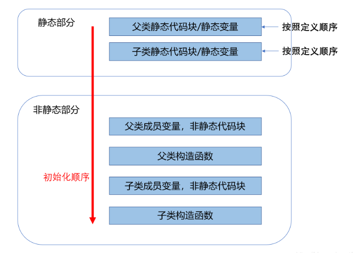

## 对象的概念 ##

编程语言是创建应用程序的思想结构，更是我们思维放大的工具与另一种表达媒介。面向对象编程（Object-Oriented Programming OOP）是一种编程思维方式和编码架构。

### 抽象

所有编程语言都提供抽象机制。从某种程度上来说，问题的复杂度直接取决于抽象的类型和质量。这里的“类型”意思是：抽象的内容是什么？汇编语言是对底层机器的轻微抽象。接着出现的“命令式”语言（如 FORTRAN和 C）是对汇编语言的抽象。与汇编相比，这类语言已有了长足的改进，但它们的抽象原理依然要求我们着重考虑计算机的结构，而非问题本身的结构。  *程序员必须要在机器模型（“解决方案空间”）和实际解决的问题模型（“问题空间”）之间建立起一种关联。*

在面向对象的程序设计中，程序员可利用一些工具表达“问题空间”内的元素。由于这种表达非常具有普遍性，所以不必受限于特定类型的问题。我们将问题空间中的元素以及它们在解决方案空间的表示称作“对象”（**Object**）。当然，还有一些在问题空间没有对应的对象体。通过添加新的对象类型，程序可进行灵活的调整，以便与特定的问题配合。所以当你在阅读描述解决方案的代码时，也是在阅读问题的表述。总之，OOP 允许我们根据问题来描述问题，而不是根据运行解决方案的计算机。然而，它仍然与计算机有联系，每个对象都类似一台小计算机：它们有自己的状态并且可以进行特定的操作。这与现实世界的“对象”或者“物体”相似：它们都有自己的特征和行为。  

 “纯粹”的面向对象程序设计方法的五大基本特征：

> 1. **万物皆对象**。你可以将对象想象成一种特殊的变量。它存储数据，但可以在你对其“发出请求”时执行本身的操作。理论上讲，你总是可以从要解决的问题身上抽象出概念性的组件，然后在程序中将其表示为一个对象。
> 2. **程序是一组对象，通过消息传递来告知彼此该做什么**。要请求调用一个对象的方法，你需要向该对象发送消息。
> 3. **每个对象都有自己的存储空间，可容纳其他对象**。或者说，通过封装现有对象，可制作出新型对象。所以，尽管对象的概念非常简单，但在程序中却可达到任意高的复杂程度。
> 4. **每个对象都有一种类型**。根据语法，每个对象都是某个“类”的一个“实例”。其中，“类”（Class）是“类型”（Type）的同义词。一个类最重要的特征就是“能将什么消息发给它”。
> 5. **同一类所有对象都能接收相同的消息**。由于类型为“圆”（Circle）的一个对象也属于类型为“形状”（Shape）的一个对象，所以一个圆完全能接收发送给"形状”的消息。这意味着可让程序代码统一指挥“形状”，令其自动控制所有符合“形状”描述的对象，其中自然包括“圆”。这一特性称为对象的“可替换性”，是 OOP 最重要的概念之一。


### 封装 ###

我们可以把编程的侧重领域划分为研发和应用。应用程序员调用研发程序员构建的基础工具类来做快速开发。研发程序员开发一个工具类，该工具类仅向应用程序员公开必要的内容，并隐藏内部实现的细节。

使用访问控制的原因有以下两点：

1. 让应用程序员不要触摸他们不应该触摸的部分。
2. 使类库的创建者（研发程序员）在不影响后者使用的情况下完善更新工具库。

Java 有三个显式关键字来设置类中的访问权限：`public`（公开），`private`（私有）和`protected`（受保护）。这些访问修饰符决定了谁能使用它们修饰的方法、变量或类。

1. `public` 表示任何人都可以访问和使用该元素。
2. `private` 除了类本身和类内部的方法，外界无法直接访问该元素。
3. `protected` 子类可以访问 `protected` 的成员，但不能访问 `private` 成员。
4. `default`（默认）被称为包访问，该权限下的资源可以被同一包中其他类的成员访问。

### 复用 ###

一个类经创建和测试后，理应是可复用的。我们可以通过重复使用某个类的对象，也可以通过继承来达到这种复用性。在创建新类时首先要考虑“组合”，因为它更简单灵活，而且设计更加清晰。“组合”和“聚合”的概念：

- **组合**（Composition）经常用来表示“拥有”关系（has-a relationship），整件拥有部件的生命周期，多个整件不可以同时共享同一个部件。例如，“汽车拥有引擎”。
- **聚合**（Aggregation）动态的**组合**，整件不会拥有部件的生命周期，多个整件可以共享同一个部件。例如，“班级拥有学生”。

### 继承 ###

继承是 Java 面向对象编程技术的一块基石，因为它允许创建分等级层次的类。

继承就是子类继承父类的特征和行为，使得子类对象（实例）具有父类的实例域和方法，或子类从父类继承方法，使得子类具有父类相同的行为。

- 子类拥有父类非 private 的属性、方法。
- 子类可以拥有自己的属性和方法，即子类可以对父类进行扩展。
- 子类可以用自己的方式实现父类的方法 （@override）。
- Java 的继承是单继承，但是可以多重继承，单继承就是一个子类只能继承一个父类，多重继承就是，例如 A 类继承 B 类，B 类继承 C 类，所以按照关系就是 C 类是 B 类的父类，B 类是 A 类的父类，这是 Java 继承区别于 C++ 继承的一个特性。
- 提高了类之间的耦合性（继承的缺点，耦合度高就会造成代码之间的联系越紧密，代码独立性越差）。

### 多态 ###

通过继承，程序直到运行时才能确定代码的地址，因此发送消息给对象时，还需要其他一些方案。为了解决这个问题，面向对象语言使用**后期绑定**的概念。当向对象发送信息时，被调用的代码直到运行时才确定。编译器确保方法存在，并对参数和返回值执行类型检查，但是它不知道要执行的确切代码。为了执行后期绑定，Java 使用一个特殊的代码位来代替绝对调用。这段代码使用对象中存储的信息来计算方法主体的地址。

发送消息给对象时，如果程序不知道接收的具体类型是什么，但最终执行是正确的，这就是对象的“多态性”（Polymorphism）。面向对象的程序设计语言是通过“动态绑定”的方式来实现对象的多态性的，编译器和运行时系统会负责对所有细节的控制。

### 单继承结构 ###

Java 是单继承结构的。所有对象都具有的公共接口，它们最终都属于同一个基类，它的名字就是 `Object`。单继承结构使得垃圾收集器的实现更为容易，这是 Java 在 C++ 基础上的根本改进之一。

由于运行期的类型信息会存在于所有对象中，所以我们永远不会遇到判断不了对象类型的情况。这对于系统级操作尤其重要，例如异常处理。

### 对象创建与生命周期 ###

我们在使用对象时要特别注意的是对象的创建和销毁方式。每个对象的生存都需要资源，尤其是内存。为了资源的重复利用，当对象不再被使用时，我们应该及时释放资源，清理内存。

Java 使用动态内存分配，每次创建对象时，使用 `new` 关键字构建该对象的动态实例。Java 的内存管理是建立在垃圾收集器上的，它能自动发现对象不再被使用并释放内存。垃圾收集器的存在带来了极大的便利，它减少了我们之前必须要跟踪的问题和编写相关代码的数量。因此，垃圾收集器提供了更高级别的保险，以防止潜在的内存泄漏问题。结合单继承和仅可在堆中创建对象的机制，Java 的编码过程比用 C++ 要简单得多。我们所要做的决定和要克服的障碍也会少很多！

### 异常处理 ###

异常处理机制将程序错误直接交给编程语言甚至是操作系统。“异常”（Exception）是一个从出错点“抛出”（thrown）后能被特定类型的异常处理程序捕获(catch)的一个对象。异常不像方法返回的错误值和方法设置用来表示发生错误的标志位那样可以被忽略。异常的发生是不会被忽略的，它终究会在某一时刻被处理。“异常机制”提供了一种可靠地从错误状况中恢复的方法，使得我们可以编写出更健壮的程序。


## 万物皆对象 ##

### 对象创建

“引用”用来关联“对象”。在 Java 中，通常我们使用`new`操作符来创建一个新对象。`new` 关键字代表：创建一个新的对象实例。

#### 数据存储

程序在运行时是如何存储的呢？尤其是内存是怎么分配的。有5个不同的地方可以存储数据：

1. **寄存器**（Registers）最快的存储区域，位于 CPU 内部 。然而，寄存器的数量十分有限，所以寄存器根据需求进行分配。我们对其没有直接的控制权，也无法在自己的程序里找到寄存器存在的踪迹。
2. **栈内存**（Stack）存在于常规内存 RAM（随机访问存储器，Random Access Memory）区域中，可通过栈指针获得处理器的直接支持。栈指针下移分配内存，上移释放内存，这是一种快速有效的内存分配方法，速度仅次于寄存器。创建程序时，Java 系统必须准确地知道栈内保存的所有项的生命周期。这种约束限制了程序的灵活性。因此，虽然在栈内存上存在一些 Java 数据，特别是对象引用，但 Java 对象却是保存在堆内存的。
3. **堆内存**（Heap）这是一种通用的内存池（也在 RAM 区域），所有 Java 对象都存在于其中。与栈内存不同，编译器不需要知道对象必须在堆内存上停留多长时间。因此，用堆内存保存数据更具灵活性。创建一个对象时，只需用 `new` 命令实例化对象即可，当执行代码时，会自动在堆中进行内存分配。
4. **常量存储**（Constant storage）常量值通常直接放在程序代码中，因为它们永远不会改变。如需严格保护，可考虑将它们置于只读存储器 ROM （只读存储器，Read Only Memory）中。
5. **非 RAM 存储**（Non-RAM storage）数据完全存在于程序之外，在程序未运行以及脱离程序控制后依然存在。两个主要的例子：（1）序列化对象：对象被转换为字节流，通常被发送到另一台机器；（2）持久化对象：对象被放置在磁盘上，即使程序终止，数据依然存在。这些存储的方式都是将对象转存于另一个介质中，并在需要时恢复成常规的、基于 RAM 的对象。Java 为轻量级持久化提供了支持。而诸如 JDBC 和 Hibernate 这些类库为使用数据库存储和检索对象信息提供了更复杂的支持。

#### 基本类型的存储

Java 的基本类型存储在栈内存中。Java 确定了每种基本类型的内存占用大小。 这些大小不会像其他一些语言那样随着机器环境的变化而变化。这种不变性也是 Java 更具可移植性的一个原因。

| 基本类型 | 大小    | 最小值    | 最大值           | 包装类型  |
| -------- | ------- | --------- | ---------------- | --------- |
| boolean  | —       | —         | —                | Boolean   |
| char     | 16 bits | Unicode 0 | Unicode 2^16^ -1 | Character |
| byte     | 8 bits  | -128      | +127             | Byte      |
| short    | 16 bits | - 2^15^   | + 2^15^ -1       | Short     |
| int      | 32 bits | - 2^31^   | + 2^31^ -1       | Integer   |
| long     | 64 bits | - 2^63^   | + 2^63^ -1       | Long      |
| float    | 32 bits | IEEE754   | IEEE754          | Float     |
| double   | 64 bits | IEEE754   | IEEE754          | Double    |
| void     | —       | —         | —                | Void      |

所有的数值类型都是有正/负符号的。布尔（boolean）类型的大小没有明确的规定，通常定义为取字面值 “true” 或 “false” 。基本类型有自己对应的包装类型，如果你希望在堆内存里表示基本类型的数据，就需要用到它们的包装类。

#### 高精度数值

 `BigInteger` 和 `BigDecimal`可用于高精度计算。这两个类提供的操作与对基本类型执行的操作相似。也就是说，能对 int 或 float 做的运算，在 BigInteger 和 BigDecimal 这里也同样可以，只不过必须要通过调用它们的方法来实现而非运算符。由于涉及到的计算量更多，所以运算速度会慢一些，我们牺牲了速度，但换来了精度。

BigInteger 支持任意精度的整数。可用于精确表示任意大小的整数值，同时在运算过程中不会丢失精度。 BigDecimal 支持任意精度的定点数字。例如，可用它进行精确的货币计算。

### 对象清理

#### 作用域

大多数程序语言都有作用域的概念。作用域决定了在该范围内定义的变量名的可见性和生存周期。在 C、 C++ 和 Java 中，作用域是由大括号 `{}` 的位置决定的。例如：	

```java
{
    int x = 12;
    // 仅 x 变量可用
    {
        int q = 96;
        // x 和 q 变量皆可用
    }
    // 仅 x 变量可用
    // 变量 q 不在作用域内
}
```

#### 对象作用域

Java 对象与基本类型具有不同的生命周期。当我们使用 `new` 关键字来创建 Java 对象时，它的生命周期将会超出作用域。示例：

```java
{
    String s = new String("a string");
} 
// 作用域终点
```

上例中，引用 s 在作用域终点就结束了。但是，引用 s 指向的字符串对象依然还在占用内存。在这段代码中，我们无法在这个作用域之后访问这个对象，因为唯一对它的引用 s 已超出了作用域的范围。

那么问题来了：我们在 Java 中并没有主动清理这些对象，那么它是如何避免 C++ 中出现的内存被填满从而阻塞程序的问题呢？答案是：Java 的垃圾收集器会检查所有 `new` 出来的对象并判断哪些不再可达，继而释放那些被占用的内存，供其他新的对象使用。也就是说，我们不必担心内存回收的问题了。

### 类的创建

#### 基本类型默认值

如果类的成员变量（字段）是基本类型，那么在类初始化时，这些类型将会被赋予一个初始值。

| 基本类型 | 初始值        |
| -------- | ------------- |
| boolean  | false         |
| char     | \u0000 (null) |
| byte     | (byte) 0      |
| short    | (short) 0     |
| int      | 0             |
| long     | 0L            |
| float    | 0.0f          |
| double   | 0.0d          |

这种默认值的赋予并不适用于局部变量，局部变量需要显式为其赋值，否则会编译错误。

#### 方法使用

方法的基本组成部分包括名称、参数、返回类型、方法体。格式如：

```java
 [返回类型] [方法名](/*参数列表*/){
     // 方法体
 }
```

方法名和参数列表统称为**方法签名**（signature of the method）。签名作为方法的唯一标识。

当返回类型为 **void** 时， **return** 关键字仅用于退出方法，因此在方法结束处的 **return** 可被省略。

标准 **main()** 方法的参数是一个 **String** 数组。 参数 **args** 并没有在当前的程序中使用到，但是 Java 编译器强制要求必须要有， 这是因为它们被用于接收从命令行输入的参数。

### 编码风格

类：类名的首字母大写。 如果类名是由多个单词构成的，则每个单词的首字母都应大写。

方法或字段：驼峰命名法，首字母小写，后面每个单词首字母大写。

静态属性：全部大写，多个字母用下划线分割。


## 运算符

几乎所有运算符都只能操作基本类型（Primitives）。唯一的例外是 `=`、`==` 和 `!=`，它们能操作所有对象。除此以外，**String** 类支持 `+` 和 `+=`。

### 字面值常量

当向程序中插入一个字面值常量（**Literal**）时，编译器会确切地识别它的类型。当类型不明确时，必须在字面值常量前后添加特殊字符来帮助编译器识别。

对于 **Long** 型数值，结尾使用大写 `L` 或小写 `l` 皆可（不推荐使用 `l`，因为容易与阿拉伯数值 1 混淆）。大写 `F` 或小写 `f` 表示 **float** 浮点数。大写 `D` 或小写 `d` 表示 **double** 双精度。 

十六进制，由前导 `0x` 或 `0X` 表示，后跟 0-9 或 a-f （大写或小写）。

八进制，由 前导零 `0` 表示，后跟 0~7 之间的数字。

二进制，由前导 `0b` 或 `0B` 表示，后跟 0 或 1 。

对于大数值的分组，可以在数字字面量中包含下划线 `_`，以使结果更清晰。（Java 7 补充）

```java
int a = 0b0010_1111_1010_1111_1010_1111_1010_1111;
```

### 算术运算符

加 `+` 、减 `-` 、乘 `*` 、除 `/` 、取余 `%` 、递增 `++` 、递减 `-- `

### 关系运算符

关系运算符会通过产生一个布尔（**boolean**）结果来表示操作数之间的关系。 

大于 `>` 、小于 `<` 、大于等于 `>=` 、小于等于 `<=` 、等于 `==` 、不等于 `!=` 。

### 逻辑运算符

逻辑运算符 `&&` （**与**）、`||`（**或**）和 `!`（**非**）根据参数的逻辑关系生成布尔值 `true` 或 `false`。 

**逻辑运算符支持“短路”**。整个表达式会在运算到可以明确结果时就停止并返回结果，这意味着该逻辑表达式的后半部分不会被执行到。 

### 位运算符

位运算符允许我们操作一个整型数字中的单个二进制位。位运算符会对**两个整数对应的位（注意：操作的是整数的补码）**执行布尔代数，从而产生结果。 **位运算符包含 与 `&` 、或 `|`  、异或 `^` 、非 `~`，其中前三者可以操作两个布尔类型的变量或常量，但是不会短路。**

位运算符和逻辑运算符都使用了同样的字符，只不过数量不同。位短，所以位运算符只有一个字符。位运算符可与等号 `=` 联合使用以接收结果及赋值：`&=`，`|=` 和 `^=` 都是合法的（由于 `~` 是一元运算符，所以不可与 `=` 联合使用）。 

### 移位运算符

移位运算符面向的运算对象也是二进制的“位” **（注意：操作的是整数的补码）**，它们只能用于处理整数类型。左移位运算符 `<<` 能将其左边的运算对象向左移动右侧指定的位数（在低位补 0）。右移位运算符 `>>` 则相反。右移位运算符有“正”、“负”值：若值为正，则在高位插入 0；若值为负，则在高位插入 1。Java 也添加了一种“不分正负”的右移位运算符（>>>），它使用了“零扩展”（zero extension）：无论正负，都在高位插入 0。 

 如果移动 **char**、**byte** 或 **short**，则会在移动发生之前将其提升为 **int**，结果为 **int**。仅使用右值（rvalue）的 5 个低阶位。这可以防止我们移动超过 **int** 范围的位数。若对一个 **long** 值进行处理，最后得到的结果也是 **long**。 

### 三元运算符

**布尔表达式 ? 值 1 : 值 2**

若表达式计算为 **true**，则返回结果 **值 1** ；如果表达式的计算为 **false**，则返回结果 **值 2**。

### 类型转换

 “类型转换”（Casting）的作用是“与一个模型匹配”。在适当的时候，Java 会将一种数据类型自动转换成另一种。  若将数据类型进行“向下转换”（**Narrowing Conversion**）的操作（将容量较大的数据类型转换成容量较小的类型），可能会发生信息丢失的危险。 对于“向上转换”（**Widening conversion**），则不必进行显式的类型转换，因为较大类型的数据肯定能容纳较小类型的数据，不会造成任何信息的丢失。 

#### 截断和舍入 ####

在执行“向下转换”时，必须注意数据的截断和舍入问题。若从浮点值转换为整型值，Java 会将小数位截断。 若你想对结果进行四舍五入，可以使用 `java.lang.Math` 的 `round()` 方法 

#### 类型提升 ####

如果我们对小于 **int** 的基本数据类型（即 **char**、**byte** 或 **short**）执行任何算术或按位操作，这些值会在执行操作之前类型提升为 **int**，并且结果值的类型为 **int**。若想重新使用较小的类型，必须使用强制转换。通常，表达式中最大的数据类型是决定表达式结果的数据类型。**float** 型和 **double** 型相乘，结果是 **double** 型的；**int** 和 **long** 相加，结果是 **long** 型。

### 运算符总结

| 运算符分类 | 结合顺序   | 运算符                                              |
| ---------- | ---------- | --------------------------------------------------- |
| 分隔符     | 左结合     | .   []   ()   ;   ,                                 |
| 一元运算符 | **右结合** | !  ++  --  - ( 取反 )  ~ ( 逐位取反 )               |
| 算术运算符 | 左结合     | +   -   *   /   %                                   |
| 移位运算符 | 左结合     | <<   >>   >>>                                       |
| 关系运算符 | 左结合     | <   >   <=  >=  ==  !=  instanceof                  |
| 逻辑运算符 | 左结合     | &&  \|\|  !                                         |
| 位运算符   | 左结合     | &  \|  ~  ^ ( 异或 )                                |
| 三目运算符 | **右结合** | 布尔表达式 ? 表达式 1 : 表达式 2                    |
| 赋值运算符 | **右结合** | =  +=  -=  *=   /=  %=   <<=  >>=  >>>=  &= \|=  ^= |


## 控制流 ##

所有的条件语句都利用条件表达式的“真”或“假”来决定执行路径。

### 选择语句

#### if-else 

**if-else** 语句是控制程序执行流程最基本的形式，其中 `else` 是可选的。

```java
if(Boolean-expression) {
     “statement”
} else {
     “statement”
}
```

#### switch 

**switch** 语句是一种实现多路选择的干净利落的一种方式（比如从一系列执行路径中挑选一个）。

```java
switch(expression){
    case value :
       //语句
       break; //可选
    case value :
       //语句
       break; //可选
    //你可以有任意数量的case语句
    default : //可选
       //语句
}
```

switch 语句中的变量类型可以是： byte、short、int 或者 char。从 Java 7 开始，String 和 枚举也被支持。同时 case 标签必须为字符串常量或字面量。

### 循环语句

**while**，**do-while** 和 **for** 用来控制循环语句。只有控制循环的布尔表达式计算结果为 `false`，循环语句才会停止。

#### while

```java
while(Boolean-expression) 
{
    statement
}
```

执行语句会在每一次循环前，判断布尔表达式返回值是否为 `true`。

#### do-while

```java
do {
	statement
}
while(Boolean-expression);
```

**while** 和 **do-while** 之间的唯一区别是：即使条件表达式返回结果为 `false`， **do-while** 语句也至少会执行一次。

#### for

**for** 循环是最常用的迭代形式。 该循环在第一次迭代之前执行初始化。随后，它会执行布尔表达式，并在每次迭代结束时，进行某种形式的步进。**step 语句在循环语句之后执行。**

```java
for(initialization; Boolean-expression; step){
	statement
}
```

逗号运算符：在 **for** 循环的初始化和步进控制中定义多个变量。我们可以使用逗号分隔多个语句，并按顺序计算这些语句。**注意**：要求定义的变量类型相同。

```java
for(int i = 1, j = i + 10; i < 5; i++, j = i * 2) {
      System.out.println("i = " + i + " j = " + j);
    }
```

#### for-each

**for-each** 无需你去创建变量和步进来控制循环计数。

```java
for(char c: "An African Swallow".toCharArray()){
	System.out.print(c + " ");
}
```

**for-each** 循环适用于任何可迭代（*iterable*）的对象。

### break 和 continue

在任何迭代语句的主体内，都可以使用 **break** 和 **continue** 来控制循环的流程。 其中，**break** 表示跳出当前循环体。而 **continue** 表示停止本次循环，开始下一次循环。

“标签”是后面跟一个冒号的标识符。对 Java 来说，唯一用到标签的地方是在循环语句之前，它实际需要紧靠在循环语句的前方。而在循环之前设置标签的唯一理由是：我们希望在其中嵌套另一个循环或者一个开关。这是由于 **break** 和 **continue** 关键字通常只中断当前循环，但若搭配标签一起使用，它们就会中断并跳转到标签所在的地方开始执行。

```java
label1:
outer-iteration { 
  inner-iteration {
  // ...
  break; 
  // ...
  continue; 
  // ...
  continue label1;
  // ...
  break label1; 
  } 
}

```

1. 简单的一个 **continue** 会退回最内层循环的开头（顶部），并继续执行。
2. 带有标签的 **continue** 会到达标签的位置，并重新进入紧接在那个标签后面的循环。
3. **break** 会中断当前循环，外层循环继续。
4. 带标签的 **break** 会中断那个标签指示的循环。

### return

return 关键字有两方面的作用

- 从当前的方法中退出，返回到该调用的方法的语句处，继续执行；
- 返回一个值给调用该方法的语句，返回值数据类型必须与方法的声明中返回值的类型一致。


## 初始化和清理

两个安全性问题：初始化和清理。在使用一个对象之前没有对其进行初始化，使用完之后没有及时将它清理。

Java 在创建对象时调用构造器来完成对象的初始化。当对象不再使用时，通过垃圾收集器（Garbage Collector, GC）去自动回收不再被使用的对象所占的资源。

### 利用构造器保证初始化 ###

Java 会在用户使用对象之前（即对象刚创建完成）自动调用对象的构造器方法，从而保证初始化。在 Java 中，对象的创建与初始化是统一的概念，二者不可分割。

如果你创建一个类，类中没有构造器，那么编译器就会自动为你创建一个无参构造器。但是,一旦你显式地定义了构造器（无论有参还是无参），编译器就不会自动为你创建无参构造器。

### 方法重载 ###

任何编程语言中都具备的一项重要特性就是命名。当你创建一个对象时，就会给此对象分配的内存空间命名。方法是行为的命名。你通过名字指代所有的对象，属性和方法。**方法重载**允许方法具有相同的方法名但接收的参数不同。

```java
public void info() {
        System.out.println(null);
}
public void info(String str) {
        System.out.println(str);
}
```

#### 返回值的重载 ####

为什么只能通过方法名和参数列表，不能通过方法名和返回值区分方法呢？例如以下两个方法：

```java
void f(){}
int f() {return 1;}
```

咋一看就能区分调用谁了。但是，如果你调用一个方法且忽略返回值，你就不知道调用的是哪个方法了，这让编译器很迷惑。

### this 关键字 ###

**this** 关键字代表当前对象的的引用，它只能在非静态方法内部使用。**this** 关键字只用在一些必须显式使用当前对象引用的特殊场合。例如，用在 **return** 语句中返回对当前对象的引用，在标准的 setter() 方法中指定被赋值的是成员变量。

#### 在构造器中调用构造器 ####

其中只能通过 **this** 调用一次构造器。另外，必须首先调用构造器，否则编译器会报错。

```java 
 Flower(String ss) {
        this.ss = ss;
 }
 Flower(String ss, int petals) {
     this(petals);
     //- this(ss); // Can't call two!
     this.ss = ss; // Another use of "this"
 }
```

#### static 的含义 ####

概括：方便在没有创建对象的情况下来进行调用。

**static** 可以修饰变量、方法、代码块、内部类，还可以实现静态导包。静态方法内不能使用 this。

### 垃圾回收器 ###

使用完一个对象就不管它并非总是安全的。Java 中有垃圾回收器回收无用对象占用的内存。垃圾回收器只知道如何释放用 **new** 创建的对象的内存，如果你创建的对象不是通过 **new** 来分配内存的，那么它不知道如何回收这部分内存。如果 Java 虚拟机（JVM）并未面临内存耗尽的情形，它可能不会浪费时间执行垃圾回收以恢复内存。

在 Java 中，对象并非总是被垃圾回收：

- 对象可能不被垃圾回收。
- 垃圾回收不等同于析构。
- 垃圾回收只与内存有关。

#### finalize() 的说明 ####

finalize() 方法是 Object 类中提供的一个方法，在 GC 准备释放对象所占用的内存空间之前，它将首先调用 finalize() 方法。

**finalize() 调用的时机**：由于 GC 的自动回收机制，因而并不能保证 finalize() 方法会被及时地执行（垃圾对象的回收时机具有不确定性），也不能保证它们会被执行(程序可能由始至终都未触发垃圾回收)。

**什么时候应该使用它**：finalize() 方法中一般用于释放非 Java 资源（如打开的文件资源、数据库连接等），或是调用 native 方法时分配的内存（如 C 语言的 malloc() 系列函数）。

**为什么应该避免使用它**：由于 finalize() 方法的调用时机具有不确定性，从一个对象变得不可到达开始到 finalize() 方法被执行，所花费的时间这段时间是任意长的。我们并不能依赖 finalize() 方法能及时的回收占用的资源，可能出现的情况是在我们耗尽资源之前，gc 却仍未触发，因而通常的做法是提供显示的 close() 方法供客户端手动调用。

**让对象再复活一次**：利用 finalize() 方法最多只会被调用一次的特性，我们可以实现延长对象的生命周期。

#### 终结条件 ####

`finalize()` 有一个有趣的用法，它不依赖于每次都要对 `finalize()` 进行调用，这就是对象终结条件的验证。

如果对象代表了一个打开的文件，在对象被垃圾回收之前程序员应该关闭这个文件。只要对象中存在没有被适当清理的部分，程序就存在很隐晦的 bug。`finalize()` 可以用来最终发现这个情况，尽管它并不总是被调用。如果某次 `finalize()` 的动作使得 bug 被发现，那么就可以据此找出问题所在。

#### 垃圾回收器如何工作 ####

Java 从堆空间分配的速度可以和其他语言在栈上分配空间的速度相媲美。

当垃圾回收器工作时，一边回收内存，一边使堆中的对象紧凑排列，这样"堆指针"就可以很容易地移动到更靠近传送带的开始处，也就尽量避免了页面错误。垃圾回收器通过重新排列对象，实现了一种高速的、有无限空间可分配的堆模型。

引用计数策略：实现简单但速度很慢，而且如果对象之间存在循环引用，那么它们的引用计数都不为 0，就会出现应该被回收但无法被回收的情况。

更快的策略：对于任意"活"的对象，一定能最终追溯到其存活在栈或静态存储区中的引用。这个引用链条可能会穿过数个对象层次，由此，如果从栈或静态存储区出发，遍历所有的引用，你将会发现所有"活"的对象。对于发现的每个引用，必须追踪它所引用的对象，然后是该对象包含的所有引用，如此反复进行，直到访问完"根源于栈或静态存储区的引用"所形成的整个网络。你所访问过的对象一定是"活"的。注意，这解决了对象间循环引用的问题，这些对象不会被发现，因此也就被自动回收了。

在这种方式下，Java 虚拟机采用了一种**自适应**的垃圾回收技术。至于如何处理找到的存活对象，取决于不同的 Java 虚拟机实现。其中有一种做法叫做**停止-复制**（stop-and-copy）。顾名思义，这需要先暂停程序的运行（不属于后台回收模式），然后将所有存活的对象从当前堆复制到另一个堆，没有复制的就是需要被垃圾回收的。另外，当对象被复制到新堆时，它们是一个挨着一个紧凑排列，然后就可以按照前面描述的那样简单、直接地分配新空间了。

当对象从一处复制到另一处，所有指向它的引用都必须修正。位于栈或静态存储区的引用可以直接被修正，但可能还有其他指向这些对象的引用，它们在遍历的过程中才能被找到（可以想象成一个表格，将旧地址映射到新地址）。

这种所谓的"复制回收器"效率低下主要因为两个原因。其一：得有两个堆，然后在这两个分离的堆之间来回折腾，得维护比实际需要多一倍的空间。某些 Java 虚拟机对此问题的处理方式是，按需从堆中分配几块较大的内存，复制动作发生在这些大块内存之间。

其二在于复制本身。一旦程序进入稳定状态之后，可能只会产生少量垃圾，甚至没有垃圾。尽管如此，复制回收器仍然会将所有内存从一处复制到另一处，这很浪费。为了避免这种状况，一些 Java 虚拟机会进行检查：要是没有新垃圾产生，就会转换到另一种模式（即"自适应"）。这种模式称为**标记-清扫**（mark-and-sweep），对一般用途而言，"标记-清扫"方式速度相当慢，但是当你知道程序只会产生少量垃圾甚至不产生垃圾时，它的速度就很快了。

"标记-清扫"所依据的思路仍然是从栈和静态存储区出发，遍历所有的引用，找出所有存活的对象。但是，每当找到一个存活对象，就给对象设一个标记，并不回收它。只有当标记过程完成后，清理动作才开始。在清理过程中，没有标记的对象将被释放，不会发生任何复制动作。"标记-清扫"后剩下的堆空间是不连续的，垃圾回收器要是希望得到连续空间的话，就需要重新整理剩下的对象。

"停止-复制"指的是这种垃圾回收动作不是在后台进行的；相反，垃圾回收动作发生的同时，程序将会暂停。在 Oracle 公司的文档中会发现，许多参考文献将垃圾回收视为低优先级的后台进程，但是早期版本的 Java 虚拟机并不是这么实现垃圾回收器的。当可用内存较低时，垃圾回收器会暂停程序。同样，"标记-清扫"工作也必须在程序暂停的情况下才能进行。

### 成员初始化 ###

Java 尽量保证所有变量在使用前都能得到恰当的初始化。对于方法的局部变量，必须显式初始化，不然将发生编译错误。对于基本类型的成员变量，Java 会为其赋予默认值。对于引用类型的成员变量，引用就会被赋值为 **null**。

#### 初始化顺序 ####

在类中变量定义的顺序决定了它们初始化的顺序。即使变量定义散布在方法定义之间，它们仍会在任何方法（包括构造器）被调用之前得到初始化。

#### 静态数据的初始化 ####

无论创建多少个对象，静态数据都只占用一份存储区域，静态代码块只会执行一次。**static** 关键字不能应用于局部变量，所以只能作用于属性（字段、域）。如果一个字段是静态的基本类型，你没有初始化它，那么它就会获得基本类型的标准初值。如果它是对象引用，那么它的默认初值就是 **null**。

### 数组初始化 ###

数组是相同类型的、用一个标识符名称封装到一起的一个对象序列或基本类型数据序列。数组是通过方括号下标操作符 [] 来定义和使用的。

```java
int[] a1; //推荐
int a1[]; //不推荐
//数组的初始化
int[] a = {1, 2, 3};
int[] b = new int[5];
```

编译器不允许定义数组的时候指定大小，因为你拥有的只是对数组的一个引用，但是还没有给数组对象本身分配任何空间，可以在初始化的时候指定大小。为了给数组创建相应的存储空间，必须写初始化表达式。**数组的大小一旦创建是不可修改的。**

所有的数组都有一个固定成员 **length**，告诉你这个数组有多少个元素，你不能对其修改。数组元素中的基本数据类型值会自动初始化为默认值（对于数字和字符是 0；对于布尔型是 **false**），引用类型则会设为 null。

#### 可变参数列表 ####

```java
static void printArray(Object... args) {
        for (Object obj: args) {
            System.out.print(obj + " ");
        }
}
```

有了可变参数，你就再也不用显式地编写数组语法了，当你指定参数时，编译器实际上会为你填充数组。

### 枚举类型 ###

#### 枚举的定义 ####

使用 **enum** 关键字定义枚举类，它被编译器编译为 `final class Xxx extends Enum { … }`

```java
//定义 color 枚举类
public enum Color {
    RED, GREEN, BLUE;
}

//编译器编译出的 class 文件
public final class Color extends Enum<Color> {//继承自 Enum，标记为 final 
    // 每个实例均为全局唯一:
    public static final Color RED = new Color();
    public static final Color GREEN = new Color();
    public static final Color BLUE = new Color();
    // private构造方法，确保外部无法调用new操作符:
    private Color() {}
}
```

此外，还可以在定义枚举的时候添加属性：

```java
public enum Weekday {
    MON(1, "星期一"), 
    TUE(2, "星期二"), 
    WED(3, "星期三"), 
    THU(4, "星期四"), 
    FRI(5, "星期五"), 
    SAT(6, "星期六"), 
    SUN(0, "星期日");

    public final int dayValue;
    private final String chinese;

    private Weekday(int dayValue, String chinese) {
        this.dayValue = dayValue;
        this.chinese = chinese;
    }

    @Override
    public String toString() {
        return this.chinese;
    }
}
```

#### enum 的方法 ####

因为 enum 是一个 class ，每个枚举的值都是 class 实例，因此，这些实例有一些方法：

- name() 返回常量名

```java
String s = Color.RED.name(); // "RED"
```

- ordinal() 返回定义的常量的顺序，从 0 开始计数

```java
int n = Color.GREEN.ordinal(); // 1
```

- 默认情况下，对枚举常量调用 toString() 会返回和 name() 一样的字符串。但是，toString() 可以被覆写，而 name() 则不行。

#### enum 的特点 ####

- 定义的 `enum` 类型总是继承自 `java.lang.Enum` （不能再继承其他类了，因为 Java 不支持多继承），且无法被继承（因为编译后被 final 修饰）；
- 只能定义出 `enum` 的实例，而无法通过 `new` 操作符创建 `enum` 的实例（构造方法私有）；
- 定义的每个实例都是引用类型的唯一实例（ jvm 中只存在一份）；
- 可以将 `enum` 类型用于 `switch` 语句，因为枚举类天生具有类型信息和有限个枚举常量，所以比 `int` 、 `String` 类型更适合用在 `switch` 语句中。

#### enum 的比较 ####

使用 `enum` 定义的枚举类是一种引用类型。一般来说，引用类型比较，要使用 equals() 方法，如果使用 `==` 比较，它比较的是两个引用类型的引用是否指向同一个对象。因此，引用类型比较，要始终使用 `equals()` 方法，但 `enum` 类型可以例外，这是因为 `enum` 类型的每个常量在 JVM 中只有一个唯一实例，所以可以直接用 `==` 比较。

```Java
if (day == Weekday.FRI) {
    // ok!
   }
if (day.equals(Weekday.SUN)) { 
    // ok, but more code!
   }
```


## 封装 ##

控制成员访问权限有两个原因：

- 第一个原因是使用户不要接触他们不该接触的部分，这部分对于类内部来说是必要的，但是不属于客户端程序员所需接口的一部分。因此将方法和属性声明为 **private** 对于客户端程序员来说是一种服务，可以让他们清楚地看到什么是重要的，什么可以忽略。这可以简化他们对类的理解。

- 第二个也是最重要的原因是为了让类库设计者更改类内部的工作方式，而不用担心会影响到客户端程序员。比如最初以某种方式创建一个类，随后发现如果更改代码结构可以极大地提高运行速度。如果接口与实现被明确地隔离和保护，你可以实现这一目的，而不必强制客户端程序员重新编写代码。访问权限控制确保客户端程序员不会依赖某个类的底层实现的任何部分。

为了解决这一问题，Java 提供了*访问修饰符*（access specifier）供类库开发者指明哪些对于客户端程序员是可用的，哪些是不可用的。访问控制权限的等级，从“最大权限”到“最小权限”依次是：**public**，**protected**，*包访问权限（package access）*和 **private**。作为一名类库设计者，你会尽可能将一切都设为 **private**，仅向客户端程序员暴露你愿意他们使用的方法。

### 包的概念 ###

包内包含一组类，它们被组织在一个单独的*命名空间*（namespace）下。例如，标准 Java 库有一个工具库，它被组织在 **java.util** 命名空间下。**java.util** 中含有一个类，叫做 **ArrayList**。使用 **ArrayList** 的一种方式是用其全名 **java.util.ArrayList**。一般使用 **import** 关键字导入某个类。引用包是为了解决类名重复的冲突，**每个类由其包名加类名组成**，可以有效解决类名冲突的问题。

### 代码组织 ###

当编译一个 **.java** 文件时，**.java** 文件中的每个外部类都会有一个输出文件。每个输出的文件名和 **.java** 文件中每个类的类名相同，只是后缀名是 **.class**。因此，在编译少量的 **.java** 文件后，会得到数量较多的 **.class** 文件。在 Java 中，可运行程序是一组 **.class** 文件，它们可以打包压缩成一个 Java 文档文件（JAR，使用 **jar** 文档生成器）。Java 解释器负责查找、加载和解释这些文件。

一个包下可以有很多 **.class** 文件，然而包从未真正被打包成单一的文件，而是将特定包下的所有 **.class** 文件都放在一个目录下，利用了操作系统的文件结构的层次性。这样做解决了两个问题：

- 创建独一无二的包名和查找可能隐藏于目录结构某处的类。
- **把 package 名称分解成你机器上的一个目录，所以当 Java 解释器必须要加载一个 .class 文件时，它能定位到 .class 文件所在的位置。**首先，它找出环境变量 **CLASSPATH**（一般通过操作系统设置）。**CLASSPATH** 包含一个或多个目录，用作查找 .**class** 文件的根目录。从根目录开始，Java 解释器获取包名并将每个句点替换成反斜杠，生成一个基于根目录的路径名（取决于你的操作系统，包名 **foo.bar.baz** 变成 **foo\bar\baz** 或 **foo/bar/baz** 或其它）。然后这个路径与 **CLASSPATH** 的不同项连接，解释器就在这些目录中查找与你所创建的类名称相关的 **.class** 文件（解释器还会查找某些涉及 Java 解释器所在位置的标准目录）。

注意，编译过的代码通常位于与源代码的不同目录中。这是很多工程的标准，而且集成开发环境（IDE）通常会自动为我们做这些。必须保证 JVM 通过 CLASSPATH 能找到编译后的代码。

### 访问权限修饰符 ###

Java 访问权限修饰符 **public**，**protected** 和 **private** 位于定义的类名、构造器名、属性名和方法名之前。如果不提供访问修饰符，就意味着"包访问权限"。所以无论如何，万物都有某种形式的访问控制权。

|                  | private | 默认访问权限 | protected         | public |
| ---------------- | ------- | ------------ | ----------------- | ------ |
| 类本身           | 是      | 是           | 是                | 是     |
| 相同包中子类     | 否      | 是           | 是                | 是     |
| 相同包中的非子类 | 否      | 是           | **是**（:smile:） | 是     |
| 不同包中的子类   | 否      | 否           | 是                | 是     |
| 不同包中的非子类 | 否      | 否           | 否                | 是     |

#### 包访问权限 ####

包访问权限可以把相关类聚到一个包下，以便它们能轻易地相互访问。由于一个编译单元（即一个文件）只能隶属于一个包，所以通过包访问权限，位于同一编译单元中的所有类彼此之间都是可访问的。

#### private 权限 ####

关键字 **private** 意味着除了包含该成员的类，其他任何类都无法访问这个成员。同一包中的其他类无法访问 **private** 成员。

默认的包访问权限通常提供了足够的隐藏措施；使用类的客户端程序员无法访问包访问权限成员。这样做很好，因为默认访问权限是一种我们常用的权限（同时也是一种在忘记添加任何访问权限时自动得到的权限）。因此，通常考虑的是把哪些成员声明成 **public** 供客户端程序员使用。所以，最初不常使用关键字 **private**，因为程序没有它也可以照常工作。然而，使用 **private** 是非常重要的，尤其是在多线程环境中。

任何可以肯定只是该类的"助手"方法，都可以声明为 **private**，以确保不会在包中的其他地方误用它，也防止了你会去改变或删除它。将方法声明为 **private** 确保了你拥有这种选择权。

#### protected 权限 ####

**protected** 修饰的成员既可以被子类访问，也可以被同一个包的其他类访问。

### 接口和实现 ###

访问控制通常被称为*隐藏实现*（implementation hiding）。将数据和方法包装进类中并把具体实现隐藏被称作是*封装*（encapsulation）。其结果就是一个同时带有特征和行为的数据类型。

出于两个重要的原因，访问控制在数据类型内部划定了边界：

- 确立客户端程序员可以使用和不能使用的边界。可以在结构中建立自己的内部机制而不必担心客户端程序员偶尔将内部实现作为他们可以使用的接口的一部分。
- 将接口与实现分离。如果在一组程序中使用接口，而客户端程序员只能向 **public** 接口发送消息的话，那么就可以自由地修改任何不是 **public** 的事物（例如包访问权限，protected，或 private 修饰的事物），却不会破坏客户端代码。

### 类访问权限 ###

一个 Java 源代码文件称为一个*编译单元（compilation unit）*，在编译单元中可以有一个 **public** 类，它的类名必须与文件名相同。每个编译单元中只能有一个 **public** 类，**如果这个编译单元中还有其他类，那么在包之外是无法访问到这些类的，因为它们不是 public 类，此时它们是为主 public 类提供“支持”的类 。**注意，类既不能是 **private** 的，也不能是 **protected** 的。所以对于类的访问权限只有两种选择：包访问权限或者 **public**。为了防止类被外界访问，可以将所有的构造器声明为 **private**。

**设置一个类不能被继承，有两种方法：一是 final 修饰类，二就是 private 修饰所有构造方法；**


## 复用 ##

如何在不污染源代码的前提下复用现存代码：

1. 在新类中创建现有类的对象。这种方式叫做“组合”（Composition），通过**这种方式复用代码的功能**，而非其形式。
2. 创建现有类类型的新类。照字面理解：采用现有类形式，又无需在编码时改动其代码，这种方式就叫做“继承”（Inheritance）。**继承**是面向对象编程（OOP）的重要基础之一。

### 组合语法 ###

你仅需要把对象的引用（object references）放置在一个新的类里，这就使用了组合。类中的基本类型字段会进行默认初始化，但是对象引用被初始化为 **null**，如果你尝试调用其任何一个方法，你将得到一个空指针异常。

编译器**不会**为每个引用创建一个默认对象，在许多情况下，这会导致不必要的开销。初始化引用有四种方法:

1. 当对象被定义时。这意味着它们总是在调用构造函数之前初始化。
2. 使用初始化代码块。
3. 在该类的构造函数中。
4. 在实际使用对象之前。这通常称为*延迟初始化*。在对象创建开销大且不需要每次都创建对象的情况下，它可以减少开销。

### 继承语法 ###

在类主体的左大括号前的代码中使用关键字 **extends** 后跟基类的名称。

当你创建派生类的对象时，它包含基类的子对象。这个子对象与你自己创建基类的对象是一样的。只是从外部看，基类的子对象被包装在派生类的对象中。

Java 自动在派生类构造函数中插入对基类无参构造函数的调用，如果基类没有无参构造函数，则需要手动显式地调用基类的有参构造函数。

### 组合与继承 ###

组合和继承都允许在新类中放置子对象（组合是显式的，而继承是隐式的），它们的使用时机：

- 如果存在一个“是”的关系，通常这意味着使用一个通用类，并为了某个特殊需求将其特殊化，那么继承是更好的选择。
- 如果存在一个“有”的关系，或者你想在新类中包含一个已有类的功能时，那么首选组合。

**尽量通过组合已有的类来创建新类，继承其实不太常用。**除非确实使用继承是有帮助的。一种判断使用组合还是继承的最清晰的方法是看看是否需要把新类向上转型为基类。如果必须向上转型，那么继承就是必要的。

### 委托 ###

Java不直接支持的第三种重用关系称为委托。这介于继承和组合之间，因为你将一个成员对象放在正在构建的类中(比如组合)，但同时又在新类中公开来自成员对象的所有方法(比如继承)。例如：

```Java
public class SpaceShipControls {
  void up(int velocity) {}
  void down(int velocity) {}
}

public class SpaceShipDelegation {
    
  private SpaceShipControls controls = new SpaceShipControls();
    
  private String name;
    
  public SpaceShipDelegation(String name) {
    this.name = name;
  }
    
  // Delegated methods:
  public void up(int velocity) {
    controls.up(velocity);
  }
    
  public void down(int velocity) {
    controls.down(velocity);
  }
  
  public static void main(String[] args) {
    SpaceShipDelegation protector =
      new SpaceShipDelegation("NSEA Protector");
    protector.up(100);
  }
}
```

方法被转发到底层 **control** 对象，因此接口与继承的接口是相同的。但是，你对委托有更多的控制，因为你可以选择只在成员对象中提供方法的子集。

### final 关键字 ###

根据上下文环境，Java 的关键字 **final** 的含义有些不同，但通常它指的是“这是不能被改变的”。防止改变有两个原因：设计或效率。因为这两个原因相差很远，所以有可能误用关键字 **final**。

可以使用 **final** 的三个地方：变量、方法和类。

#### final 变量 ####

final 修饰变量有两种含义：

- 永不改变的编译时常量。编译器可以把常量带入计算中，也就是说，可以在编译时计算，减少了一些运行时的负担。这类常量必须是基本类型，必须在定义时用**直接量**进行赋值。
- 在运行时初始化就不会改变的值。

对于基本类型，**final** 使数值恒定不变，而对于对象引用，**final 使引用恒定不变，但是引用的对象本身的属性是可以改变的**。一旦引用被初始化指向了某个对象，它就不能改为指向其他对象。但是，对象本身是可以修改的，Java 没有提供将任意对象设为常量的方法。

一个被 **static** 和 **final** 同时修饰的属性只会占用一段不能改变的存储空间。

你必须在定义时或在每个构造器中执行 final 变量的赋值操作。这保证了 final 属性在使用前已经被初始化过。

#### final 参数 ####

在参数列表中，将参数声明为 **final** 意味着在方法中不能改变参数指向的对象或基本变量。这个特性主要用于传递数据给匿名内部类。

#### final 方法 ####

使用 **final** 方法的原因有两个：

- 第一个原因是防止子类通过覆写改变方法的行为。这是出于继承的考虑，确保方法的行为不会因继承而改变。
- 过去建议使用 **final** 方法的第二个原因是效率。在早期的 Java 实现中，如果将一个方法指明为 **final**，就是同意编译器把对该方法的调用转化为内嵌调用。（**不建议**这样使用）

#### final 和 private  ####

类中所有的 **private** 方法都隐式地指定为 **final**。因为不能访问 **private** 方法，所以不能覆写它。可以给 **private** 方法添加 **final** 修饰，但是并不能给方法带来额外的含义。

"覆写"只发生在方法是基类的接口时。也就是说，必须能将一个对象向上转型为基类并调用相同的方法。如果一个方法是 **private** 的，它就不是基类接口的一部分。它只是隐藏在类内部的代码，且恰好有相同的命名而已。但是如果你在派生类中以相同的命名创建了 **public**，**protected** 或包访问权限的方法，这些方法与基类中的方法没有联系，你没有覆写方法，只是在创建新的方法而已。

#### final 类 ####

当用 **final** 修饰一个类 ，就意味着它不能被继承。之所以这么做，是因为类的设计就是永远不需要改动，或者是出于安全考虑不希望它有子类。

**final** 类的属性可以根据个人选择是或不是 **final**。这同样适用于不管类是否是 **final** 的内部 **final** 属性。然而，由于 **final** 类禁止继承，类中所有的方法都被隐式地指定为 **final** 。

### 类初始化和加载 ###

每个类的编译代码都存在于它自己独立的文件中。该文件只有在使用程序代码时才会被加载。一般可以说**类的代码在首次使用时加载**。这通常是指创建类的第一个对象，或者是访问了类的 **static** 属性或方法。构造器也是一个 **static** 方法尽管它的 **static** 关键字是隐式的。因此，准确地说，**一个类当它任意一个 static 成员被访问时，就会被加载**。

首次使用时就是 **static** 初始化发生时。所有的 **static** 对象和 **static** 代码块在加载时按照文本的顺序（在类中定义的顺序）依次初始化。**static** 变量只被初始化一次。

#### 继承和初始化 ####

当使用继承时，就已经知道了基类的一切，并可以访问基类中任意 **public** 和 **protected** 的成员。所以必须先首先初始化基类，再初始化派生类。



<center>Java 继承体系初始化执行顺序</center>

#### 继承和清理 ####

在使用组合和继承创建新类时，大部分时候你无需关心清理。子对象通常会留给垃圾收集器处理。如果你存在清理问题，那么你必须为新类创建一个**清理方法**。由于继承，如果有其他特殊的清理工作的话，就必须在派生类中**重写清理方法**。当重写清理方法时，记得调用**基类的清理方法**，否则基类的清理工作不会发生。

**销毁的顺序应该与初始化的顺序相反，以防一个对象依赖另一个对象**。

- 对于属性来说，就意味着与声明的顺序相反。
- 对于基类，首先进行派生类的清理工作，然后才是基类的清理。这是因为派生类的清理可能调用基类的一些方法，所以基类组件这时得存活，不能过早地被销毁。

## 多态 ##

封装通过合并特征和行为来创建新的数据类型。隐藏实现通过将细节**私有化**把接口与实现分离。

多态提供了另一个维度的接口与实现分离，以解耦做什么和怎么做。多态不仅能改善代码的组织，提高代码的可读性，而且能创建有扩展性的程序——无论在最初创建项目时还是在添加新特性时都可以“生长”的程序。多态消除类型之间的耦合，是一项“将改变的事物与不变的事物分离”的重要技术。

### 向上转型 ###

派生类转型为基类是向上的，所以通常称作**向上转型**。因为是从一个更具体的类转化为一个更一般的类，所以向上转型永远是安全的。也就是说，派生类是基类的一个超集。它可能比基类包含更多的方法，但它必须至少具有与基类一样的方法。在向上转型期间，类接口只可能失去方法，不会增加方法。这就是为什么编译器在没有任何明确转型或其他特殊标记的情况下，仍然允许向上转型的原因。

```Java
//圆是一种形状
Shape s = new Circle();
```

### 方法调用绑定 ###

将一个方法调用和一个方法主体关联起来称作**绑定**。若绑定发生在程序运行前，叫做**前期绑定**，它是面向过程语言不需选择默认的绑定方式，例如在 C 语言中就只有前期绑定这一种方法调用。

**编译器是如何知道基类引用指向的是哪一个派生类对象呢？**

解决方法就是**后期绑定**，意味着在运行时根据对象的类型进行绑定，后期绑定也称为*动态绑定*或*运行时绑定*。编译器不知道对象的类型，但是方法调用机制能找到正确的方法体并调用，对象中一定存在某种**类型信息**。

Java 中除了 **static** 和 **final** 方法（**private** 方法也是隐式的 **final**）外，其他所有方法都是后期绑定。**final** 可以防止方法被重写，告诉编译器不需要对其进行动态绑定。**也就是说，static 和 final 修饰的方法不具有多态性。**

### **可扩展性** ###

在一个设计良好的面向对象程序中，通常只与基类接口通信。这样的程序是可扩展的，因为可以从通用的基类派生出新的数据类型，从而添加新的功能。那些操纵基类接口的方法不需要改动就可以应用于新类。

### 协变返回类型 ###

Java 5 中引入了**协变返回类型**，这表示派生类的被重写方法可以返回基类方法返回类型的派生类型。

```Java
class Shape {
    Shape draw() {
        return new Shape();
    }
}
class Line extends Shape {
    //被子类覆盖的方法的返回类型更加具体
    @Override
    Line draw() {
        return new Line();
    }
}
```


## 接口 ##

接口和抽象类提供了一种将接口与实现分离的更加结构化的方法。

### 抽象类和抽象方法 ###

**抽象方法**只有方法签名，没有实现体。包含抽象方法的类叫做**抽象类**。如果一个类包含一个或多个抽象方法，那么类本身也必须限定为抽象的。

```Java
abstract void f(); //只有方法签名

//抽象类
abstract class Basic {
    abstract void unimplemented();
}
```

抽象类不允许创建对象，当试图创建抽象类的对象时，会得到编译器的错误信息。如果创建一个抽象类的子类并为之创建对象，那么就必须为抽象类的所有抽象方法提供方法定义。如果不这么做，新类仍然是一个抽象类，编译器会强制我们为新类加上 **abstract** 关键字。

抽象类的抽象方法可以是**包访问权限、protected 权限、public 权限**。

### 创建接口 ###

接口是一种规范，是一系列方法的声明，是一些方法特征的集合，一个接口只有方法的特征没有方法的实现，因此这些方法可以在不同的地方被不同的类实现，而这些实现可以具有不同的行为。

使用 **interface** 关键字创建接口。**接口的抽象方法默认都被 public abstract 修饰。** 接口可以有 **public 权限**和**包访问权限**。

```java
public interface PureInterface {
    int m1(); 
    void m2();
    double m3();
}
```

 **Java 8 允许接口包含默认方法和静态方法。**接口与抽象类最明显的区别可能就是使用上的惯用方式。接口的典型使用是代表一个类的类型或一个形容词，如 Runnable 或 Serializable，而抽象类通常是类层次结构的一部分或一件事物的类型，如 String 或 ActionHero。

接口可以包含属性，这些属性被隐式指明为 **public static final**。

#### 默认方法 ####

Java 8 为关键字 **default** 增加了一个新的用途（之前只用于 **switch** 语句和注解中）。增加默认方法的极具说服力的理由是它允许在不破坏已使用接口的代码的情况下，在接口中增加新的方法。默认方法有时也被称为*守卫方法*或*虚拟扩展方法*。

```java
interface InterfaceWithDefault {
    void firstMethod();
    void secondMethod();

    default void newMethod() {
        System.out.println("newMethod");
    }
}
```

#### 多继承 ####

**Java 只能继承自一个类，但可以实现任意多个接口**。

Java 8 之后通过**默认方法**具有了某种多继承的特性。结合带有默认方法的接口意味着结合了多个基类中的行为。因为接口中仍然不允许存在成员属性（只有静态属性，不适用），所以属性仍然只会来自单个基类或抽象类，也就是说，不会存在状态的多继承。

如果实现的多个接口之间有相同的方法签名，这会使编译器报错。

#### 静态方法 ####

Java 8 允许在接口中添加**静态方法**。这么做能恰当地把工具功能置于接口中，从而操作接口，或者成为通用的工具。

```java
public interface Operations {
    void execute();
    //接口的静态方法
    static void runOps(Operations... ops) {
        for (Operations op: ops) {
            op.execute();
        }
    }
    static void show(String msg) {
        System.out.println(msg);
    }
}
```

这是模版方法模式的一个版本，`runOps()` 是一个模版方法。`runOps()` 使用可变参数列表，因而可以传入任意多的 **Operations** 参数并按顺序运行它们：

```java
class Bing implements Operations {
    @Override
    public void execute() {
        Operations.show("Bing");
    }
}

class Crack implements Operations {
    @Override
    public void execute() {
        Operations.show("Crack");
    }
}

class Twist implements Operations {
    @Override
    public void execute() {
        Operations.show("Twist");
    }
}

public class Machine {
    public static void main(String[] args) {
        Operations.runOps(
            new Bing(), new Crack(), new Twist());
        //依次输出 Bing Crack Twist
    }
}
```

这个特性是一项改善，因为它允许把静态方法放在更合适的地方。

### 抽象类和接口 ###

在 Java 8 引入 **default** 方法之后，选择用抽象类还是用接口变得令人困惑。下表做了明确的区分：

| 特性                | 接口                                                       | 抽象类                                   |
| ------------------- | ---------------------------------------------------------- | ---------------------------------------- |
| 组合                | 新类可以实现多个接口                                       | 只能继承单一抽象类                       |
| 状态                | 不能包含属性（除了静态属性，不支持对象状态）               | 可以包含属性，非抽象方法可能引用这些属性 |
| 默认方法和 抽象方法 | 不需要在子类中实现默认方法。默认方法可以引用其他接口的方法 | 必须在非抽象子类中实现抽象方法           |
| 构造器              | 没有构造器                                                 | 可以有构造器                             |
| 可见性              | 隐式 **public**                                            | **public、protected、包访问**            |

**抽象类的构造方法不能直接被调用因为抽象类不能实现实例。**但是一旦一个普通类继承了抽象类便也可以在构造函数中调用其抽象类的构造函数。

抽象类仍然是一个类，在创建新类时只能继承它一个。而创建类的过程中可以实现多个接口。

尽可能地抽象，更倾向使用接口而不是抽象类。只有当必要时才使用抽象类。

### 使用继承扩展接口 ###

通过继承，可以很容易在接口中增加方法声明，还可以在新接口中结合多个接口。这两种情况都可以得到新接口。

```java
interface Monster {
    void menace();
}
//继承一个接口
interface DangerousMonster extends Monster {
    void destroy();
}

interface Lethal {
    void kill();
}
//继承两个接口
interface Vampire extends DangerousMonster, Lethal {
    void drinkBlood();
}
//实现接口
class VeryBadVampire implements Vampire {
    @Override
    public void menace() {}

    @Override
    public void destroy() {}

    @Override
    public void kill() {}

    @Override
    public void drinkBlood() {}
}
```

### 接口适配 ###

接口最吸引人的原因之一是相同的接口可以有多个实现。体现在一个方法接受**接口作为参数**，该接口的实现和传递对象给方法则交由你来做。

因此，接口的一种常见用法是**策略模式**。编写一个方法执行某些操作并接受一个指定的接口作为参数。可以说：“只要对象遵循接口，就可以调用方法” ，这使得方法更加灵活，通用，并更具可复用性。

例如，类 **Scanner** 的构造器接受的是一个 **Readable** 接口， **Scanner** 没有将其参数限制为某个特定类。如果你创建了一个新类并想让 **Scanner** 作用于它，就让它实现 **Readable** 接口。假设你有一个类没有实现 **Readable** 接口，可以使用适配器模式进行适配。通过这种方式，**Scanner** 可以与更多的类型协作。**一个接受接口类型的方法提供了一种让任何类都可以与该方法进行适配的方式**，这就是使用接口而不是类的强大之处。

### 接口嵌套 ###

接口内部也可以定义接口，内部接口自动就是 **public** 的，不能指明为 **private**。

在类中也能定义内部接口，而它的权限可以是任意的。

```Java
public interface InterfaceInnerInterface {
    //public 不是必须的 因为默认是 public
    public interface SS {
        
    }
}

public class ClassInnerInterface {
    public interface AA {
    }

    protected interface BB {
    }

    private interface CC {
    }

    interface DD {
    }
}
```

### 接口和工厂方法模式 ###

接口是多实现的途径，而生成符合某个接口的对象的典型方式是**工厂方法模式**。例子：

```java
//抽象产品角色
interface Service {
    void method1();
}
//抽象工厂角色
interface ServiceFactory {
    Service getService();
}
//具体产品角色
class Service1 implements Service {
    Service1() {} // Package access

    @Override
    public void method1() {
        System.out.println("Service1 method1");
    }
}
class Service2 implements Service {
    Service2() {} // Package access

    @Override
    public void method1() {
        System.out.println("Service2 method1");
    }
}

//具体工厂角色
class Service1Factory implements ServiceFactory {
    @Override
    public Service getService() {
        return new Service1();
    }
}
class Service2Factory implements ServiceFactory {
    @Override
    public Service getService() {
        return new Service2();
    }
}

public class Factories {
    public static void serviceConsumer(ServiceFactory fact) {
        Service s = fact.getService();
        s.method1();
    }

    public static void main(String[] args) {
        serviceConsumer(new Service1Factory());
        serviceConsumer(new Service2Factory());
        //输出 
        //Service1 method1
		//Service2 method1
    }
}
```

接口使用小结：

认为接口是好的选择，从而使用接口不用具体类，这具有诱惑性。很多人都掉进了这个陷阱，只要有可能就创建接口和工厂。这种逻辑看起来像是可能会使用不同的实现，所以总是添加这种抽象性。这变成了一种过早的设计优化。

**任何抽象性都应该是由真正的需求驱动的。**当有必要时才应该使用接口进行重构，而不是到处添加额外的间接层，从而带来额外的复杂性。

**恰当的原则是优先使用类而不是接口。**从类开始，如果使用接口的必要性变得很明确，那么就重构。接口是一个伟大的工具，但它们容易被滥用。


## 内部类 ##

一个定义在另一个类中的类，叫作内部类，它允许你把一些逻辑相关的类组织在一起，并控制位于内部的类的可见性。**内部类与组合是完全不同的概念**。在最初，内部类看起来就像是一种代码隐藏机制：将类置于其他类的内部。但是，内部类远不止如此，它了解外围类，并能与之通信，而且你用内部类写出的代码更加优雅而清晰。

### 创建内部类 ###

把类的定义置于外围类的里面：

```java
public class OuterClass {
    class InnerClass {
        private int i = 11;

        public int value() { return i; }
    }
}
```

### 链接外部类 ###

内部类不只是一种名字隐藏和组织代码的模式。当生成一个内部类的对象时，此对象与制造它的外围对象（enclosing object）之间就有了一种联系，所以**它能访问其外围对象的方法和字段**。

为什么可以访问外部类的数据：

- 编译器自动为内部类添加一个成员变量， 这个成员变量的类型和外部类的类型相同， 这个成员变量就是指向外部类对象（this）的引用；
- 编译器自动为内部类的构造方法添加一个参数， 参数的类型是外部类的类型， 在构造方法内部使用这个参数为内部类中添加的成员变量赋值；
- 在调用内部类的构造函数初始化内部类对象时，会默认传入外部类的引用。

```Java
interface Selector {
    boolean end();
    Object current();
    void next();
}

public class Sequence {
    private Object[] items;
    private int next = 0;

    public Sequence(int size) {
        items = new Object[size];
    }

    public void add(Object x) {
        if (next < items.length) {
            items[next++] = x;
        }
    }

    private class SequenceSelector implements Selector {
        private int i = 0;

        @Override
        public boolean end() {
            return i == items.length;
        }

        @Override
        public Object current() {
            return items[i];
        }

        @Override
        public void next() {
            if (i < items.length) {
                i++;
            }
        }
    }

    public Selector selector() {
        return new SequenceSelector();
    }
}

class Test {
    public static void main(String[] args) {
        //初始化 Sequence
        Sequence sequence = new Sequence(10);
        for (int i = 0; i < 10; i++) {
            sequence.add(Integer.toString(i));
        }
        // 迭代器模式
        Selector selector = sequence.selector();
        while (!selector.end()) {
            System.out.print(selector.current() + " ");
            selector.next();
        }
    }
}
```

### 使用 .this 和 .new ###

如果你需要生成对外部类对象的引用，可以使用外部类的名字后面紧跟 **.this** 。

```java 
public class DotThis {
    void f() {
        System.out.println("DotThis.f()");
    }

    public Inner inner() {
        return new Inner();
    }

    class Inner {
        //内部类的方法
        private DotThis outer() {
            return DotThis.this;
        }
    }

    public static void main(String[] args) {
        DotThis dt = new DotThis();
        DotThis.Inner dti = dt.inner();
        DotThis outer = dti.outer();

        outer.f();
    }
}
```

有时你可能想要告知某些对象，去创建其某个内部类的对象。要实现此目的，你必须在 **new** 表达式中提供对其他外部类对象的引用，这是需要使用 **.new** 语法。**在拥有外部类对象之前是不可能创建内部类对象的。**这是因为内部类对象会暗暗地连接到建它的外部类对象上。但是，如果你创建的是**静态内部类**，那么它就不需要对外部类对象的引用。

```java
public class DotNew {
    //内部类
    public class Inner {
    }
    public static void main(String[] args) {
        DotNew dn = new DotNew();
        DotNew.Inner dni = dn.new Inner();
    }
}
```

### 内部类与向上转型 ###

当将内部类向上转型为其基类，尤其是转型为一个接口的时候，内部类就有了用武之地。

因为此内部类-某个接口的实现-能够完全不可见，所得到的只是指向基类或接口的引用，所以能够很方便地隐藏实现细节。引用不能向下转型成 **private** 内部类（或 **protected** 内部类，除非是继承自它的子类），因为不能访问其名字。**private** 内部类给类的设计者提供了一种可以完全阻止任何依赖于类型的编码，并且完全隐藏了实现的细节。

### 匿名内部类 ###

```java
public class Parcel7 {
    public Contents contents() {
        return new Contents() { //匿名内部类
            private int i = 11;

            @Override
            public int value() { return i; }
        }; // Semicolon required
    }

    public static void main(String[] args) {
        Parcel7 p = new Parcel7();
        Contents c = p.contents();
    }
}
```

`contents()` 方法将返回值的生成与表示这个返回值的类的定义结合在一起！这个类没有名字，这种奇怪的语法指的是：创建一个继承自 **Contents** 的匿名类的对象。通过 **new** 表达式返回的引用被自动向上转型为对 **Contents** 的引用。

在匿名类中定义字段时，还能够对其执行初始化操作：

```java
public class Parcel9 {
    public Destination destination(final String dest) {
        return new Destination() {
            private String label = dest;
            @Override
            public String readLabel() { return label; }
        };
    }
    public static void main(String[] args) {
        Parcel9 p = new Parcel9();
        Destination d = p.destination("Tasmania");
    }
}
```

如果定义一个匿名内部类，并且希望它使用一个在其外部定义的对象，那么编译器会要求其参数引用是 **final** 的。如果只是简单地给一个字段赋值，那么此例中的方法是很好的。但是，如何做一些类似构造器的行为？在匿名类中不能有命名构造器，可以通过**初始化代码块**。

匿名内部类与常规的继承相比有些受限，即使匿名内部类既可以扩展类，也可以实现接口，但是不能两者兼备，而且如果是实现接口，也只能实现一个接口。

### 静态内部类（嵌套类） ###

普通的内部类对象隐式地保存了一个引用，指向创建它的外围类对象。当内部类是 **static** 的时：

- 要创建静态内部类的对象，并不需要其外围类的对象。
- 不能从静态内部类的对象中访问非静态的外围类对象。
- 普通的内部类不能有 **static** 方法和 **static** 字段等，静态内部类可以。

```java
public class Parcel11 {
    private static class ParcelContents implements Contents {
        private int i = 11;
        @Override
        public int value() { return i; }
    }
    public static Contents contents() {
        return new ParcelContents();
    }
    public static void main(String[] args) {
        Contents c = contents();
    }
}
```

### 接口内部的类 ###

静态内部类可以作为接口的一部分，接口中的任何类都自动地是 **public** 和 **static** 的。你甚至可以在内部类中实现其外围接口，就像下面这样：

```java
public interface ClassInInterface {
    void howdy();
    //编译器会自动添加 public 和 static
    class Test implements ClassInInterface {
        @Override
        public void howdy() {
            System.out.println("Howdy!");
        }
    }
}

class A {
    public static void main(String[] args) {
        ClassInInterface test = new ClassInInterface.Test();
        test.howdy();
    }
}
```

### 为什么需要内部类 ###

一般说来，内部类继承自某个类或实现某个接口，内部类的代码操作创建它的外围类的对象。所以可以认为内部类提供了某种进入其外围类的窗口。

内部类必须要回答的一个问题是：如果只是需要一个对接口的引用，为什么不通过外围类实现那个接口呢？答案是：“如果这能满足需求，那么就应该这样做。”那么内部类实现一个接口与外围类实现这个接口有什么区别呢？答案是：后者不是总能享用到接口带来的方便，有时需要用到接口的实现。所以，使用内部类最吸引人的原因是：

> 每个内部类都能独立地继承自一个（接口的）实现，所以无论外围类是否已经继承了某个（接口的）实现，对于内部类都没有影响。

如果没有内部类提供的、可以继承多个具体的或抽象的类的能力，一些设计与编程问题就很难解决。从这个角度看，**内部类使得多重继承的解决方案变得完整**。接口解决了部分问题，而内部类有效地实现了“多重继承”。也就是说，内部类允许继承多个非接口类型。

使用内部类，还可以获得其他一些特性：

- 内部类可以有多个实例，每个实例都有自己的状态信息，并且与其外围类对象的信息相互独立。
- 在单个外围类中，可以让多个内部类以不同的方式实现同一个接口，或继承同一个类。
- 创建内部类对象的时刻并不依赖于外围类对象的创建。
- 内部类并没有令人迷惑的"is-a”关系，它就是一个独立的实体。

举个例子，如果 **Sequence.java** 不使用内部类，就必须声明"**Sequence** 是一个 **Selector**"，对于某个特定的 **Sequence** 只能有一个 **Selector**，然而使用内部类很容易就能拥有另一个方法 `reverseSelector()`，用它来生成一个反方向遍历序列的 **Selector**，只有内部类才有这种灵活性。


**闭包（closure）是一个可调用的对象，它记录了一些信息，这些信息来自于创建它的作用域**。通过这个定义，**可以看出内部类是面向对象的闭包**，因为它不仅包含外围类对象（创建内部类的作用域）的信息，还自动拥有一个指向此外围类对象的引用，在此作用域内，内部类有权操作所有的成员，包括 **private** 成员。

实现闭包的方式：**内部类** 和 **lambda 表达式**。

通过内部类提供闭包的功能可以实现回调机制（callback）。

```Java
interface Incrementable {
    void increment();
}

class Callee1 implements Incrementable {
    private int i = 0;
    @Override
    public void increment() {
        i++;
        System.out.println(i);
    }
}

class MyIncrement {
    public void increment() {
        System.out.println("Other operation");
    }
}
//已经有了一个 increment() 方法，于是只能使用内部类独立地实现 Incrementable
class Callee2 extends MyIncrement {
    private int i = 0;
    @Override
    public void increment() {
        super.increment();
        i++;
        System.out.println(i);
    }
    
    private class Closure implements Incrementable {
        @Override
        public void increment() {
            // Specify outer-class method, otherwise
            // you'll get an infinite recursion:
            Callee2.this.increment();
        }
    }
    
    Incrementable getCallbackReference() {
        return new Closure();
    }
}

//调用者 调用回调函数
class Caller {
    private Incrementable callbackReference;

    Caller(Incrementable cbh) {
        callbackReference = cbh;
    }

    void go() {
        callbackReference.increment();
    }
}

public class Callbacks {
    public static void main(String[] args) {
        //外部类实现接口 Incrementable
        Callee1 c1 = new Callee1();
        //内部类实现接口 Incrementable
        Callee2 c2 = new Callee2();

        Caller caller1 = new Caller(c1);
        caller1.go();
        caller1.go();
        System.out.println("-------------");

        Caller caller2 = new Caller(c2.getCallbackReference());
        caller2.go();
        caller2.go();
    }
}
```

**Caller** 的构造器需要一个 **Incrementable** 的引用作为参数（虽然可以在任意时刻捕获回调引用），然后在以后的某个时刻，**Caller** 对象可以使用此引用回调 **Callee** 类。回调的价值在于它的灵活性-可以在运行时动态地决定需要调用什么方法。


应用程序框架（application framework）就是被设计用以解决某类特定问题的一个类或一组类。要运用某个应用程序框架，通常是继承一个或多个类，并覆盖某些方法。在覆盖后的方法中，编写代码定制应用程序框架提供的通用解决方案，以解决你的特定问题。这是设计模式中模板方法的一个例子，模板方法包含算法的基本结构，并且会调用一个或多个可覆盖的方法，以完成算法的动作。设计模式总是将变化的事物与保持不变的事物分离开，在这个模式中，模板方法是保持不变的事物，而可覆盖的方法就是变化的事物。

控制框架是一类特殊的应用程序框架，它用来解决响应事件的需求。主要用来响应事件的系统被称作**事件驱动**系统。应用程序设计中常见的问题之一是图形用户接口（GUI），它几乎完全是事件驱动的系统。

要理解内部类是如何允许简单的创建过程以及如何使用控制框架的，请考虑这样一个控制框架，它的工作就是在事件“就绪”的时候执行事件。虽然“就绪”可以指任何事，但在本例中是指基于时间触发的事件。接下来的问题就是，对于要控制什么，控制框架并不包含任何具体的信息。那些信息是在实现算法的 `action()` 部分时，通过继承来提供的。

```Java
public abstract class Event {
    //瞬时时间戳
    private Instant eventTime;
    //时间间隔
    protected final Duration delayTime;

    public Event(long millisecondDelay) {
        delayTime = Duration.ofMillis(millisecondDelay);
        start();//开始计时
    }

    public void start() { // Allows restarting
        eventTime = Instant.now().plus(delayTime);
    }

    public boolean ready() {
        return Instant.now().isAfter(eventTime);
    }

    public abstract void action();
}
```

### 继承内部类 ###

因为内部类的构造器必须连接到指向其外围类对象的引用，所以在继承内部类的时候，事情会变得有点复杂。问题在于，那个指向外围类对象的“秘密的”引用必须被初始化，而在派生类中不再存在可连接的默认对象。

```java
class WithInner {
    class Inner {}
}
public class InheritInner extends WithInner.Inner {
    //- InheritInner() {} // Won't compile
    InheritInner(WithInner wi) {
        wi.super();
    }
    public static void main(String[] args) {
        WithInner wi = new WithInner();
        InheritInner ii = new InheritInner(wi);
    }
}
```

### 局部内部类 ###

可以在代码块里创建内部类，典型的方式是在一个方法体的里面创建。局部内部类不能有访问说明符，因为它不是外围类的一部分；但是它可以访问当前代码块内的常量，以及此外围类的所有成员。


由于编译后每个类都会产生一个**.class** 文件，其中包含了如何创建该类型的对象的全部信息（此信息产生一个"meta-class"，叫做 **Class** 对象）。内部类也必须生成一个**.class** 文件以包含它们的 **Class** 对象信息。这些类文件的命名有严格的规则：外围类的名字，加上“**$**"，再加上内部类的名字。例如，**LocalInnerClass.java** 生成的 **.class** 文件包括：

```java
Counter.class
LocalInnerClass$1.class
LocalInnerClass$LocalCounter.class
LocalInnerClass.class
```

如果内部类是匿名的，编译器会简单地产生一个数字作为其标识符。如果内部类是嵌套在别的内部类之中，只需直接将它们的名字加在其外围类标识符与“**$**”的后面。


## 集合 ##

**java.util** 库提供了一套相当完整的*集合类*（collection classes），也被称作*容器类*（container classes）。其中基本的类型有 **List** 、 **Set** 、 **Queue** 和 **Map**。集合提供了完善的方法来保存对象，可以使用这些工具来解决大量的问题。

集合还有一些其它特性。例如， **Set** 对于每个值都只保存一个对象， **Map** 是一个关联数组，允许将某些对象与其他对象关联起来。Java 集合类都可以自动地调整自己的大小。因此，与数组不同，在编程时，可以将任意数量的对象放置在集合中，而不用关心集合应该有多大。

### 泛型和类型安全的集合 ###

使用泛型，你不仅知道编译器将检查放入集合的对象类型，而且在使用集合中的对象时也可以获得更清晰的语法。

```java
List<Apple> apples = new ArrayList<>();
	apples.add(new Apple());
    // Compile-time error:
    // apples.add(new Orange());
```

### 基本概念 ###

Java集合类库采用“持有对象”（holding objects）的思想，并将其分为两个不同的概念，表示为类库的基本接口：

1. **集合（Collection）** ：一个独立元素的序列，这些元素都服从一条或多条规则。**List** 必须以插入的顺序保存元素， **Set** 不能包含重复元素， **Queue** 按照*排队规则*来确定对象产生的顺序（通常与它们被插入的顺序相同）。
2. **映射（Map）** ： 一组成对的“键值对”对象，允许使用键来查找值。 **ArrayList** 使用数字来查找对象，因此在某种意义上讲，它是将数字和对象关联在一起。 **map** 允许我们使用一个对象来查找另一个对象，它也被称作*关联数组*（associative array），因为它将对象和其它对象关联在一起；或者称作*字典*（dictionary），因为可以使用一个键对象来查找值对象，就像在字典中使用单词查找定义一样。 **Map** 是强大的编程工具。

### 添加元素组 ###

在 **java.util** 包中的 **Arrays** 和 **Collections** 类中都有很多实用的方法，可以在一个 **Collection** 中添加一组元素。

`Arrays.asList()` 方法接受一个数组或是逗号分隔的元素列表（使用可变参数），并将其转换为 **List** 对象。

### 集合的打印 ###


### 列表 List ###


### 迭代器 Iterators ###


#### ListLterator ####


### 链表 LinkedList ###


### 堆栈 Stack ###


### 集合 Set ###


### 映射 Map ###


### 队列 Queue ###


#### 优先级队列 PriorityQueue ####


### 集合与迭代器 ###


### for-each 和 迭代器 ###


#### 适配器方法惯用法 ####


