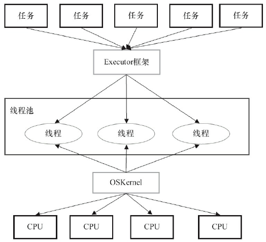
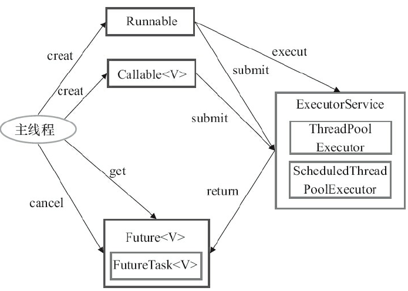

## 多线程带来的问题

虽然多线程能带来诸多好处，但引入它也会带来许多风险：

- **安全性问题**：在没有充足同步的情况下，多个线程的操作**执行顺序**是不可预测的。当多个线程同时访问和修改相同的变量时，将会在串行编程模型中引入非串行因素。
- **活跃性问题**。例如死锁、饥饿、活锁。
- **性能问题**。在多线程程序中，当线程调度器临时挂起活跃线程并转而运行另一个线程时，就会频繁地出现**上下文切换**操作（Context Switch），这种操作将带来极大的开销：保存和恢复执行上下文，丢失局部性，而且 CPU 时间将更多地花在线程调度而不是线程运行上。

## 线程安全性

要编写线程安全的代码，其核心在于要对**状态访问**操作进行管理，特别是对**共享的（Shared）**和**可变的（Mutable）**状态的访问。

- **共享**意味着变量可以被多个线程同时访问。
- **可变**意味着变量的值在其生命周期内可以发生改变。

当多个线程同时访问**同一个可变的状态变量**并且没有使用合适的同步，那么程序就会出现错误。有三种方式可以修复这个问题：

- 不在线程之间共享该状态变量。
- 将状态变量修改为不可变的变量。
- 在访问状态变量时使用同步。

线程安全的程序是否完全由线程安全类构成？

> 答：否，完全由线程安全类构成的程序并不一定就是线程安全的，而在线程安全程序中也可以包含非线程安全类。

### 什么是线程安全性

在线程安全性的定义中，最核心的概念就是**正确性**——某个类的行为与其规范完全一致。在良好的规范中通常会定义各种**不变性条件（Invariant）**来约束对象的状态，以及定义定义各种**后验条件（Postcondition）**来描述对象的操作结果。以下的描述来自 [StackOverflow](https://stackoverflow.com/questions/11331964/what-are-the-differences-pre-condition-post-condition-and-invariant-in-computer)：

- **Pre-conditions** are the things that must be true before a method is called. The method tells clients "this is what I expect from you".
- **Post-conditions** are the things that must be true after the method is complete. The method tells clients "this is what I promise to do for you".
- **Invariants** are the things that are always true and won't change. The method tells clients "if this was true before you called me, I promise it'll still be true when I'm done".

**线程安全性的定义**：当多个线程访问某个类时，不管运行时环境采用何种调度方式或者这些线程将如何交替执行，并且在主调代码中不需要任何额外的同步或协同，这个类都能表现出正确的行为，那么就称这个类是线程安全的。

### 原子性

如下代码的 `value++` 看上去是一个操作，实际上包含“读取-修改-写入”的操作序列，并且其结果状态依赖之前的状态。

```java
@NotThreadSafe
public class UnsafeSequence {
    private int value;
    // 不是原子操作，存在“读取-修改-写入”这种类型的竞态条件
    public int getNext() { return value++;}
}
@ThreadSafe
public class Sequence {
    @GuardedBy("this") private int nextValue;
	// 使用了 synchronized 将 getNext() 加锁，每次只有一个线程能够进来，原子操作
    public synchronized int getNext() { return nextValue++;}
}
```

#### 竞态条件

什么是竞态条件（Race Condition）？

- 当两个及以上的线程访问相同的对象时，或者访问不同步的共享状态，就会出现**竞态条件**。
- 导致竞态条件发生的**代码区**称作**临界区**（Critical Section）。
- 在临界区中使用适当的同步就可以避免竞态条件。
- 临界区实现方法有两种，一种是用 synchronized，一种是用 Lock 显式锁实现。

竞态条件的一般类型：

- 先检查后执行（Check-Then-Act）
- 读取-修改-写入

```java
@NotThreadSafe
public class LazyInitRace {
    private ExpensiveObject instance = null;
    public ExpensiveObject getInstance() {
        // 存在“先检查后执行”的竞态条件
        if (instance == null)
            instance = new ExpensiveObject();
        return instance;
    }
}
```

#### 复合操作

上面提到的“先检查后执行”和“读取-修改-写入”都属于复合操作，因此存在竞态条件问题，要避免这个问题，就必须在某个线程修改该变量时，通过某种方式防止其他线程使用这个变量，从而确保其他线程只能在修改操作完成之前或之后读取和修改状态，而不是在修改状态的过程中。

换句话说，将**复合操作**转变成**原子操作**即可。

- 无状态对象一定是线程安全的。
- 当在无状态的类中添加一个状态时，如果该状态完全由线程安全的对象来管理，那么这个类仍然是线程安全的，即将当前类的线程安全性**委托**给线程安全的状态变量。

### 加锁机制

#### 内置锁

Java 提供了一种内置的锁机制来支持原子性：同步代码块（Synchronized Block），它包含两部分：**一个作为锁的对象引用，一个作为这个锁保护的代码块**。synchronized 修饰的方法的锁是方法调用所在的对象，如果是静态方法就是以 Class 对象作为锁。

线程在进入同步代码块之前需要获得锁，在退出同步代码块时会自动释放锁。Java 的内置锁是独占锁（互斥锁），一个线程获得锁之后如果再有一个线程想要获得锁就必须等待或者阻塞。

#### 重入

Java 的内置锁是**可重入**的。重入的一种实现方法是：

1. 为每个锁关联一个获取计数值和一个所有者线程。
2. 当计数值为 0 时，这个锁就被认为是没有被任何线程持有。
3. 当线程请求一个未被持有的锁时，JVM 将记下锁的持有者，并且将获取计数值置为 1。
4. 如果同一个线程再次请求获取这个锁，计数值将递增，而线程退出同步代码块时，计数值将会递减。
5. 当计数值为 0 时，这个锁将被释放。

子类改写了父类的 synchronized 方法，然后调用父类中的方法，此时如果没有可重入的锁，那么将产生死锁。

```java
class Widget {
    public synchronized void doSomething() {
    }
}
class LoggingWidget extends Widget {
    public synchronized void doSomething() {
        System.out.println(toString() + ": calling doSomething");
        super.doSomething();
    }
}
```

### 用锁来保护状态

对于可能被多个线程同时访问的可变状态变量，如果使用同步来协调对这个变量的访问，**那么在访问这个变量的所有位置上都需要使用同步，在访问它时都需要持有同一把锁**。

对象的内置锁与其状态之间没有内在的关联，当获取与对象关联的锁时，并**不能阻止其他线程访问该对象**，某个线程在获得对象的锁之后，**只能阻止其他线程获得同一个锁**。之所以每个对象都有一个内置锁，只是因为免去显式地创建锁对象。

并非所有数据都需要锁的保护，只有被多个线程同时访问的可变数据才需要通过锁来保护。

当类的不变形条件涉及多个状态变量时，**在不变性条件中的每个变量都必须由同一个锁来保护**。

### 活跃性与性能

在所有的方法上都使用 synchronized 修饰看起来能避免产生问题，但是这将导致 synchronized 的滥用，执行性能非常糟糕。

应确保同步代码块不要过小，并且**不要将本应是原子的操作拆分到多个同步代码块中**。应该尽量**将不影响共享状态且执行时间较长的操作从同步代码块中分离出去**，从而在这些操作的执行过程中，其他线程可以访问共享数据。

当执行时间较长的计算或者可能无法快速完成的操作时（例如，网络 I/O 或控制台 I/O），一定不要持有锁。


## 对象的共享

### 内存可见性

通常，我们无法确保执行读操作的线程能适时看到其他线程写入的值。

```java
public class NoVisibility {
    private static boolean ready;
    private static int number;
    private static class ReaderThread extends Thread {
        public void run() {
            // 没有同步，读线程不一定能看到 ready 已经更新了
            while (!ready)
                Thread.yield();
            System.out.println(number);
        }
    }
    public static void main(String[] args) {
        new ReaderThread().start();// 启动读线程
        number = 42; // 主线程修改变量的值
        ready = true;
    }
}
```

读线程可能永远不会停止，因为可能看不到 ready 的值被改变了，可能输出了 0，因为读线程看到了 ready，看不到 number，这种奇怪的现象称为“指令重排序（Reordering）”。避免这个问题的方法：**只要有数据在多个线程之间共享，就使用正确的同步**。

**指令重排序**：在没有同步的情况下，编译器、处理器以及运行时等都可能对操作的执行顺序进行一些意想不到的调整。

**内存可见性**：当某线程修改了共享变量的值的时候，其他线程会马上看到被修改的值。

**Java Memory Model 中内存和共享变量存在约束：**

- 任何线程对共享变量的所有操作必须在自己的工作内存中完成，不能直接从主存中读写。

- 线程与线程的工作内存是相互独立的，不能够直接访问，当有需要时，可以通过主存来间接访问。

**导致共享变量在线程间不可见的原因：**

- 线程的交叉执行；
- 重排序结合线程的交叉执行；
- 共享变量更新后的值没有在工作内存与主内存及时更新。

**实现内存可见的方法**：

- volatile 修饰共享变量
- synchronized 给访问共享变量的代码加锁

### volatile 变量

volatile 是一种轻量级的同步机制，编译器和运行时不会将 volatile 变量上的操作和其他内存操作一起重排序，其次也不会被缓存在寄存器中，因此在读取 volatile 变量时总会返回最新写入的值。

volatile 变量的典型用法：检查某个状态标记以判断是否退出循环。

```java
volatile boolean asleep；
    while(!asleep){
        doSomething();
    }
```

满足以下所有条件时，才应该使用 volatile 变量：

- 对变量的**写入操作不依赖变量当前的值**，或者你能确保只有单个线程更新变量的值。
- 该变量不会与其他状态变量一起纳入不变性条件中。
- 在访问变量时不需要加锁。

**volatile 和 synchronized 的区别和联系：**

- volatile: 相对于 synchronized 来说，它是比较轻量级的，当有多个线程进行操作共享数据时，可以保证内存中变量可见性，**不能保证代码的原子性，但是可以禁止指令的重排序优化**。

> 深入的说：通过加入**内存屏障**和**禁止重排序优化**实现。对其变量执行写操作时，在写操作后加入一条 **store 屏障指令**；对其执行读操作时，在读操作前加入一条 **load 屏障指令**。
> 通俗的说：volatile 变量在每次被线程访问时，都强迫从主线程中重读该变量的值，而当该变量发生变化时，又会强迫线程将最新的值刷新到主内存中，这样任何时刻，不同的线程总能看到该变量最新的值。 

- synchronized: 它是一种互斥锁的做法，当线程访问某个变量之前先对其加锁，其他后来的线程都只能等待锁被释放，一直在阻塞着。**它能够保证内存可见性和代码原子性。**

> JVM 对线程锁的两条规定：
>
> - 线程释放锁前，必须把共享变量的最新值刷新到主内存中；
> - 线程获取锁前，将清空工作内存中的共享变量的值，从而使用共享变量时需要从主内存中重新读取新的值。

#### 非原子的 64 位操作

**失效数据**：当线程在没有同步的情况下读取变量时，可能会得到一个失效值。但至少这个值是由之前某个线程设置的值，而不是随机的值——称为最低安全性。

Java 内存模型要求，变量的读取操作和写入操作都必须是原子操作，但是对于非 volatile 类型的 long 和 double 变量，JVM 允许将 64 位的读操作或写操作分解为两个 32 位的操作。如果对变量的读操作和写操作在不同的线程中执行，很可能会读取到某个值的高 32 位和另一个值的低 32 位。

### 发布与逸出

**发布（Publish）**：使对象能够在当前作用域之外的代码中使用。

- 一般情况下，我们要确保对象及其内部状态不被发布。
- 当确实需要发布某个对象时，但如果在发布时要确保线程安全性，则可能需要同步。
- 如果在对象构造完成之前就发布该对象，就会破坏线程安全性。

**逸出（Escape）**：发布了不应该被发布的对象。

```java
public class ThisEscape {
    public ThisEscape(EventSource source) {
        source.registerListener(new EventListener() {
            public void onEvent(Event e) {
                // 还没初始化完成就调用了非私有方法
                doSomething(e); }
        });
    }
    void doSomething(Event e) {
    }
}
```

EventListener 是匿名内部类，ThisEscape 在发布这个类对象时隐含地把 this 引用也发布出去了。

当从对象的构造函数中发布对象时，只是发布了一个尚未构造完成的对象，只有当构造函数返回时，对象才处于可预测的和一致的状态。**不要在构造过程中使 this 引用逸出。**

使 this 逸出的常见错误：

- 在构造函数中**启动**一个线程。
- 在构造函数调用一个**可改写**的实例方法。

### 线程封闭

**线程封闭（Thread Confinement）：**将对象封闭在单个线程中使用，从而实现线程安全。例如，从数据库连接池获取的 Connection 对象，该对象一直都在单个线程中使用，并且连接池不会将该对象分配给其他线程。

实现线程封闭的方法：

- 栈封闭：JVM 虚拟机栈或者本地方法栈的默认行为。成员变量是线程共享的，而局部变量是线程相关的。
- ThreadLocal：Java 提供给开发者的线程封闭 API，ThreadLocal 提供了 get 和 set 等方法，这些方法为每个使用该变量的线程都存有一份独立的副本，因此 get 总是返回由当前执行线程在调用 set 时设置的值。

### 不可变对象

不可变对象（Immutable Object）：对象一旦被创建后，对象所有的状态及属性在其生命周期内不会发生任何变化。**不可变对象一定是线程安全的，但他们的引用不是。**

创建不可变类原则有以下几条：

1. 所有成员变量必须是 private；
2. 最好同时用 final 修饰（非必须）；
3. 不提供能够修改原有对象状态的方法；
   - 最常见的方式是不提供 setter 方法；
   - 如果提供修改方法，需要新创建一个对象，并在新创建的对象上进行修改；
4. 通过构造器初始化所有成员变量，引用类型的成员变量必须进行深拷贝；
5. getter 方法不能对外泄露 this 引用以及成员变量的引用；
6. 最好不允许类被继承（非必须）；

JDK 中提供了一系列方法方便我们创建不可变集合，只是返回值不可变，原集合仍然可变，如：

```java
Collections.unmodifiableList(List<? extends T> list)
```

### 安全发布

先来看个不安全的发布：

```java
public class Holder {
    private int n; // 添加 final 关键字可破
    public Holder(int n) { this.n = n;}
    public void assertSanity() {
        if (n != n)
            throw new AssertionError("This statement is false.");
    }
}
//----> 不安全的发布
public Holder holder;
public void initialize(){
    holder = new Holder(42);
}
```

首先 ，除了发布对象的线程外，其他线程可以看到的 Holder 域是一个失效值 ，因此将看到一个空引用或者之前的旧值。然而 ，更糟糕的情况是，线程看到 Holder 引用的值是最新的，但 Holder 状态的值却是失效的。情况变得更加不可预测的是，某个线程在第一次读取域时得到失效值，而再次读取这个域时会得到一个更新值，这也是 assertSainty 抛出 AssertionError 的原因。

解决方案：将 Holder 类的域用 final 修饰，**JVM 必须保证含有 final 域的对象的初始引用在构造函数之后执行**。

安全发布的常用模式：

- 在静态初始化函数中初始化一个对象引用； 
- 将对象的引用保存到 volatile域或者 AtomicReference 对象中；
- 将对象的引用保存到某个正确构造对象的 final 域中；
- 将对象的引用保存到一个由锁保护的域中；（例如，线程安全的集合）

#### 事实不可变对象

虽然对象是可变的，但其状态在发布后不会再改变，那么就称这种对象为**事实不可变对象**。

所有的安全发布机制都能确保，当对象的引用对所有访问该对象的线程可见时，对象发布时的状态对于所有线程也是可见的，并且如果对象状态不会再改变，那么就足以确保任何访问都是安全的。

**任何线程都可以安全地使用被安全发布的事实不可变对象**。

#### 可变对象

如果对象在构造后可以修改，那么安全发布只能确保“发布当时”状态的可见性。对于可变对象，不仅在发布对象时需要使用同步，而且在每次对象访问时同样需要使用同步来确保后续操作的可见性。

对象的发布需求取决于它的可变性：

- **不可变对象**（域必须是 final 类型）可以通过任意机制来发布；
- **事实不可变对象**必须通过安全方式来发布；
- **可变对象**必须通过安全方式来发布，并且必须是线程安全的或者由某个锁保护起来；

#### 安全地共享对象

安全地共享对象时的一些实用策略：

- **线程封闭**：对象被封闭在单个线程中，只能由该线程修改。
- **只读共享**：共享的只读对象可以由多个线程并发访问，但任何线程都不能修改它。共享的只读对象包括不可变对象和事实不可变对象。
- **线程安全共享**：线程安全的对象在其内部实现同步，因此多个线程可以通过对象的公有接口来进行访问而不需要进一步的同步。
- **保护对象**：被保护的对象只能通过持有特定的锁来访问。


## 对象的组合

### 设计线程安全的类

设计线程安全类的三个要素：

- 找出构成对象状态的所有变量；
- 找出约束状态变量的不变性条件；
- 建立对象状态的并发访问策略；

要确保类的线程安全性，就必须确保它的**不变性条件**不会在并发访问的情况下被破坏。如果不变性条件涉及到多个变量，那么这些相关的变量必须在单个原子操作中进行读取和更新。有时需要包含一些**后验条件**来判断状态迁移是否是有效的。

**依赖状态的操作**：对象中的某个操作包含基于状态的**先验条件**。例如，不能从空队列中移除一个元素，必须有先验条件判断它是非空的。要想实现某个等待先验条件为真时才进行的操作，可以使用阻塞队列（BlockingQueue）或信号量（Semaphore）。

### 实例封闭

实例封闭：当一个对象被封装到另一个对象中时，能够访问被封装对象的所有代码路径都是已知的。

被封闭的对象一定不能超出它们既定的作用域。对象可以封闭在类的一个实例（例如作为类的一个私有成员）中，或者封闭在某个作用域内（例如作为局部变量），在或者封闭在线程内（例如在某个线程中将对象从一个方法传递给另一个方法，而不是在线程间共享该对象）。

下面是通过实例封闭来构造线程安全的类：

```java
@ThreadSafe
public class PersonSet {
    @GuardedBy("this") private final Set<Person> mySet = new HashSet<Person>();
    public synchronized void addPerson(Person p) {
        mySet.add(p);
    }
    public synchronized boolean containsPerson(Person p) {
        return mySet.contains(p);
    }
}
```

注意：PersonSet 是线程安全的，Person 的线程安全性是未知的。

Java 提供了很多实例封闭的类，例如 Collections.synchronizedXXX() 方法，这些工厂方法通过装饰器模式将不安全的容器类转成同步容器类。

实例封闭可以使**不同的状态变量**可以由**不同的锁**来保护，前提是状态变量是相互独立的，不然会破坏不变性条件。同时，被封闭的对象不应该被发布。

### 线程安全性的委托

线程安全的委托：在创建线程安全的类时，如果类中的状态已经是线程安全的，可以在**确保不变性条件不被破坏**的情况下将当前类的线程安全性**委托**给线程安全的状态变量。

如下例子，CountingFactorizer 将线程安全性**委托**给 AtomicLong 类型的变量：

```java
@ThreadSafe
public class CountingFactorizer extends GenericServlet implements Servlet {
    // AtomicLong 是 Java 提供的线程安全的原子变量
    private final AtomicLong count = new AtomicLong(0);
    public long getCount() { return count.get(); }
    public void service(ServletRequest req, ServletResponse resp) {
        BigInteger i = extractFromRequest(req);
        BigInteger[] factors = factor(i);
        count.incrementAndGet();
        encodeIntoResponse(resp, factors);
    }
}
```

将线程安全性委托给多个状态变量，需要注意，这里的状态变量是彼此独立的：

```java
public class VisualComponent {
    private final List<KeyListener> keyListeners
            = new CopyOnWriteArrayList<>();
    private final List<MouseListener> mouseListeners
            = new CopyOnWriteArrayList<>();

    public void addKeyListener(KeyListener listener) {
        keyListeners.add(listener);
    }
    public void addMouseListener(MouseListener listener) {
        mouseListeners.add(listener);
    }
    public void removeKeyListener(KeyListener listener) {
        keyListeners.remove(listener);
    }
    public void removeMouseListener(MouseListener listener) {
        mouseListeners.remove(listener);
    }
}
```

#### 当委托失效时

看下面这个例子：

```java
@NotThreadSafe
public class NumberRange {
    // 不变性条件为: lower <= upper
    private final AtomicInteger lower = new AtomicInteger(0);
    private final AtomicInteger upper = new AtomicInteger(0);
    public void setLower(int i) {
        // 不安全的“先检查后执行”
        if (i > upper.get())
            throw new IllegalArgumentException("");
        lower.set(i);
    }
    public void setUpper(int i) {
        // 不安全的“先检查后执行”
        if (i < lower.get())
            throw new IllegalArgumentException("");
        upper.set(i);
    }
    public boolean isInRange(int i) {
        return (i >= lower.get() && i <= upper.get());
    }
}
```

NumberRange 的不变性条件为 **lower <= upper**，不能简单的将它的线程安全性委托给状态变量，可以通过加锁来维护不变性条件，从而实现线程安全。

#### 发布底层的状态变量

如果一个状态变量是线程安全的，并且没有任何不变性条件来约束它的值，在变量的操作上也不存在任何不允许的状态转换，那么就可以安全地发布这个状态变量。

### 在现有的线程安全类中添加功能

在大多数时候，我们应该重用类库提供的类（降低工作量、风险和维护成本）。当确实需要时，可以在**不破坏线程安全性的情况下**给现有的类添加新的功能。

假设我们现在要给原有的类增加“**若没有则添加（putIfAbsent）**”的操作，有如下多种方法：

1. 最安全的方法是**修改原始的类**，但这通常无法做到；

2. **扩展原有的类**，这种方式很脆弱，因为现在的同步策略实现被分布到多个单独维护的源代码中。如果底层的类改变了同步策略并选择了不同的锁来保护它的状态变量，那么子类会被破坏。

   ```java
   @ThreadSafe // 底层的 Vector 使用的锁是当前对象
   public class BetterVector <E> extends Vector<E> {
       public synchronized boolean putIfAbsent(E x) {
           boolean absent = !contains(x);
           if (absent)
               add(x);
           return absent;
       }
   }
   ```

3. **客户端加锁机制**，更加脆弱，因为它将某个类的加锁代码放到了与类完全无关的其他类中；

   ```java
   @ThreadSafe
   class GoodListHelper <E> {
       public List<E> list = Collections.synchronizedList(new ArrayList<>());
       public boolean putIfAbsent(E x) {
           // 底层的 list 使用的锁是当前对象，所以这里也需要使用相同的锁
           synchronized (list) {
               boolean absent = !list.contains(x);
               if (absent)
                   list.add(x);
               return absent;
           }
       }
   }
   ```

4. **组合现有的类**，推荐。看下面例子：ImprovedList 假设把构造参数传进来之后，客户代码就不会再直接使用这个对象，而只能通过 ImprovedList  来访问它；

   ```java
   @ThreadSafe
   public class ImprovedList<T> implements List<T> {
       private final List<T> list;
       // PRE: list argument is thread-safe.
       public ImprovedList(List<T> list) { this.list = list; }
       public synchronized boolean putIfAbsent(T x) {
           boolean contains = list.contains(x);
           if (contains)
               list.add(x);
           return !contains;
       }
   }
   ```


## 基础构件模块

### 同步容器类

同步容器类包括 Vector、Stack 和 HashTable 等，还包括由 Collections.synchronizedXxx 等工厂方法创建的类。它们实现线程安全的方式是：将它们的状态封装起来，并对每个公有方法都进行同步，使得**每次只有一个线程**能访问容器的状态（只能有一个线程访问，效率很低）。

下面这段代码可能会抛出数组索引越界异常：

```java
for(int i = 0; i < vector.size(); i++){
	doSomething(vector.get(i));
}
```

解决方法是客户端加锁，防止在迭代 vector  期间被其他线程修改：

```java
synchronized (vector){
	for(int i = 0; i < vector.size(); i++){
		doSomething(vector.get(i));
	}
}
```

无论是同步容器类还是普通容器类，在设计其迭代器时没有考虑到并发修改的问题，它们表现出的行为是“**快速失败（fail-fast）**”，当发现容器在迭代过程中被修改了，就会抛出 ConcurrentModificationException 异常。

#### 隐藏迭代器

在将容器变量和字符串连接时，会自动调用容器变量的 toString() 方法，也会触发迭代容器。

容器的 hashCode() 和 equals() 等方法也会间接地执行迭代操作，当容器作为另一个容器的元素或者键值时，就会出现这种情况。

### 并发容器类

**并发容器**是针对**多个线程并发访问**设计的。

Java 1.5 增加了 `java.util.concurrent` 这一重要的并发编程基础类库。

- ConcurrentHashMap 用于替代同步的且基于散列的 Map；
- CopyOnWriteArrayList 用于在**遍历操作为主要操作**的情况下代替同步的 List；
- CopyOnWriteArraySet 用于替代同步的 Set；
- ConcurrentSkipListMap（jdk 1.6） 替代同步的 SortedMap；
- ConcurrentSkipListMap（jdk 1.6） 替代同步的 SortedMap；
- ConcurrentSkipListSet（jdk 1.6） 替代同步的 SortedSet；

ConcurrentHashMap：jdk 1.7 以前使用一种细粒度的加锁机制来实现更大程度的共享，这种机制称为分段锁（Lock Striping），jdk 1.8 采用 **CAS + synchronized** 来保证并发访问的安全。只有当应用程序需要加锁 Map 以进行独占访问时，才应该放弃使用 ConcurrentHashMap。

ConcurrentHashMap 提供的迭代器是**弱一致性（Weakly Consistent）**的，而并非“**快速失败**”的。弱一致性的迭代器可以容忍并发修改，因此不会抛异常。由于 size 和 isEmpty 等操作需要在整个 Map 中进行计算，所以它返回的值是估算的，而不是准确的，但是不用怕，这些需要在并发环境中用处很小。

CopyOnWriteArrayList：**写入时复制**，在每次修改时，都会创建并重新发布一个新的容器副本。“写入时复制”的支持多个线程并发迭代，而不会相互干扰，并且返回的元素与迭代器创建时的元素完全一致，而不必考虑之后修改操作所带来的影响。由于每次修改都需要复制底层数组，当数组特别大时需要巨大的开销，因此，仅当迭代操作远远多于修改操作时，才应该使用“写入时复制”容器。

### 阻塞队列和生产者-消费者模式

**阻塞队列（BlockingQueue）**提供了可阻塞的 put() 和 take() 方法，以及支持定时的 offer() 和 poll() 方法。如果队列已满，put 将会阻塞直到有空间可用；如果队列为空，take 将阻塞直到有元素可用。

**生产者-消费者模式**将“找出需要完成的工作”与“执行工作”这两个过程分离开来，并把工作项放入一个“待完成”列表中以便在随后处理 ，而不是找出来立即处理。BlockingQueue 支持任意数量的生产者和消费者。

在构建高可靠的应用程序时，**有界队列**是一种强大的资源管理工具：它能抑制并**防止**产生过多的工作项，使应用程序在负荷过载的情况下变得更加健壮。

类库中的 BlockingQueue 有多种实现：

- LinkedBlockingQueue
- ArrayBlockingQueue
- PriorityBlockingQueue
- SynchronousQueue

SynchronousQueue 实际上并不是真正的队列，它没有存储功能，put 和 take 也会一直阻塞，直到有另一个线程已经准备好参与到交付过程中。仅当有足够多的消费者，并且**总是有一个消费者准备好**获取交付的工作时，才适合使用同步队列。

#### 串行线程封闭

对于可变对象，生产者-消费者这种设计与阻塞队列一起，促进了串行线程封闭，从而将对象所有权从生产者交付给消费者。

**对象池**利用了串行线程封闭，将对象“借给”一个请求线程。只要对象池包含足够的内部同步来安全地发布池中的对象，并且只要客户代码本身不会发布池中的对象，或者在将对象返回给对象池就不再使用它，那么就可以安全地在线程之间传递所有权。

#### 双端队列和工作窃取

**双端队列**适用于**工作窃取（Work Stealing）**，在生产者-消费者模式中，所有消费者共享一个工作队列，而**在工作窃取中，每个消费者都有各自的双端队列**。如果一个消费者完成了自己双端队列中的全部工作，那么它可以从其他消费者双端队列的队尾秘密地获取工作。

工作窃取非常适用于**即是消费者又是生产者**问题——当执行某个工作时可能导致出现更多的工作。

### 同步工具类

同步工具类可以是任意一个对象，只要它根据自身的状态来协调线程的控制流。它们封装的状态将决定执行同步工具类的线程是继续执行还是等待。

#### 闭锁

CountDownLatch 是闭锁的实现，可以使一个或多个线程等待一组事件发生。闭锁状态包含一个计数器，该计数器被初始化为一个正数，表示需要等待的事件数量。countDown 方法递减计数器，表示有一个事件发生了，而 await 方法等待计数器达到零。闭锁是一次性对象。

```java
public class TestHarness {
    public long timeTasks(int nThreads, final Runnable task)
            throws InterruptedException {
        final CountDownLatch startGate = new CountDownLatch(1);
        final CountDownLatch endGate = new CountDownLatch(nThreads);

        for (int i = 0; i < nThreads; i++) {
            Thread t = new Thread(() -> {
                try {
                    // 所有的新建线程等待
                    startGate.await();
                    try {
                        task.run();
                    } finally {
                        // 每个线程执行完成都递减
                        endGate.countDown();
                    }
                } catch (InterruptedException ignored) { }
            });
            t.start();
        }
        long start = System.nanoTime();
        // 放行等待的线程
        startGate.countDown();
        // 主线程等待其他线程执行完成
        endGate.await();
        long end = System.nanoTime();
        return end - start;
    }
}
```

#### 信号量

计数信号量（Counting Semaphore）用来控制同时访问某个特定资源的操作数量，或者同时执行某个指定操作的数量，还可以对容器施加边界。

Semaphore 中管理者一组虚拟的**许可（permit）**，许可的初始数量可通过构造函数来指定。在执行操作时首先获得许可（只要还有剩余的许可），并在使用之后释放许可。如果没有许可，那么acquire 将阻塞直到有许可（或者被中断或者操作超时），release 方法返回一个许可给信号量。

可以使用 Semaphore 将任何一种容器变成有界阻塞容器。

```java
public class BoundedHashSet <T> {
    private final Set<T> set;
    private final Semaphore sem;

    public BoundedHashSet(int bound) {
        this.set = Collections.synchronizedSet(new HashSet<>());
        sem = new Semaphore(bound);
    }

    public boolean add(T o) throws InterruptedException {
        sem.acquire();
        boolean wasAdded = false;
        try {
            wasAdded = set.add(o);
            return wasAdded;
        } finally {
            if (!wasAdded)
                sem.release();
        }
    }

    public boolean remove(Object o) {
        boolean wasRemoved = set.remove(o);
        if (wasRemoved)
            sem.release();
        return wasRemoved;
    }
}
```

#### 栅栏

栅栏能阻塞一组线程直到某个事件发生。栅栏和闭锁的关键区别在于，所有线程必须同时到达栅栏位置，才能继续执行。

CyclicBarrier 可以使一定数量的参与方反复地在栅栏位置汇集。当线程到达栅栏位置时将调用 await 方法，这个方法将阻塞直到所有线程都到达栅栏位置。如果所有线程都到达了栅栏位置，那么栅栏将打开，此时所有线程都被释放，而栅栏将被重置以便下次使用。

CyclicBarrier 还可以使你将一个栅栏操作传递给构造函数，这是一个 Runnable，当成功通过栅栏会（在一个子任务线程中）执行它，但在阻塞线程被释放之前是不能执行的。

```java
public class Test {
    public static void main(String[] args) {
        int N = 4;
        CyclicBarrier barrier  = new CyclicBarrier(N,new Runnable() {
            @Override
            public void run() {
                System.out.println("当前线程"+Thread.currentThread().getName());   
            }
        });
         
        for(int i=0;i<N;i++)
            new Writer(barrier).start();
    }
    
    static class Writer extends Thread {
        private CyclicBarrier cyclicBarrier;
        public Writer(CyclicBarrier cyclicBarrier) {
            this.cyclicBarrier = cyclicBarrier;
        }
 
        @Override
        public void run() {
            System.out.println("线程"+Thread.currentThread().getName()+"正在写入数据...");
            try {
                Thread.sleep(5000); //以睡眠来模拟写入数据操作
                System.out.println("线程"+Thread.currentThread().getName()+"写入数据完毕，等待其他线程写入完毕");
                cyclicBarrier.await();
            } catch (InterruptedException e) {
                e.printStackTrace();
            }catch(BrokenBarrierException e){
                e.printStackTrace();
            }
            System.out.println("所有线程写入完毕，继续处理其他任务...");
        }
    }
}
```


## 任务执行

### 在线程中执行任务

在围绕“**任务执行**”来设计应用程序时，其关键是要找出**任务边界**。

在正常的负载下，服务器应用程序应该同时表现出良好的吞吐量和快速的响应性，当负荷过载时，应用程序的性能应该是逐渐降低，而不是直接失败。

#### 串行执行任务

最简单的任务调度策略是在单个线程中串行地执行各项任务。

```java
public class SingleThreadWebServer {
    public static void main(String[] args) throws IOException {
        ServerSocket socket = new ServerSocket(80);
        while (true) {
            Socket connection = socket.accept();
            handleRequest(connection);
        }
    }
}
```

上面例子理论上是正确的，但是在生产环境的执行性能很糟糕，因为它每次只能处理一个请求。如果一个请求的执行时间很长的话，后面来的用户会认为服务器挂了。

#### 显式地为任务创建线程

通过为每个请求创建一个新的线程来提供服务，从而实现更高的响应性。

```java
public class ThreadPerTaskWebServer {
    public static void main(String[] args) throws IOException {
        ServerSocket socket = new ServerSocket(80);
        while (true) {
            final Socket connection = socket.accept();
            Runnable task = () -> handleRequest(connection); // lambda
            new Thread(task).start();
        }
    }
}
```

- 任务处理过程从主线程中分离出来，使得主循环能更快地重新等待下一个到来的请求；
- 任务可以并行处理，从而能同时服务多个请求；
- 任务处理代码必须是线程安全的；
- 在正常的负载下，这种方法能提升串行执行的性能，只要请求的到达速率不超出服务器的请求处理能力。

无限制创建线程的不足：

- **线程生命周期的开销非常高**；
- **资源消耗**，活跃的线程会消耗系统资源，尤其是内存，如果可运行的线程数量多于可用的处理器的数量，那么有些线程将会闲置。如果已经有足够多的线程使所有的处理器保持忙绿，那么再创建更多的线程反而会降低性能。
- 稳定性，在可创建线程的数量上存在一个限制，如果破坏限制可能会导致内存溢出。

### Executor 框架

**任务**是一组逻辑工作单元，**线程**是使任务异步执行的机制。

在 Java 类库中，任务执行的主要抽象不是 Thread，而是 Executor。Executor 框架能支持多种不同类型的任务执行策略，它提供了一种标准的方法**将任务的提交过程和执行过程解耦**，并用 Runnable 来表示任务。**Executor 基于生产者-消费者模式**，提交任务的操作相当于生产者，执行任务的线程相当于消费者。

```java
public class TaskExecutionWebServer {
    private static final int NTHREADS = 100;
    // 基于线程池的 web 服务器
    private static final Executor exec = Executors.newFixedThreadPool(NTHREADS);
    public static void main(String[] args) throws IOException {
        ServerSocket socket = new ServerSocket(80);
        while (true) {
            final Socket connection = socket.accept();
            Runnable task = () -> handleRequest(connection);
            exec.execute(task);
        }
    }
}
```

#### 线程池

线程池，是指管理一组同构工作线程的资源池。线程池是与**工作队列（Work Queue）**密切相关的，其中在工作队列中保存了所有等待执行的任务。**工作者线程（Work Thread）**的任务很简单：从工作队列中获得一个任务，执行任务，然后返回线程池并等待下一个任务。

Executor 框架的两级调度模型：



在上层，Java 程序通过将应用分解为若干个**任务**，然后使用用户级的调度器（Executor）将 task 映射为固定数量的 Java 线程；在底层，Java 线程与操作系统的线程是一一对应的关系，由操作系统调度给可用的CPU，底层的调度不受上层的影响。

Executor 框架工作流程如下图：



通过适当调整线程池的大小，可以创建足够多的线程以便**使处理器保持忙绿**状态，同时还可以**防止过多线程相互竞争资源**而使应用程序耗尽内存或失败。

通过调用 Executors 中静态工厂方法之一来创建线程池：

- **newFixedThreadPool**，将创建固定长度的线程池。适用于为了满足资源管理的需求，而需要限制当前线程数量的应用场景，它适用于负载比较重的服务器。
- **newCachedThreadPool**，将创建一个可缓存的线程池。是大小无界的线程池，适用于执行很多的短期异步任务的小程序，或者是负载较轻的服务器。
- **newSingleThreadExecutor**，是一个单线程的 Executor，能确保依照任务在队列中的**顺序**来串行执行（FIFO、LIFO、优先级）。
- **newScheduledThreadPool**，创建了固定长度的线程池，而且以**延迟或定时**的方式来执行任务。

ExecutorService 生命周期有 3 种状态：运行、关闭和已终止。

### 找出可利用的并行性

Executor 帮助指定执行策略，使用时要将任务表述为 Runnable。

下面将实现浏览器程序中的页面渲染（Page-Rendering）功能，它的作用是将 HTML 页面绘制到图像缓存中，HTML 页面只包含文本和图片。

#### 串行的页面渲染器

```java
public abstract class SingleThreadRenderer {
    public void renderPage(CharSequence source) {
        renderText(source); // 渲染文本
        List<ImageData> imageData = new ArrayList<ImageData>();
        for (ImageInfo imageInfo : scanForImageInfo(source))
            imageData.add(imageInfo.downloadImage());
        for (ImageData data : imageData)
            renderImage(data); //渲染图片
    }
}
```

图片下载过程的大部分时间都是在等待 I/O 操作执行完成，没有充分利用 CPU。

#### 携带结果的任务 Callable 和 Future

**Callable 可以有返回值，并且可以抛出一个异常**。Runnable 和 Callable 描述的都是抽象的计算任务。这些任务通常都是有范围的，有明确的起始点和终点。 

**Future 表示一个任务的生命周期**，并提供了相应的方法来判断是否已经完成或取消，以及获取任务的结果和取消任务等。get 方法用于获取任务的返回值，没完成的任务将一直等待或者抛出异常。

ExecutorService 中的所有 submit 方法都将返回一个 Future，从而将一个 Runnable 或 Callable 提交给 Executor，并得到一个 Future 来获得任务的执行结果或者取消任务。

#### 使用 Future 实现页面渲染器

```java
public abstract class FutureRenderer {
    // 缓存线程池
    private final ExecutorService executor = Executors.newCachedThreadPool();
    public void renderPage(CharSequence source) {
        final List<ImageInfo> imageInfos = scanForImageInfo(source);
        Callable<List<ImageData>> task = () -> {
                    List<ImageData> result = new ArrayList<>();
                    for (ImageInfo imageInfo : imageInfos)
                        result.add(imageInfo.downloadImage());
                    return result;
                };
        // 在渲染文本的同时也在下载图片
        Future<List<ImageData>> future = executor.submit(task);
        renderText(source); // 渲染文本
        try {
            List<ImageData> imageData = future.get();
            for (ImageData data : imageData)
                renderImage(data); // 渲染图片
        } catch (InterruptedException e) {
            // 重新设置线程的中断状态
            Thread.currentThread().interrupt();
            // 取消任务
            future.cancel(true);
        } catch (ExecutionException e) {
            throw launderThrowable(e.getCause());
        }
	}
}
```

这个代码的问题是等到所有图片都下载完了才开始渲染图片。

#### 使用 CompletionService 实现页面渲染

CompletionService 将 Executor 和 BlockingQueue 的功能融合在一起。

在实现上，ExecutorCompletionService 在构造函数中会创建 LinkedBlockingQueue，该队列的作用是保存 Executor 执行的结果。当计算完成时，调用 FutureTask 的 done 方法。当提交一个任务到ExecutorCompletionService 时，首先将任务包装成 QueueingFuture，它是 FutureTask 的一个子类，然后改写 FutureTask 的 done 方法，之后把 Executor 执行的计算结果放入 BlockingQueue 中。

```java
public abstract class Renderer {
    private final ExecutorService executor;
    Renderer(ExecutorService executor) {
        this.executor = executor;
    }
    
    public void renderPage(CharSequence source) {
        final List<ImageInfo> info = scanForImageInfo(source);
        CompletionService<ImageData> completionService =
                new ExecutorCompletionService<>(executor);
        for (final ImageInfo imageInfo : info)
            // 将每张图片信息分解成独立的任务提交
            completionService.submit(() -> imageInfo.downloadImage());
	    // 渲染文本
        renderText(source);
        try {
            for (int t = 0, n = info.size(); t < n; t++) {
                Future<ImageData> f = completionService.take();
                ImageData imageData = f.get();
                // 每当下载了一张图片就渲染
                renderImage(imageData);
            }
        } catch (InterruptedException e) {
            Thread.currentThread().interrupt();
        } catch (ExecutionException e) {
            throw launderThrowable(e.getCause());
        }
    }
}
```


## 取消与关闭

### 任务取消

操作被取消的原因有很多，比如超时，异常，请求被取消等等。

**可取消的任务**必须拥有**取消策略（Cancellation Policy）**：如何请求取消该任务，何时检查是否请求了取消，以及在响应取消请求时应该执行哪些操作。

#### 使用 volatile 状态变量来控制

```java
@ThreadSafe
public class PrimeGenerator implements Runnable {
    private static final ExecutorService exec = Executors.newCachedThreadPool();
    @GuardedBy("this")
    private final List<BigInteger> primes = new ArrayList<>();
    // 必须是 volatile 类型的，保证内存可见性
    private volatile boolean cancelled;
    public void run() {
        BigInteger p = BigInteger.ONE;
        while (!cancelled) {
            p = p.nextProbablePrime();
            synchronized (this) {
                primes.add(p);
            }
        }
    }
    // 取消任务的方法
    public void cancel() { cancelled = true;}
    public synchronized List<BigInteger> get() {
        return new ArrayList<>(primes);
    }
    static List<BigInteger> aSecondOfPrimes() throws InterruptedException {
        PrimeGenerator generator = new PrimeGenerator();
        exec.execute(generator);
        try {
            SECONDS.sleep(1);
        } finally {
            generator.cancel();
        }
        return generator.get();
    }
}
```

其取消策略为：通过改变取消标志位取消任务，任务在每次生成下一随机素数之前检查任务是否被取消，被取消后任务将退出。

**然而，该机制最大的问题就是无法应用于阻塞方法**，例如 BlockingQueue.put()。可能会产生一个很严重的问题——**任务可能因阻塞而永远无法检查取消标识，导致任务永远不会结束。**

#### 中断机制

线程中断是一种协作机制，线程可以通过这种机制来**通知**另一个线程，告诉它在合适的或者可能情况下停止当前工作。**中断是实现取消的最合理方式**。

对中断操作的正确理解是：**它并不会真正的中断线程，而是给线程发出中断通知，告知目标线程有人希望你退出。目标线程收到通知后如何处理完全由目标线程自行决定，这是非常重要的。线程收到中断通知后，通常会在下一个合适的时刻（被称为取消点）中断自己**。有些方法，如 wait、sleep 和 join 等将严格地处理这种请求，当它们收到中断请求或者在开始执行时发现某个已被设置好的中断状态时，将抛出中断异常。

```java
public class PrimeProducer extends Thread {
    private final BlockingQueue<BigInteger> queue;
    PrimeProducer(BlockingQueue<BigInteger> queue) {
        this.queue = queue;
    }
    public void run() {
        try {
            BigInteger p = BigInteger.ONE;
            // 主动查询中断状态可以提高响应度
            while (!Thread.currentThread().isInterrupted())
                // 阻塞方法也会检测到中断状态并抛出中断异常
                queue.put(p = p.nextProbablePrime());
        } catch (InterruptedException consumed) {
            /* Allow thread to exit */
        }
    }
	// 其他线程调用此方法来中断这个线程
    public void cancel() { interrupt();}
}
```

**中断策略**：发现中断请求时应该做什么，以多快速度来响应中断。

区分任务和线程对中断的反应是很重要的。一个中断请求可以有一个或多个接收者，例如，**中断线程池中的某个工作者线程， 则意味着取消了当前任务，同时也意味着关闭了工作者线程**。

无论任务把中断视为取消，还是其它某个中断响应操作，都应该小心地保存执行线程的中断状态。如果除了将中断异常传递给调用者外，还需要进行其它操作，则因该在捕获中断异常之后恢复中断状态。

```java
Thread.currentThread().interrupt();
```

**响应中断**

当调用可中断的阻塞函数时，例如 Thread.sleep 或者 BlockingQueue.put 等，有两种实用策略可用于响应中断：

- 传递异常（可能在执行某个特定于任务的清除操作之后），从而使你的方法也成为可中断的阻塞方法。

  ```java
  BlockingQueue<Task> queue;
  //抛出 InterruptedException，从而将中断传递给调用者
  public Task getNextTask() throws InterruptedException{
      return queue.take();
  }
  ```

- 恢复中断状态，从而使调用栈中的上层代码能够对其进行处理。不可取消的任务在退出前恢复中断：

  ```java
  public TaskgetNextTask(BlockingQueue<Task> queue){
     boolean interrupted = false;
     try{
        while(true){
            try{
                return queue.take();
            } catch (InterruptedException e){
               interrupted = true;
               // 重新尝试
            }
        }
     } finaly {
        if (interrupted) 
            Thread.currentThread().interrupt();
     }
  }
  ```

  如果代码不会调用可中断的阻塞方法，那么仍然可以通过在任务代码中轮询当前线程的中断状态来响应中断。要选择合适的轮询频率，就需要在效率和响应性之间进行权衡。

#### 通过 Future 来实现取消

Future 用来管理任务的**生命周期**，处理异常，也可以实现取消。通常，使用现有库中的类比自行实现更好，所以我们可以直接使用 Future 来实现任务的取消。

当 Future.get 抛出 InterruptedException 或 TimeoutException 时，如果不再需要结果，那么就可以使用 Future.cancel 来取消任务。这是一种良好的编程习惯。

```java
/**
 * 通过 Future 来取消任务
 */
public class TimedRun {
    private static final ExecutorService taskExec = Executors.newCachedThreadPool();

    public static void timedRun(Runnable r, long timeout, TimeUnit unit) 
        throws InterruptedException {
        Future<?> task = taskExec.submit(r);
        try {
            task.get(timeout, unit);
        } catch (TimeoutException e) {
            // 因超时而取消任务
        } catch (ExecutionException e) {
            // 任务异常，重新抛出异常信息
            throw launderThrowable(e.getCause());
        } finally {
            // 如果该任务已经完成，将没有影响
            // 如果任务正在运行，将因为中断而被取消
            task.cancel(true); // interrupt if running
        }
    }
}
```

**处理不可中断的阻塞**

如果一个线程由于**执行同步的 Socket I/O** 或者**等待获得内置锁**而阻塞，那么中断请求只能设置线程的中断状态，除此之外没有其他任何作用。可以使用类似于中断的手段来停止这些线程，但这要求我们必须知道线程阻塞的原因。以下是不可中断阻塞的情况：

- **java.io 包中的同步 Socket I/O**。通过关闭底层的套接字，可以使得由于执行 read 或 write 等方法而被阻塞的线程抛出一个 SocketException。
- **java.io 包中的同步 I/O**。如当中断或关闭正在 InterruptibleChannel 上等待的线程时，会对应抛出 ClosedByInterruptException 或 AsynchronousCloseException。
- **Selector 的异步 I/O**。如果一个线程在调用 Selector.select 时阻塞了，那么调用 close 或 wakeup 会使线程抛出 ClosedSelectorException 并提前返回。
- **获取某个锁**。当一个线程等待某个锁而阻塞时，不会响应中断。但 Lock 类的 lockInterruptibly 允许在等待锁时响应中断。

### 处理非正常的线程终止

导致线程提前死亡的最主要原因就是 RuntimeException。由于这些异常表示出现了某种编程错误或者其它不可修复的错误，因此它们通常不会被捕获。它们不会再调用栈中逐层传递，而是默认在控制台中输出栈追踪信息，并终止线程。

**未捕获异常处理器**：UncaughtExceptionHandler，它能检测出某个由于未捕获的异常而终结的情况。当一个线程由于未捕获异常而退出时，JVM 会把这个事件报告给 UncaughtExceptionHandler 异常处理器，如果没有提供异常处理器，那么默认的行为是将追踪信息输出到 Sytem.err，即控制台。

```java
/**
 * 将异常写入日志的 UncaughtExceptionHandler
 */
public class UEHLogger implements Thread.UncaughtExceptionHandler {

    public void uncaughtException(Thread t, Throwable e) {
        Logger logger = Logger.getAnonymousLogger();
        logger.log(Level.SEVERE, "Thread terminated with exception: " + t.getName(), e);
    }

}
```

则在使用时只需要为线程设置一个 UncaughtExceptionHandler 即可。

```java
Thread thread=new Thread();
thread.setUncaughtExceptionHandler(new UEHLogger()); 
thread.start();
```

在运行时间较长的应用程序中，通常会为所有线程的未捕获异常指定同一个异常处理器，并且该处理器异常至少会将异常信息记录到日志中。

要为线程池中的所有线程设置一个 UncaughtExceptionHandler，只需要为 ThreadPoolExecutor 的构造函数提供一个 ThreadFactory。

## 线程池的使用


#### 2. 原子性和 CAS 算法

##### 实现原子性的方法

1. synchronized 关键字

   > 使用同步代码块对对象加锁操作
   >
   > 1、获得互斥锁；
   > 2、清空工作内存；
   > 3、从主内存拷贝变量的最新的值到工作内存；
   > 4、执行代码；
   > 5、将更改后的共享变量的值刷新到主内存；
   > 6、释放互斥锁。 
   
2. ReentrantLock 锁  (java.util.concurrent.locks 包下) 

   > 在操作共享变量之前调用 lock()，try{ 操作共享变量 } final{ unlock() } 

3. AtomicXX 原子变量 (java.util.concurrent.atomic 包下) 

   > 使用原子变量提供的方法可以轻松实现并发控制。
   >
   >  AtomicInteger是在使用非阻塞算法实现并发控制，在一些高并发程序中非常适合，但并不能每一种场景都适合，不同场景要使用使用不同的数值类。 

##### CAS 算法 #####


CAS 是英文单词 CompareAndSwap 的缩写，中文意思是：比较并替换。CAS 需要有3个操作数：内存地址 V，旧的预期值 A，即将要更新的目标值 B。

CAS 指令执行时，当且仅当内存地址 V 的值与预期值 A 相等时，将内存地址V的值修改为 B，否则就什么都不做。整个比较并替换的操作是一个原子操作。

CAS 是乐观锁技术，当多个线程尝试使用 CAS 同时更新同一个变量时，只有其中一个线程能更新变量的值，而其它线程都失败，失败的线程并不会被挂起，而是被告知这次竞争中失败，并可以再次尝试。

###### CAS 的缺点： ######

CAS 虽然很高效的解决了原子操作问题，但是 CAS 仍然存在三大问题。

循环时间长开销很大。
只能保证一个共享变量的原子操作。
ABA 问题。

###### 循环时间长开销很大： ######

我们可以看到 getAndAddInt 方法执行时，如果 CAS 失败，会一直进行尝试。如果 CAS 长时间一直不成功，可能会给 CPU 带来很大的开销。

###### 只能保证一个共享变量的原子操作： ######

当对一个共享变量执行操作时，我们可以使用循环 CAS 的方式来保证原子操作，但是对多个共享变量操作时，循环 CAS 就无法保证操作的原子性，这个时候就可以用锁来保证原子性。

###### 什么是ABA问题？ABA 问题怎么解决？ ######

如果内存地址V初次读取的值是 A，并且在准备赋值的时候检查到它的值仍然为 A，那我们就能说它的值没有被其他线程改变过了吗？

如果在这段期间它的值曾经被改成了 B，后来又被改回为 A，那 CAS 操作就会误认为它从来没有被改变过。这个漏洞称为 CAS 操作的 “ABA” 问题。Java 并发包为了解决这个问题，提供了一个带有标记的原子引用类“AtomicStampedReference”，它可以通过控制变量值的版本来保证 CAS 的正确性。因此，在使用 CAS 前要考虑清楚 “ABA” 问题是否会影响程序并发的正确性，如果需要解决ABA问题，改用传统的互斥同步可能会比原子类更高效。

###### CAS 的优点: ######

可以避免优先级倒置和死锁等危险，竞争比较便宜，协调发生在更细的粒度级别,允许更高程度的并行机制等等


