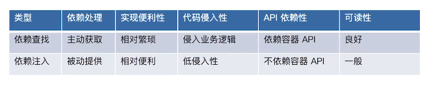

### Spring Framework 

##### Spring 是什么？

- Spring 是 Java 应用最广的一个开源框架，为了解决企业应用开发的复杂性而创建的，但现在已经不止应用于企业应用

- 是一个轻量级的控制反转 `(IOC)` 和面向切面 `(AOP)` 的容器框架

- 它是当前 Java 语言开发应用程序的最重要的软件基础设施

  **Spring官网：http://spring.io/**
  
  

Spring 由众多设计精良模块组成，这些模块能够帮助我们快速开发高质量的程序，以下是 Spring框架的特性概述：

- **核心特性： ** **IoC 容器（IoC Container）、面向切面编程（AOP）**、Spring 事件（Events）、资源管理（Resources）、国际化（i18n）、校验（Validation）、数据绑定（Data Binding）、类型装换（Type Conversion）、Spring 表达式（Spring Express Language）

- **数据存储：**JDBC、事务抽象（Transactions）、DAO支持（DAO Support）、O/R 映射（O/R Mapping）、XML 编列（XML Marshalling）

- **Web 技术：** **Web Servlet 技术栈**（Spring MVC、WebSocket、SockJS）、**Web Reactive 技术栈**（Spring WebFlux、WebClient、WebSocket）

- **技术整合：** 远程调用（Remoting）、Java 消息服务（JMS）、Java 连接架构（JCA）、Java 管理扩展（JMX）、Java 邮件客户端（Email）、本地任务（Tasks）、本地调度（Scheduling）、缓存抽象（Caching）、Spring 测试 （Testing）

- **测试：** 模拟对象（Mock Objects）、TestContext 框架（TextContext Framework）、Spring  MVC 测试（Spring MVC Test）、Web 测试客户端（Web Test Client）


##### Spring Framework 有哪些核心模块?

- **spring-core：**Spring 基础API 模块，如资源管理，泛型处理 

- **spring-beans：**SpringBean 相关，如依赖查找，依赖注入 

- **spring-aop :** SpringAOP 处理，如动态代理，AOP 字节码提升 

- **spring-context :** 事件驱动、注解驱动，模块驱动等 

- **spring-expression：**Spring 表达式语言模块


##### Spring 的核心价值有哪些？


 

##### 什么是 IoC 容器？

- **IoC—Inversion of Control，即“控制反转”：**不是具体的技术，而是一种设计思想。在 Java 开发中，IoC 意味着将你设计好的对象交给容器控制，而不是传统的在你的对象内部直接控制。如何理解好  IoC 呢？理解好 IoC 的关键是要明确“谁控制谁，控制什么，为何是反转（有反转就应该有正转了），哪些方面反转了”，那我们来深入分析一下：
- **谁控制谁，控制什么：**传统 Java SE 程序设计，我们直接在对象内部通过 new 进行创建对象，是程序主动去创建依赖对象；而 IoC 是有专门一个容器来创建这些对象，即由 IoC 容器来控制对象的创建；谁控制谁？当然是 IoC 容器控制了对象；控制什么？那就是主要控制了外部资源获取（不只是对象包括比如文件等）。
- **为何是反转，哪些方面反转了：**有反转就有正转，传统应用程序是由我们自己在对象中主动控制去直接获取依赖对象，也就是正转；而反转则是由容器来帮忙创建及注入依赖对象；为何是反转？因为由容器帮我们查找及注入依赖对象，对象只是被动的接受依赖对象，所以是反转；哪些方面反转了？依赖对象的获取被反转了。

**总结：所谓 IoC，就是由 Spring IoC 容器来负责对象的生命周期和对象之间的关系**


##### IoC 容器的职责有哪些？

- 依赖处理

  - 依赖查找 DL（Depend Lookup），主动或手动的依赖查找方式，通常需要依赖容器或标准 API 实现

  - 依赖注入 DI （Depend Injection），被动或自动依赖绑定的方式，无需依赖相关的额 API

    

- 生命周期管理
  - 容器
  - 托管的资源（Java Beans 或其他资源）

- 配置
  - 容器
  - 外部化配置
  - 托管的资源（Java Beans 或其他资源）


##### Spring IoC 依赖查找

- 根据 Bean 名称查找

  - 实时查找

   ``` Java
    private static void lookupInRealTime(BeanFactory beanFactory) {
            User user = (User) beanFactory.getBean("user");
            System.out.println("实时查找：" + user);
     }
   ```

  - 延迟查找

  ``` xml
  需要先在配置文件中定义 ObjectFactory 对象
  <bean id="objectFactory" class="org.springframework.beans.factory.config.ObjectFactoryCreatingFactoryBean">
          <property name="targetBeanName" value="user"/>
  </bean>
  ```
  
  ``` java
  private static void lookupInLazy(BeanFactory beanFactory) {
          ObjectFactory<User> objectFactory = (ObjectFactory<User>) beanFactory.getBean("objectFactory");
          User user = objectFactory.getObject();
          System.out.println("延迟查找：" + user);
      }
  ```
  
- 根据 Bean 类型查找
  - 单个 Bean 对象
  
  ```Java
    private static void lookupByType(BeanFactory beanFactory) {
            //如果 User 类型的对象不止一个会抛出异常
        	  User user = beanFactory.getBean(User.class);
            System.out.println("实时查找：" + user);
        }
  ```
  
  - 集合 Bean 对象
  
  ``` java
  private static void lookupCollectionByType(BeanFactory beanFactory) {
          if (beanFactory instanceof ListableBeanFactory) {
              ListableBeanFactory listableBeanFactory = (ListableBeanFactory) beanFactory;
              Map<String, User> users = listableBeanFactory.getBeansOfType(User.class);
              System.out.println("查找到的所有的 User 集合对象：" + users);
          }
      }
  ```
  
  
  
- 根据 Java 注解查找
  - 集合 Bean 对象

  ```java
  private static void lookupByAnnotationType(BeanFactory beanFactory) {
          if (beanFactory instanceof ListableBeanFactory) {
              ListableBeanFactory listableBeanFactory = (ListableBeanFactory) beanFactory;
              Map<String, User> users = (Map) listableBeanFactory.getBeansWithAnnotation(Super.class);
              System.out.println("查找标注 @Super 所有的 User 集合对象：" + users);
          }
      }
  ```


##### Spring IoC 依赖注入

- 根据 Bean 名称注入

```xml
<bean id="userRepository"
          class="org.xxx.UserRepository">
    	<!-- 单个属性配置 -->
    	<property name="car" ref="Ferrari">
        <!-- 集合属性配置 -->
        <property name="users">
            <util:list>
                <ref bean="superUser"/>
                <ref bean="user"/>
            </util:list>
        </property>
    </bean>
```

- 根据 Bean 类型注入

```xml
<bean id="userRepository"
          class="org.xxx.UserRepository" autowire="byType">
    <!-- Auto-Wiring 自动装配 -->
 </bean>
```

- 注入容器内建非 Bean 对象

```java
1. 先在实体类中定义 BeanFactory
	class UserRepository {
   		 private BeanFactory beanFactory; // 內建非 Bean 对象（依赖）
    	 //省略getter和setter方法
	}
2. 使用 autowire 自动注入这个依赖对象
 	<bean id="userRepository"
          class="org.xxx.UserRepository" autowire="byType">
     </bean>
3. 获取内建非 Bean 对象（依赖）
    // 依赖来源一：自定义 Bean
    UserRepository userRepository = ac.getBean("userRepository", 				UserRepository.class);
    System.out.println(userRepository.getUsers());
    System.out.println(userRepository.getBeanFactory());
    // 依赖来源二：依赖注入（內建依赖）
    System.out.println(userRepository.getBeanFactory());
4. 使用 applicationContext 查找会抛异常（因为不是定义的普通 bean）
    // 依赖查找（错误）
    System.out.println(ac.getBean(BeanFactory.class));
```

- 注入容器内建 Bean 对象

```java
	// 依赖来源三：容器內建 Bean
    Environment environment = ac.getBean(Environment.class);
    System.out.println("获取 Environment 类型的 Bean：" + environment);
```

总结：**依赖查找只能找到 Bean 对象**，对于不存在的 Bean 会抛 NoSuchBeanDefinitionException 异常。**依赖注入可以注入 Bean 对象（自定义的 Bean 对象、容器内建的 Bean 对象）和容器提供的依赖。**


##### Spring IoC 依赖来源

- 自定义 Bean 
- 容器内建 Bean 对象
- 容器内建对象


##### Spring IoC 配置元信息

- Bean 定义配置（业务流程需要的 Bean 对象）
  - 基于 XML 文件
  - 基于 Properties 文件
  - 基于 Java 注解
  - 基于Java API 

- IoC 容器配置（设置容器的属性，不影响业务流程）
  - 基于 XMl 文件
  - 基于 Java 注解
  - 基于Java API 

- 外部化属性配置
  - 基于 Java 注解（如：@Value）


##### BeanFactory 和 ApplicationContext 谁才是 Spring IoC 容器？

- BeanFactory 和 ApplicationContext 是 Spring 的两大核心接口，而其中 ApplicationContext 是 BeanFactory 的超集。它们都可以当做 Spring 的容器，Spring 容器是生成 Bean 实例的工厂，并管理容器中的 Bean。在基于 Spring 的 Java EE 应用中，所有的组件都被当成 Bean 处理，包括数据源，Hibernate 的 SessionFactory、事务管理器等。

- 两者在功能设计上的区别

  - **BeanFactory 是 Spring 里面最低层的接口，提供了最简单的容器的功能，只提供了实例化对象和拿对象的功能；**

  - **ApplicationContext 应用上下文，继承 BeanFactory 接口，它是 Spring 的一个更高级的容器，提供了更多的有用的功能；**

    1) 面向切面 （AOP）

    2) 资源管理（Resources）

    3) 配置元信息（Configuration Metadata）

    4) 事件、响应机制（Events、ApplicationEventPublisher）

    5) 国际化（i18n）

    6) 注解（Annotations）

    7) Environment 抽象 

- 两者在装载 bean 时候的区别
  - BeanFactory 在启动的时候不会去实例化 Bean，从容器中拿 Bean 的时候才会去实例化；
  - ApplicationContext 在启动的时候就把所有的单例 Bean 全部实例化了。它还可以为 Bean 配置 lazy-init=true 来让 Bean 延迟实例化；

**注意：BeanFactory  是 IoC 的底层容器，而 FactoryBean 是创建 Bean 的一种方式，帮助实现复杂的初始化逻辑。**


##### BeanFactory  和 ApplicationContext  的示例

- BeanFactory 示例（通过 xml 配置）

```java
public static void main(String[] args) {
    // 创建 BeanFactory 容器
    DefaultListableBeanFactory beanFactory = new DefaultListableBeanFactory();
    XmlBeanDefinitionReader reader = new XmlBeanDefinitionReader(beanFactory);
    // XML 配置文件 ClassPath 路径
    String location = "classpath:/META-INF/dependency-lookup-context.xml";
    // 加载配置
    int beanDefinitionsCount = reader.loadBeanDefinitions(location);
    System.out.println("Bean 定义加载的数量：" + beanDefinitionsCount);
    // 依赖查找集合对象
    lookupCollectionByType(beanFactory);
}

private static void lookupCollectionByType(BeanFactory beanFactory) {
    if (beanFactory instanceof ListableBeanFactory) {
        ListableBeanFactory listableBeanFactory = (ListableBeanFactory) beanFactory;
        Map<String, User> users = listableBeanFactory.getBeansOfType(User.class);
        System.out.println("查找到的所有的 User 集合对象：" + users);
    }
}
```

- ApplicationContext 示例（通过注解配置的方式）

```java
public static void main(String[] args) {
    // 创建 BeanFactory 容器
    AnnotationConfigApplicationContext applicationContext = new AnnotationConfigApplicationContext();
    // 将当前类  作为配置类（Configuration Class）
  applicationContext.register(AnnotationApplicationContextAsIoCContainerDemo.class);
    // 启动应用上下文
    applicationContext.refresh();
    // 依赖查找集合对象
    lookupCollectionByType(applicationContext);

    // 关闭应用上下文
    applicationContext.close();

}

/**
 * 通过 Java 注解的方式，定义了一个 Bean
 */
@Bean
public User user() {
    User user = new User();
    user.setId(1L);
    user.setName("小马哥");
    return user;
}

private static void lookupCollectionByType(BeanFactory beanFactory) {
    if (beanFactory instanceof ListableBeanFactory) {
        ListableBeanFactory listableBeanFactory = (ListableBeanFactory) beanFactory;
        Map<String, User> users = listableBeanFactory.getBeansOfType(User.class);
        System.out.println("查找到的所有的 User 集合对象：" + users);
    }
}
```


##### Spring Ioc 容器的生命周期

- 启动
- 运行
- 停止


##### Spring Bean 基础

1. 定义 Spring Bean

2. BeanDefinition 元信息

3. 命名 Spring Bean

4. Spring Bean 的别名

5. 注册 Spring Bean

6. 实例化 Spring Bean

7. 初始化 Spring Bean

8. 延迟初始化 Spring Bean

9. 销毁 Spring Bean

10. 垃圾回收 Spring Bean

    

