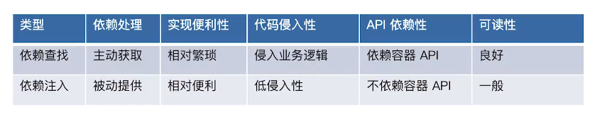
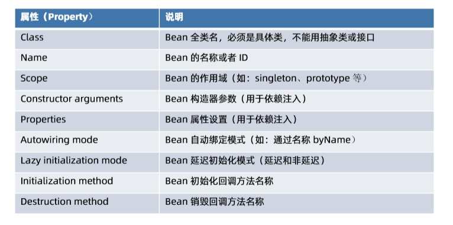

##### Spring 是什么？

- Spring 是 Java 应用最广的一个开源框架，为了解决企业应用开发的复杂性而创建的，但现在已经不止应用于企业应用

- 是一个轻量级的控制反转 `(IOC)` 和面向切面 `(AOP)` 的容器框架

- 它是当前 Java 语言开发应用程序的最重要的软件基础设施

  **Spring官网：http://spring.io/**

  

Spring 由众多设计精良模块组成，这些模块能够帮助我们快速开发高质量的程序，以下是 Spring框架的特性概述：

- **核心特性：IoC 容器（IoC Container）、面向切面编程（AOP）**、Spring 事件（Events）、资源管理（Resources）、国际化（i18n）、校验（Validation）、数据绑定（Data Binding）、类型装换（Type Conversion）、Spring 表达式（Spring Express Language）

- **数据存储：** JDBC、事务抽象（Transactions）、DAO支持（DAO Support）、O/R 映射（O/R Mapping）、XML 编列（XML Marshalling）

- **Web 技术：**  **Web Servlet 技术栈**（Spring MVC、WebSocket、SockJS）、**Web Reactive 技术栈**（Spring WebFlux、WebClient、WebSocket）

- **技术整合：** 远程调用（Remoting）、Java 消息服务（JMS）、Java 连接架构（JCA）、Java 管理扩展（JMX）、Java 邮件客户端（Email）、本地任务（Tasks）、本地调度（Scheduling）、缓存抽象（Caching）、Spring 测试 （Testing）

- **测试：**  模拟对象（Mock Objects）、TestContext 框架（TextContext Framework）、Spring  MVC 测试（Spring MVC Test）、Web 测试客户端（Web Test Client）


##### Spring Framework 有哪些核心模块?

- **spring-core：** Spring 基础API 模块，如资源管理，泛型处理 

- **spring-beans：** SpringBean 相关，如依赖查找，依赖注入 

- **spring-aop :** SpringAOP 处理，如动态代理，AOP 字节码提升 

- **spring-context :** 事件驱动、注解驱动，模块驱动等 

- **spring-expression：** Spring 表达式语言模块


##### Spring 的核心价值有哪些？


 

##### 什么是 IoC 容器？

- **IoC—Inversion of Control，即“控制反转”：** 不是具体的技术，而是一种设计思想。在 Java 开发中，IoC 意味着将你设计好的对象交给容器控制，而不是传统的在你的对象内部直接控制。如何理解好  IoC 呢？理解好 IoC 的关键是要明确“谁控制谁，控制什么，为何是反转（有反转就应该有正转了），哪些方面反转了”，那我们来深入分析一下：
- **谁控制谁，控制什么：** 传统 Java SE 程序设计，我们直接在对象内部通过 new 进行创建对象，是程序主动去创建依赖对象；而 IoC 是有专门一个容器来创建这些对象，即由 IoC 容器来控制对象的创建；谁控制谁？当然是 IoC 容器控制了对象；控制什么？那就是主要控制了外部资源获取（不只是对象包括比如文件等）。
- **为何是反转，哪些方面反转了：** 有反转就有正转，传统应用程序是由我们自己在对象中主动控制去直接获取依赖对象，也就是正转；而反转则是由容器来帮忙创建及注入依赖对象；为何是反转？因为由容器帮我们查找及注入依赖对象，对象只是被动的接受依赖对象，所以是反转；哪些方面反转了？依赖对象的获取被反转了。

**总结：所谓 IoC，就是由 Spring IoC 容器来负责对象的生命周期和对象之间的关系**


##### IoC 容器的职责有哪些？

- 依赖处理

  - 依赖查找 DL（Depend Lookup），主动或手动的依赖查找方式，通常需要依赖容器或标准 API 实现

  - 依赖注入 DI （Depend Injection），被动或自动依赖绑定的方式，无需依赖相关的额 API

    

- 生命周期管理

  - 容器
  - 托管的资源（Java Beans 或其他资源）

- 配置

  - 容器
  - 外部化配置
  - 托管的资源（Java Beans 或其他资源）


##### Spring IoC 依赖查找

- 根据 Bean 名称查找

  - 实时查找

   ``` Java
    private static void lookupInRealTime(BeanFactory beanFactory) {
            User user = (User) beanFactory.getBean("user");
            System.out.println("实时查找：" + user);
     }
   ```

  - 延迟查找

  ``` xml
  需要先在配置文件中定义 ObjectFactory 对象
  <bean id="objectFactory" class="org.springframework.beans.factory.config.ObjectFactoryCreatingFactoryBean">
          <property name="targetBeanName" value="user"/>
  </bean>
  ```

  ``` java
  private static void lookupInLazy(BeanFactory beanFactory) {
          ObjectFactory<User> objectFactory = (ObjectFactory<User>) beanFactory.getBean("objectFactory");
          User user = objectFactory.getObject();
          System.out.println("延迟查找：" + user);
      }
  ```

- 根据 Bean 类型查找

  - 单个 Bean 对象

  ```Java
    private static void lookupByType(BeanFactory beanFactory) {
            //如果 User 类型的对象不止一个会抛出异常
        	  User user = beanFactory.getBean(User.class);
            System.out.println("实时查找：" + user);
        }
  ```

  - 集合 Bean 对象

  ``` java
  private static void lookupCollectionByType(BeanFactory beanFactory) {
          if (beanFactory instanceof ListableBeanFactory) {
              ListableBeanFactory listableBeanFactory = (ListableBeanFactory) beanFactory;
              Map<String, User> users = listableBeanFactory.getBeansOfType(User.class);
              System.out.println("查找到的所有的 User 集合对象：" + users);
          }
      }
  ```

  

- 根据 Java 注解查找

  - 集合 Bean 对象

  ```java
  private static void lookupByAnnotationType(BeanFactory beanFactory) {
          if (beanFactory instanceof ListableBeanFactory) {
              ListableBeanFactory listableBeanFactory = (ListableBeanFactory) beanFactory;
              Map<String, User> users = (Map) listableBeanFactory.getBeansWithAnnotation(Super.class);
              System.out.println("查找标注 @Super 所有的 User 集合对象：" + users);
          }
      }
  ```


##### Spring IoC 依赖注入

- 根据 Bean 名称注入

```xml
<bean id="userRepository"
          class="org.xxx.UserRepository">
    	<!-- 单个属性配置 -->
    	<property name="car" ref="Ferrari">
        <!-- 集合属性配置 -->
        <property name="users">
            <util:list>
                <ref bean="superUser"/>
                <ref bean="user"/>
            </util:list>
        </property>
    </bean>
```

- 根据 Bean 类型注入

```xml
<bean id="userRepository"
          class="org.xxx.UserRepository" autowire="byType">
    <!-- Auto-Wiring 自动装配 -->
 </bean>
```

- 注入容器内建非 Bean 对象

```java
1. 先在实体类中定义 BeanFactory
	class UserRepository {
   		 private BeanFactory beanFactory; // 內建非 Bean 对象（依赖）
    	 //省略getter和setter方法
	}
2. 使用 autowire 自动注入这个依赖对象
 	<bean id="userRepository"
          class="org.xxx.UserRepository" autowire="byType">
     </bean>
3. 获取内建非 Bean 对象（依赖）
    // 依赖来源一：自定义 Bean
    UserRepository userRepository = ac.getBean("userRepository", 				UserRepository.class);
    System.out.println(userRepository.getUsers());
    System.out.println(userRepository.getBeanFactory());
    // 依赖来源二：依赖注入（內建依赖）
    System.out.println(userRepository.getBeanFactory());
4. 使用 applicationContext 查找会抛异常（因为不是定义的普通 bean）
    // 依赖查找（错误）
    System.out.println(ac.getBean(BeanFactory.class));
```

- 注入容器内建 Bean 对象

```java
	// 依赖来源三：容器內建 Bean
    Environment environment = ac.getBean(Environment.class);
    System.out.println("获取 Environment 类型的 Bean：" + environment);
```

总结：**依赖查找只能找到 Bean 对象**，对于不存在的 Bean 会抛 NoSuchBeanDefinitionException 异常。**依赖注入可以注入 Bean 对象（自定义的 Bean 对象、容器内建的 Bean 对象）和容器提供的依赖。**


##### Spring IoC 依赖来源

- 自定义 Bean 
- 容器内建 Bean 对象
- 容器内建对象


##### Spring IoC 配置元信息

- Bean 定义配置（业务流程需要的 Bean 对象）
  - 基于 XML 文件
  - 基于 Properties 文件
  - 基于 Java 注解
  - 基于Java API 

- IoC 容器配置（设置容器的属性，不影响业务流程）
  - 基于 XMl 文件
  - 基于 Java 注解
  - 基于Java API 

- 外部化属性配置
  - 基于 Java 注解（如：@Value）


##### BeanFactory 和 ApplicationContext 谁才是 Spring IoC 容器？

- BeanFactory 和 ApplicationContext 是 Spring 的两大核心接口，而其中 ApplicationContext 是 BeanFactory 的超集。它们都可以当做 Spring 的容器，Spring 容器是生成 Bean 实例的工厂，并管理容器中的 Bean。在基于 Spring 的 Java EE 应用中，所有的组件都被当成 Bean 处理，包括数据源，Hibernate 的 SessionFactory、事务管理器等。

- 两者在功能设计上的区别

  - **BeanFactory 是 Spring 里面最低层的接口，提供了最简单的容器的功能，只提供了实例化对象和拿对象的功能；**

  - **ApplicationContext 应用上下文，继承 BeanFactory 接口，它是 Spring 的一个更高级的容器，提供了更多的有用的功能；**

    1) 面向切面 （AOP）

    2) 资源管理（Resources）

    3) 配置元信息（Configuration Metadata）

    4) 事件、响应机制（Events、ApplicationEventPublisher）

    5) 国际化（i18n）

    6) 注解（Annotations）

    7) Environment 抽象 

- 两者在装载 bean 时候的区别

  - BeanFactory 在启动的时候不会去实例化 Bean，从容器中拿 Bean 的时候才会去实例化；
  - ApplicationContext 在启动的时候就把所有的单例 Bean 全部实例化了。它还可以为 Bean 配置 lazy-init=true 来让 Bean 延迟实例化；

**注意：BeanFactory  是 IoC 的底层容器，而 FactoryBean 是创建 Bean 的一种方式，帮助实现复杂的初始化逻辑。**


##### BeanFactory  和 ApplicationContext  的示例

- BeanFactory 示例（通过 xml 配置）

```java
public static void main(String[] args) {
    // 创建 BeanFactory 容器
    DefaultListableBeanFactory beanFactory = new DefaultListableBeanFactory();
    XmlBeanDefinitionReader reader = new XmlBeanDefinitionReader(beanFactory);
    // XML 配置文件 ClassPath 路径
    String location = "classpath:/META-INF/dependency-lookup-context.xml";
    // 加载配置
    int beanDefinitionsCount = reader.loadBeanDefinitions(location);
    System.out.println("Bean 定义加载的数量：" + beanDefinitionsCount);
    // 依赖查找集合对象
    lookupCollectionByType(beanFactory);
}

private static void lookupCollectionByType(BeanFactory beanFactory) {
    if (beanFactory instanceof ListableBeanFactory) {
        ListableBeanFactory listableBeanFactory = (ListableBeanFactory) beanFactory;
        Map<String, User> users = listableBeanFactory.getBeansOfType(User.class);
        System.out.println("查找到的所有的 User 集合对象：" + users);
    }
}
```

- ApplicationContext 示例（通过注解配置的方式）

```java
public static void main(String[] args) {
    // 创建 BeanFactory 容器
    AnnotationConfigApplicationContext applicationContext = new AnnotationConfigApplicationContext();
    // 将当前类  作为配置类（Configuration Class）
  applicationContext.register(AnnotationApplicationContextAsIoCContainerDemo.class);
    // 启动应用上下文
    applicationContext.refresh();
    // 依赖查找集合对象
    lookupCollectionByType(applicationContext);

    // 关闭应用上下文
    applicationContext.close();

}

/**
 * 通过 Java 注解的方式，定义了一个 Bean
 */
@Bean
public User user() {
    User user = new User();
    user.setId(1L);
    user.setName("小马哥");
    return user;
}

private static void lookupCollectionByType(BeanFactory beanFactory) {
    if (beanFactory instanceof ListableBeanFactory) {
        ListableBeanFactory listableBeanFactory = (ListableBeanFactory) beanFactory;
        Map<String, User> users = listableBeanFactory.getBeansOfType(User.class);
        System.out.println("查找到的所有的 User 集合对象：" + users);
    }
}
```


##### Spring Ioc 容器的生命周期

- 启动
- 运行
- 停止


##### Spring Bean 基础

1. 定义 Spring Bean

   ###### 什么是 BeanDefinition ？

   BeanDefinition 是 Spring 框架中定义 Bean 的配置元信息接口，包含：

   - Bean 的类名
   - Bean 行为配置元素，如作用域、自动绑定的模式，生命周期回调等
   - 其他 Bean 引用，又可称作合作者或者依赖
   - 配置设置，比如 Bean 属性（properties）

2. BeanDefinition 元信息

   ###### BeanDefinition 的元信息如图：

   

   ###### BeanDefinition 的构建

   - 通过 BeanDefinitionBuilder

   ```java
   	// 1.通过 BeanDefinitionBuilder 构建
       BeanDefinitionBuilder builder = 										BeanDefinitionBuilder.genericBeanDefinition(User.class);
   	// 通过属性设置
        builder.addPropertyValue("id", 1)
           	.addPropertyValue("name", "小马哥");
       // 获取 BeanDefinition 实例
       BeanDefinition beanDefinition = builder.getBeanDefinition();
       // BeanDefinition 并非 Bean 终态，可以自定义修改
   ```

   - 通过 AbstractBeanDefinition 以及它的派生类

   ```java
   	// 2. 通过 AbstractBeanDefinition 以及派生类
   	GenericBeanDefinition generic = new GenericBeanDefinition();
       // 设置 Bean 类型
   	generic.setBeanClass(User.class);
       // 通过 MutablePropertyValues 批量操作属性
       MutablePropertyValues property = new MutablePropertyValues();
       property.add("id", 1)
               .add("name", "小马哥");
       // 通过 set MutablePropertyValues 批量操作属性
       generic.setPropertyValues(property);
   ```

3. 命名 Spring Bean

   - 每个 Bean 拥有一个或多个标识符，这些标识符在 Bean 所在的容器必须是唯一的（在整个应用中可以不唯一），同时，还可以为 Bean 设置别名（Alias）。

   - 在基于 XML 的配置元信息中，可用 id 或者 name 属性来规定 Bean 的标识符，如果想要引入别名的话，可在 name 属性使用半角逗号或分号来间隔。

   - Bean 的 id 或 name 属性并非必须制定，如果留空的话，容器会为 Bean 自动生成一个唯一的名称。
   - Bean 名称生成器（BeanNameGenerator 接口）有两个实现，一个是默认通用的 DefaultBeanNameGenerator，一个是基于注解扫描的 AnnotationBeanNameGenerator

4. Spring Bean 的别名

   Bean 别名配置：

   ```xml
   <!-- 将 Spring 容器中 "user" Bean 关联/建立别名 - "xiaomage-user" -->
   <alias name="user" alias="xiaomage-user" />
   ```

   使用别名依赖查找对应的 Bean：

   ```java
   // 通过别名 xiaomage-user 获取曾用名 user 的 bean
   User user = beanFactory.getBean("user", User.class);
   User xiaomageUser = beanFactory.getBean("xiaomage-user", User.class);
   System.out.println(user == xiaomageUser); //true
   ```

5. 注册 Spring Bean

   BeanDefinition 注册

   - xml 配置元信息
     - <bean name =“…" /> 
   - Java 注解配置元信息
     - @Bean
     - @Component
     - @Import
   - Java API 配置元信息
     - 命名方式：BeanDefinitionRegistry#registerBeanDefinition(String,BeanDefinition)
     - 非命名：BeanDefinitionReaderUtils#registerWithGeneratedName(AbstractBeanDefinition,Be anDefinitionRegistry)

   ```java
   public static void registerUserBeanDefinition(BeanDefinitionRegistry registry, String beanName) {
       BeanDefinitionBuilder beanDefinitionBuilder = genericBeanDefinition(User.class);
       beanDefinitionBuilder
               .addPropertyValue("id", 1L)
               .addPropertyValue("name", "小马哥");
   
       // 判断如果 beanName 参数存在时
       if (StringUtils.hasText(beanName)) {
           // 注册 BeanDefinition
           registry.registerBeanDefinition(beanName, beanDefinitionBuilder.getBeanDefinition());
       } else {
           // 非命名 Bean 注册方法
     BeanDefinitionReaderUtils.registerWithGeneratedName(beanDefinitionBuilder.getBeanDefinition(), registry);
       }
   }
   
   public static void registerUserBeanDefinition(BeanDefinitionRegistry registry) {
       registerUserBeanDefinition(registry, null);
   }
   ```

   - 配置类方式：AnnotatedBeanDefinitionReader#register(Class...)

   - 外部单例对象注册

     - SingletonBeanRegistry#registerSingleton

     ```java
     // 创建一个外部 UserFactory 对象
     UserFactory userFactory = new DefaultUserFactory();
     SingletonBeanRegistry sing = appContext.getBeanFactory();
     // 注册外部单例对象
     sing.registerSingleton("userFactory", userFactory);
     // 启动 Spring 应用上下文
     appContext.refresh();
     // 通过依赖查找的方式来获取 UserFactory
     UserFactory user2 = appContext.getBean("userFactory", UserFactory.class);
     System.out.println(userFactory == user2);
     ```

6. 实例化 Spring Bean

   - 通过构造器

   ```xml
   <bean id="user-by-constructor" class="org.xxx.User">
       <constructor-arg value="20"/>
       <constructor-arg value="zhangsan"/>
   </bean>
   ```

   - 通过静态工厂方法

   ```xml
   <!-- 静态方法实例化 Bean -->
   <bean id="user-by-static-method" class="org.xxx.User"
   factory-method="createUser" />
   <!-- User 类中的静态方法 -->
   public static User createUser() {
           User user = new User();
           user.setId(1L);
           user.setName("小马哥");
           return user;
       }
   ```

   - 通过 Bean 工厂方法

   ```xml
   <!-- 实例（Bean）方法实例化 Bean -->
   <bean id="userFactory" class="org.xxx.DefaultUserFactory"/>
   <bean id="user-by-instance-method" factory-bean="userFactory" factory-method="createUser"/>
   
   public class DefaultUserFactory {
       @Override
       public User createUser() {
           return User.createUser();
       }
   }
   ```

   - 通过 FactoryBean 

   ```java
   <!-- FactoryBean实例化 Bean -->
   <bean id="user-by-factory-bean" class="org.xxx.UserFactoryBean" />
   
   public class UserFactoryBean implements FactoryBean {
   
       @Override
       public Object getObject() throws Exception {
           return User.createUser();
       }
   
       @Override
       public Class<?> getObjectType() {
           return User.class;
       }
   }
   ```

   - 通过 ServiceLoaderFactoryBean

   ```java
   <!-- 配置 ServiceLoaderFactoryBean  -->
   <bean id="userFactoryServiceLoader"class="x.ServiceLoaderFactoryBean">
       <property name="serviceType" value="org.xx.UserFactory" />
   </bean>
       
   ServiceLoader<UserFactory> serviceLoader = 	beanFactory.getBean("userFactoryServiceLoader", ServiceLoader.class);
   
   Iterator<UserFactory> iterator = serviceLoader.iterator();
   while (iterator.hasNext()) {
       UserFactory userFactory = iterator.next();
       System.out.println(userFactory.createUser());
   }
   ```

   - 通过 AutowireCapableBeanFactory#createBean(Class,int,boolean)

   ```java
   // 通过 ApplicationContext 获取 AutowireCapableBeanFactory
   AutowireCapableBeanFactory beanFactory = 									applicationContext.getAutowireCapableBeanFactory();
   
   // 创建 UserFactory 对象，通过 AutowireCapableBeanFactory
   UserFactory factory = beanFactory.createBean(DefaultUserFactory.class);
   System.out.println(factory.createUser());
   ```

   - 通过 BeanDefinitionRegistry#registerBeanDefinition(String,BeanDefinition)

7. 初始化 Spring Bean

   - @PostConstruct 标注方法

   ```java
   // 1. 基于 @PostConstruct 注解
   @PostConstruct
   public void init() {
       System.out.println("@PostConstruct : UserFactory 初始化中...");
   }
   ```

   - 实现 InitializingBean 接口的 afterPropertiesSet() 方法

   ```java
   public class DefaultUserFactory implements UserFactory, InitializingBean {
       @Override
       public void afterPropertiesSet() throws Exception {
           System.out.println("InitializingBean#afterPropertiesSet() : UserFactory 初始化中...");
       }
   }
   ```

   - 自定义初始化方法
     - Java 注解：@Bean(initMethod=”init”) 
     - XML 配置：<bean init-method=”init” ... />
     - Java API：AbstractBeanDefinition#setInitMethodName(String)

   ```java
   @Bean(initMethod = "initUserFactory")
   public UserFactory userFactory() {
       return new DefaultUserFactory();
   }
   public void initUserFactory() {
       System.out.println("自定义初始化方法 initUserFactory() : UserFactory 初始化中...");
   }
   ```

    **注意：初始化方法执行顺序：@PostConstruct 》 afterPropertiesSet() 》自定义初始化方法**

   

8. 延迟初始化 Spring Bean

   - XML 配置：<bean lazy-init=”true” ... />

   - Java 注解：@Lazy

   ```java
   @Lazy
   public UserFactory userFactory() {
       return new DefaultUserFactory();
   }
   ```

   总结：延迟初始化是在容器需要这个 Bean 的时候才去初始化

9. 销毁 Spring Bean

   - @PreDestroy 标注方法

   ```java
   @PreDestroy
   public void preDestroy() {
       System.out.println("@PreDestroy : UserFactory 销毁中...");
   }
   ```

   - 实现 DisposableBean 接口的 destroy() 方法

   ```java
   public class DefaultUserFactory implements UserFactory, DisposableBean {
       @Override
       public void destroy() throws Exception {
           System.out.println("DisposableBean#destroy() : UserFactory 销毁中...");
       }
   }
   ```

   - 自定义销毁方法
     - XML 配置：<bean destroy=”destroy” ... /> 
     - Java 注解：@Bean(destroy=”destroy”) 
     - Java API：AbstractBeanDefinition#setDestroyMethodName(String)

   ```java
   @Bean(destroyMethod = "doDestroy")
   public UserFactory userFactory() {
       return new DefaultUserFactory();
   }
   public void doDestroy() {
       System.out.println("自定义销毁方法 doDestroy() : UserFactory 销毁中...");
   }
   ```

   **注意：销毁方法执行顺序：@PreDestroy 》 destroy() 》自定义销毁方法**

10. 垃圾回收 Spring Bean

    Bean 垃圾回收

    1. 关闭 Spring 容器（应用上下文）
    2. 执行 GC
    3. Spring Bean 覆盖的 finalize() 方法被回调

    

##### Spring IoC 依赖查找进阶

1. 单一类型依赖查找

   - 根据Bean 名称查找 
     - getBean(String) 
     - Spring 2.5 覆盖默认参数：getBean(String,Object...) 
   - 根据Bean 类型查找 
     - Bean 实时查找 
       - Spring 3.0 getBean(Class) 
       - Spring 4.1 覆盖默认参数：getBean(Class,Object...) 
     - Spring 5.1  Bean 延迟查找 
       - getBeanProvider(Class) 
       - getBeanProvider(ResolvableType) 
   - 根据Bean 名称+ 类型查找：getBean(String,Class)

   

2. 集合类型依赖查找

   **集合类型依赖查找接口-ListableBeanFactory** 

   - 根据Bean 类型查找 
     - 获取同类型Bean 名称列表 
       - getBeanNamesForType(Class) 
       - Spring 4.2 getBeanNamesForType(ResolvableType) 
     - 获取同类型Bean 实例列表 
       - getBeansOfType(Class) 以及重载方法 
   - 通过注解类型查找 
     - Spring 3.0 获取标注类型Bean 名称列表 
       - getBeanNamesForAnnotation(Class<? extends Annotation>) 
     - Spring 3.0 获取标注类型Bean 实例列表 
       - getBeansWithAnnotation(Class<? extends Annotation>) 
     - Spring 3.0 获取指定名称+ 标注类型Bean 实例 
       - findAnnotationOnBean(String,Class<? extends Annotation>)

   

3. 层次性依赖查找

   **层次性依赖查找接口-HierarchicalBeanFactory**

   - 双亲BeanFactory：getParentBeanFactory() 
   - 层次性查找 
     - 根据Bean 名称查找 
       - 基于containsLocalBean 方法实现 
     - 根据Bean 类型查找实例列表 
       - 单一类型：BeanFactoryUtils#beanOfType 
       - 集合类型：BeanFactoryUtils#beansOfTypeIncludingAncestors 
     - 根据Java 注解查找名称列
       - BeanFactoryUtils#beanNamesForTypeIncludingAncestors

   

4. 延迟依赖查找

   Bean 延迟依赖查找接口 

   - org.springframework.beans.factory.ObjectFactory

   - org.springframework.beans.factory.ObjectProvider 

     - Spring 5 对 Java 8 特性扩展 

       - getIfAvailable(Supplier) 

       ```java
       private static void lookupIfAvailable(AnnotationConfigApplicationContext applicationContext) {
           ObjectProvider<User> userObjectProvider = applicationContext.getBeanProvider(User.class);
           // 如果当前对象不存在，则创建一个，属于兜底的方案
           User user = userObjectProvider.getIfAvailable(User::createUser);
           System.out.println("当前 User 对象：" + user);
       }
       ```

       - ifAvailable(Consumer) 

       - Stream 扩展-stream()

       ```java
       private static void lookupByStreamOps(AnnotationConfigApplicationContext applicationContext) {
           ObjectProvider<String> objectProvider = applicationContext.getBeanProvider(String.class);
           // Stream -> Method reference
           objectProvider.stream().forEach(System.out::println);
       }
       ```

5. 安全依赖查找

    依赖查找安全性对比

   | 依赖查找类型 | 代表实现                           | 是否安全 |
   | :----------- | ---------------------------------- | -------- |
   | 单一类型查找 | BeanFactory#getBean                | ==否==   |
   |              | ObjectFactory#getObject            | ==否==   |
   |              | ObjectProvider#getIfAvailable      | 是       |
   | 集合类型查找 | ListableBeanFactory#getBeansOfType | 是       |
   |              | ObjectProvider#stream              | 是       |

   注意：层次性依赖查找的安全性取决于其扩展的单一或集合类型的 BeanFactory 接口

6. 内建可查找的依赖

   - AbstractApplicationContext 内建可查找的依赖

   | Bean 名称                   | Bean 实例                         | 使用场景                |
   | --------------------------- | --------------------------------- | ----------------------- |
   | environment                 | Environment 对象                  | 外部化配置以及 Profiles |
   | systemProperties            | java.util.Properties 对象         | Java 系统属性           |
   | systemEnvironment           | java.util.Map 对象                | 操作系统环境变量        |
   | messageSource               | MessageSource 对象                | 国际化文案              |
   | lifecycleProcessor          | LifecycleProcessor 对象           | Lifecycle Bean 处理器   |
   | applicationEventMulticaster | ApplicationEventMulticaster 对 象 | Spring 事件广播器       |

   - 注解驱动 Spring 应用上下文内建可查找的依赖（内建 bean）（部分）

   | Bean 名称                                                    | Bean 实例                                    | 使用场景                                             |
   | ------------------------------------------------------------ | -------------------------------------------- | ---------------------------------------------------- |
   | org.springframework.contex t.annotation.internalConfigu rationAnnotationProcessor | ConfigurationClassPostProcesso r 对象        | 处理 Spring 配置类                                   |
   | org.springframework.contex t.annotation.internalAutowir edAnnotationProcessor | AutowiredAnnotationBeanPostP rocessor 对象   | 处理 @Autowired 以及 @Value 注解                     |
   | org.springframework.contex t.annotation.internalCommo nAnnotationProcessor | CommonAnnotationBeanPostPr ocessor 对象      | （条件激活）处理JSR-250 注解， 如@PostConstruct 等   |
   | org.springframework.contex t.event.internalEventListener Processor | EventListenerMethodProcessor 对象            | 处理标注@EventListener 的 Spring 事件监听方法        |
   | org.springframework.contex t.event.internalEventListener Factory | DefaultEventListenerFactory 对 象            | @EventListener 事件监听方法适配为ApplicationListener |
   | org.springframework.contex t.annotation.internalPersiste nceAnnotationProcessor | PersistenceAnnotationBeanPost Processor 对象 | （条件激活）处理JPA 注解场景                         |

   

7. 依赖查找中的经典异常

   | 异常类型                        | 触发条件                                   | 场景举例                                    |
   | ------------------------------- | ------------------------------------------ | ------------------------------------------- |
   | NoSuchBeanDefinitionException   | 当查找 Bean 不存在于 IoC 容器时            | BeanFactory#getBean ObjectFactory#getObject |
   | NoUniqueBeanDefinitionException | 类型依赖查找时，IoC 容器存在多个 Bean 实例 | BeanFactory#getBean(Class)                  |
   | BeanInstantiationException      | 当 Bean 所对应的类型非具体类时             | BeanFactory#getBean                         |
   | BeanCreationException           | 当 Bean 初始化过程中                       | Bean 初始化方法执行异常时                   |
   | BeanDefinitionStoreException    | 当 BeanDefinition 配置元信息非法时         | XML 配置资源无法打开时                      |


##### Spring IoC 依赖注入进阶

