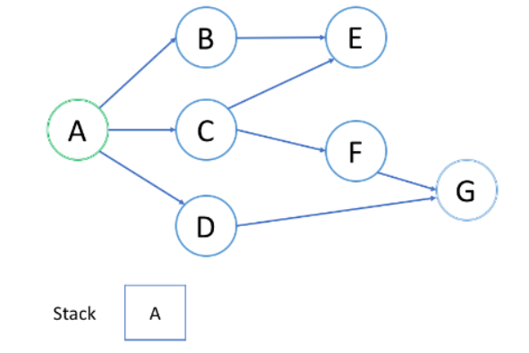

### 数据结构是什么

数据结构是计算机存储、组织数据的方式。数据结构由某一数据元素的集合和该集合中数据元素之间的关系组成。通常情况下，精心选择的数据结构可以带来更高的运行或者存储效率。

### 数据结构的分类

**按存储结构划分**：

- 顺序存储：把逻辑上相邻的元素储存到物理上也相邻的存储单元中。（一般用一维数组）
- 链式存储：元素不需要存储到相邻的位置，而是用附加的指针指示逻辑关系。
- 索引存储：在存储元素的同时建立附加的索引表。（关键码：地址）
- 哈希存储：根据元素的关键码通过哈希函数计算直接得到存储地址。

数据的顺序存储结构的特点是：借助元素在存储器中的相对位置来表示数据元素之间的逻辑关系；非顺序存储的特点是：借助指示元素存储地址的指针表示数据元素之间的逻辑关系。

**按逻辑结构划分**：

- 集合：元素之间除了“同属一个集合” 的相互关系外，别无其他关系
- 线性结构：数据结构中的元素存在一对一的相互关系
- 树形结构：数据结构中的元素存在一对多的相互关系
- 图形结构：数据结构中的元素存在多对多的相互关系

逻辑关系是指数据元素之间的前后间关系，而与他们在计算机中的存储位置无关。

### 数据结构的操作

数据结构研究的内容：就是如何按一定的逻辑结构，把数据组织起来，并选择适当的存储表示方法把逻辑结构组织好的数据存储到计算机的存储器里。算法研究的目的是为了更有效的处理数据，提高数据运算效率。数据的运算是定义在数据的逻辑结构上，但运算的具体实现要在存储结构上进行。一般有以下几种常用运算： 

- 插入。往数据结构中增加新的节点。
- 删除。把指定的结点从数据结构中去掉。 
- 更新。改变指定节点的一个或多个字段的值。 
- 查找。在数据结构里查找满足一定条件的节点。 
- 排序。把节点按某种指定的顺序重新排列，例如递增或递减。


### 数组 


### 字符串


### 队列

简单的说：**队列是一种先入先出（FIFO）的数据结构**，可以使用数组或者链表实现。


队列首先处理添加到队列中的**第一个元素**。通常，插入（insert）操作也称作入队（enqueue），新元素始终被添加在队列的末尾。 删除（delete）操作也被称为出队（dequeue)。 你只能移除第一个元素。

#### 循环队列

循环队列可以提高内存的利用率。具体来说，我们可以使用`固定大小的数组`和`两个指针`来指示起始位置和结束位置。实现一个循环队列：

使用一个`数组`和两个指针（`head` 和 `tail`）。 `head` 表示队列的起始位置，`tail` 表示队列的结束位置。注意：**判断队满的条件 ((tail + 1) % data.length) == head** 。

```java
class MyCircularQueue {
    //存储元素的数组
    private int[] data;
    //头索引
    private int head = -1;
    //尾索引
    private int tail = -1;

    public MyCircularQueue(int k) {
        data = new int[k];
    }

    public boolean enQueue(int value) {
        if (isFull()) {
            return false;
        }
        //空队列第一次添加元素
        if (isEmpty()) {
            head = 0;
        }
        tail = (tail + 1) % data.length;
        data[tail] = value;
        return true;
    }

    public boolean deQueue() {
        if (isEmpty()) {
            return false;
        }
        //如果头尾相接 -> 最后一个元素啦
        if (head == tail) {
            head = -1;
            tail = -1;
        } else {
            //循环队列的特性
            head = (head + 1) % data.length;
        }
        return true;
    }

    public int Front() {
        if (isEmpty()) {
            return -1;
        }
        return data[head];
    }

    public int Rear() {
        if (isEmpty()) {
            return -1;
        }
        return data[tail];
    }

    public boolean isEmpty() {
        return head == -1;
    }

    public boolean isFull() {
        return ((tail + 1) % data.length) == head;
    }
}
```

#### 优先级队列


#### 队列和 BFS

广度优先搜索（BFS）的一个常见应用是找出从**根结点到目标结点的最短路径**。

示例：如何使用 BFS 来找出根结点 `A` 和目标结点 `G` 之间的最短路径？


**1. 结点的处理顺序是什么？**

首先将 A 加入队列。

第一轮：处理 A，并将 B C D 加入队列。

第二轮：顺序处理 B C D 并且将他们相邻的 E F G 加入队列。

第三轮：顺序处理 E F G，发现 G，**此时经过的处理轮次就是最短路径**。

如果在第 k 轮中将结点 `X` 添加到队列中，则根结点与 `X` 之间的最短路径的长度恰好是 `k`。也就是说，**第一次找到目标结点时，你已经处于最短路径中**。

**2. 队列的入队和出队顺序是什么？**

我们首先将根结点排入队列。然后在每一轮中，我们逐个处理已经在队列中的结点，并将所有邻居添加到队列中。值得注意的是，新添加的节点不会立即遍历，而是在下一轮中处理。

结点的处理顺序与它们添加到队列的顺序是完全相同的顺序，即先进先出（FIFO）。这就是我们在 BFS 中使用队列的原因。

##### BFS 的模板 I

```java
/**
 * Return the length of the shortest path between root and target node.
 */
int BFS(Node root, Node target) {
    Queue<Node> queue;  // store all nodes which are waiting to be processed
    int step = 0;       // number of steps neeeded from root to current node
    // initialize
    add root to queue;
    // BFS
    while (queue is not empty) {
        step = step + 1;
        // iterate the nodes which are already in the queue
        int size = queue.size();
        for (int i = 0; i < size; ++i) {
            Node cur = the first node in queue;
            return step if cur is target;
            for (Node next : the neighbors of cur) {
                add next to queue;
            }
            remove the first node from queue;
        }
    }
    return -1; // there is no path from root to target
}
```

- 如代码所示，在每一轮中，队列中的结点是`等待处理的结点`。
- 在每个更外一层的 `while` 循环之后，我们`距离根结点更远一步`。变量 `step` 指示从根结点到我们正在访问的当前结点的距离。

##### BFS 的模板 II

有时，确保我们**永远不会访问一个结点两次**很重要。否则，我们可能陷入无限循环。如果是这样，我们可以在上面的代码中添加一个哈希集来解决这个问题。这是修改后的伪代码：

```java
/**
 * Return the length of the shortest path between root and target node.
 */
int BFS(Node root, Node target) {
    Queue<Node> queue;  // store all nodes which are waiting to be processed
    Set<Node> used;     // store all the used nodes
    int step = 0;       // number of steps neeeded from root to current node
    // initialize
    add root to queue;
    add root to used;
    // BFS
    while (queue is not empty) {
        // iterate the nodes which are already in the queue
        int size = queue.size();
        for (int i = 0; i < size; ++i) {
            Node cur = queue.poll();
            return step if cur is target;
            for (Node next : the neighbors of cur) {
                if (next is not in used) {
                    add next to queue;
                    add next to used;
                }
            }
            step++；// 在这里更新步数
        }
    }
    return -1; // there is no path from root to target
}
```

有两种情况你不需要使用哈希集：

- 你完全确定没有循环，例如，在树遍历中；
- 你确实希望多次将结点添加到队列中。


### 栈

简单的说：**栈是一种后进先出（LIFO）的数据结构**，可以使用数组或链表实现。


栈首先处理添加到其中的**最新元素**。通常，插入操作在栈中被称作入栈 `push` 。与队列类似，总是在堆栈的末尾添加一个新元素。但是，删除操作，退栈 `pop` ，将始终删除堆栈中相对于它的最后一个元素。

#### 最小栈

设计一个支持 `push` ，`pop` ，`top` 操作，并能在**常数时间**内检索到最小元素的栈。

- `push(x)` —— 将元素 x 推入栈中。
- `pop()` —— 删除栈顶的元素。
- `top()` —— 获取栈顶元素。
- `getMin()` —— 检索栈中的最小元素。

###### 使用数组实现

```java
class MinStack {

    private Stack<Integer> stack;
    //使用一个变量存储最小的元素
    private int min = Integer.MAX_VALUE;

    public MinStack() {
        stack = new Stack<>();
    }
    //加入元素
    public void push(int x) {
        //如果新加入的元素 <= min
        //将原来的 min 也一起加入栈中
        if (x <= min) {
            stack.push(min);
            min = x;
        }
        stack.push(x);
    }
    //弹出栈顶元素
    public void pop() {
        //如果获取的是最小的元素
        //那么还需要再弹出一次恢复原样
        if (stack.pop() == min) {
            min = stack.pop();
        }
    }
    //获取栈顶元素
    public int top() {
        return stack.peek();
    }
    //获取栈中最小的元素
    public int getMin() {
        return min;
    }
}
```

###### 使用链表实现

```java
class Min_Stack {
    private Node head;
    public Min_Stack() {
    }
    public void push(int x) {
        if (head == null) {
            head = new Node(x, x);
        } else {
            head = new Node(x, Math.min(x, head.min), head);
        }
    }
    public void pop() {
        head = head.next;
    }
    public int top() {
        return head.val;
    }
    public int getMin() {
        return head.min;
    }
	//结点 内部类
    private class Node {
        int val;
        int min;
        Node next;
        private Node(int val, int min) {
            this(val, min, null);
        }
        private Node(int val, int min, Node next) {
            this.val = val;
            this.min = min;
            this.next = next;
        }
    }
}
```

#### 单调栈

单调栈即栈内的元素的是有序的，可以递增也可以递减。可以以 **O(1)** 的时间复杂度得知某个位置左右两侧比他大（或小）的数的位置，当你需要高效率获取某个位置左右两侧比他大（或小）的数的位置的的时候就可以用到单调栈。（**单调栈一般用于存储数组的下标**）

模板：

```java
for (遍历这个数组) {
while (栈不为空 && 栈顶元素小于当前元素) {
栈顶元素出栈;
更新结果;
}
当前元素入栈;
}
```

#### 栈和 DFS

与 BFS 类似，深度优先搜索（DFS）也可用于查找从根结点到目标结点的路径。



**1. 结点的处理顺序是什么？**

我们从根结点 `A` 开始。首先，我们选择结点 `B` 的路径，并进行回溯，直到我们到达结点 `E`，我们无法更进一步深入。然后我们回溯到 `A` 并选择第二条路径到结点 `C` 。从 `C` 开始，我们尝试第一条路径到 `E` 但是 `E` 已被访问过。所以我们回到 `C` 并尝试从另一条路径到 `F`。最后，我们找到了 `G`。总的来说，**在我们到达最深的结点之后，我们只会回溯并尝试另一条路径**。

因此，你在 DFS 中找到的**第一条路径并不总是最短的路径**。例如，在上面的例子中，我们成功找出了路径 `A-> C-> F-> G` 并停止了 DFS。但这不是从 `A` 到 `G` 的最短路径。

**2. 栈的入栈和退栈顺序是什么？**

我们首先将根结点推入到栈中；然后我们尝试第一个邻居 `B` 并将结点 `B` 推入到栈中。当我们到达最深的结点 `E` 时，我们需要回溯。当我们回溯时，我们将从栈中弹出最深的结点，这实际上是推入到栈中的最后一个结点。

结点的处理顺序是`完全相反的顺序`，就像它们被`添加`到栈中一样，它是后进先出（LIFO）。这就是我们在 DFS 中使用栈的原因。

在大多数情况下，我们在能使用 BFS 时也可以使用 DFS。但是有一个重要的区别：**遍历顺序**。

##### 模板 I：隐式栈递归

递归解决方案的优点是它更容易实现。 但是，存在一个很大的缺点：如果递归的深度太高，你将遭受堆栈溢出，并且递归的效率很低。

```java
/*
 * Return true if there is a path from cur to target.
 */
boolean DFS(Node cur, Node target, Set<Node> visited) {
    return true if cur is target;
    for (next : each neighbor of cur) {
        if (next is not in visited) {
            add next to visted;
            return true if DFS(next, target, visited) == true;
        }
    }
    return false;
}
```

当我们递归地实现 DFS 时，似乎不需要使用任何栈。但实际上，我们使用的是由系统提供的隐式栈，也称为调用栈（Call Stack）。

##### 模板 II：显式栈

该逻辑与递归解决方案完全相同。 但我们**使用 `while` 循环和栈来模拟递归期间的系统调用栈**。

```java
/*
 * Return true if there is a path from cur to target.
 */
boolean DFS(Node root, Node target) {
    Set<Node> visited;
    Stack<Node> s;
    add root to s;
    while (s is not empty) {
        Node cur = pop element from s;
        return true if cur is target;
        for (Node next : the neighbors of cur) {
            if (next is not in visited) {
                add next to s;
                add next to visited;
            }
        }
    }
    return false;
}
```


### 链表


### 树

#### 二叉树

#### 完全二叉树

#### Huffman 树

#### 二叉搜索树

#### AVL 树

#### 红黑树

#### N 叉树

#### B + 树

#### Trie 树


### 图


### 堆

#### 最小堆

#### 最大堆


### 散列表

