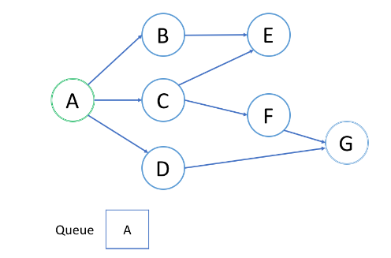

### 数据结构是什么

数据结构是计算机存储、组织数据的方式。数据结构由某一数据元素的集合和该集合中数据元素之间的关系组成。通常情况下，精心选择的数据结构可以带来更高的运行或者存储效率。

### 数据结构的分类

**按存储结构划分**：

- 顺序存储：把逻辑上相邻的元素储存到物理上也相邻的存储单元中。（一般用一维数组）
- 链式存储：元素不需要存储到相邻的位置，而是用附加的指针指示逻辑关系。
- 索引存储：在存储元素的同时建立附加的索引表。（关键码：地址）
- 哈希存储：根据元素的关键码通过哈希函数计算直接得到存储地址。

数据的顺序存储结构的特点是：借助元素在存储器中的相对位置来表示数据元素之间的逻辑关系；非顺序存储的特点是：借助指示元素存储地址的指针表示数据元素之间的逻辑关系。

**按逻辑结构划分**：

- 集合：元素之间除了“同属一个集合” 的相互关系外，别无其他关系
- 线性结构：数据结构中的元素存在一对一的相互关系
- 树形结构：数据结构中的元素存在一对多的相互关系
- 图形结构：数据结构中的元素存在多对多的相互关系

逻辑关系是指数据元素之间的前后间关系，而与他们在计算机中的存储位置无关。

### 数据结构的操作

数据结构研究的内容：就是如何按一定的逻辑结构，把数据组织起来，并选择适当的存储表示方法把逻辑结构组织好的数据存储到计算机的存储器里。算法研究的目的是为了更有效的处理数据，提高数据运算效率。数据的运算是定义在数据的逻辑结构上，但运算的具体实现要在存储结构上进行。一般有以下几种常用运算： 

- 插入。往数据结构中增加新的节点。
- 删除。把指定的结点从数据结构中去掉。 
- 更新。改变指定节点的一个或多个字段的值。 
- 查找。在数据结构里查找满足一定条件的节点。 
- 排序。把节点按某种指定的顺序重新排列，例如递增或递减。


### 数组 

数组用**索引**的数字来标识每项数据在数组中的位置，索引是从 `0` 算起的，我们可以根据索引快速访问数组中的元素。**数组中的元素在内存中是连续存储的**，且每个元素占用相同大小的内存。解决数组类的问题的方法：**双指针（左右指针、快慢指针）、前缀和、二分查找（排序数组）**等。

- 根据索引直接读取元素的时间复杂度为 O(1)。
- 在数组中查找某个元素的时间复杂度为 O(n)，因为需要逐个比对。
- 插入和删除元素的时间复杂度为 O(n)，因为需要将其他元素移动位置。

#### 排序数组的二分查找

题目描述：给定一个排序数组和一个目标值，在数组中找到目标值，并返回其索引。如果目标值不存在于数组中，返回它将会被按顺序插入的位置。

```java
int searchInsert(int[] nums, int target) {
    int begin = 0;
    int end = nums.length - 1;
    //当起始小于等于终止
    while (begin <= end) {
        int mid = (begin + end) / 2;
        if (nums[mid] == target) {
            return mid;
        } else if (nums[mid] > target) {
            end = mid - 1;
        } else {
            begin = mid + 1;
        }
    }
    return begin;
}
```

#### 双指针技巧

双指针包括**快慢指针**和**左右指针**。你想要从两端向中间迭代数组，可以使用左右指针。如果你希望同向但不同速度遍历数组或者处理**滑动窗口**问题可以使用快慢指针。
- [反转字符串](https://leetcode-cn.com/problems/reverse-string/)：将输入的字符串反转过来。

  ```java
  /**
  * 使用左右指针
  */
  public void reverseString(char[] s) {
      for (int i = 0, j = s.length - 1; i < j; i++, j--) {
          char c = s[i];
          s[i] = s[j];
          s[j] = c;
      }
  }
  ```

- [两数之和 II](https://leetcode-cn.com/problems/two-sum-ii-input-array-is-sorted/)：给定一个升序排序的有序数组，找到两个数使得它们相加之和等于目标数。

  ```java
  /**
  * 使用左右指针
  * 时间复杂度 o(n)
  */
  public static int[] twoSum(int[] numbers, int target) {
      int left = 0;
      int right = numbers.length - 1;
      while (left < right) {
          int sum = numbers[left] + numbers[right];
          if (sum == target) {
              return new int[]{left + 1, right + 1};
          } else if (sum > target) {
              right--;
          } else {
              left++;
          }
      }
      return new int[]{-1, -1};
  }
  ```

- [移除元素](https://leetcode-cn.com/problems/remove-element)：给你一个数组 *nums* 和一个值 *val*，你需要原地移除所有数值等于 *val* 的元素，并返回移除后数组的新长度。

  ```java
  /**
  * 使用快慢指针
  */
  public int removeElement(int[] nums, int val) {
      int len = nums.length;
      int slow = 0, fast = 0;
      while (fast < len) {
          if (nums[fast] != val) {
          	nums[slow++] = nums[fast];
          }
          fast++;
      }
      return slow;
  }
  ```

- [长度最小的子数组](https://leetcode-cn.com/problems/minimum-size-subarray-sum/)：给定一个含有 **n** 个正整数的数组和一个正整数 **s ，**找出该数组中满足其和 **≥ s** 的长度最小的子数组，并返回其长度**。**如果不存在符合条件的子数组，返回 0。

  ```java
  /**
   * 使用快慢指针（也叫滑动窗口）
   * 时间复杂度：O(n)，其中 n 是数组的长度。指针 start 和 end 最多各移动 n 次。
   * 空间复杂度：O(1)。
   */
  public static int minSubArrayLen3(int s, int[] nums) {
      //定义两个指针
      int start = 0, end = 0;
      int sum = 0;
      //最小数组长度
      int res = Integer.MAX_VALUE;
      while (end < nums.length) {
          sum += nums[end];
          //移除元素
          while (sum >= s) {
              res = Math.min(res, end - start + 1);
              sum -= nums[start++];
          }
          end++;
      }
      return res == Integer.MAX_VALUE ? 0 : res;
  }
  ```

#### 二维数组

二维数组的每个元素是一维数组，所以二维数组的本质上仍然是一个一维数组，内部的一维数组仍然从索引 `0` 开始，我们可以将它看作一个**矩阵**，并处理矩阵的相关问题。

实际应用中，往往使用二维数据处理矩阵类相关问题，包括**矩阵旋转**、**对角线遍历**以及对**子矩阵的操作**等。

- [旋转矩阵](https://leetcode-cn.com/problems/rotate-matrix-lcci/)：给你一幅由 `N × N` 矩阵表示的图像，将图像旋转 90 度。

  ```java
     /**
       * 先对角线翻转再左右翻转
       * 时间复杂度：O(N^2)，其中 N 是 matrix 的边长。
       * 空间复杂度：O(1)
       */
      public static void rotate2(int[][] matrix) {
          int len = matrix.length;
          //对角线翻转
          for (int i = 0; i < len; i++) {
              for (int j = 0; j < i; j++) {
                  int temp = matrix[i][j];
                  matrix[i][j] = matrix[j][i];
                  matrix[j][i] = temp;
              }
          }
          //左右翻转的轮次 ( >> 1 是除以二的意思)
          int mid = len >> 1;
          //左右翻转
          for (int i = 0; i < mid; i++) {
              for (int j = 0; j < len; j++) {
                  int temp = matrix[j][i];
                  matrix[j][i] = matrix[j][len - 1 - i];
                  matrix[j][len - 1 - i] = temp;
              }
          }
      }
  ```

- [零矩阵](https://leetcode-cn.com/problems/zero-matrix-lcci/)：若M × N矩阵中某个元素为0，则将其所在的行与列清零。

  ```java
  public static void setZeroes(int[][] matrix) {
          boolean[] line = new boolean[matrix.length];
          boolean[] column = new boolean[matrix[0].length];
  
          // 找出要清零的行列
          for (int i = 0; i < matrix.length; i++) {
              for (int j = 0; j < matrix[0].length; j++) {
                  if (matrix[i][j] == 0) {
                      line[i] = true;
                      column[j] = true;
                  }
              }
          }
          // 开始对行清零
          for (int i = 0; i < matrix.length; i++) {
              if (line[i]) {
                  for (int j = 0; j < matrix[0].length; j++) {
                      matrix[i][j] = 0;
                  }
              }
          }
          // 开始对列清零
          for (int i = 0; i < matrix[0].length; i++) {
              if (column[i]) {
                  for (int j = 0; j < matrix.length; j++) {
                      matrix[j][i] = 0;
                  }
              }
          }
      }
  ```

- [对角线遍历](https://leetcode-cn.com/problems/diagonal-traverse/)：给定一个含有 M x N 个元素的矩阵（M 行，N 列），请以对角线遍历的顺序返回这个矩阵中的所有元素。（遍历顺序为：左下到右上，右上到左下，以此类推）

  ```java
  /**
   * 根据规律变换坐标遍历二维数组
   * 时间复杂度：O(N⋅M)，每个元素只处理一次。
   * 空间复杂度：O(1)，不使用额外空间
   */
  public static int[] findDiagonalOrder(int[][] matrix) {
      //避免多余的循环
      if (matrix == null || matrix.length == 0) {
          return new int[0];
      }
      int m = matrix.length;
      int n = matrix[0].length;
  
      int size = m * n;
      int[] res = new int[size];
      //遍历的坐标
      int x = 0, y = 0;
      //true代表向右上角遍历，false代表向左下角遍历
      boolean flag = true;
      for (int i = 0; i < size; i++) {
          res[i] = matrix[x][y];
          //向右上角遍历
          if (flag) {
              x--;
              y++;
              //到了右边界
              if (y > n - 1) {
                  y = n - 1;
                  x += 2;
                  flag = false;
              }
              //到了上边界
              if (x < 0) {
                  x = 0;
                  flag = false;
              }
          } else {
              //向左下角遍历
              x++;
              y--;
              //到了下边界
              if (x > m - 1) {
                  x = m - 1;
                  y += 2;
                  flag = true;
              }
              //到了左边界
              if (y < 0) {
                  y = 0;
                  flag = true;
              }
          }
      }
      return res;
  }
  ```

### 字符串

字符串是由零个或多个字符组成的有限序列。一般记为 s = a1a2...an。它是编程语言中表示文本的数据类型。

- 字符串的基本操作对象通常是**字符串整体**或者**其子串**；
- 字符串操作一般有**比较**和**连接**；

#### KMP 算法

KMP 算法是一种改进的**字符串匹配**算法，其关键是利用匹配失败后的信息，尽量减少**模式串**与**主串**的匹配次数以达到**快速匹配**的目的。常用于在一个文本串 S 内查找一个模式串 P 的出现位置，KMP 算法的时间复杂度 O(m+n)，空间复杂度 O(n)。

```java
/**
 * KMP 匹配主方法
 * @param str     文本串
 * @param pattern 模式串
 * @return 模式串第一次出现的索引，如果没有匹配到返回 -1
 */
public static int match(String str, String pattern) {
    // 构造 next 表
    int[] next = buildNext(pattern);

    int m = str.length();
    int n = pattern.length();
    // i 和 j 分别是文本串和模式串的指针
    int i = 0, j = 0;
    while (j < n && i < m) {
        // 若匹配，或 pattern 已移除最左侧
        if (0 > j || str.charAt(i) == pattern.charAt(j)) {
            // 则转到下一字符
            i++;
            j++;
        } else {
            // 模式串回退 （文本串不用回退）
            j = next[j];
        }
    }
    //没能成功匹配到字符串
    if (j != n) return -1;
    return i - j;
}

/**
 * 构造模式串 p 的 next 表
 */
private static int[] buildNext(String p) {
    int m = p.length();
    int[] next = new int[m];
    // 模式串指针
    int t = next[0] = -1;
    // “主”串指针
    int j = 0;
    while (j < m - 1) {
        if (0 > t || p.charAt(j) == p.charAt(t)) {
            j++;
            t++;
            next[j] = (p.charAt(j) != p.charAt(t) ? t : next[t]);
        } else {
            // 失配
            t = next[t];
        }
    }
    return next;
}
```


### 队列

简单的说：**队列是一种先入先出（FIFO）的数据结构**，可以使用数组或者链表实现。


队列首先处理添加到队列中的**第一个元素**。通常，插入（insert）操作也称作入队（enqueue），新元素始终被添加在队列的末尾。 删除（delete）操作也被称为出队（dequeue)。 你只能移除第一个元素。

#### 循环队列

循环队列可以提高内存的利用率。具体来说，我们可以使用`固定大小的数组`和`两个指针`来指示起始位置和结束位置。实现一个循环队列：

使用一个`数组`和两个指针（`head` 和 `tail`）。 `head` 表示队列的起始位置，`tail` 表示队列的结束位置。注意：**判断队满的条件 ((tail + 1) % data.length) == head** 。

```java
class MyCircularQueue {
    //存储元素的数组
    private int[] data;
    //头索引
    private int head = -1;
    //尾索引
    private int tail = -1;

    public MyCircularQueue(int k) {
        data = new int[k];
    }

    public boolean enQueue(int value) {
        if (isFull()) {
            return false;
        }
        //空队列第一次添加元素
        if (isEmpty()) {
            head = 0;
        }
        tail = (tail + 1) % data.length;
        data[tail] = value;
        return true;
    }

    public boolean deQueue() {
        if (isEmpty()) {
            return false;
        }
        //如果头尾相接 -> 最后一个元素啦
        if (head == tail) {
            head = -1;
            tail = -1;
        } else {
            //循环队列的特性
            head = (head + 1) % data.length;
        }
        return true;
    }

    public int Front() {
        if (isEmpty()) {
            return -1;
        }
        return data[head];
    }

    public int Rear() {
        if (isEmpty()) {
            return -1;
        }
        return data[tail];
    }

    public boolean isEmpty() {
        return head == -1;
    }

    public boolean isFull() {
        return ((tail + 1) % data.length) == head;
    }
}
```

#### 优先级队列

优先队列可以快速得到队列中优先级最高的元素。一种高效的实现方式是使用**二叉堆**。


#### 队列和 BFS

广度优先搜索（BFS）的一个常见应用是找出从**根结点到目标结点的最短路径**。

示例：如何使用 BFS 来找出根结点 `A` 和目标结点 `G` 之间的最短路径？




**1. 结点的处理顺序是什么？**

首先将 A 加入队列。

第一轮：处理 A，并将 B C D 加入队列。

第二轮：顺序处理 B C D 并且将他们相邻的 E F G 加入队列。

第三轮：顺序处理 E F G，发现 G，**此时经过的处理轮次就是最短路径**。

如果在第 k 轮中将结点 `X` 添加到队列中，则根结点与 `X` 之间的最短路径的长度恰好是 `k`。也就是说，**第一次找到目标结点时，你已经处于最短路径中**。

**2. 队列的入队和出队顺序是什么？**

我们首先将根结点排入队列。然后在每一轮中，我们逐个处理已经在队列中的结点，并将所有邻居添加到队列中。值得注意的是，新添加的节点不会立即遍历，而是在下一轮中处理。

结点的处理顺序与它们添加到队列的顺序是完全相同的顺序，即先进先出（FIFO）。这就是我们在 BFS 中使用队列的原因。

##### BFS 的模板 I

```java
/**
 * Return the length of the shortest path between root and target node.
 */
int BFS(Node root, Node target) {
    Queue<Node> queue;  // store all nodes which are waiting to be processed
    int step = 0;       // number of steps neeeded from root to current node
    // initialize
    add root to queue;
    // BFS
    while (queue is not empty) {
        step = step + 1;
        // iterate the nodes which are already in the queue
        int size = queue.size();
        for (int i = 0; i < size; ++i) {
            Node cur = the first node in queue;
            return step if cur is target;
            for (Node next : the neighbors of cur) {
                add next to queue;
            }
            remove the first node from queue;
        }
    }
    return -1; // there is no path from root to target
}
```

- 如代码所示，在每一轮中，队列中的结点是`等待处理的结点`。
- 在每个更外一层的 `while` 循环之后，我们`距离根结点更远一步`。变量 `step` 指示从根结点到我们正在访问的当前结点的距离。

##### BFS 的模板 II

有时，确保我们**永远不会访问一个结点两次**很重要。否则，我们可能陷入无限循环。如果是这样，我们可以在上面的代码中添加一个哈希集来解决这个问题。这是修改后的伪代码：

```java
/**
 * Return the length of the shortest path between root and target node.
 */
int BFS(Node root, Node target) {
    Queue<Node> queue;  // store all nodes which are waiting to be processed
    Set<Node> used;     // store all the used nodes
    int step = 0;       // number of steps neeeded from root to current node
    // initialize
    add root to queue;
    add root to used;
    // BFS
    while (queue is not empty) {
        // iterate the nodes which are already in the queue
        int size = queue.size();
        for (int i = 0; i < size; ++i) {
            Node cur = queue.poll();
            return step if cur is target;
            for (Node next : the neighbors of cur) {
                if (next is not in used) {
                    add next to queue;
                    add next to used;
                }
            }
            step++；// 在这里更新步数
        }
    }
    return -1; // there is no path from root to target
}
```

有两种情况你不需要使用哈希集：

- 你完全确定没有循环，例如，在树遍历中；
- 你确实希望多次将结点添加到队列中。


### 栈

简单的说：**栈是一种后进先出（LIFO）的数据结构**，可以使用数组或链表实现。


栈首先处理添加到其中的**最新元素**。通常，插入操作在栈中被称作入栈 `push` 。与队列类似，总是在堆栈的末尾添加一个新元素。但是，删除操作，退栈 `pop` ，将始终删除堆栈中相对于它的最后一个元素。

#### 最小栈

设计一个支持 `push` ，`pop` ，`top` 操作，并能在**常数时间**内检索到最小元素的栈。

- `push(x)` —— 将元素 x 推入栈中。
- `pop()` —— 删除栈顶的元素。
- `top()` —— 获取栈顶元素。
- `getMin()` —— 检索栈中的最小元素。

###### 使用数组实现

```java
class MinStack {

    private Stack<Integer> stack;
    //使用一个变量存储最小的元素
    private int min = Integer.MAX_VALUE;

    public MinStack() {
        stack = new Stack<>();
    }
    //加入元素
    public void push(int x) {
        //如果新加入的元素 <= min
        //将原来的 min 也一起加入栈中
        if (x <= min) {
            stack.push(min);
            min = x;
        }
        stack.push(x);
    }
    //弹出栈顶元素
    public void pop() {
        //如果获取的是最小的元素
        //那么还需要再弹出一次恢复原样
        if (stack.pop() == min) {
            min = stack.pop();
        }
    }
    //获取栈顶元素
    public int top() {
        return stack.peek();
    }
    //获取栈中最小的元素
    public int getMin() {
        return min;
    }
}
```

###### 使用链表实现

```java
class Min_Stack {
    private Node head;
    public Min_Stack() {
    }
    public void push(int x) {
        if (head == null) {
            head = new Node(x, x);
        } else {
            head = new Node(x, Math.min(x, head.min), head);
        }
    }
    public void pop() {
        head = head.next;
    }
    public int top() {
        return head.val;
    }
    public int getMin() {
        return head.min;
    }
	//结点 内部类
    private class Node {
        int val;
        int min;
        Node next;
        private Node(int val, int min) {
            this(val, min, null);
        }
        private Node(int val, int min, Node next) {
            this.val = val;
            this.min = min;
            this.next = next;
        }
    }
}
```

#### 单调栈

单调栈即栈内的元素的是有序的，可以递增也可以递减。可以以 **O(1)** 的时间复杂度得知某个位置左右两侧比他大（或小）的数的位置，当你需要高效率获取某个位置左右两侧比他大（或小）的数的位置的的时候就可以用到单调栈。（**单调栈一般用于存储数组的下标**）

模板：

```java
for (遍历这个数组) {
while (栈不为空 && 栈顶元素小于当前元素) {
栈顶元素出栈;
更新结果;
}
当前元素入栈;
}
```

#### 栈和 DFS

与 BFS 类似，深度优先搜索（DFS）也可用于查找从根结点到目标结点的路径。


**1. 结点的处理顺序是什么？**

我们从根结点 `A` 开始。首先，我们选择结点 `B` 的路径，并进行回溯，直到我们到达结点 `E`，我们无法更进一步深入。然后我们回溯到 `A` 并选择第二条路径到结点 `C` 。从 `C` 开始，我们尝试第一条路径到 `E` 但是 `E` 已被访问过。所以我们回到 `C` 并尝试从另一条路径到 `F`。最后，我们找到了 `G`。总的来说，**在我们到达最深的结点之后，我们只会回溯并尝试另一条路径**。

因此，你在 DFS 中找到的**第一条路径并不总是最短的路径**。例如，在上面的例子中，我们成功找出了路径 `A-> C-> F-> G` 并停止了 DFS。但这不是从 `A` 到 `G` 的最短路径。

**2. 栈的入栈和退栈顺序是什么？**

我们首先将根结点推入到栈中；然后我们尝试第一个邻居 `B` 并将结点 `B` 推入到栈中。当我们到达最深的结点 `E` 时，我们需要回溯。当我们回溯时，我们将从栈中弹出最深的结点，这实际上是推入到栈中的最后一个结点。

结点的处理顺序是`完全相反的顺序`，就像它们被`添加`到栈中一样，它是后进先出（LIFO）。这就是我们在 DFS 中使用栈的原因。

在大多数情况下，我们在能使用 BFS 时也可以使用 DFS。但是有一个重要的区别：**遍历顺序**。

##### 模板 I：隐式栈递归

递归解决方案的优点是它更容易实现。 但是，存在一个很大的缺点：如果递归的深度太高，你将遭受堆栈溢出，并且递归的效率很低。

```java
/*
 * Return true if there is a path from cur to target.
 */
boolean DFS(Node cur, Node target, Set<Node> visited) {
    return true if cur is target;
    for (next : each neighbor of cur) {
        if (next is not in visited) {
            add next to visted;
            return true if DFS(next, target, visited) == true;
        }
    }
    return false;
}
```

当我们递归地实现 DFS 时，似乎不需要使用任何栈。但实际上，我们使用的是由系统提供的隐式栈，也称为调用栈（Call Stack）。

##### 模板 II：显式栈

该逻辑与递归解决方案完全相同。 但我们**使用 `while` 循环和栈来模拟递归期间的系统调用栈**。

```java
/*
 * Return true if there is a path from cur to target.
 */
boolean DFS(Node root, Node target) {
    Set<Node> visited;
    Stack<Node> s;
    add root to s;
    add root to visited;
    while (s is not empty) {
        Node cur = pop element from s;
        return true if cur is target;
        for (Node next : the neighbors of cur) {
            if (next is not in visited) {
                add next to s;
                add next to visited;
            }
        }
    }
    return false;
}
```


### 链表

链表是一种线性数据结构，它通过引用字段将所有分离的元素链接在一起。有两种常用的链表：**单链表**和**双链表**。

使用链表的技巧：伪头伪尾指针、快慢指针。

#### 单链表

单链表中的每个结点不仅包含**值**，还包含链接到下一个结点的**引用字段**。通过这种方式，单链表将所有结点按顺序组织起来。在大多数情况下，我们将使用**第一个结点**来表示整个列表。

结点结构：

```java
class Node {
    int val;
    Node next;
    Node(int x) { val = x; }
}
```

与数组不同，我们无法在常量时间内访问单链表中的随机元素。 如果我们想要获得第 i 个元素，我们必须从头结点逐个遍历。 我们按索引来访问元素平均要花费 `O(N) `时间，其中 N 是链表的长度。

#### 双链表

它的每个结点中都有**两个指针**，分别指向**直接后继**和**直接前驱**。所以，从双向链表中的任意一个结点开始，都可以很方便地访问它的前驱结点和后继结点。

结点结构：

```java
class Node {
    int val;
    Node next;
    Node prev;
    Node(int x) { val = x; }
}
```

[LeetCode 707. 设计链表](https://leetcode-cn.com/problems/design-linked-list/) 这道题的可以使用单链表或双链表实现。

单链表实现：

```java
/**
 * 单链表实现 使用哨兵结点充当伪头
 * 时间复杂度：
 * addAtHead： O(1)
 * addAtIndex，get，deleteAtIndex: O(k)，其中 k 指的是元素的索引。
 * addAtTail：O(N)，其中 N 指的是链表的元素个数。
 * 空间复杂度：所有的操作都是 O(1)。
 */
class MyLinkedList {

    private class ListNode {
        int val;
        ListNode next;
        ListNode(int x) { val = x; }
    }

    private int size;
    // 哨兵结点做伪头
    private ListNode head;

    public MyLinkedList() {
        size = 0;
        head = new ListNode(0);
    }

    public int get(int index) {
        if (index < 0 || index >= size) return -1;

        ListNode curr = head;
        for(int i = 0; i < index + 1; ++i)
            curr = curr.next;

        return curr.val;
    }

    public void addAtHead(int val) {
        addAtIndex(0, val);
    }

    public void addAtTail(int val) {
        addAtIndex(size, val);
    }

    public void addAtIndex(int index, int val) {
        if (index > size) return;
        if (index < 0) index = 0;

        ++size;
        ListNode pred = head;
        for(int i = 0; i < index; ++i)
            pred = pred.next;
        
        ListNode toAdd = new ListNode(val);
        toAdd.next = pred.next;
        pred.next = toAdd;
    }

    public void deleteAtIndex(int index) {
        if (index < 0 || index >= size) return;
        size--;
        ListNode pred = head;
        for(int i = 0; i < index; ++i)
            pred = pred.next;
        pred.next = pred.next.next;
    }
}
```

双链表实现：

```java
/**
 * 双链表实现 使用哨兵结点充当伪头和伪尾
 * 时间复杂度：
 * addAtHead，addAtTail： O(1)
 * get，addAtIndex，delete：O(min(k,N−k))，其中 k 指的是元素的索引。
 * 空间复杂度：所有的操作都是 O(1)。
 *
 */
class MyLinkedList {

    private class ListNode {
        int val;
        ListNode next;
        ListNode prev;
        ListNode(int x) { val = x; }
    }

    private int size;
    // 使用哨兵结点充当伪头和伪尾
    private ListNode head, tail;

    public MyLinkedList() {
        size = 0;
        head = new ListNode(0);
        tail = new ListNode(0);
        head.next = tail;
        tail.prev = head;
    }

    public int get(int index) {
        if (index < 0 || index >= size) return -1;

        ListNode curr = head;
        if (index + 1 < size - index)
            for(int i = 0; i < index + 1; ++i)
                curr = curr.next;
        else {
            curr = tail;
            for(int i = 0; i < size - index; ++i)
                curr = curr.prev;
        }
        return curr.val;
    }

    public void addAtHead(int val) {
        ListNode pred = head, succ = head.next;
        ++size;
        ListNode toAdd = new ListNode(val);
        //需要将四个引用重新连上
        toAdd.prev = pred;
        toAdd.next = succ;
        pred.next = toAdd;
        succ.prev = toAdd;
    }

    public void addAtTail(int val) {
        ListNode succ = tail, pred = tail.prev;
        ++size;
        ListNode toAdd = new ListNode(val);
        //需要将四个引用重新连上
        toAdd.prev = pred;
        toAdd.next = succ;
        pred.next = toAdd;
        succ.prev = toAdd;
    }

    public void addAtIndex(int index, int val) {
        if (index > size) return;
        if (index < 0) index = 0;

        ListNode pred, succ;
        if (index < size - index) {
            pred = head;
            for(int i = 0; i < index; ++i)
                pred = pred.next;
            succ = pred.next;
        } else {
            succ = tail;
            for (int i = 0; i < size - index; ++i)
                succ = succ.prev;
            pred = succ.prev;
        }

        ++size;
        ListNode toAdd = new ListNode(val);
        toAdd.prev = pred;
        toAdd.next = succ;
        pred.next = toAdd;
        succ.prev = toAdd;
    }

    public void deleteAtIndex(int index) {
        if (index < 0 || index >= size) return;
        ListNode pred, succ;
        if (index < size - index) {
            pred = head;
            for(int i = 0; i < index; ++i)
                pred = pred.next;
            succ = pred.next.next;
        } else {
            succ = tail;
            for (int i = 0; i < size - index - 1; ++i)
                succ = succ.prev;
            pred = succ.prev.prev;
        }
        --size;
        pred.next = succ;
        succ.prev = pred;
    }
}
```

#### 链表中的双指针

双指针可以分为**快慢指针**（一般是链表）和**左右指针**（一般是数组）两种。

##### 快慢指针

快慢指针顾名思义就是有两个指针，一个跑的快一点，一个跑的慢一点。

快慢指针模板：

```java
ListNode slow = head;
ListNode fast = head;
while (slow != null && fast != null && fast.next != null) {
    slow = slow.next;           // move slow pointer one step each time
    fast = fast.next.next;      // move fast pointer two steps each time
    if (slow == fast) {         // change this condition to fit specific problem
        return true;
    }
}
return false;   // change return value to fit specific problem
```

注意：

- 在调用 next 字段之前，始终检查节点是否为空，例如，在我们运行 `fast = fast.next.next` 之前，需要检查 `fast` 和 `fast.next` 不为空。

- 仔细定义循环的结束条件，运行几个示例，以确保你的结束条件不会导致无限循环。

快慢指针应用：

- 判断链表中是否有环

  一个安全的选择是每次移动慢指针一步，而移动快指针两步。每一次迭代，快速指针将额外移动一步。如果环的长度为 *M*，经过 *M* 次迭代后，快指针肯定会多绕环一周，并赶上慢指针。

  ```java
  boolean hasCycle(ListNode head) {
      ListNode fast = head, slow = head;
      while(fast != null && fast.next != null) {
          fast = fast.next.next;
          slow = slow.next;
          if (fast == slow)
              return true;
      }
      return false;
  }
  ```

- 已知链表中含有环，返回这个环的起始位置

  ```java
  ListNode detectCycle(ListNode head) {
      ListNode fast = head, slow = head;
      while (fast != null && fast.next != null) {
          fast = fast.next.next;
          slow = slow.next;
          if (fast == slow)//此时已经在环内的某个结点
              break;
      }
      slow = head;
      //以相同的速度走到再次相遇时 就是环的起点
      while (slow != fast) {
          fast = fast.next;
          slow = slow.next;
      }
      return slow;
  }
  ```

- 寻找链表的中点

  ```java
  ListNode middle(ListNode head) {
      ListNode slow = head, fast = head;
      while (fast != null && fast.next != null) {
          fast = fast.next.next;
          slow = slow.next;
      }
      // slow 就在中间位置
      return slow;
  }
  ```

  当链表的长度是奇数时，slow 恰巧停在中点位置；如果长度是偶数，slow 最终的位置是中间偏右位置。

- 寻找链表的倒数第 k 个结点

  ```java
  ListNode get(ListNode head, int k) {
      ListNode slow = head, fast = head;
      while (k-- > 0) 
          fast = fast.next;
      while (fast != null) {
          slow = slow.next;
          fast = fast.next;
      }
      return slow;
  }
  ```

  让快指针先走 k 步，然后快慢指针开始同速前进。这样当快指针走到链表末尾 null 时，慢指针所在的位置就是倒数第 k 个链表节点。

### 哈希表

哈希表是一种使用**哈希函数**组织数据，以支持**快速插入和搜索**的数据结构。（缺点：需要较多的空间，属于一种用空间换时间的做法）。

有两种不同类型的哈希表：哈希集合和哈希映射。

- 哈希集合是**集合**数据结构的实现之一，用于存储**非重复值**。（Java 的 HashSet）
- 哈希映射是**映射**数据结构的实现之一，用于存储`(key, value)`键值对。（Java 的 HashMap）

#### 设计哈希表

哈希表的原理：使用哈希函数**将键映射到存储桶**。

- 当我们插入一个新的键时，哈希函数将决定该键应该分配到哪个桶中，并将该键存储在相应的桶中；
- 当我们想要搜索一个键时，哈希表将使用相同的哈希函数来查找对应的桶，并只在特定的桶中进行搜索。

 设计哈希表的关键：

- **哈希函数**，它是哈希表中最重要的组件，用于将键映射到特定的桶。散列函数将取决于**键值的范围和桶的数量**。

  哈希函数的设计是一个开放的问题。其思想是尽可能将键均匀分配到桶中，理想情况下，完美的哈希函数将是键和桶之间的一对一映射。然而，在大多数情况下，哈希函数并不完美，它需要在桶的数量和桶的容量之间进行权衡。

- **解决冲突**，当两个以前的键使用哈希函数计算出的值相等时，就产生了冲突，于是，我们必须解决哈希值相同时如何找到准确的目标值。

  **拉链法**：把具有相同哈希值的键放在同一个单链表中，称为同义词链表。（Java 的 HashMap 就是使用这种方法）。

#### 哈希集合
一般判断是否存在重复的值。

- [两个数组的交集](https://leetcode-cn.com/problems/intersection-of-two-arrays/)：给定两个数组，编写一个函数来计算它们的交集。

  ```java
  /**
   * 使用两个 Set 去重
   * 时间复杂度：O(m+n)，其中 n 和 m 是数组的长度。
   * 将 nums1 转换为集合需要 O(n) 的时间，类似地，将 nums2 转换为集合需要 O(m) 的时间。
   * 而在平均情况下，集合的 in/contains 操作只需要 O(1) 的时间。
   * 空间复杂度：O(m+n)，最坏的情况是数组中的所有元素都不同。
   */
  public int[] intersection(int[] nums1, int[] nums2) {
      Set<Integer> set = new HashSet<>();
      Set<Integer> res = new HashSet<>();
      for (int num : nums1) {
          set.add(num);
      }
      for (int num : nums2) {
          if (set.contains(num)) {
              res.add(num);
          }
      }
      int[] ints = new int[res.size()];
      int i = 0;
      for (Integer integer : res) {
          ints[i++] = integer;
      }
      return ints;
  }
  ```

- [快乐数](https://leetcode-cn.com/problems/happy-number/)：编写一个算法来判断一个数 `n` 是不是快乐数。

  ```java
  /**
   * 解法一：用 HashSet 检测循环 非递归求解
   * 时间复杂度：O(logn)
   * 空间复杂度：O(logn)
   */
  public boolean isHappy2(int n) {
      Set<Integer> seen = new HashSet<>();
      while (n != 1 && !seen.contains(n)) {
          seen.add(n);
          n = nextSum(n);
      }
      return n == 1;
  }
  
  /**
   * 解法二：快慢指针法
   * 不快乐的数一定会形成死循环 快慢指针可以检测是否存在循环
   * 时间复杂度：O(logn)
   * 空间复杂度：O(1)
   */
  public boolean isHappy3(int n) {
      int slow = n;
      int fast = nextSum(n);
      while (fast != 1 && fast != slow) {
          slow = nextSum(slow);
          fast = nextSum(nextSum(fast));
      }
      return fast == 1;
  }
  
  private int nextSum(int n) {
      int sum = 0;
      while (n > 0) {
          int d = n % 10;
          sum += d * d;
          n /= 10;
      }
      return sum;
  }
  ```

#### 哈希映射

- [同构字符串](https://leetcode-cn.com/problems/isomorphic-strings/)

  ```java
  /**
   * 使用 HashMap 建立映射
   */
  public boolean isIsomorphic(String s, String t) {
      //关于 s -> t 的映射
      HashMap<Character, Character> map = new HashMap<>();
      for (int i = 0; i < s.length(); i++) {
          char sc = s.charAt(i);
          char tc = t.charAt(i);
          //保证 s 中当前元素未建立映射
          if (map.get(sc) == null) {
              //保证 t 中当前元素未建立映射
              if (map.containsValue(tc)) {
                  return false;
              }
              //建立 s 中当前元素与 t 中当前元素一一映射关系
              map.put(sc, tc);
          } else if (map.get(sc) != tc) {
              return false;
          }
      }
      return true;
  }
  ```

- [两个列表的最小索引总和](https://leetcode-cn.com/problems/minimum-index-sum-of-two-lists/)

  ```java
  /**
   * 解法一：使用 HashMap 记录餐厅和索引
   */
  public String[] findRestaurant(String[] list1, String[] list2) {
      //保证使用最小的空间
      if (list1.length > list2.length) {
          return findRestaurant(list2, list1);
      }
      //避免重复计算
      int m = list1.length;
      int n = list2.length;
      // 定义 HashMap 时指定初始容量 避免 rehash
      Map<String, Integer> map = new HashMap<>((int)(list1.length/0.75));
      for (int i = 0; i < m; i++) {
          map.put(list1[i], i);
      }
      int min = Integer.MAX_VALUE;
      // 定义时指定列表的大小 避免频繁的扩容
      List<String> list = new ArrayList<>(map.size());
      for (int j = 0; j < n; j++) {
          Integer i;//提前定义变量，减少操作
          if ((i = map.get(list2[j])) != null) {
              if (i + j < min) {
                  list.clear();
                  min = i + j;
                  list.add(list2[j]);
              } else if (i + j == min) {
                  list.add(list2[j]);
              }
          }
      }
      return list.toArray(new String[0]);
  }
  ```

#### 设计键

通常键的选择相对简单，有时你必须考虑在使用哈希表时**设计合适的键**。

- [字母异位词分组](https://leetcode-cn.com/problems/group-anagrams/)：给定一个字符串数组，将字母异位词组合在一起。字母异位词指字母相同，但排列不同的字符串。

  ```java
  /**
   * 解法一：将字符串按字符排序 返回值作为 HashMap 的键
   */
  public List<List<String>> groupAnagrams(String[] strs) {
      Map<String, List<String>> map = new HashMap<>();
      for (String str : strs) {
          //对字符串按字符进行排序 返回值做键
          String key = sortStr(str);
          List<String> list;
          if ((list = map.get(key)) == null) {
              list = new ArrayList<>();
              map.put(key, list);
          }
          //不需要重新 put 已经存在的 list （引用传递）
          list.add(str);
      }
      return new ArrayList<>(map.values());
  }
  
  private String sortStr(String str) {
      char[] chars = str.toCharArray();
      Arrays.sort(chars);
      return new String(chars);
  }
  
  /**
   * 小写字母 ACSII 码 - 97 以后和质数的对应规则
   */
  private int[] primes = {
          2, 3, 5, 7, 11, 13, 17, 19, 23, 29,
          31, 37, 41, 43, 47, 53, 59, 61, 67,
          71, 73, 79, 83, 89, 97, 101};
  /**
   * 解法二：自定义字符串的哈希规则，使用质数作为乘法因子
   */
  public List<List<String>> groupAnagrams2(String[] strs) {
      Map<Integer, List<String>> map = new HashMap<>();
      // key 是字符串自定义规则下的哈希值
      for (String str : strs) {
          int hashValue = 1;
          char[] charArray = str.toCharArray();
          for (char c : charArray) {
              hashValue *= primes[c - 'a'];
          }
          //提前定义变量可以减少操作
          List<String> list;
          if ((list = map.get(hashValue)) == null) {
              list = new ArrayList<>();
              map.put(hashValue, list);
          }
          //不需要重新 put 已经存在的 list （引用传递）
          list.add(str);
      }
      return new ArrayList<>(map.values());
  }
  ```

- [寻找重复的子树](https://leetcode-cn.com/problems/find-duplicate-subtrees/)：给定一棵二叉树，返回所有重复的子树。对于同一类的重复子树，你只需要返回其中任意**一棵**的根结点即可。

  ```java
  /**
   * 前序遍历 在递归的最里层开始将出现的节点加入 HashMap 中
   */
  public static List<TreeNode> findDuplicateSubtrees(TreeNode root) {
      Map<String, Integer> map = new HashMap<>();
      List<TreeNode> list = new ArrayList<>();
  
      findDuplicateSubtrees(root, map, list);
      return list;
  }
  
  private static String findDuplicateSubtrees(TreeNode root, Map<String, Integer> map, List<TreeNode> list) {
      StringBuilder sb = new StringBuilder();
      sb.append("#");
      if (root == null)
          return sb.toString();
  
      sb.append(root.val)
              .append(findDuplicateSubtrees(root.left, map, list))
              .append(findDuplicateSubtrees(root.right, map, list));
  
      String key = sb.toString();
      Integer val = map.get(key);
      //对已经出现一次的加入返回列表中
      if ( val != null && val == 1) {
          list.add(root);
      }
      //对出现的次数累加
      map.merge(key, 1, (a, b) -> a + b);
      return key;
  }
  ```

### 树

树由 n（n>=0）个有限结点组成一个具有层次关系的数据结构。**从图的观点来看，树也可视为一个拥有 n 个节点和 n-1 条边的一个有向无环图**。把它叫做“树”是因为它看起来像一棵倒挂的树，也就是说它是根朝上，而叶朝下的。它具有以下的特点：

- 每个结点有零个或多个子结点；
- 没有父结点的结点称为根结点；
- 每一个非根结点有且只有一个父结点；
- 除了根结点外，每个子结点可以分为多个不相交的子树；

树的术语：

- 结点：包含一个数据元素及若干指向子树分支的信息。
- 结点的度：一个结点拥有子树的数目称为结点的度。
- 叶子结点：也称为终端结点，没有子树的结点或者度为零的结点。
- 分支结点：也称为非终端结点，度不为零的结点称为非终端结点。
- 树的度：树中所有结点的度的最大值。
- 结点的层次：从根结点开始，假设根结点为第 1 层，根结点的孩子结点为第 2 层，依此类推，如果某一个结点位于第 L 层，则其孩子结点位于第 L+1 层。
- 树的深度：也称为树的高度，树中所有结点的层次最大值称为树的深度。
- 有序树：如果树中各棵子树的次序是有先后次序，则称该树为有序树。
- 无序树：如果树中各棵子树的次序没有先后次序，则称该树为无序树。
- 森林：由 m（m≥0）棵互不相交的树构成一片森林。如果把一棵非空的树的根结点删除，则该树就变成了一片森林，森林中的树由原来根结点的各棵子树构成 。

#### 二叉树

每个结点至多拥有两棵子树（即二叉树中不存在度大于 2 的结点)，并且，二叉树的子树有左右之分，其次序不能任意颠倒。二叉树的性质：

- 若二叉树的层次从 1 开始，则在二叉树的第 i 层至多有 2^i-1^ 个结点（i>=1）；
- 深度为 k 的二叉树最多有 2^k^ - 1 个结点 (k>=1) (空树的深度不存在)；
- 对任何一棵二叉树，如果其叶子结点（度为 0）数为`m`, 度为 2 的结点数为 n , 则 m = n + 1；

**满二叉树**：如果一棵二叉树只有度为 0 的结点和度为 2 的结点，并且度为 0 的结点在同一层上，则这棵二叉树为满二叉树。深度为 k 的满二叉树有 2^k^ -1 个结点 (k>=1)（空树的深度不存在）。

**完全二叉树**：一棵深度为 k 的有 n 个结点的二叉树，对树中的结点按从上至下、从左到右的顺序进行编号，如果编号为 i（1≤i≤n）的结点与满二叉树中编号为 i 的结点在二叉树中的位置相同，则这棵二叉树称为完全二叉树。

运用递归解决树的问题：

- [二叉树的最大深度](https://leetcode-cn.com/problems/maximum-depth-of-binary-tree/)：二叉树的深度为根节点到最远叶子节点的最长路径上的节点数。

  ```java
  /**
   * 解法一：自底向上 递归
   */
  public static int maxDepth(TreeNode root) {
      if (root == null) return 0;
      int i = maxDepth(root.left);
      int j = maxDepth(root.right);
      return Math.max(i, j) + 1;
  }
  
  /**
   * 解法二：自顶向下 递归
   */
  private static int maxDepth = 0;
  public static int maxDepth2(TreeNode root) {
      if (root == null) return 0;
      maxDepth2(root,maxDepth+1);
      return maxDepth;
  }
  
  private static void maxDepth2(TreeNode root, int depth) {
      if (root == null) return;
      if (root.left == null && root.right == null) {
          maxDepth = Math.max(maxDepth, depth);
      }
      maxDepth2(root.left, depth + 1);
      maxDepth2(root.right, depth + 1);
  }
  ```

- [对称二叉树](https://leetcode-cn.com/problems/symmetric-tree/)：给定一个二叉树，检查它是否是镜像对称的。

  ```java
  /**
   * 解法一：递归
   */
  public static boolean isSymmetric(TreeNode root) {
      if (root == null) return true;
      return isSymmetric(root.left,root.right);
  }
  
  private static boolean isSymmetric(TreeNode left, TreeNode right) {
      if (left == null && right == null) {
          return true;
      }
      // 此时左右子树都不能为空
      if (left == null || right == null || left.val != right.val) {
          return false;
      }
      return isSymmetric(left.left,right.right) && isSymmetric(left.right,right.left);
  }
  
  /**
   * 解法二使用 队列 迭代
   */
  public static boolean isSymmetric2(TreeNode root) {
      if(root==null || (root.left==null && root.right==null)) {
          return true;
      }
      //用队列保存节点
      LinkedList<TreeNode> queue = new LinkedList<>();
      //将根节点的左右孩子放到队列中
      queue.add(root.left);
      queue.add(root.right);
      while(queue.size()>0) {
          //从队列中取出两个节点，再比较这两个节点
          TreeNode left = queue.removeFirst();
          TreeNode right = queue.removeFirst();
          //如果两个节点都为空就继续循环，两者有一个为空就返回false
          if(left==null && right==null) {
              continue;
          }
          // 此时左右子树都不能为空
          if(left==null || right==null) {
              return false;
          }
          if(left.val!=right.val) {
              return false;
          }
          //将左节点的左孩子， 右节点的右孩子放入队列
          queue.add(left.left);
          queue.add(right.right);
          //将左节点的右孩子，右节点的左孩子放入队列
          queue.add(left.right);
          queue.add(right.left);
      }
      return true;
  }
  ```

- [路径总和](https://leetcode-cn.com/problems/path-sum/)：给定一个二叉树和一个目标和，判断该树中是否存在根节点到叶子节点的路径，这条路径上所有节点值相加等于目标和。

  ```java
  /**
   * 解法一：递归
   */
  public static boolean hasPathSum(TreeNode root, int sum) {
      if (root == null) {
          return false;
      }
      if (root.left == null && root.right == null) {
          return sum == root.val;
      }
      // 有结果了快速返回 加快速度
      boolean b = hasPathSum(root.left, sum - root.val);
      if (b) {
          return true;
      }
      return hasPathSum(root.right, sum - root.val);
  }
  ```


#### 二叉树的遍历 ####

遍历是对树的一种最基本的运算，所谓遍历二叉树，就是按一定的规则和顺序走遍二叉树的所有结点，使每一个结点都被访问一次，而且只被访问一次。由于二叉树是非线性结构，因此，树的遍历实质上是将二叉树的各个结点转换成为一个线性序列来表示。

以这棵二叉树为例子讲述遍历过程：


- [前序遍历](https://leetcode-cn.com/problems/binary-tree-preorder-traversal/)：首先访问根节点，然后遍历左子树，最后遍历右子树。

  遍历结果：1->2->4->5->3->6->7

  ```java
  /**
   * 解法一：递归实现前序遍历
   */
  public static List<Integer> preorderTraversal(TreeNode root) {
      // 因为不需要查询，使用 LinkedList 更佳
      List<Integer> list = new LinkedList<>();
      preorderTraversal(root, list);
      return list;
  }
  
  private static void preorderTraversal(TreeNode root, List<Integer> list) {
      if (root == null) return;
      list.add(root.val);
      preorderTraversal(root.left, list);
      preorderTraversal(root.right, list);
  }
  
  /**
   * 解法二：使用 栈 迭代实现前序遍历
   * 时间复杂度：访问每个节点恰好一次，时间复杂度为 O(N) ，其中 N 是节点的个数，也就是树的大小。
   * 空间复杂度：取决于树的结构，最坏情况存储整棵树，因此空间复杂度是 O(N)。
   */
  public static List<Integer> preorderTraversal2(TreeNode root) {
      // 因为不需要查询，使用 LinkedList 更佳
      List<Integer> list = new LinkedList<>();
      if (root == null) {
          return list;
      }
      //临时存储树的结点
      Deque<TreeNode> stack = new LinkedList<>();
      stack.push(root);
      while (!stack.isEmpty()) {
          TreeNode node = stack.pop();
          list.add(node.val);
          if (node.right != null) {
              stack.push(node.right );
          }
          if (node.left != null) {
              stack.push(node.left );
          }
      }
      return list;
  }
  
  /**
   * 解法三：莫里斯 Morris 算法实现前序遍历
   *
   * 假设当前节点为 cur，并且开始时赋值为根节点 root。
   * 1. 判断 cur 节点是否为空
   * 2. 如果不为空
   * 2.1 如果 cur 没有左孩子，cur 向右更新，即（cur = cur.right）
   * 2.2 如果 cur 有左孩子，则从左子树找到最右侧节点 pre
   * 2.2.1 如果 pre 的右孩子为空，则将右孩子指向 cur。pre.right = cur
   * 2.2.2 如果 pre 的右孩子为 cur，则将其指向为空。pre.right = null。（还原树结构）
   * 3. cur 为空时，停止遍历
   *
   * 时间复杂度： O(N)。
   * 空间复杂度： O(1)。
   */
  public static List<Integer> preorderTraversal3(TreeNode root) {
      // 因为不需要查询，使用 LinkedList 更佳
      List<Integer> list = new LinkedList<>();
      TreeNode cur = root;
      while (cur != null) {
          if (cur.left == null) {
              // 获取根节点的值
              list.add(cur.val);
              cur = cur.right;
          } else {
              // 查找前驱结点
              TreeNode pred = cur.left;
              while (pred.right != null && pred.right != cur) {
                  pred = pred.right;
              }
              // 第一次到达左子树的最右端 将前驱结点的右节点赋值为当前结点
              if (pred.right == null) {
                  list.add(cur.val);
                  pred.right = cur;
                  cur = cur.left;
              } else {
                  // 第二次到达左子树的最右端 还原树结构
                  pred.right = null;
                  cur = cur.right;
              }
          }
      }
      return list;
  }
  ```

- [中序遍历](https://leetcode-cn.com/problems/binary-tree-inorder-traversal/)：先遍历左子树，然后访问根节点，然后遍历右子树。

  遍历结果：4->2->5->1->6->3->7

  对于二叉搜索树，中序遍历将得到一个递增的有序序列。

  ```java
  /**
   * 使用 栈 迭代实现中序遍历
   */
  public static List<Integer> inorderTraversal2(TreeNode root) {
      List<Integer> list = new LinkedList<>();
      //存储节点的栈
      Deque<TreeNode> stack = new LinkedList<>();
      TreeNode cur = root;
      while (cur != null || !stack.isEmpty()) {
          while (cur != null) {
              stack.push(cur);
              cur = cur.left;
          }
          cur = stack.pop();
          list.add(cur.val);
          cur = cur.right;
      }
      return list;
  }
  
  /**
   * 莫里斯 Morris 算法实现中序遍历
   * 时间复杂度： O(N)。
   * 空间复杂度： O(1)。
   */
  public static List<Integer> inorderTraversal3(TreeNode root) {
      // 因为不需要查询，使用 LinkedList 更佳
      List<Integer> list = new LinkedList<>();
      TreeNode cur = root;
      while (cur != null) {
          if (cur.left == null) {
              // 获取根节点的值
              list.add(cur.val);
              cur = cur.right;
          } else {
              // 查找前驱结点
              TreeNode pred = cur.left;
              while (pred.right != null && pred.right != cur) {
                  pred = pred.right;
              }
              // 第一次到达左子树的最右端 将前驱结点的右节点赋值为当前结点
              if (pred.right == null) {
                  pred.right = cur;
                  cur = cur.left;
              } else {
                  // 第二次到达左子树的最右端 还原树结构
                  list.add(cur.val);
                  pred.right = null;
                  cur = cur.right;
              }
          }
      }
      return list;
  }
  ```

- [后序遍历](https://leetcode-cn.com/problems/binary-tree-postorder-traversal/)：先遍历左子树，然后遍历右子树，最后访问树的根节点。

  遍历结果：4->5->2->6->7->3->1

  ```java
  /**
   * 解法二：使用 栈 迭代实现后序遍历
   * 时间复杂度：访问每个节点恰好一次，时间复杂度为 O(N) 
   * 空间复杂度： O(N)。
   */
  public static List<Integer> postorderTraversal2(TreeNode root) {
      LinkedList<Integer> list = new LinkedList<>();
      if (root == null) {
          return list;
      }
      Deque<TreeNode> stack = new LinkedList<>();
      stack.push(root);
      while (!stack.isEmpty()) {
          TreeNode node = stack.pop();
          list.addFirst(node.val);
          if (node.left != null) {
              stack.push(node.left);
          }
          if (node.right != null) {
              stack.push(node.right);
          }
      }
      return list;
  }
  
  /**
   * 莫里斯  Morris 算法实现后序遍历
   * 时间复杂度： O(N)。
   * 空间复杂度： O(1)。
   */
  public static List<Integer> postorderTraversal3(TreeNode root) {
      // 因为不需要查询，使用 LinkedList 更佳
      List<Integer> list = new LinkedList<>();
      TreeNode cur = root;
      while (cur != null) {
          if (cur.left == null) {
              cur = cur.right;
          } else {
              // 查找前驱结点
              TreeNode pred = cur.left;
              while (pred.right != null && pred.right != cur) {
                  pred = pred.right;
              }
              // 第一次到达左子树的最右端 将前驱结点的右节点赋值为当前结点
              if (pred.right == null) {
                  pred.right = cur;
                  cur = cur.left;
              } else {
                  // 第二次到达左子树的最右端 还原树结构
                  pred.right = null;
                  addNode(cur.left, list);
                  cur = cur.right;
              }
          }
      }
      addNode(root,list);
      return list;
  }
  
  private static void addNode(TreeNode node, List<Integer> list) {
      TreeNode tail = reverseNode(node);
      TreeNode cur = tail;
      while (cur != null) {
          list.add(cur.val);
          cur = cur.right;
      }
      reverseNode(tail);
  }
  
  // 反转链表
  private static TreeNode reverseNode(TreeNode node) {
      TreeNode pre = null;
      TreeNode next;
      while (node != null) {
          next = node.right;
          node.right = pre;
          pre = node;
          node = next;
      }
      return pre;
  }
  ```
  
- [层次遍历](https://leetcode-cn.com/problems/binary-tree-level-order-traversal/)：逐层遍历树结构。从一个根节点开始，首先访问节点本身。 然后遍历它的相邻节点，其次遍历它的二级邻节点、三级邻节点，以此类推。

  使用**队列和广度优先搜索**可以很方便实现此算法。

  遍历结果：1->2->3->4->5->6->7
  
  ```java
  /**
   * 解法一：队列 + BFS
   */
  public static List<List<Integer>> levelOrder(TreeNode root) {
      List<List<Integer>> lists = new LinkedList<>();
      if (root == null) {
          return lists;
      }
      Queue<TreeNode> queue = new LinkedList<>();
      queue.offer(root);
      while (!queue.isEmpty()) {
          int size = queue.size();
          List<Integer> list = new LinkedList<>();
          for (int i = 0; i < size; i++) {
              TreeNode node = queue.remove();
              list.add(node.val);
              if (node.left != null) {
                  queue.offer(node.left);
              }
              if (node.right != null) {
                  queue.offer(node.right);
              }
          }
          lists.add(list);
      }
      return lists;
  }
  ```

#### 二叉搜索树

**二叉搜索树**（BST）是二叉树的一种特殊表示形式，它满足如下特性：

1. 每个节点中的值必须**大于**（或等于）存储在其左子树中的任何值。
2. 每个节点中的值必须**小于**（或等于）存储在其右子树中的任何值。

二叉搜索树的有优点是，即便在最坏的情况下，也允许你在`O(h)`（h 为树的高度）的时间复杂度内执行所有的搜索、插入、删除操作。

通常来说，如果你想**有序地存储数据**或者需要**同时执行搜索、插入、删除**等多步操作，二叉搜索树这个数据结构是一个很好的选择。		

- [验证二叉搜索树](https://leetcode-cn.com/problems/validate-binary-search-tree/)：给定一个二叉树，判断其是否是一个有效的二叉搜索树。

  ```java
  /**
   * 中序遍历 直接检查结果
   */
  private long pre = Long.MIN_VALUE;
  public boolean isValidBST(TreeNode root) {
      if (root == null) {
          return true;
      }
      // 访问左子树
      if (!isValidBST(root.left)) {
          return false;
      }
      // 访问当前节点：如果当前节点小于等于中序遍历的前一个节点，说明不满足 BST，返回 false；否则继续遍历。
      if (root.val <= pre) {
          return false;
      }
      pre = root.val;
      // 访问右子树
      return isValidBST(root.right);
  }
  ```

  

- [二叉搜索树中的搜索](https://leetcode-cn.com/problems/search-in-a-binary-search-tree/)：给定二叉搜索树（BST）的根节点和一个值。 你需要在 BST 中找到节点值等于给定值的节点。 返回以该节点为根的子树。 如果节点不存在，则返回 NULL。

  ```java
  public TreeNode searchBST(TreeNode root, int val) {
      if (root == null) return null;
      if (root.val == val) {
          return root;
      } else if (root.val > val) {
          return searchBST(root.left, val);
      } else {
          return searchBST(root.right, val);
      }
  }
  ```

- [二叉搜索树中的插入操作](https://leetcode-cn.com/problems/insert-into-a-binary-search-tree/)：给定二叉搜索树（BST）的根节点和要插入树中的值，将值插入二叉搜索树。 返回插入后二叉搜索树的根节点。

  ```java
  /**
   * 解法一：递归
   */
  public TreeNode insertIntoBST(TreeNode root, int val) {
      if (root == null)
          return new TreeNode(val);
      if (root.val > val) {
          root.left = insertIntoBST(root.left, val);
      } else if (root.val < val) {
          root.right = insertIntoBST(root.right, val);
      }
      return root;
  }
  
  /**
   * 解法二：迭代
   */
  public TreeNode insertIntoBST2(TreeNode root, int val) {
      if (root == null)
          return new TreeNode(val);
      TreeNode parent = root, p = root;
      while (p != null) {
          parent = p;
          p = p.val < val ? p.right : p.left;
      }
      if (parent.val < val) {
          parent.right = new TreeNode(val);
      } else {
          parent.left = new TreeNode(val);
      }
      return root;
  }
  ```

- [删除二叉搜索树中的节点](https://leetcode-cn.com/problems/delete-node-in-a-bst/)：给定一个二叉搜索树的根节点 root 和一个值 key，删除二叉搜索树中的 key 对应的节点，并保证二叉搜索树的性质不变。返回二叉搜索树（有可能被更新）的根节点的引用。

  ```java
  /**
   * 解法一：递归
   * 1. 如果目标节点没有子节点，我们可以直接移除该目标节点。
   * 2. 如果目标节只有一个子节点，我们可以用其子节点作为替换。
   * 3. 如果目标节点有两个子节点，我们需要用其中序 后继节点 或者 前驱节点 来替换，再删除该目标节点。
   */
  public TreeNode deleteNode(TreeNode root, int key) {
      if (root == null) return null;
      if (key > root.val) {
          root.right = deleteNode(root.right, key);
      } else if (key < root.val) {
          root.left = deleteNode(root.left, key);
      } else {
          if (root.left == null && root.right == null) {
              root = null;
          } else if (root.right != null) {
              //使用后继节点替换当前节点再删除后继节点
              root.val = successor(root);
              root.right = deleteNode(root.right, root.val);
          } else {
              //使用前驱节点替换当前节点再删除前驱节点
              root.val = predecessor(root);
              root.left = deleteNode(root.left, root.val);
          }
      }
      return root;
  }
  
  private int successor(TreeNode root) {
      root = root.right;
      while (root.left != null) {
          root = root.left;
      }
      return root.val;
  }
  
  private int predecessor(TreeNode root) {
      root = root.left;
      while (root.right != null) {
          root = root.right;
      }
      return root.val;
  }
  ```

- [将有序数组转换为二叉搜索树](https://leetcode-cn.com/problems/convert-sorted-array-to-binary-search-tree/)：将一个按照升序排列的有序数组，转换为一棵高度平衡二叉搜索树。

  ```java
  /**
   * 解法一：递归 + 二分法
   */
  public TreeNode sortedArrayToBST(int[] nums) {
      if (nums == null || nums.length == 0) return null;
      return sortedArrayToBST(nums, 0, nums.length-1);
  }
  
  private TreeNode sortedArrayToBST(int[] nums, int start, int end) {
      if (start > end) return null;
      // 使用 (start+end)/2 有溢出的风险
      int mid = start + (end - start) / 2;
      int num = nums[mid];
      TreeNode root = new TreeNode(num);
      root.left = sortedArrayToBST(nums, start, mid - 1);
      root.right = sortedArrayToBST(nums, mid + 1, end);
      return root;
  }
  ```

#### AVL 树


#### 红黑树


#### N 叉树

 一棵以根节点开始，每个节点不超过`N`个子节点的树，称为 `N` 叉树（N-ary Tree）。

**N 叉树的遍历有前序遍历、后序遍历、层序遍历**，N叉树的中序遍历没有标准定义，中序遍历只有在二叉树中有明确的定义。

用如图所示的三叉树举例：


- 前序遍历：先访问根节点，然后逐个遍历以其子节点为根的子树。

  遍历结果：A->B->C->E->F->D->G.

  ```java
  // N 叉树节点定义
  private static class Node {
      private int val;
      private List<Node> children;
      public Node() {
      }
      public Node(int _val) {
          val = _val;
      }
      public Node(int _val, List<Node> _children) {
          val = _val;
          children = _children;
      }
  }
  
  /**
   * 解法一：递归
   */
  private static List<Integer> list = new ArrayList<>();
  public static List<Integer> preorder(Node root) {
      if (root == null) return list;
  
      list.add(root.val);
      if (root.children == null) return list;
      for (Node node : root.children) {
          preorder(node);
      }
      return list;
  }
  
  /**
   * 解法二：迭代
   */
  public static List<Integer> preorder2(Node root) {
      List<Integer> list = new LinkedList<>();
      if (root == null) return list;
      // 使用栈临时存储子节点
      Deque<Node> stack = new LinkedList<>();
      stack.push(root);
      while (!stack.isEmpty()) {
          Node node = stack.pop();
          list.add(node.val);
          List<Node> children = node.children;
          if (children != null && !children.isEmpty()) {
              for (int i = children.size() - 1; i >= 0; i--)
                  stack.push(children.get(i));
          }
      }
      return list;
  }
  ```

- 后序遍历：先逐个遍历以根节点的子节点为根的子树，最后访问根节点。

  遍历结果：B->E->F->C->G->D->A.

  ```java
  /**
   * 解法一：递归
   */
  private static List<Integer> list = new ArrayList<>();
  public static List<Integer> postorder(Node root) {
      if (root == null) return list;
      List<Node> children = root.children;
      if (children != null) {
          for (Node node : root.children) {
              postorder(node);
          }
      }
      list.add(root.val);
      return list;
  }
  
  /**
   * 解法二：迭代
   */
  public static List<Integer> postorder2(Node root) {
      LinkedList<Integer> list = new LinkedList<>();
      if (root == null) return list;
      // 使用栈临时存储子节点
      Deque<Node> stack = new LinkedList<>();
      stack.push(root);
      while (!stack.isEmpty()) {
          Node node = stack.pop();
          list.addFirst(node.val);
  
          List<Node> children = node.children;
          if (children != null && !children.isEmpty()) {
              for (int i = 0; i < children.size(); i++)
                  stack.push(children.get(i));
          }
      }
      return list;
  }
  ```

- 层序遍历：在树中进行广度优先搜索，我们将按层序的顺序进行遍历。

  遍历结果：A->B->C->D->E->F->G.

  ```java
  /**
   * 解法一：使用 队列 + BFS
   * 时间复杂度：O(n)。n 指的是节点的数量。
   * 空间复杂度：O(n)。
   */
  public static List<List<Integer>> levelOrder(Node root) {
      List<List<Integer>> list = new LinkedList<>();
      if (root == null) return list;
  
      Queue<Node> queue = new LinkedList<>();
      queue.offer(root);
      while (!queue.isEmpty()) {
          List<Integer> level = new LinkedList<>();
          int size = queue.size();
          for (int i = 0; i < size; i++) {
              Node node = queue.remove();
              level.add(node.val);
              List<Node> children = node.children;
              if (children != null) {
                  queue.addAll(children);
              }
          }
          list.add(level);
      }
      return list;
  }
  
  /**
   * 解法二：递归
   * 时间复杂度：O(n)。
   * 空间复杂度：正常情况 O(logn)，最坏情况 O(n)。运行时在堆栈上的空间。
   */
  private static List<List<Integer>> list = new LinkedList<>();
  public static List<List<Integer>> levelOrder2(Node root) {
      if (root == null) return list;
      levelOrder2(root,0);
      return list;
  }
  
  private static void levelOrder2(Node root, int level) {
      if (list.size() <= level) {
          list.add(new LinkedList<>());
      }
      list.get(level).add(root.val);
      if (root.children != null) {
          for (Node node : root.children) {
              levelOrder2(node, level + 1);
          }
      }
  }
  ```

- [N 叉树的最大深度]()：给定一个 N 叉树，找到其最大深度。最大深度是指从根节点到最远叶子节点的最长路径上的节点总数。

  ```java
  /**
   * 解法一：自底向上递归
   */
  public int maxDepth(Node root) {
      if (root == null) return 0;
      int maxDepth = 0;
      List<Node> children = root.children;
      if (children != null) {
          for (Node node : children) {
              maxDepth = Math.max(maxDepth, maxDepth(node));
          }
      }
      return maxDepth + 1;
  }
  
  /**
   * 解法二：自顶向下递归
   */
  private int max = 0;
  
  public int maxDepth2(Node root) {
      if (root == null) return 0;
      maxDepth2(root, 1);
      return max;
  }
  
  private void maxDepth2(Node root, int depth) {
      List<Node> children = root.children;
      if (children == null || children.size() == 0) {
          max = Math.max(max, depth);
          return;
      }
      for (Node node : children) {
          maxDepth2(node, depth + 1);
      }
  }
  ```

#### Trie 树 ####

**前缀树**，又称**字典树**，是 **N 叉树**的特殊形式。前缀树是用来**存储字符串**的，根节点表示**空字符串**。

前缀树的每一个节点代表一个**字符串（前缀）**。每一个节点会有多个子节点，通往不同子节点的路径上有着不同的字符。子节点代表的字符串是由节点本身的**原始字符串**，以及**通往该子节点路径上所有的字符**组成的。

前缀树的一个重要的特性是，**节点所有的后代都与该节点相关的字符串有着共同的前缀**。这就是前缀树名称的由来。前缀树有着广泛的应用，例如自动补全，拼写检查等等。

- [实现 Trie 前缀树](https://leetcode-cn.com/problems/implement-trie-prefix-tree/)：实现一个 Trie (前缀树)，包含 `insert`, `search`, 和 `startsWith` 这三个操作。

  ```java
  /**
   * 解法一：使用 HashMap 存储子节点
   */
  class Trie {
      private class TrieNode{
          // 当前节点是否代表一个单词
          public boolean isWord;
          // 子节点集合
          public Map<Character, TrieNode> nodeMap = new HashMap<>();
          // 判断当前节点是否存在目标子节点
          public boolean exist(Character c) {
              return nodeMap.containsKey(c);
          }
      }
      // 前缀树的根节点
      private TrieNode root = new TrieNode();
  
      public void insert(String word) {
          TrieNode cur = root;
          for (int i = 0; i < word.length(); i++) {
              char c = word.charAt(i);
              if (!cur.exist(c)) {
                  cur.nodeMap.put(c, new TrieNode());
              }
              cur = cur.nodeMap.get(c);
          }
          // 将节点标记为单词
          cur.isWord = (cur != root);
      }
  
      public boolean search(String word) {
          return searchHelp(word, true);
      }
  
      public boolean startsWith(String prefix) {
          return searchHelp(prefix, false);
      }
      
      /**
       * @param str 要搜索的字符串
       * @param isFindWord 是否是单词
       */
      private boolean searchHelp(String str, boolean isFindWord) {
          TrieNode cur = root;
          for (int i = 0; i < str.length(); i++) {
              char c = str.charAt(i);
              if (!cur.exist(c)) {
                  return false;
              }
              cur = cur.nodeMap.get(c);
          }
          return isFindWord ? cur.isWord : true;
      }
  }
  
  /**
   * 解法二：使用 数组 存储子节点
   */
  class Trie {
      private class TrieNode{
          // 当前节点是否代表一个单词
          public boolean isWord;
          // 子节点集合
          public TrieNode[] trieNodes = new TrieNode[26];
          // 判断当前节点是否存在目标子节点
          public boolean exist(char c) {
              return trieNodes[c-'a'] != null;
          }
      }
      // 前缀树的根节点
      private TrieNode root = new TrieNode();
  
      public void insert(String word) {
          TrieNode cur = root;
          for (int i = 0; i < word.length(); i++) {
              char c = word.charAt(i);
              if (!cur.exist(c)) {
                  cur.trieNodes[c-'a'] =  new TrieNode();
              }
              cur = cur.trieNodes[c-'a'];
          }
          // 将节点标记为单词
          cur.isWord = (cur != root);
      }
  
      public boolean search(String word) {
          return searchHelp(word, true);
      }
  
      public boolean startsWith(String prefix) {
          return searchHelp(prefix, false);
      }
  
      /**
       * @param str 要搜索的字符串
       * @param isFindWord 是否是单词
       */
      private boolean searchHelp(String str, boolean isFindWord) {
          TrieNode cur = root;
          for (int i = 0; i < str.length(); i++) {
              char c = str.charAt(i);
              if (!cur.exist(c)) {
                  return false;
              }
              cur = cur.trieNodes[c - 'a'];
          }
          return isFindWord ? cur.isWord : true;
      }
  }
  ```

- [单词替换](https://leetcode-cn.com/problems/replace-words/)：现在，给定一个由许多词根组成的词典和一个句子。你需要将句子中的所有`继承词`用`词根`替换掉。如果`继承词`有许多可以形成它的`词根`，则用最短的词根替换它。

  ```java
  /**
   * 构建前缀树
   */
  private class Trie {
      private class TrieNode {
          // 当前节点是否代表一个单词
          boolean isWord;
          // 子节点集合
          TrieNode[] trieNodes = new TrieNode[26];
          // 判断当前节点是否存在目标子节点
          boolean exist(char c) {
              return trieNodes[c - 'a'] != null;
          }
      }
      // 前缀树的根节点
      private TrieNode root = new TrieNode();
      
   private void insert(String word) {
          TrieNode cur = root;
          for (int i = 0; i < word.length(); i++) {
              char c = word.charAt(i);
              if (!cur.exist(c)) {
                  cur.trieNodes[c - 'a'] = new TrieNode();
              }
              cur = cur.trieNodes[c - 'a'];
          }
          // 将节点标记为单词
          cur.isWord = (cur != root);
      }
  
   private String getPrefix(String word) {
          TrieNode cur = root;
          for (int i = 0; i < word.length(); i++) {
              char c = word.charAt(i);
              if (cur.exist(c)) {
                  // 存在此单词的词根
                  if (cur.trieNodes[c - 'a'].isWord) {
                      return word.substring(0, i + 1);
                  }
              } else {
                  // 不存在此单词的词根
                  return word;
              }
              cur = cur.trieNodes[c - 'a'];
          }
          return word;
      }
  }
  
  private Trie trie = new Trie();
  
  /**
   * 解法一：构建前缀树 然后根据前缀树替换单词
   */
  public String replaceWords(List<String> dict, String sentence) {
      // 将词根放进前缀树中
      for (String word : dict) {
          trie.insert(word);
      }
      // 在前缀树查找是否有此单词的词根
      StringBuilder builder = new StringBuilder();
      String[] words = sentence.split(" ");
      for (String s : words) {
          builder.append(trie.getPrefix(s)).append(" ");
      }
      // 去掉最后的空格
      if (builder.length() > 0) {
          builder.deleteCharAt(builder.length() - 1);
      }
      return builder.toString();
  }
  ```

- [数组中两个数的最大异或值](https://leetcode-cn.com/problems/maximum-xor-of-two-numbers-in-an-array/)：给定一个非空数组，数组中元素为 a~0~, a~1~, a~2~, … , a~n-1~，其中 0 ≤ a~i~ < 2^31^ 。找到 a~i~ 和a~j~ 最大的异或 (XOR) 运算结果，其中 0 ≤ i,  j < n 。

  ```java
  private class TrieNode {
      // 当前节点代表的数
      public int val;
      // 当前比特位为 0, 延长左子节点
      public TrieNode left;
      // 当前比特位为 1, 延长右子节点
      public TrieNode right;
  }
  
  private TrieNode root = new TrieNode();
  
  private void insert(int num) {
      TrieNode cur = root;
      // 对目标数的从高位到低位拆分 存到前缀树中
      for (int i = 30; i >= 0; --i) {
          int bit = (num >> i) & 1;
          if (bit == 1) {
              if (cur.right == null) {
                  cur.right = new TrieNode();
              }
              cur = cur.right;
          } else {
              if (cur.left == null) {
                  cur.left = new TrieNode();
              }
              cur = cur.left;
          }
      }
      cur.val = num;
  }
  
  /**
   * 解法一：前缀树
   * 异或结果要最大，那么尽可能的保证高位是 1
   * 先将所有的元素按二进制插入到前缀树中
   * 再次遍历数组，在前缀树中找能使 异或 结果更大的路径
   */
  public int findMaximumXOR(int[] nums) {
      // 构建前缀树
      for (int num : nums) {
          insert(num);
      }
      // 在前缀树中找能使 异或 结果更大的路径
      int res = 0;
      for (int num : nums) {
          TrieNode cur = root;
          for (int i = 30; i >= 0; --i) {
              int bit = (num >> i) & 1;
              if (bit == 1) {
                  if (cur.left != null) {
                      cur = cur.left;
                  } else {
                      cur = cur.right;
                  }
              } else {
                  if (cur.right != null) {
                      cur = cur.right;
                  } else {
                      cur = cur.left;
                  }
              }
          }
          res = Math.max(res, num ^ cur.val);
      }
      return res;
  }
  ```

- [单词搜索](https://leetcode-cn.com/problems/word-search-ii/)：给定一个二维网格 **board** 和一个字典中的单词列表 **words**，找出所有同时在二维网格和字典中出现的单词。单词必须按照字母顺序，通过相邻的单元格内的字母构成，其中“相邻”单元格是那些水平相邻或垂直相邻的单元格。同一个单元格内的字母在一个单词中不允许被重复使用。

  ```java
  private class TrieNode {
      boolean isWord = false;
      String val;
      TrieNode[] nodes = new TrieNode[26];
  }
  
  private TrieNode root = new TrieNode();
  
  /**
   * 将字符串存进前缀树中
   */
  private void insert(String word) {
      TrieNode cur = root;
      for (int i = 0; i < word.length(); i++) {
          char c = word.charAt(i);
          if (cur.nodes[c - 'a'] == null) {
              cur.nodes[c - 'a'] = new TrieNode();
          }
          cur = cur.nodes[c - 'a'];
      }
      cur.isWord = true;
      cur.val = word;
  }
  
  /**
   * 解法一：先对单词列表构建前缀树, 然后递归搜索二维数组的字符是否匹配
   */
  public List<String> findWords(char[][] board, String[] words) {
      // 将字符串插入前缀树
      for (String word : words) {
          insert(word);
      }
      int row = board.length;
      int col = board[0].length;
      // 已访问过的坐标
      boolean[][] visited = new boolean[row][col];
      Set<String> res = new HashSet<>();
      for (int i = 0; i < row; i++) {
          for (int j = 0; j < col; j++) {
              findWords(board, visited, i, j, res, root);
          }
      }
      return new LinkedList<>(res);
  }
  
  private void findWords(char[][] board, boolean[][] visited, int i, int j, Set<String> res, TrieNode cur) {
      // 边界以及是否已经访问判断
      if (i < 0 || i >= board.length || j < 0 || j >= board[0].length || visited[i][j]) {
          return;
      }
      cur = cur.nodes[board[i][j] - 'a'];
      // 没有子节点了，回退
      if (cur == null) {
          return;
      }
      //找到单词后不能回退，因为可能是“ad” “addd”这样的单词得继续查找
      if (cur.isWord) {
          res.add(cur.val);
      }
      visited[i][j] = true;
      findWords(board, visited, i - 1, j, res, cur);
      findWords(board, visited, i + 1, j, res, cur);
      findWords(board, visited, i, j - 1, res, cur);
      findWords(board, visited, i, j + 1, res, cur);
      //最后要回退，因为下一个起点可能会用到上一个起点的字符
      visited[i][j] = false;
  }
  ```


#### B + 树


#### Huffman 树


### 图


### 堆


#### 最小堆


#### 最大堆


