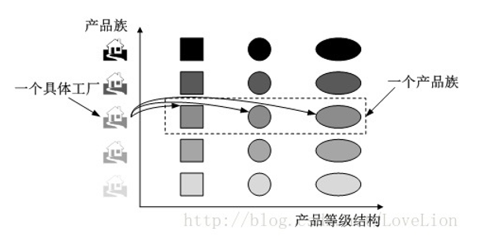

### 设计模式概述

##### 设计模式的前世今生

模式（pattern）起源于建筑业，后来被“四人组” GoF 引入到软件工程领域中，1990 年，“四人组”开始着手进行设计模式的分类整理工作。1995 年，“四人组”出版了《设计模式：可复用面向对象软件的基础》，此书也成为了设计模式的经典书籍，狭义上的设计模式就是指该书中描述的 23 种经典设计模式。

##### 设计模式的概述及定义

概述：设计模式（design pattern）是一套被反复使用的、多数人知晓的、经过分类编目的、代码设计经验的总结，使用设模式是为了可重用代码、让代码更容易被他人理解并且提高代码的可靠性。设计模式是一种用于对软件系统中不断出现的设计问题的解决方案进行文档化的技术，也是一种共享专家设计经验的技术。

定义：**设计模式是在特定环境下为解决某一通用软件设计问题提供的一套定制的解决方案，该方案描述了对象和类之间的相互作用。**

##### 设计模式的分类

- 根据目的分类
  - 创建型（Creational）：用于创建对象，5 种
  - 结构型（Structural）：用于处理类或对象的组合，7 种
  - 行为型（Behavioral）：用于描述类或对象怎样交互和怎样分配职责，11 种
- 根据范围分类
  - 类模式：处理类和子类之间的关系，这些关系通过继承建立，在编译时就被确定下来，是一种静态关系。
  - 对象模式：处理对象间的关系，这些关系在运行时变化，更具动态性。

##### 设计模式的优点

- 设计模式融合了众多专家的经验，并以一种标准的形式供广大开发人员所用，它提供了一套通用的设计动词和一种通用的语言以方便开发人员之间沟通和交流，使得设计方案更加通俗易懂。
- 设计模式使人们可以更加简单、方便地复用成功的设计和体系结构，将已证实的技术表述成设计模式也会使新系统开发者更加容易理解其设计思路。
- 设计模式使得设计方案更加灵活，且易于修改。在很多设计模式中广泛使用了开闭原则和依赖倒转原则、迪米特法则等面向对象设计原则，使得系统具有较好的可维护性，真正实现可维护性的复用。
- 设计模式的使用将提高软件系统的开发效率和软件质量，并且在一定程度上节约设计成本。
- 设计模式有助于初学者更深入地理解面向对象思想，一方面可以帮助初学者更加方便阅读和学习现有类库与其他系统中的源代码，另一方面还可以提高软件的设计水平和代码质量。


### 七个面向对象设计原则

##### 面向对象设计原则概述

软件的可维护性（Maintainability）和可复用性（reusability）是两个非常重要的用于衡量软件质量的属性，软件的可维护性是指软件能够被理解、修正、适用及扩展的难易程度，软件的可复用性是指软件能够被重复使用的难易程度。**面向对象设计原则的目标之一就是实现可维护性复用。**

##### 单一职责原则

**一个对象应该只包含单一的职责，并且该职责被完整地封装在一个类中。**一个类承担的职责越多，它被复用的可能性就越小，而且一个类承担的职责过多，相当于将这些职责耦合在一起，当其中一个职责变化时可能会影响其他职责的运作。单一职责原则是实现高内聚、低耦合的指导方针。

##### 开闭原则

**软件实体应当对扩展开放、对修改关闭。**开闭原则就是指软件实体应尽量在不修改原有代码的情况下进行扩展。为了满足这一原则，需要对系统进行抽象化设计，抽象化是开闭原则的关键。在很多面向对象编程语言中提供了接口、抽象类等机制，可以通过它们定义系统的抽象层，再通过具体类来进行扩展。如果需要修改系统的行为，无须对抽象层进行任何改动，只需要增加新的具体类来实现新的业务功能即可。

##### 里氏代换原则

**所有引用基类的地方必须能透明地使用其子类的对象。**在软件中将一个基类对象替换成它的子类对象，程序将不会产生任何错误和异常，在运用里氏代换原则时应该将父类设计成抽象类或接口，让子类继承父类或实现父接口，并实现在父类中声明的方法，在运行时子类实例替换父类实例，可以很方便地扩展系统的功能，无须修改原有子类的代码，增加新的功能可以通过增加新的子类来实现。

##### 依赖倒转原则

**高层模块不应该依赖低层模块，它们都应该依赖抽象。抽象不应该依赖于细节，细节应该依赖于抽象。**依赖倒转原则要求针对接口编程，不要针对实现编程。依赖倒转原则要求在程序代码中传递参数时或在关联关系中尽量引用层次高的抽象层类，即使用接口或抽象类进行变量类型声明、参数类型声明、方法返回类型声明，以及数据类型的转换等，而不是具体类来做这些事情。

**==在大多数情况下，开闭原则、里氏代换原则和依赖倒转原则会同时出现，开闭原则是目标，里氏代换原则是基础，依赖倒转原则是手段，它们相辅相成，相互补充，目标一致，只是分析问题时所站的角度不同而已。==**

##### 接口隔离原则

**客户端不应该依赖那些它不需要的接口。**当一个接口太大时需要将它分割成一些更细小的接口，使用该接口的客户端仅需要知道与之相关的方法即可。同时，需要注意接口的粒度，**接口太小会导致系统中接口泛滥，不利于维护；接口太大将会违背接口隔离原则，灵活性差，使用起来很不方便。**

##### 合成复用原则

**优先使用对象组合，而不是通过继承来达到复用的目的。**合成复用原则就是在一个新的对象里通过关联关系（包括组合关系和聚合关系）来使用一些已有的对象，使之成为新对象的一部分，新对象通过委派调用已有对象的方法达到复用功能的目的。一般而言，如果两个类之间是“Has-A”的关系应使用组合或聚合，如果是“Is-A”的关系可以使用继承。“Is-A”意思是一个类是另一个类的“一种”，而“Has-A”则不同，它表示某一个角色具有某一项责任。

##### 迪米特法则

**每一个软件单位对其他单位都只有最少的知识，而且局限于那些与本单位密切相关的软件单位。**迪米特法则要求一个软件实体尽可能少地与其他实体发生相互作用。如果一个系统符合迪米特法则，那么当其中的某一个模块发生修改时就会尽量少地影响其他模块，扩展会相对容易，这是对软件实体之间通信的限制，迪米特法则要求限制软件实体之间通信的宽度和深度。应用迪米特法则可降低系统的耦合度，使类与类之间保持松散的耦合关系。


### 简单工厂模式

##### 简单工厂模式的概述及定义

- 概述：简单工厂模式并不属于 GoF 的 23 种经典设计模式，但是它的使用频率也很高，并且常常将它作为学习其他工厂模式的基础。由于在简单工厂模式中用于创建实例的方法通常是静态（static）方法，因此简单工厂模式又被称为**静态工厂方法模式**（Static Factory Method Pattern）

- 定义：定义一个工厂类，它可以根据**参数**的不同返回不同类的示例，被创建的实例通常都具有共同的父类。

##### 简单工厂模式的结构

简单工厂模式的结构比较简单，其核心是工厂类的设计，它包含以下 3 个角色：

- **Factory（工厂角色）**：简单工厂模式的核心，负责实现创建所有产品实例的内部逻辑，提供静态的工厂方法 factoryMethod()，它的返回类型为抽象产品类型 Product。
- **Product（抽象产品角色）**：它是工厂类创建的所有对象的父类，封装了各种产品对象的共有方法
- **ConcreteProduct（具体产品角色）**：它是简单工厂模式的创建目标，所有被创建的对象都充当这个角色的某个具体类的实例。它需要继承抽象产品角色，需要实现在抽象产品中声明的抽象方法。

##### 简单工厂模式的实现

实现情景：开发一套图标库，该图标库可以为应用系统提供多种不同外观的图表，例如柱状图（HistogramChart）、饼状图（PieChart）、折线图（LineChart）等。

- 抽象产品接口

```java
/**
 * 抽象图标接口，充当抽象产品类
 */
public interface Chart {
    void display();
}
```

- 具体产品类

```java
/**
 * 柱状图类，充当具体产品类
 */
public class HistogramChart implements Chart {
    public HistogramChart() {
        System.out.println("创建柱状图");
    }

    @Override
    public void display() {
        System.out.println("显示柱状图");
    }
}

/**
 * 饼状图类，充当具体产品类
 */
public class PieChart implements Chart {
    public PieChart() {
        System.out.println("创建饼状图");
    }

    @Override
    public void display() {
        System.out.println("显示饼状图");
    }
}

/**
 * 折线图类，充当具体产品类
 */
public class LineChart implements Chart {
    public LineChart() {
        System.out.println("创建折线图");
    }

    @Override
    public void display() {
        System.out.println("显示折线图");
    }
}
```

- 工厂类

```java
/**
 * 图表工厂类，充当工厂类
 */
public class ChartFactory {

    //静态工厂方法
    public static Chart getChart(String type){
        Chart chart = null;
        if ("histogram".equalsIgnoreCase(type)) {
            chart = new HistogramChart();
            System.out.println("初始化设置柱状图！");
        } else if ("pie".equalsIgnoreCase(type)) {
            chart = new PieChart();
            System.out.println("初始化设置饼状图！");
        }else if ("line".equalsIgnoreCase(type)) {
            chart = new LineChart();
            System.out.println("初始化设置折线图！");
        }
        return chart;
    }
}
```

- 测试客户端

```java
/**
 * 客户端测试类
 */
public class ChartClient {
    public static void main(String[] args) {
        Chart chart = null;
        chart = ChartFactory.getChart("line");
        chart.display();
    }
}
```

注意：本实例在创建具体 Chart 对象时必须通过修改客户端代码中的静态工厂方法的参数来更换具体产品对象，客户端需要重新编译，这对于客户端而言违反了开闭原则，可以通过引入 xml 配置文件来解决，在需要更换具体图表对象时，只需要修改 xml 配置文件，不需要更改源代码，复合开闭原则。

##### 简单工厂模式的优缺点

优点：

- 工厂类包含必要的判断逻辑，可以决定在什么时候创建哪一个具体产品对象，客户端不需要直接创建这些对象，而仅仅“消费”产品，实现了对象的创建和使用分离。
- 客户端不需要知道所创建的具体产品类的类名，只需要知道对应的参数即可。
- 通过引入配置文件，可以在不修改客户端源代码的情况下更换和增加新的具体产品类

缺点：

- 工厂类集中了所有产品的创建逻辑，职责过重，一旦不能正常工作，整个系统都会受到影响。
- **系统拓展困难，一旦添加新产品就不得不修改工厂类逻辑**，在产品类型较多时有可能造成工厂逻辑过于复杂，不利于系统的拓展和维护。
- 简单工厂模式由于使用了静态工厂方法，造成工厂角色无法形成基于继承的等级结构。

##### 简单工厂模式的适应环境

- 工厂类负责创建的对象较少，由于创建的对象较少，不会造成工厂方法中的业务逻辑太过复杂。
- 客户端只知道传入工厂类的参数，对于如何创建对象并不需要关心。


### 工厂方法模式

##### 工厂方法模式概述及定义

- 概述：工厂方法模式是简单工厂模式的延伸，它继承了简单工厂模式的优点，同时弥补了它的缺陷，更好的复合开闭原则，在增加新的具体产品对象时不需要对已有系统做任何修改。

- 定义：定义一个用于创建对象的接口，但是让子类决定将哪一个类实例化，工厂方法模式让一个类的实例化延迟到其子类。

##### 工厂方法模式结构

工厂方法模式提供一个抽象工厂接口来声明抽象工厂方法，而由其子类来具体实现工厂方法，创建具体的产品对象。工厂方法模式包含以下 4 个角色：

- **Product（抽象产品**）：它是定义产品的接口，是工厂方法模式所创建对象的超类型，也就是产品对象的公共父类。
- **ConcreteProduct（具体产品）**：它实现了抽象产品接口，某种类型的具体产品由专门的具体工厂创建，具体工厂和具体产品之间一一对应。
- **Factory（抽象工厂）**：在抽象工厂类中声明了工厂方法（Factory Method），用于返回一个产品。**抽象工厂是工厂方法模式的核心**，所有创建对象的工厂类都必须实现该接口。
- **ConcreteFactory（具体工厂）**：它是抽象工厂类的子类，实现了在抽象工厂中声明的工厂方法，并可由客户端调用，返回一个具体产品类的实例。

##### 工厂方法模式实现

实现情景：某系统运行日志记录器可以通过多种途径保存系统运行日志，例如通过文件记录或数据库记录，用户可以通过修改配置更换日志记录方式。日志记录器初始化参数设置较为复杂，而且某些参数的设置有严格的先后顺序，为了更好地封装记录器的初始化过程并保证多种记录器切换的灵活性，现采用工厂方法模式来设计该系统。

- Logger 抽象产品角色

```java
/**
 * 抽象日志接口，充当抽象产品角色
 */
public interface Logger {
    void writeLog();
}
```

- xxxLogger 具体产品角色

```java
/**
 * 数据库日志记录器，充当具体产品角色
 */
public class DatabaseLogger implements Logger {
    @Override
    public void writeLog() {
        System.out.println("数据库日志记录");
    }
}

/**
 * 文件日志记录器，充当具体产品角色
 */
public class FileLogger implements Logger {
    @Override
    public void writeLog() {
        System.out.println("文件日志记录");
    }
}
```

- LoggerFactory 抽象工厂角色

```java
/**
 * 日志记录器工厂接口，充当抽象工厂角色
 */
public interface LoggerFactory {
    Logger createLogger();
}
```

- xxxLoggerFactory  具体工厂角色

```java
/**
 * 数据库日志记录器，充当具体工厂角色
 */
public class DatabaseLoggerFactory implements LoggerFactory {
    @Override
    public Logger createLogger() {
        //连接数据库，代码省略
        //创建数据库日志记录器对象
        Logger databaseLogger = new DatabaseLogger();
        //初始化数据库日志记录器对象
        return databaseLogger;
    }
}

/**
 * 文件日志记录器，充当具体工厂角色
 */
public class FileLoggerFactory implements LoggerFactory {
    @Override
    public Logger createLogger() {
        //创建文件日志记录器对象
        Logger logger = new FileLogger();
        //初始化文件日志记录器对象
        return logger;
    }
}
```

- LoggerClient 测试客户端

```java
/**
 * 客户端测试类
 */
public class LoggerClient {
    public static void main(String[] args) {
        LoggerFactory loggerFactory = null;
        Logger logger = null;
        //可引入配置文件和反射机制实现
        loggerFactory = new DatabaseLoggerFactory();
        logger = loggerFactory.createLogger();
        logger.writeLog();
    }
}
```

注意：如果需要添加并使用心得日志记录器，只需要添加一个新的具体工厂类，然后在客户端代码中修改具体工厂类的类名，原有类库的代码不需要改变。

**通过引入配置文件并使用反射机制可以实现在不修改任何客户端代码的基础上更换具体工厂类**。让系统更加符合开闭原则，具备更好的灵活性和可扩展性。

##### 工厂方法的重载

某些情况下，可以通过多种方式来初始化同一个产品类。例如前面提到的日志记录器类，可以为各种日志记录器提供默认实现，还可以为数据库日志记录器提供数据库连接字符串，为文件日志记录器提供文件路径；也可以将相关参数封装在一个 Object 类型的对象中，通过 Object 对象将配置参数传入工厂类。**此时可以提供一组重载的工厂方法，以不同的方法对产品对象进行创建。**

- 抽象工厂类

```java
/**
 * 日志记录器工厂接口，充当抽象工厂角色
 */
public interface LoggerFactory {
    Logger createLogger();
    Logger createLogger(String url);
    Logger createLogger(Object obj);
}
```

- 具体工厂类

```java
/**
 * 数据库日志记录器，充当具体工厂角色
 */
public class DatabaseLoggerFactory implements LoggerFactory {
    @Override
    public Logger createLogger() {
        //使用默认方式连接数据库，代码省略
        Logger databaseLogger = new DatabaseLogger();
        //初始化数据库日志记录器对象
        return databaseLogger;
    }
    @Override
    public Logger createLogger(String args) {
        //使用 args 作为连接字符串来连接数据库，代码省略
        Logger databaseLogger = new DatabaseLogger();
        //初始化数据库日志记录器对象
        return databaseLogger;
    }
    @Override
    public Logger createLogger(Object obj) {
        //使用封装在 obj 中的字符串来连接数据库，代码省略
        Logger databaseLogger = new DatabaseLogger();
        //使用封装在 obj 中数据来初始化数据库日志记录器对象
        return databaseLogger;
    }

}
```

##### 工厂方法模式的优缺点

优点：

- 在工厂方法模式中，工厂方法用来创建客户端所需要的产品，同时还向客户隐藏了哪种具体产品类将被初始化这一细节，用户只需要知道所需产品对象的工厂类即可，无需关心创建细节。
- 基于工厂角色和产品角色的多态性设计师工厂方法模式的关键。它能够让工厂自主确定创建何种产品对象，而如何创建这个对象的细节完全封装在具体工厂内部。
- 系统中加入新产品时无需修改抽象工厂和抽象产品提供的接口，无需修改客户端，也无需修改其他具体工厂和具体产品，而只要添加一个具体工厂和具体产品即可，这样系统的可扩展性好，完全符合开闭原则。

缺点：

- 添加新产品时需要同时添加具体工厂类，使得系统中的类的个数成对增加，一定程度上增加了系统的复杂性，有更多的类需要编译和运行，给系统带来一些额外的开销。

- 由于考虑到系统的可扩展性，需要引入抽象层，在客户端代码中均适用抽象层进行定义，增加了系统的抽象性和理解难度。

##### 工厂方法模式的适应环境

- 客户端不需要知道具体产品类的类名，只需要知道所对应的工厂即可，可以将具体工厂类的类名储存到配置文件或数据库中。
- 抽象工厂类通过其子类来指定创建哪个对象。在工厂方法模式中，对于抽象工厂类只需要提供一个创建产品的接口，而由其子类来确定具体要创建的对象，利用面向对象的多态性和里氏代换原则，在程序运行时子类对象覆盖父类对象，从而使得系统更容易扩展。


### 抽象工厂模式

##### 产品等级结构和产品族

- **产品等级结构：**产品等级结构即产品的继承结构，例如一个抽象类是电视机，其子类包括海尔电视机、海信电视机、TCL 电视机等等，抽象电视机和具体的电视机之间构成了一个产品等级结构。

- **产品族：**在抽象工厂模式中，产品族是指由同一个工厂生产的位于不同产品等级结构中的一组产品，例如海尔电器工厂生产的海尔电视机、海尔冰箱、海尔电视机位于电视机产品等级结构中，海尔冰箱位于冰箱产品等级结构中，海尔电视机和海尔冰箱构成了一个产品族。~~海尔快给我广告费！~~



##### 抽象工厂模式概述及定义

- 概述：抽象工厂模式是所有形式的工厂模式中最为抽象和最具一般性的一种形式。抽象工厂模式和工厂方法模式最大的区别在于，工厂方法模式针对的一个产品等级结构，而抽象工厂模式需要面对多个产品等级结构。抽象工厂模式为**创建一组对象**提供了一种解决方案。

- 定义：提供一个创建一系列相关或相互依赖对象的接口，而无需指定它们的具体的类。

##### 抽象工厂模式的结构

在抽象工厂模式中，每一个具体工厂都提供了多个工厂方法用于产生多种不同类型的产品，这些产品构成了一个产品族，抽象工厂模式包含以下 4 个角色：

- **AbstractFactory（抽象工厂）**：它声明了一组用于创建一族产品的方法，每一个方法对应一种产品。
- **ConcreteFactory（具体工厂）**：它实现了在抽象工厂中声明的创建产品的方法，生成一组具体产品，这些产品构成了一个产品族，每一个产品都位于某个产品等级结构。
- **AbstractProduct（抽象产品）**：它为每种产品声明接口，在抽象产品中声明了产品所具有的业务方法。
- **ConcreteProduct（具体产品）**：它定义了具体工厂生产的具体产品对象，实现抽象产品接口中声明的业务方法。

##### 抽象工厂模式的实现

实现场景：开发一套界面皮肤库，用户在使用时可以通过菜单来选择皮肤，不同的皮肤将提供视觉不同的按钮、文本框、组合框等界面元素，例如春天（Spring）风格的皮肤将提供浅绿色的按钮、绿色边框的文本框、绿色边框的组合框；而夏天（Summer）风格的皮肤将提供浅蓝色的按钮、蓝色边框的文本框、蓝色边框的组合框；要求皮肤库具备良好的灵活性和可扩展性，开发人员可以在不修改既有代码的基础上增加新的皮肤。

- Button 抽象产品接口

```java
/**
 * 按钮接口，充当抽象产品
 */
public interface Button {
    void display();
}
```

- xxxButton 具体产品

```java
/**
 * Spring 按钮类，充当具体产品
 */
public class SpringButton implements Button {
    @Override
    public void display() {
        System.out.println("显示浅绿色按钮");
    }
}

/**
 * Summer 按钮类，充当具体产品
 */
public class SummerButton implements Button {
    @Override
    public void display() {
        System.out.println("显示浅蓝色按钮");
    }
}
```

- TextField 抽象产品接口

```java
/**
 * 文本框接口，充当抽象产品
 */
public interface TextField {
    void display();
}
```

- xxxField 具体产品接口

```java
/**
 * Spring 文本框，充当具体产品
 */
public class SpringTextField  implements TextField{
    @Override
    public void display() {
        System.out.println("显示绿色边框文本框");
    }
}

/**
 * Summer 文本框，充当具体产品
 */
public class SummerTextField  implements TextField{
    @Override
    public void display() {
        System.out.println("显示蓝色边框文本框");
    }
}
```

- ComboBox 抽象产品接口

```java
/**
 * 组合框接口，充当抽象产品
 */
public interface ComboBox {
    void display();
}
```

- xxxComboBox 具体产品

```java
/**
 * Spring 组合框类，充当具体产品
 */
public class SpringComboBox implements ComboBox {
    @Override
    public void display() {
        System.out.println("显示绿色边框组合框");
    }
}

/**
 * Summer 组合框类，充当具体产品
 */
public class SummerComboBox implements ComboBox {
    @Override
    public void display() {
        System.out.println("显示蓝色边框组合框");
    }
}
```

- SkinFactory 抽象工厂

```java
/**
 * 界面皮肤工厂接口，充当抽象工厂（生产的产品组成一个产品族）
 */
public interface SkinFactory {
    Button createButton();
    TextField createTextField();
    ComboBox createComboBox();
}
```

- xxxSkinFactory 具体工厂

```java
/**
 * Spring 皮肤工厂，充当具体工厂
 */
public class SpringSkinFactory implements SkinFactory {
    @Override
    public Button createButton() {
        return new SpringButton();
    }
    @Override
    public TextField createTextField() {
        return new SpringTextField();
    }
    @Override
    public ComboBox createComboBox() {
        return new SpringComboBox();
    }
}

/**
 * Summer 皮肤工厂，充当具体工厂
 */
public class SummerSkinFactory implements SkinFactory {
    @Override
    public Button createButton() {
        return new SummerButton();
    }
    @Override
    public TextField createTextField() {
        return new SummerTextField();
    }
    @Override
    public ComboBox createComboBox() {
        return new SummerComboBox();
    }
}
```

- SkinClient 测试客户端

```java
/**
 * 皮肤客户端测试类
 */
public class SkinClient {
    public static void main(String[] args) {
        SkinFactory skinFactory = (SkinFactory) AbstractFactoryXmlUtil.getBean();
        if (skinFactory != null) {
            Button button = skinFactory.createButton();
            TextField textField = skinFactory.createTextField();
            ComboBox comboBox = skinFactory.createComboBox();

            button.display();
            textField.display();
            comboBox.display();
        }
    }
}
```

- xml 配置文件

```xml
<?xml version="1.0" encoding="utf-8" ?>
<!--抽象工厂模式的配置文件 xml-->
<config>
    <className>
        com.piano.creation.abstract_factory.SummerSkinFactory
    </className>
</config>
```

- xml 解析工具类

```java
/**
 * xml 工具类，用于获取 xml 配置的具体工厂类的对象
 */
class AbstractFactoryXmlUtil {
    //该方法用于从 xml 配置文件中提取具体类的类名，并返回一个实例对象
    static Object getBean() {
        try {
            //创建 DOM 文档对象
            DocumentBuilderFactory builderFactory = new DocumentBuilderFactoryImpl();
            DocumentBuilder documentBuilder = builderFactory.newDocumentBuilder();
            Document document = documentBuilder.parse(new File("src\\com\\piano\\creation\\abstract_factory\\abstract_factory.xml"));

            NodeList nodeList = document.getElementsByTagName("className");
            Node item = nodeList.item(0).getFirstChild();
            String className = item.getNodeValue();
            //通过反射创建对象
            return Class.forName(className.trim()).newInstance();
        } catch (Exception e) {
            e.printStackTrace();
            return null;
        }
    }
}
```

注意：可以通过引入配置文件和反射机制来配置皮肤的使用，如果需要增加新的皮肤，只需要增加一族新的具体产品组件并对应提供一个新的具体工厂，修改配置文件中的具体工厂类的类名即可使用新的皮肤，原有代码无需修改，符合开闭原则。

##### 开闭原则的倾斜性

上面的例子存在一个严重的问题，如果设计之初因为考虑不全面，忘记为某种类型的界面组件（以单选按钮 Radio 为例）提供不同皮肤下的风格化显示，那么再往系统添加单选按钮时将发现非常麻烦，**无法在满足开闭原则的前提下添加单选按钮。**原因是抽象工厂 SkinFactory 没有提供创建单选按钮的接口，如果需要的话，需要修改抽象工厂接口，然后逐个修改具体工厂类，此外还需要修改客户端类。

抽象工厂模式无法解决这类问题，这也是抽象工厂模式的最大缺点。**在抽象工厂模式中增加新的产品族很方便，但是增加新的产品等级结构很麻烦。**抽象工厂模式的这种性质称为开闭原则的倾斜性。
##### 抽象工厂模式的优缺点

优点：

- 抽象工厂模式隔离了具体类的生成，使得客户端并不需要知道什么被创建。由于这种隔离，更换一个具体工厂就变得相对容易，所有的具体工厂都实现了抽象工厂中定义的那些公共接口，因此只需要修改具体工厂的实例就可以在某种程度上改变整个软件系统的行为。
- 当一个产品族的多个对象被设计成一起工作时，它能够保证客户端始终只使用同一个产品族中的对象。
- 增加新的产品族很方便，无需修改已有系统，符合开闭原则。

缺点：

- 增加新的产品等级结构麻烦，需要对原有系统进行较大的修改，甚至需要修改抽象层代码，这显然会带来较大的不便，违背了开闭原则。

##### 抽象工厂模式的适用环境

- 系统中有多于一个产品族，而每次只使用其中一个产品族。可以通过配置文件等方式来使用户能够动态改变产品族，也可以很方便增加新的产品族。
- 产品等级结构稳定，在设计完成之后不会向系统增加新的产品等级结构或者删除已有的产品等级结构。


### 建造者模式

##### 建造者模式概述及定义

- 概述：构造者模式将客户端与包含多个部件的复杂对象的创建过程分离，客户端无须知道复杂对象的内部组成部分和装配方式，只需要知道所需构造者的类型即可。建造者模式关注如何一步一步地创建一个复杂对象，不同的构造者定义了不同的创建过程。
- 定义：讲一个复杂对象的构建与它的表示分离，使得同样的构建过程可以创建不同的表示。

##### 建造者模式的结构

建造者模式包含如下 4 个角色：

- **Builder（抽象构造者）**：它为创建一个产品对象的各个部件指定抽象接口，在该接口中一般声明两类方法，一类方法是 buildPartX() ，它们用于创建复杂对象的各个部件；另一类方法是 getResult() ，它们用于返回复杂对象。Builder 既可以是抽象类，也可以是接口。
- **ConcreteBuilder（具体构造者）**：它实现了 Builder 接口，实现各个部件的具体构造和装配方法，定义并明确所创建的复杂对象，还可以提供一个方法返回创建好的复杂产品对象（该方法也可以由抽象构造者实现）。
- **Product（产品）**：它是被构建的复杂对象，包含多个组成部件，具体构造者创建该产品的内部表示并定义它的装配过程。
- **Director（指挥者）**：指挥者又称为导演类，它负责安排复杂对象的构造次序，指挥者与抽象构造者直接存在关联关系，可以在其 construct() 构造方法中调用构造者对象的部件构造与装配方法，完成复杂对象的构造。客户端一般只需要与指挥者进行交互，在客户端确定具体构造者的类型，并实例化具体构造者对象（也可以通过配置文件和反射机制实现），然后通过指挥者类的构造函数或者 Setter 方法将该对象传入指挥者类。

##### 建造者模式的实现

实现场景：开发一款基于角色扮演的游戏，通过分析发现，游戏角色是一个复杂对象，它包含类型、性别、脸型、服装、发型等组成部分，不同类型的游戏角色的特性有所差异，例如“天使”拥有美丽的笑容和披肩的长发，“恶魔”极其丑陋，留着光头并穿一件刺眼的黑衣。无论哪种造型的角色，它的创建步骤都大同小异，都需要逐步创建其组成部分，再将各个组成部分装配成一个完整的游戏角色。

- 游戏角色类，充当复杂产品

```java
/**
 * 游戏角色类，充当负责产品对象
 */
public class Actor {
    private String type; //角色类型
    private String sex; //性别
    private String face; //脸型
    private String costume; //服装
    private String hairstyle; //发型
    //setter 和 getter方法省略
    }
```

- 游戏角色构造者，充当抽象构造者

```java
/**
 * 游戏角色构造者，充当抽象构造者
 */
public abstract class ActorBuilder {
    protected Actor actor = new Actor();

    abstract void buildType();
    abstract void buildSex();
    abstract void buildFace();
    abstract void buildCostume();
    abstract void buildHairstyle();

    //工厂方法，返回一个完整的游戏角色对象
    public Actor createActor() {
        return this.actor;
    }
}
```

- 具体构造者

```java
/**
 * 英雄角色构造者，充当具体构造者
 */
public class HeroActorBuilder extends ActorBuilder {
    @Override
    void buildType() {
        actor.setType("英雄");
    }
    @Override
    void buildSex() {
        actor.setSex("难");
    }
    @Override
    void buildFace() {
        actor.setFace("英俊");
    }
    @Override
    void buildCostume() {
        actor.setCostume("盔甲");
    }
    @Override
    void buildHairstyle() {
        actor.setHairstyle("飘逸");
    }
}

/**
 * 天使角色构造者，充当具体构造者
 */
public class AngelActorBuilder extends ActorBuilder {
    @Override
    void buildType() {
        actor.setType("天使");
    }
    @Override
    void buildSex() {
        actor.setSex("女");
    }
    @Override
    void buildFace() {
        actor.setFace("漂亮");
    }
    @Override
    void buildCostume() {
        actor.setCostume("白裙");
    }
    @Override
    void buildHairstyle() {
        actor.setHairstyle("披肩长发");
    }
}

/**
 * 恶魔角色构造者，充当具体构造者
 */
public class DevilActorBuilder extends ActorBuilder {
    @Override
    void buildType() {
        actor.setType("恶魔");
    }
    @Override
    void buildSex() {
        actor.setSex("妖");
    }
    @Override
    void buildFace() {
        actor.setFace("丑陋");
    }
    @Override
    void buildCostume() {
        actor.setCostume("黑衣");
    }
    @Override
    void buildHairstyle() {
        actor.setHairstyle("光头");
    }
}
```

- 角色控制类，充当指挥者

```java
/**
 * 角色控制器，充当指挥者
 */
public class ActorController {
    //逐步构建复杂产品对象
    public Actor construct(ActorBuilder actorBuilder) {
        Actor actor = null;

        actorBuilder.buildType();
        actorBuilder.buildSex();
        actorBuilder.buildFace();
        actorBuilder.buildCostume();
        actorBuilder.buildHairstyle();
        actor = actorBuilder.createActor();
        return actor;
    }
}
```

- 客户端测试类

```java
/**
 * 游戏角色客户端测试类
 */
public class ActorClient {
    public static void main(String[] args) {
        Actor actor = null;
        //反射生成具体构造者对象
        ActorBuilder actorBuilder = (ActorBuilder) BuilderXmlUtil.getBean();

        ActorController actorController = new ActorController();
        //通过指挥者创建完整的构造者对象
        actor = actorController.construct(actorBuilder);

        System.out.println(actor);
    }
}
```

注意：配置文件和抽象工厂模式的一样，所以省略。当需要增加新的具体角色构造者时只需要将新增的具体角色构造者作为抽象角色构造者的子类，然后修改配置文件，既有代码不用变，符合开闭原则。

##### 指挥者类的深入讨论

- 省略 Director 指挥者这个角色

  某些情况下，为了简化系统结构，可以将 Director 和 Builder 合并，在 Builder 中提供构造复杂对象的 construct() 方法，由于 Builder 通常为抽象类，因此可以将 construct() 方法定义为静态方法，以便客户端能够直接调用。此时 Builder 的代码如下：

```java
/**
 * 游戏角色构造者，充当抽象构造者
 */
public abstract class ActorBuilder {
    protected static Actor actor = new Actor();

    public static Actor construct(ActorBuilder actorBuilder) {
        actorBuilder.buildType();
        actorBuilder.buildSex();
        actorBuilder.buildFace();
        actorBuilder.buildCostume();
        actorBuilder.buildHairstyle();
        return actor;
    }
}
```

- 钩子方法的引入

  建造者模式除了可以逐步构建一个复杂产品对象外，还可以通过 Director 类更加精细地控制产品的创建过程，例如增加一类称为钩子方法（Hook Method）的特殊方法来控制是否对某个 buildPartX() 进行调用。**钩子方法的返回值通常是 Boolean 类型，方法名一般为 isXXX()** ，钩子方法定义在抽象构造者中。为了判断某个角色是否光头，在 ActorBuilder 为之提供一个默认实现，其返回值为 false

```java
/**
 * 游戏角色构造者，充当抽象构造者
 */
public abstract class ActorBuilder {
    protected Actor actor = new Actor();

    abstract void buildType();
    abstract void buildSex();
    abstract void buildFace();
    abstract void buildCostume();
    abstract void buildHairstyle();

    //钩子方法
    public boolean isBareheaded() {
        return false;
    }
    
    //工厂方法，返回一个完整的游戏角色对象
    public Actor createActor() {
        return this.actor;
    }
}
```

- 覆盖钩子方法

  假如“恶魔”角色无须构造头部部件，则对应的具体构造器 DevilActorBuilder 将覆盖 isBareheaded() 方法，并将返回值改为 true，相应的 ActorController 也要修改。代码如下：

```java
/**
 * 恶魔角色构造者，充当具体构造者
 */
public class DevilActorBuilder extends ActorBuilder {
    @Override
    void buildType() {
        actor.setType("恶魔");
    }
// .....
    //覆盖钩子方法
    @Override
    public boolean isBareheaded() {
        return true;
    }
}

/**
 * 角色控制器，充当指挥者
 */
public class ActorController {
    //逐步构建复杂产品对象
    public Actor construct(ActorBuilder actorBuilder) {
        Actor actor = null;

        actorBuilder.buildType();
        actorBuilder.buildSex();
        actorBuilder.buildFace();
        actorBuilder.buildCostume();
        //通过钩子方法来控制产品的构建
        if (!actorBuilder.isBareheaded()) {
            actorBuilder.buildHairstyle();
        }
        actor = actorBuilder.createActor();
        return actor;
    }
}
```

##### 建造者模式的优缺点

优点：

- 在建造者模式中，客户端不必知道产品内部组成的细节，将产品本身与产品的创建过程解耦，使得同样的创建过程可以创建不同的产品。
- 每一个具体构造者都相对独立，而与其他具体构造者无关，因此可以很方便地替换具体构造者或增加新的具体构造者。由于指挥者针对抽象构造者编程，增加新的具体构造者无须修改既有代码，系统扩展很方便。
- 可以更加精细地控制产品的创建过程。将复杂产品的创建步骤分解在不同的方法中，使得创建过程更加清晰，也更方便使用程序来控制创建过程。

缺点：

- 建造者模式所创建的产品一般具有较多的共同点，其组成部分相似，如果产品之间的差异性很大，则不太适用，例如很多组成部分不同，不适用建造者模式。
- 如果系统内部变化复杂，可能会导致需要定义很多具体构造者来实现这种变化，导致系统变得很庞大，增加系统的理解难度和运行成本。

##### 建造者模式的适用环境

- 需要生成的产品对象有复杂的内部结构，这些产品通常包含多个成员变量。
- 需要生成的产品对象的属性相互依赖，需要指定其生成的顺序。
- 对象的创建过程独立于创建该对象的类，在构造者模式中通过引入指挥类将创建过程封装在指挥者类中，而不在建造者类中和客户端中。
- 隔离复杂对象的创建和使用，并使得相同的创建过程可以创建不同的产品。


### 原型模式

##### 原型模式的概述及定义

- 概述：将一个原型对象传给要发动创建的对象（即客户端对象），这个要发动创建的对象通过请求原型对象复制自己来实现创建过程。创建新对象（也称为克隆对象）的工厂就是原型类自身，工厂方法由负责复制原型对象的克隆方法来实现，**克隆方法创建的对象是一个全新的对象，它们在内存中拥有新的地址，通常对克隆所产生的对象进行修改不会对原型对象造成任何影响，每一个克隆对象都是相互独立的。**
- 定义：使用原型实例指定待创建对象的类型，并且通过复制这个原型来创建新的对象。

##### 原型模式的结构

原型模式包含以下 3 个角色：

- **Prototype（原型抽象类）**：它是声明克隆方法的接口，是所有具体原型类的公共父类，它可以是抽象类也可以是接口，甚至可以是具体的实现类。
- **ConcretePrototype（具体抽象类）**：它实现在抽象原型类中声明的克隆方法，在克隆方法中返回自己的一个克隆对象。
- **Client（客户端）**：在客户端类中，让一个原型对象克隆自身从而创建一个新的对象，只需要直接实例化或通过工厂方法等方式创建一个原型对象，再通过调用该对象的克隆方法即可得到多个相同的对象。由于客户端针对抽象原型类编程，因此用户可以根据需要选择具体原型类。

##### 理解浅克隆和深克隆

根据在复制原型对象的同时是否复制包含在原型对象中引用类型的成员变量，原型模式的克隆机制分为两种，即浅克隆（Shadow Clone）和深克隆（Deep Clone）。

- 浅克隆：当原型对象被复制时只复制它本身和其中包含的值类型的成员变量，而引用类型（如类，接口，数组等复杂数据类型）的成员变量并没有复制，原型对象和克隆对象的引用类型的成员变量指向相同的内存地址。**对象可以通过实现一个标识接口 Cloneable，然后调用公共对象 Object 的 clone() 方法来实现浅克隆。**
- 深克隆：无论原型对象的成员变量是值类型还是引用类型，都将复制一份给克隆对象。**可以通过序列化（Serialization）等方式来实现深克隆。序列化就是将对象写到流的过程，写到流的对象是原有对象的一个复制，而原有对象仍然存在与内存中。能够实现序列化的对象其类必须实现 Serializable 接口。**

##### 原型模式的实现

实现场景：在使用某 OA 系统，员工发现他们每周的工作周报很多内容都是重复的，为了提高效率，大家迫切希望有一种机制能够快速创建相同或者相似的周报，包括创建周报的附件。

- 附件类

```java
/**
 * 附件类
 */
public class Attachment implements Serializable {
    private String name;
    public String getName() {
        return name;
    }
    public void setName(String name) {
        this.name = name;
    }
}
```

- 工作周报类，充当原型角色

```java
/**
 * 工作周报类，充当原型角色，浅克隆方式
 */
public class WeeklyLog implements Serializable, Cloneable {
    private String name; //周报名称
    private String date; //提交日期
    private String content; //内容
    private Attachment attachment; //附件
	//省略 getter和setter方法
    
    //深克隆方法
    public WeeklyLog deepClone() throws IOException, ClassNotFoundException {

        ByteArrayOutputStream outputStream = new ByteArrayOutputStream();
        ObjectOutputStream objectOutputStream = new ObjectOutputStream(outputStream);
        objectOutputStream.writeObject(this);

        ByteArrayInputStream arrayInputStream = new ByteArrayInputStream(outputStream.toByteArray());
        ObjectInputStream objectInputStream = new ObjectInputStream(arrayInputStream);
        Object object = objectInputStream.readObject();

        return (WeeklyLog) object;
    }
    //浅克隆方法
    @Override
    public WeeklyLog clone() {
        WeeklyLog weeklyLog = null;
        try {
            weeklyLog = (WeeklyLog) super.clone();
        } catch (CloneNotSupportedException e) {
            e.printStackTrace();
        }
        return weeklyLog;
    }
}
```

- 客户端测试类

```java
/**
 * 原型模式测试客户端
 */
public class WeeklyLogClient {
    public static void main(String[] args) throws Exception{
        //创建附件对象
        Attachment attachment = new Attachment();
        //创建原型对象
        WeeklyLog weeklyLog = new WeeklyLog();
        weeklyLog.setAttachment(attachment);
        //浅克隆的新对象
        WeeklyLog cloneWeeklyLog = weeklyLog.clone();

        System.out.println("浅克隆周报是否相同："+(weeklyLog==cloneWeeklyLog));
        System.out.println("浅克隆附件是否相同："+(weeklyLog.getAttachment()==cloneWeeklyLog.getAttachment()));

        //深克隆的新对象
        WeeklyLog deepClone = weeklyLog.deepClone();
        System.out.println("深克隆周报是否相同："+(weeklyLog==deepClone));
        System.out.println("深克隆附件是否相同："+(weeklyLog.getAttachment()==deepClone.getAttachment()));
    }
}
```

##### 原型管理器

原型管理器（Prototype Manager）将多个原型对象存储在一个集合中供客户端使用，它是一个专门负责克隆对象的工厂，其中定义了一个集合用于存储原型对象，如果需要某个原型对象的一个克隆，可以通过复制集合中对应的原型对象来获得。在原型管理器中针对抽象原型类进行编程，以便扩展。**原型管理器一般设置成单例类。**

```java
/**
 * 原型管理器，这个类一般设置成单例类
 */
public class PrototypeManager {
    //使用 Hashtable 存储原型对象
    private Hashtable prototypeTable = new Hashtable();
    
    public PrototypeManager() {
        prototypeTable.put("A", new Attachment());
        prototypeTable.put("B", new WeeklyLog());
    }
    
    public void add(String key, Prototype prototype) {
        prototypeTable.put(key, prototype);
    }
    
    public Prototype get(String key) {
        Prototype prototype = null;
        prototype = ((Prototype) prototypeTable.get(key)).clone();
        return prototype;
    }
}
```

##### 原型模式的优缺点

优点：

- 当创建新的对象实例较为复杂时，通过原型模式复制一个已有实例可以提高新实例的创建效率。
- 原型模式简化了创建结构，原型模式中产品的复制是通过封装在原型类中的克隆方法实现的，无须专门的工厂类来创建产品。
- 可以使用深克隆的方式保存对象的状态，使用原型模式将对象复制一份并将其状态保存起来，以便在需要的时候使用（例如恢复到某一历史状态），可辅助实现撤销操作。

缺点：

- 需要为每一个类配备一个克隆方法，而且该克隆方法位于一个类的内部，当对已有的类进行改造时需要修改源代码，违背了开闭原则。
- 在实现深克隆时需要编写较为复杂的代码，而且当对象之间存在多重的嵌套引用时，为了实现深克隆，每一层对象对应的类都必须支持深克隆，实现可能会比较麻烦。

##### 原型模式的适用环境

- 创建新对象成本较大，新对象可以用过复制已有对象来获得，如果是相似对象，则可以对其成员变量稍作修改。
- 系统要保存对象的状态，而对象的状态的变化很小。
- 需要避免使用分层次的工厂类来创建分层次的对象，并且类的实例对象只有一个或很少的几个组合状态，通过复制原型对象得到新实例可能比使用构造器函数创建一个新实例更加方便。


### 单例模式

##### 单例模式的概述及定义

- 概述：单例模式是结构最简单的一个设计模式，在它的核心结构中只包含一个被称为单例类的特殊类。通过单例模式可以确保系统中的一个类只有一个实例而且该实例易于被外界访问，从而方便对实例个数进行控制，节约系统资源。
- 定义：定义一个类只有一个实例，并提供一个**全局访问**点来访问这个唯一的实例。单例模式有三个要点：
  - **某个类只能有一个实例；**
  - **它必须自行创建这个实例；**
  - **它必须自行向整个系统提供这个实例；**

##### 单例模式的结构

单例模式只包含一个单例角色，也就是 Singleton。

对于 Singleton，在其内部创建它的唯一实例，并通过静态方法 getInstance() 让客户端可以使用它的唯一实例；为了防止在外部对单例类实例化，将其构造器函数的可见性设为 private，在单例类内部定义了一个 Singleton 类型的静态对象作为供外部共享访问的唯一实例。

##### 单例模式的实现

- 最简单的实现方案（线程不安全）

```java
/**
 * 最简单的单例模式(线程不安全)
 */
public class SimpleSingleton {
    private static SimpleSingleton singleton = null;

    private SimpleSingleton() {
    }
    public static SimpleSingleton getInstance() {
        if (singleton == null) {
            singleton = new SimpleSingleton();
        }
        return singleton;
    }
}
```

##### 饿汉式单例与懒汉式单例

- **饿汉式单例（线程安全）**，当类被加载时，静态变量 singleton 会被初始化，此时类的私有构造函数会被调用，单例类的唯一实例将被创建。

```java
/**
 * 饿汉式单例，线程安全
 */
public class EagerSingleton {
    private static final EagerSingleton singleton = new EagerSingleton();

    private EagerSingleton() {
    }

    public static EagerSingleton getInstance() {
        return singleton;
    }
}
```

- **懒汉式单例（线程安全）**

与饿汉式单例类相同的是，懒汉式单例类（Lazy Singleton）的构造函数也是私有的。与饿汉式单例类不同的是，懒汉式单例类在第一次被引用时将自己实例化，在懒汉式单例类被加载时不会被初始化，因为锁定了整个方法，代码效率不是很高。

```java
/**
 * 懒汉式单例类，锁定方法
 */
public class LazySingleton {
    private static LazySingleton singleton = null;
    private LazySingleton() {
        
    }
    // synchronized 关键字锁定方法
    public synchronized static LazySingleton getInstance() {
        if (singleton == null) {
            singleton = new LazySingleton();
        }
        return singleton;
    }
}
```

- **双重检查锁定的懒汉式单例（线程安全）**，静态变量必须加 volatile 关键字修饰，使多个线程之间的内存可见，通过锁定代码块的方式，提高了代码的执行效率。

```java
/**
 * 双重检查锁定的单例类
 */
public class DoubleCheckSingleton {
    //必须加 volatile 关键字，使多个线程之间的内存可见
    private static volatile DoubleCheckSingleton singleton = null;

    private DoubleCheckSingleton() {
    }

    //双重检查锁定
    public static DoubleCheckSingleton getInstance() {
        if (singleton == null) {
            //锁定代码块
            synchronized (DoubleCheckSingleton.class) {
                if (singleton == null) {
                    singleton = new DoubleCheckSingleton();
                }
            }
        }
        return singleton;
    }
}
```

- 饿汉式单例类和懒汉式单例类的比较

饿汉式单例类在类加载时就将自己实例化，它的优点在于考虑多个线程同时访问的问题，可以确保实例的唯一性；从调用速度和反应时间角度来讲，由于单例对象一开始就得以创建，因此要优于懒汉式；但是无论系统在运行时是否需要使用该单例对象，由于在类加载时该对象就需要创建，因此从资源利用效率角度来讲饿汉式不如懒汉式。

- 静态内部类实现单例模式

  饿汉式单例类不能实现延迟加载，不管将来用不用始终占据内存；懒汉式单例类线程安全控制烦琐，而且性能受影响。可见，无论是饿汉式还是懒汉式都存在一些问题。为了克服这些问题，**在 Java 语言中可以通过 Initialization on Demand Holder 技术来实现单例模式。**使用内部类的方式既可以实现延迟加载，又可以保证线程安全，不影响系统性能。

```java
/**
 * 静态内部类实现单例模式
 */
public class StaticInnerSingleton {
    private StaticInnerSingleton() {
    }

    //静态内部类
    private static class InnerSingleton {
        private static final StaticInnerSingleton singleton = new StaticInnerSingleton();
    }

    public StaticInnerSingleton getInstance() {
        return InnerSingleton.singleton;
    }
}
```

##### 单例模式的优缺点

优点：

- 单例模式提供了对唯一实例的受控访问，因为单例类封装了它的唯一实例，所以它可以严格控制客户怎样以及何时访问它。
- 由于在系统中只存在一个对象，因此可以节约系统资源，对于一些需要频繁创建和销毁的对象，单例模式无疑提高系统的性能。
- 允许可变数目的实例。基于单例模式可以进行扩展，使用与控制单例对象相似的方法来获得指定个数的实例对象，既节省系统资源，又解决了由于单例对象共享过多有损性能的问题。（注：自行提供指定数目实例对象的类可称为多例类）

缺点：

- 由于单例模式中没有抽象层，因此单例类的扩展有很大的困难。
- 单例类的职责过重，在一定程度上违背了单一职责原则。因为单例类既提供了业务方法，又提供了创建对象的方法。将对象的创建和对象本身的功能耦合在一起。
- 因为存在垃圾回收机制，因此如果实例化的共享对象长时间不被利用，系统会认为它是垃圾，会自动销毁并回收资源，下次利用时又将重新实例化，这将导致共享的单例对象状态的丢失。

##### 单例模式的适用环境

- 系统只需要一个实例对象，例如系统要求提供一个唯一的序列号生成器或资源管理器，或者因为资源消耗太大只允许创建一个对象。
- 客户调用类的单个实例只允许使用一个公共访问点，除了该公共访问点，不能通过其他途径访问该实例。

### 适配器模式

##### 结构型模式

结构型模式可以分为**类结构型模式**和**对象结构型模式**。类结构型模式关心类的组合，由多个类可以组合成一个更大的系统，在类结构型模式中一般只存在继承关系和实现关系；而对象结构型模式关心类与对象的组合，通过关联关系在一个类中定义另一个类的实例对象，然后通过该对象调用相应的方法，根据合成复用原则，在系统中尽量使用关联关系来替代继承关系，因此一部分结构型模式都是对象结构型模式。

##### 适配器模式的概述及定义

- 概述：适配器模式引入了一个被称为适配器（Adapter）的包装类，而它所包装的对象称为适配者（Adaptee），即被适配的类。适配器的实现就是把客户端的请求转化为对适配者的相关接口的调用。也就是说，当客户端调用**适配器的方法**时在适配器类的内部将调用**适配者类的方法**。
- 定义：**将一个类的接口转换成客户希望的另一个接口。适配器模式让那些接口不兼容的类可以一起工作。**

##### 适配器模式的结构

适配器模式包含以下 3 个角色：

- **Target（目标抽象类）**：目标抽象类定义客户所属的接口，可以是一个抽象类或接口，也可以是具体类。在类适配器中，由于 Java 不支持多重继承，它只能是接口。
- **Adapter（适配器类）**：它可以调用另一个接口，作为一个转化器，对 Adaptee 和 Target 进行适配。适配器 Adapter 是适配器模式的核心，在类适配器中，它通过**实现 Target 接口并继承 Adaptee 类**来使两者产生联系；在对象适配器中，它通过**继承 Target 并关联一个 Adaptee 对**象使二者产生联系。
- **Adaptee（适配者类）**：适配者即被适配的角色，它定义了一个已经存在的接口，这个接口需要适配，适配者类一般是具体类，包含了客户希望使用的业务方法，在某些情况下甚至没有适配者类的源代码。

适配器模式可以将一个类的接口和另一个类的接口匹配起来，使用的前提是不能或不想修改适配者接口和抽象目标类接口。适配器模式更多的是强调对代码的组织，而不是功能的实现。

##### 适配器模式的实现

实现场景：开发一款儿童玩具汽车，该玩具汽车在移动过程中伴随着灯光闪烁和声音提示。以往的产品已经实现了控制灯光闪烁和声音提示的程序，为了重用先前的代码并且使汽车控制软件具有更好的灵活性和扩展性，现使用适配器模式设计该玩具汽车控制软件。

- 目标抽象类

```java
/**
 * 汽车控制类，充当目标抽象类
 */
public abstract class CarController {
    public void move() {
        System.out.println("玩具汽车移动");
    }
    //发出声音
    abstract void phonate();
    //灯光闪烁
    abstract void twinkle();
}
```

- 适配者

```java
/**
 * 警笛类，充当适配者
 */
public class PoliceSound {
    public void alarmSound() {
        System.out.println("发出警笛声音");
    }
}

/**
 * 警灯类，充当适配者
 */
public class PoliceLamp {
    public void alarmLamp() {
        System.out.println("呈现警灯闪烁");
    }
}
```

- 适配器类

```java
/**
 * 警车适配器，充当适配器
 */
public class PoliceCarAdapter extends CarController{

    //定义适配者 PoliceSound 对象
    private PoliceSound policeSound;
    //定义适配者 PoliceLamp 对象
    private PoliceLamp policeLamp;

    public PoliceCarAdapter() {
        this.policeSound = new PoliceSound();
        this.policeLamp = new PoliceLamp();
    }

    //发出警笛声音
    @Override
    void phonate() {
        //调用适配者类 PoliceSound 的方法
        policeSound.alarmSound();
    }

    //呈现警灯闪烁
    @Override
    void twinkle() {
        //调用适配者类 PoliceLamp 的方法
        policeLamp.alarmLamp();
    }
}
```

- 客户端测试类

```java
/**
 * 适配器客户端测试类
 */
public class AdapterClient {
    public static void main(String[] args) {
        CarController carController = new PoliceCarAdapter();

        carController.move();
        carController.phonate();
        carController.twinkle();
    }
}
```

总结：本实例中目标抽象类是一个抽象类，而不是接口，并且实例中的适配器类 PoliceCarAdapter 同时适配了两个适配者，由于 Java 语言不支持多重类继承，因此本实例只能通过对象适配器来实现，而不能用类适配器。也可以参考前面的设计模式引入配置文件，并且通过反射机制获得适配器对象，那样如果需要使用其他声音类或灯光类，可以增加一个新的适配器类，使用新的适配器类来适配新的声音类或灯光类，原有代码无须改变。

##### 缺省适配器模式

**缺省适配器模式定义（Default Adapter Pattern）**：当不需要实现一个接口提供的所有方法时，可先设计一个抽象类实现该接口，并为接口中的每个方法提供一个默认实现（空方法），那么该抽象类的子类可以选择性地覆盖父类的某些方法来实现需求，它适用于不想使用一个接口中的所有方法的情况，又称为单接口适配器模式。

缺省适配器模式包含以下 3 个角色：

- **ServiceInterface（适配者接口）**：通常在该接口中声明了大量的方法。
- **AbstractServiceClass（缺省适配器类）**：它是缺省适配器模式的核心类，使用空方法的形式实现了在 ServiceInterface 接口中声明的方法。通常将它定义为抽象类，因为对它进行实例化没有意义。、
- **ConcreteServiceClass（具体业务类）**：它是缺省适配器类的子类，可以根据需要有选择性地覆盖在适配器类中定义的方法。

```java
/** 
 * 适配者接口
 */
public interface ServiceInterface {

    //定义了许多方法
    void serviceMethod(); 
    void serviceMethod2(); 
    void serviceMethod3(); 
}

/**
 * 缺省适配器类，实现接口，但是只是空方法
 */
public class AbstractServiceClass implements ServiceInterface {
    @Override
    public void serviceMethod() {

    }

    @Override
    public void serviceMethod2() {

    }

    @Override
    public void serviceMethod3() {

    }
}

/**
 * 具体业务类
 */
public class ConcreteServiceClass extends AbstractServiceClass {

    @Override
    public void serviceMethod() {
        System.out.println(" 有选择覆盖 serviceMethod ");
    }
}
```


##### 双向适配器

在对象适配器模式的使用过程中，如果在适配器中同时包含了对目标类和适配者的引用，适配者可以通过它调用目标类中的方法，目标类也可以通过它调用适配者类中的方法，那么该适配器就是一个双向适配器。

##### 适配器模式的优缺点

优点：

- 将目标类和适配者类解耦，通过引入一个适配器类来重用现有的适配者类，无须修改原有结构。
- 增加了类的透明性和复用性，将具体的业务实现过程封装在适配者类，对于客户端而言是透明的，而且提高了适配者的复用性，同一个适配者类可以在多个不同的系统中复用。
- 灵活性和可扩展性都非常好，通过使用配置文件可以很方便地更换适配器，也可以在不修改原有代码的基础上增加新的适配器类，符合开闭原则。
- 对于类适配器模式：
  - 由于适配器是适配者的子类，因此可以在适配器类置换一些适配者的方法，使得适配器的灵活性更强。
- 对于对象适配器：
  - 一个对象适配器可以把多个不同的适配者适配到同一个目标。
  - 可以适配一个适配者的子类，由于适配器和适配者是关联关系，根据里氏代换原则，适配者的子类也可通过该适配器进行适配。

缺点： 

- 对于类适配器：
  - 对于 Java 而言，它不支持多重继承，目标抽象类只能是接口，并且一次只能适配一个适配者。
  - 适配者类不能为 final 修饰的类。

- 对于对象适配器：
  - 要在适配器中置换适配者类的某些方法比较麻烦。如果一定要置换掉适配者类的一个或多个方法，可以先做一个适配者类的子类，将适配者类的方法置换掉，然后再把适配者类的子类当成真正的适配者进行适配，实现过程较为复杂。

##### 适配器模式的适用环境

- 系统需要使用一些现有的类，而这些类的接口（例如方法名）不符合系统的需要，甚至没有这些类的源代码。
- 想创建一个可以重复使用的类，用于和彼此之间没有太大关联的类（包含一些可能在将来引进的类）一起工作。


### 桥接模式

##### 桥接模式的概述及定义

- 概述：桥接模式是一种对象结构型模式，它用一种巧妙的方式处理多层继承存在的问题，**用抽象关联取代了传统的多层继承，将类之间的静态继承关系转换成动态的对象组合关系**，使得系统更加灵活，并易于扩展，同时有效地控制了系统中类的个数。
- 定义：将抽象部分与它的实现部分解耦，使得两者都能够独立变化。

##### 桥接模式的结构

桥接模式包含以下 4 个角色：

- **Abstraction（抽象类）**：通常是抽象类而不是接口，其定义了一个 Implementor（实现类接口）类型的对象并可以维护该对象，它与 Implementor 具有关联关系，它既可以包含抽象业务方法，也可以已包含具体业务方法。
- **RefinedAbstraction（扩充抽象类）**：它扩充了由 Abstraction 定义的接口，通常情况下不再是抽象类而是具体类，实现了在 Abstraction  中声明的抽象业务方法，在 RefinedAbstraction 中可以调用在 Implementor 中定义的业务方法。
- **Implementor（实现类接口）**：它是定义实现类的接口，这个接口不一定要与 Abstraction 的接口完全一致，事实上这两个接口可以完全不同。Implementor  接口仅提供基本操作，而 Abstraction 定义的接口可能会做更多更复杂的操作。Implementor  接口对这些基本操作进行了声明，而具体实现交给其子类。通过关联关系，在 Abstraction 中不仅拥有自己的方法，还可以调用到 Implementor  中定义的方法，使用关联关系来替代继承关系。
- **ConcreteImplementor（具体实现类）**：它具体实现了 Implementor  接口，在不同的 ConcreteImplementor  中提供基本操作的不同实现，在程序运行时 ConcreteImplementor  对象将替代其父类对象，提供给抽象类具体的业务操作方法。

##### 桥接模式的实现

实现情景：开发一款跨平台的图像浏览系统，要求能够显示 BMP、JPG、GIF、PNG 等多种格式的文件，并且能够在 Windows、Linux、Unix 等系统上运行。系统首先将各种格式的文件解析成像素矩阵（Matrix），然后将像素矩阵显示在屏幕上，在不同的操作系统中可以调用不同的绘制函数来绘制像素矩阵，系统需要有较好的扩展性，以便将来支持新的文件格式和操作系统。

- 像素矩阵类

```java
/**
 * 像素矩阵类，它是一个辅助类
 * 各种格式的图像文件最终都被转化为像素矩阵
 * 不同的操作系统提供不同的方式显示像素矩阵
 */
public class Matrix {
    //代码省略
}
```

- 抽象操作系统，充当实现类接口

```java
/**
 * 抽象操作系统，充当实现类接口
 */
public interface OSImg {
    //显示像素矩阵 matrix
    void doPaint(Matrix matrix);
}
```

- 具体操作系统，充当具体实现类

```java
/**
 * Unix 操作系统，充当具体实现类
 */
public class UnixImg implements OSImg {
    @Override
    public void doPaint(Matrix matrix) {
        //调用 Unix 系统的绘制函数绘制像素矩阵
        System.out.print("在 Unix 操作系统中显示图像：");
    }
}

/**
 * Windows 操作系统，充当具体实现类
 */
public class WindowsImg implements OSImg {
    @Override
    public void doPaint(Matrix matrix) {
        //调用 Windows 系统的绘制函数绘制像素矩阵
        System.out.print("在 Windows 操作系统中显示图像：");
    }
}

/**
 * Linux 操作系统，充当具体实现类
 */
public class LinuxImg implements OSImg {
    @Override
    public void doPaint(Matrix matrix) {
        //调用 Linux 系统的绘制函数绘制像素矩阵
        System.out.print("在 Linux 操作系统中显示图像：");
    }
}
```

- 抽象图像类，充当抽象类

```java
/**
 * 抽象图像类，充当抽象类
 */
public abstract class Image {
    //子类可以调用
    protected OSImg osImg;

    //注入 实现类接口 对象
    public void setOsImg(OSImg osImg) {
        this.osImg = osImg;
    }

    //解析图像并显示，由子类实现
    public abstract void parseFile(String fileName);
}
```

- 扩充抽象类

```java
/**
 * JPG 格式图像，充当扩充抽象类
 */
public class JPGImage extends Image {
    @Override
    public void parseFile(String fileName) {
        //模拟解析 JPG 文件并获得一个像素矩阵对象 matrix
        Matrix matrix = new Matrix();
        osImg.doPaint(matrix);
        System.out.println(fileName+"，格式为 JPG. ");
    }
}

/**
 * BMP 格式图像，充当扩充抽象类
 */
public class BMPImage extends Image {
    @Override
    public void parseFile(String fileName) {
        //模拟解析 BMP 文件并获得一个像素矩阵对象 matrix
        Matrix matrix = new Matrix();
        osImg.doPaint(matrix);
        System.out.println(fileName+"，格式为 BMP. ");
    }
}

/**
 * GIF 格式图像，充当扩充抽象类
 */
public class GIFImage extends Image {
    @Override
    public void parseFile(String fileName) {
        //模拟解析 GIF 文件并获得一个像素矩阵对象 matrix
        Matrix matrix = new Matrix();
        osImg.doPaint(matrix);
        System.out.println(fileName+"，格式为 GIF. ");
    }
}

/**
 * PNG 格式图像，充当扩充抽象类
 */
public class PNGImage extends Image {
    @Override
    public void parseFile(String fileName) {
        //模拟解析 PNG 文件并获得一个像素矩阵对象 matrix
        Matrix matrix = new Matrix();
        osImg.doPaint(matrix);
        System.out.println(fileName+"，格式为 PNG. ");
    }
}
```

- 测试客户端

```java
/**
 * 桥接模式测试客户端
 */
public class ImageClient {
    public static void main(String[] args) {
        //操作系统类
        OSImg osImg = new WindowsImg();
        //图像类
        Image image = new JPGImage();
        image.setOsImg(osImg);

        image.parseFile("smile");
        //打印： 在 Windows 操作系统中显示图像：smile，格式为 JPG.
    }
}
```


##### 桥接模式和适配器模式联用及实现

- **适配器模式**通常用于现有系统与第三方产品功能的集成，采用增加适配器的方式将第三方类集成到系统中。

- **桥接模式**则不同，用户可以通过实现接口或类继承的方式对系统进行扩展。

实现情景：在某系统的报表处理模块中需要将报表显示和数据输出分开，系统可以有多种报表显示方式也可以有多种数据输出方式，如将数据输出为文本文件，也可以输出为 Excel 文件，如果需要输出 Excel 文件，则需要调用与 Excel 相关的 API，而这个 API 是现有系统所不具备的，该 API 由厂商提供。使用桥接模式和类适配器模式来实现该系统：

- 抽象报表显示类

```java
/**
 * 报表显示，充当桥接模式抽象类
 */
public abstract class ReportDisplay {

    //数据输出 引用
    protected DataOutput dataOutput;

    public void setDataOutput(DataOutput dataOutput) {
        this.dataOutput = dataOutput;
    }

    //抽象显示方法
    abstract void display();
}
```

- 具体报表显示

```java
/**
 * 第一种报表显示方式，充当扩充抽象类
 */
public class FirstDisplay extends ReportDisplay {
    @Override
    void display() {
        System.out.println("第一种报表显示方式！");
        dataOutput.output();
    }
}

/**
 * 第二种报表显示方式，充当扩充抽象类
 */
public class SecondDisplay extends ReportDisplay {
    @Override
    void display() {
        System.out.println("第二种报表显示方式！");
        dataOutput.output();
    }
}
```

- 数据输出（桥接模式实现类接口和适配器模式目标类）

```java
/**
 * 数据输出，充当 桥接模式实现类接口、适配器模式目标抽象类
 */
public interface DataOutput {
    void output();
}
```

- 具体数据输出实现类

```java
/**
 * 文本类型数据输出，充当桥接模式具体实现类
 */
public class TextDataOutput implements DataOutput {
    @Override
    public void output() {
        System.out.println("输出文本类型数据");
    }
}

/**
 * Excel 类型数据输出，充当桥接模式具体实现类、适配器模式适配器类
 */
public class ExcelDataOutput extends ExcelAPI implements DataOutput {
    @Override
    public void output() {
        //调用第三方适配者
        super.deal();
        System.out.println("输出 Excel 类型数据");
    }
}
```

- ExcelAPI（适配者类）

```骄傲AV
/**
 * 第三方 ExcelAPI 类，充当适配器模式适配者类
 */
public class ExcelAPI {
    public void deal() {
        System.out.println("调用第三方 ExcelAPI 处理 Excel ");
    }
}
```

- 测试客户端

```java
/**
 * 桥接模式和适配器模式（类）测试客户端
 */
public class ReportClient {
    public static void main(String[] args) {
        //创建数据输出对象
//        DataOutput dataOutput = new TextDataOutput();
        DataOutput dataOutput = new ExcelDataOutput();

        //创建报表显示对象
        ReportDisplay reportDisplay = new FirstDisplay();
        reportDisplay.setDataOutput(dataOutput);

        reportDisplay.display();
    }
}
```

##### 桥接模式的优缺点

优点：

- 分离抽象接口及其实现部分。桥接模式使用“对象间的关联关系”解耦了抽象和实现之间固有的绑定关系，使得抽象和实现可以沿着各自的维度来变化。
- 在很多情况下，桥接模式可以替代多层继承方案，多层继承方案违背了单一职责原则，复用性较差，而且类的个数非常多。
- 桥接模式提高了系统的可扩展性，在两个变化维度中任意扩展一个维度都不需要修改原有系统，复合开闭原则。

缺点:

- 桥接模式的使用会增加系统的理解与设计难度，由于关联关系建立在抽象层，要求开发者一开始就针对抽象层进行设计和编程。
- 桥接模式要求正确地识别出系统中的两个独立变化的维度，因此其使用范围具有一定的局限性，如何正确识别两个独立维度也需要一定的经验积累。

##### 桥接模式的适用环境

- 如果一个系统需要在抽象化和具体化之间增加更多的灵活性，避免在两个层次之间建立静态的继承关系，通过桥接模式可以使它们在抽象层建立一个关联关系。
- 一个类存在两个（或多个）独立变化的维度，且这两个（或多个）维度都需要独立进行扩展。
- 对于那些不希望使用继承或因为多层继承导致系统类的个数急剧增加的系统，桥接模式尤为适用。


### 组合模式


### 装饰模式


### 外观模式


### 享元模式


### 代理模式


### 职责链模式


### 命令模式


### 解释器模式


### 迭代器模式


### 终结者模式


### 备忘录模式


### 观察者模式


### 状态模式


### 策略模式


### 模板方法模式


### 访问者模式

