### 设计模式概述

##### 设计模式的前世今生

模式（pattern）起源于建筑业，后来被“四人组” GoF 引入到软件工程领域中，1990 年，“四人组”开始着手进行设计模式的分类整理工作。1995 年，“四人组”出版了《设计模式：可复用面向对象软件的基础》，此书也成为了设计模式的经典书籍，狭义上的设计模式就是指该书中描述的 23 种经典设计模式。

##### 设计模式的概述及定义

概述：设计模式（design pattern）是一套被反复使用的、多数人知晓的、经过分类编目的、代码设计经验的总结，使用设模式是为了可重用代码、让代码更容易被他人理解并且提高代码的可靠性。设计模式是一种用于对软件系统中不断出现的设计问题的解决方案进行文档化的技术，也是一种共享专家设计经验的技术。

定义：**设计模式是在特定环境下为解决某一通用软件设计问题提供的一套定制的解决方案，该方案描述了对象和类之间的相互作用。**

##### 设计模式的分类

- 根据目的分类
  - 创建型（Creational）：用于创建对象，5 种
  - 结构型（Structural）：用于处理类或对象的组合，7 种
  - 行为型（Behavioral）：用于描述类或对象怎样交互和怎样分配职责，11 种
- 根据范围分类
  - 类模式：处理类和子类之间的关系，这些关系通过继承建立，在编译时就被确定下来，是一种静态关系。
  - 对象模式：处理对象间的关系，这些关系在运行时变化，更具动态性。

##### 设计模式的优点

- 设计模式融合了众多专家的经验，并以一种标准的形式供广大开发人员所用，它提供了一套通用的设计动词和一种通用的语言以方便开发人员之间沟通和交流，使得设计方案更加通俗易懂。
- 设计模式使人们可以更加简单、方便地复用成功的设计和体系结构，将已证实的技术表述成设计模式也会使新系统开发者更加容易理解其设计思路。
- 设计模式使得设计方案更加灵活，且易于修改。在很多设计模式中广泛使用了开闭原则和依赖倒转原则、迪米特法则等面向对象设计原则，使得系统具有较好的可维护性，真正实现可维护性的复用。
- 设计模式的使用将提高软件系统的开发效率和软件质量，并且在一定程度上节约设计成本。
- 设计模式有助于初学者更深入地理解面向对象思想，一方面可以帮助初学者更加方便阅读和学习现有类库与其他系统中的源代码，另一方面还可以提高软件的设计水平和代码质量。


### 七个面向对象设计原则

##### 面向对象设计原则概述

软件的可维护性（Maintainability）和可复用性（reusability）是两个非常重要的用于衡量软件质量的属性，软件的可维护性是指软件能够被理解、修正、适用及扩展的难易程度，软件的可复用性是指软件能够被重复使用的难易程度。**面向对象设计原则的目标之一就是实现可维护性复用。**

##### 单一职责原则

**一个对象应该只包含单一的职责，并且该职责被完整地封装在一个类中。**一个类承担的职责越多，它被复用的可能性就越小，而且一个类承担的职责过多，相当于将这些职责耦合在一起，当其中一个职责变化时可能会影响其他职责的运作。单一职责原则是实现高内聚、低耦合的指导方针。

##### 开闭原则

**软件实体应当对扩展开放、对修改关闭。**开闭原则就是指软件实体应尽量在不修改原有代码的情况下进行扩展。为了满足这一原则，需要对系统进行抽象化设计，抽象化是开闭原则的关键。在很多面向对象编程语言中提供了接口、抽象类等机制，可以通过它们定义系统的抽象层，再通过具体类来进行扩展。如果需要修改系统的行为，无须对抽象层进行任何改动，只需要增加新的具体类来实现新的业务功能即可。

##### 里氏代换原则

**所有引用基类的地方必须能透明地使用其子类的对象。**在软件中将一个基类对象替换成它的子类对象，程序将不会产生任何错误和异常，在运用里氏代换原则时应该将父类设计成抽象类或接口，让子类继承父类或实现父接口，并实现在父类中声明的方法，在运行时子类实例替换父类实例，可以很方便地扩展系统的功能，无须修改原有子类的代码，增加新的功能可以通过增加新的子类来实现。

##### 依赖倒转原则

**高层模块不应该依赖低层模块，它们都应该依赖抽象。抽象不应该依赖于细节，细节应该依赖于抽象。**依赖倒转原则要求针对接口编程，不要针对实现编程。依赖倒转原则要求在程序代码中传递参数时或在关联关系中尽量引用层次高的抽象层类，即使用接口或抽象类进行变量类型声明、参数类型声明、方法返回类型声明，以及数据类型的转换等，而不是具体类来做这些事情。

**==在大多数情况下，开闭原则、里氏代换原则和依赖倒转原则会同时出现，开闭原则是目标，里氏代换原则是基础，依赖倒转原则是手段，它们相辅相成，相互补充，目标一致，只是分析问题时所站的角度不同而已。==**

##### 接口隔离原则

**客户端不应该依赖那些它不需要的接口。**当一个接口太大时需要将它分割成一些更细小的接口，使用该接口的客户端仅需要知道与之相关的方法即可。同时，需要注意接口的粒度，**接口太小会导致系统中接口泛滥，不利于维护；接口太大将会违背接口隔离原则，灵活性差，使用起来很不方便。**

##### 合成复用原则

**优先使用对象组合，而不是通过继承来达到复用的目的。**合成复用原则就是在一个新的对象里通过关联关系（包括组合关系和聚合关系）来使用一些已有的对象，使之成为新对象的一部分，新对象通过委派调用已有对象的方法达到复用功能的目的。一般而言，如果两个类之间是“Has-A”的关系应使用组合或聚合，如果是“Is-A”的关系可以使用继承。“Is-A”意思是一个类是另一个类的“一种”，而“Has-A”则不同，它表示某一个角色具有某一项责任。

##### 迪米特法则

**每一个软件单位对其他单位都只有最少的知识，而且局限于那些与本单位密切相关的软件单位。**迪米特法则要求一个软件实体尽可能少地与其他实体发生相互作用。如果一个系统符合迪米特法则，那么当其中的某一个模块发生修改时就会尽量少地影响其他模块，扩展会相对容易，这是对软件实体之间通信的限制，迪米特法则要求限制软件实体之间通信的宽度和深度。应用迪米特法则可降低系统的耦合度，使类与类之间保持松散的耦合关系。


### 简单工厂模式

##### 简单工厂模式的概述及定义

- 概述：简单工厂模式并不属于 GoF 的 23 种经典设计模式，但是它的使用频率也很高，并且常常将它作为学习其他工厂模式的基础。由于在简单工厂模式中用于创建实例的方法通常是静态（static）方法，因此简单工厂模式又被称为**静态工厂方法模式**（Static Factory Method Pattern）

- 定义：定义一个工厂类，它可以根据**参数**的不同返回不同类的示例，被创建的实例通常都具有共同的父类。

##### 简单工厂模式的结构

简单工厂模式的结构比较简单，其核心是工厂类的设计，它包含以下 3 个角色：

- **Factory（工厂角色）**：简单工厂模式的核心，负责实现创建所有产品实例的内部逻辑，提供静态的工厂方法 factoryMethod()，它的返回类型为抽象产品类型 Product。

- **Product（抽象产品角色）**：它是工厂类创建的所有对象的父类，封装了各种产品对象的共有方法

- **ConcreteProduct（具体产品角色）**：它是简单工厂模式的创建目标，所有被创建的对象都充当这个角色的某个具体类的实例。它需要继承抽象产品角色，需要实现在抽象产品中声明的抽象方法。

  

  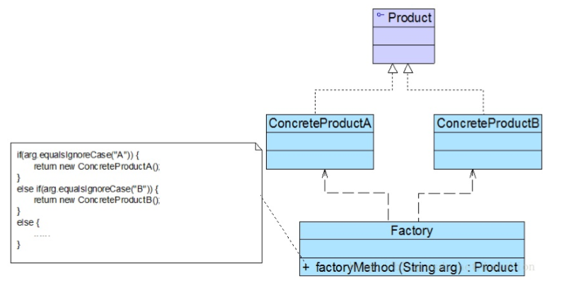

<center>简单工厂模式结构图</center>

##### 简单工厂模式的实现

实现情景：开发一套图标库，该图标库可以为应用系统提供多种不同外观的图表，例如柱状图（HistogramChart）、饼状图（PieChart）、折线图（LineChart）等。

- 抽象产品接口

```java
/**
 * 抽象图标接口，充当抽象产品类
 */
public interface Chart {
    void display();
}
```

- 具体产品类

```java
/**
 * 柱状图类，充当具体产品类
 */
public class HistogramChart implements Chart {
    public HistogramChart() {
        System.out.println("创建柱状图");
    }

    @Override
    public void display() {
        System.out.println("显示柱状图");
    }
}

/**
 * 饼状图类，充当具体产品类
 */
public class PieChart implements Chart {
    public PieChart() {
        System.out.println("创建饼状图");
    }

    @Override
    public void display() {
        System.out.println("显示饼状图");
    }
}

/**
 * 折线图类，充当具体产品类
 */
public class LineChart implements Chart {
    public LineChart() {
        System.out.println("创建折线图");
    }

    @Override
    public void display() {
        System.out.println("显示折线图");
    }
}
```

- 工厂类

```java
/**
 * 图表工厂类，充当工厂类
 */
public class ChartFactory {

    //静态工厂方法
    public static Chart getChart(String type){
        Chart chart = null;
        if ("histogram".equalsIgnoreCase(type)) {
            chart = new HistogramChart();
            System.out.println("初始化设置柱状图！");
        } else if ("pie".equalsIgnoreCase(type)) {
            chart = new PieChart();
            System.out.println("初始化设置饼状图！");
        }else if ("line".equalsIgnoreCase(type)) {
            chart = new LineChart();
            System.out.println("初始化设置折线图！");
        }
        return chart;
    }
}
```

- 测试客户端

```java
/**
 * 客户端测试类
 */
public class ChartClient {
    public static void main(String[] args) {
        Chart chart = null;
        chart = ChartFactory.getChart("line");
        chart.display();
    }
}
```

注意：本实例在创建具体 Chart 对象时必须通过修改客户端代码中的静态工厂方法的参数来更换具体产品对象，客户端需要重新编译，这对于客户端而言违反了开闭原则，可以通过引入 xml 配置文件来解决，在需要更换具体图表对象时，只需要修改 xml 配置文件，不需要更改源代码，复合开闭原则。

##### 简单工厂模式的优缺点

优点：

- 工厂类包含必要的判断逻辑，可以决定在什么时候创建哪一个具体产品对象，客户端不需要直接创建这些对象，而仅仅“消费”产品，实现了对象的创建和使用分离。
- 客户端不需要知道所创建的具体产品类的类名，只需要知道对应的参数即可。
- 通过引入配置文件，可以在不修改客户端源代码的情况下更换和增加新的具体产品类

缺点：

- 工厂类集中了所有产品的创建逻辑，职责过重，一旦不能正常工作，整个系统都会受到影响。
- **系统拓展困难，一旦添加新产品就不得不修改工厂类逻辑**，在产品类型较多时有可能造成工厂逻辑过于复杂，不利于系统的拓展和维护。
- 简单工厂模式由于使用了静态工厂方法，造成工厂角色无法形成基于继承的等级结构。

##### 简单工厂模式的适应环境

- 工厂类负责创建的对象较少，由于创建的对象较少，不会造成工厂方法中的业务逻辑太过复杂。
- 客户端只知道传入工厂类的参数，对于如何创建对象并不需要关心。


### 工厂方法模式

##### 工厂方法模式概述及定义

- 概述：工厂方法模式是简单工厂模式的延伸，它继承了简单工厂模式的优点，同时弥补了它的缺陷，更好的复合开闭原则，在增加新的具体产品对象时不需要对已有系统做任何修改。

- 定义：定义一个用于创建对象的接口，但是让子类决定将哪一个类实例化，工厂方法模式让一个类的实例化延迟到其子类。

##### 工厂方法模式结构

工厂方法模式提供一个抽象工厂接口来声明抽象工厂方法，而由其子类来具体实现工厂方法，创建具体的产品对象。工厂方法模式包含以下 4 个角色：

- **Product（抽象产品**）：它是定义产品的接口，是工厂方法模式所创建对象的超类型，也就是产品对象的公共父类。

- **ConcreteProduct（具体产品）**：它实现了抽象产品接口，某种类型的具体产品由专门的具体工厂创建，具体工厂和具体产品之间一一对应。

- **Factory（抽象工厂）**：在抽象工厂类中声明了工厂方法（Factory Method），用于返回一个产品。**抽象工厂是工厂方法模式的核心**，所有创建对象的工厂类都必须实现该接口。

- **ConcreteFactory（具体工厂）**：它是抽象工厂类的子类，实现了在抽象工厂中声明的工厂方法，并可由客户端调用，返回一个具体产品类的实例。

  

  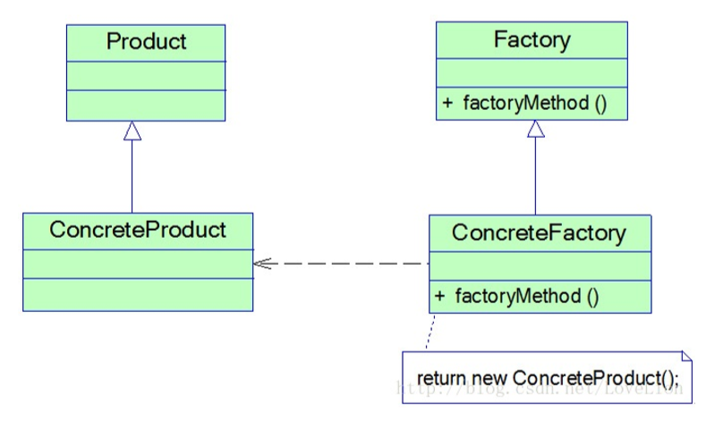

<center>工厂方法模式结构图</center>

##### 工厂方法模式实现

实现情景：某系统运行日志记录器可以通过多种途径保存系统运行日志，例如通过文件记录或数据库记录，用户可以通过修改配置更换日志记录方式。日志记录器初始化参数设置较为复杂，而且某些参数的设置有严格的先后顺序，为了更好地封装记录器的初始化过程并保证多种记录器切换的灵活性，现采用工厂方法模式来设计该系统。

- Logger 抽象产品角色

```java
/**
 * 抽象日志接口，充当抽象产品角色
 */
public interface Logger {
    void writeLog();
}
```

- xxxLogger 具体产品角色

```java
/**
 * 数据库日志记录器，充当具体产品角色
 */
public class DatabaseLogger implements Logger {
    @Override
    public void writeLog() {
        System.out.println("数据库日志记录");
    }
}

/**
 * 文件日志记录器，充当具体产品角色
 */
public class FileLogger implements Logger {
    @Override
    public void writeLog() {
        System.out.println("文件日志记录");
    }
}
```

- LoggerFactory 抽象工厂角色

```java
/**
 * 日志记录器工厂接口，充当抽象工厂角色
 */
public interface LoggerFactory {
    Logger createLogger();
}
```

- xxxLoggerFactory  具体工厂角色

```java
/**
 * 数据库日志记录器，充当具体工厂角色
 */
public class DatabaseLoggerFactory implements LoggerFactory {
    @Override
    public Logger createLogger() {
        //连接数据库，代码省略
        //创建数据库日志记录器对象
        Logger databaseLogger = new DatabaseLogger();
        //初始化数据库日志记录器对象
        return databaseLogger;
    }
}

/**
 * 文件日志记录器，充当具体工厂角色
 */
public class FileLoggerFactory implements LoggerFactory {
    @Override
    public Logger createLogger() {
        //创建文件日志记录器对象
        Logger logger = new FileLogger();
        //初始化文件日志记录器对象
        return logger;
    }
}
```

- LoggerClient 测试客户端

```java
/**
 * 客户端测试类
 */
public class LoggerClient {
    public static void main(String[] args) {
        LoggerFactory loggerFactory = null;
        Logger logger = null;
        //可引入配置文件和反射机制实现
        loggerFactory = new DatabaseLoggerFactory();
        logger = loggerFactory.createLogger();
        logger.writeLog();
    }
}
```

注意：如果需要添加并使用心得日志记录器，只需要添加一个新的具体工厂类，然后在客户端代码中修改具体工厂类的类名，原有类库的代码不需要改变。

**通过引入配置文件并使用反射机制可以实现在不修改任何客户端代码的基础上更换具体工厂类**。让系统更加符合开闭原则，具备更好的灵活性和可扩展性。

##### 工厂方法的重载

某些情况下，可以通过多种方式来初始化同一个产品类。例如前面提到的日志记录器类，可以为各种日志记录器提供默认实现，还可以为数据库日志记录器提供数据库连接字符串，为文件日志记录器提供文件路径；也可以将相关参数封装在一个 Object 类型的对象中，通过 Object 对象将配置参数传入工厂类。**此时可以提供一组重载的工厂方法，以不同的方法对产品对象进行创建。**

- 抽象工厂类

```java
/**
 * 日志记录器工厂接口，充当抽象工厂角色
 */
public interface LoggerFactory {
    Logger createLogger();
    Logger createLogger(String url);
    Logger createLogger(Object obj);
}
```

- 具体工厂类

```java
/**
 * 数据库日志记录器，充当具体工厂角色
 */
public class DatabaseLoggerFactory implements LoggerFactory {
    @Override
    public Logger createLogger() {
        //使用默认方式连接数据库，代码省略
        Logger databaseLogger = new DatabaseLogger();
        //初始化数据库日志记录器对象
        return databaseLogger;
    }
    @Override
    public Logger createLogger(String args) {
        //使用 args 作为连接字符串来连接数据库，代码省略
        Logger databaseLogger = new DatabaseLogger();
        //初始化数据库日志记录器对象
        return databaseLogger;
    }
    @Override
    public Logger createLogger(Object obj) {
        //使用封装在 obj 中的字符串来连接数据库，代码省略
        Logger databaseLogger = new DatabaseLogger();
        //使用封装在 obj 中数据来初始化数据库日志记录器对象
        return databaseLogger;
    }

}
```

##### 工厂方法模式的优缺点

优点：

- 在工厂方法模式中，工厂方法用来创建客户端所需要的产品，同时还向客户隐藏了哪种具体产品类将被初始化这一细节，用户只需要知道所需产品对象的工厂类即可，无需关心创建细节。
- 
- 
- 基于工厂角色和产品角色的多态性设计师工厂方法模式的关键。它能够让工厂自主确定创建何种产品对象，而如何创建这个对象的细节完全封装在具体工厂内部。
- 系统中加入新产品时无需修改抽象工厂和抽象产品提供的接口，无需修改客户端，也无需修改其他具体工厂和具体产品，而只要添加一个具体工厂和具体产品即可，这样系统的可扩展性好，完全符合开闭原则。

缺点：

- 添加新产品时需要同时添加具体工厂类，使得系统中的类的个数成对增加，一定程度上增加了系统的复杂性，有更多的类需要编译和运行，给系统带来一些额外的开销。

- 由于考虑到系统的可扩展性，需要引入抽象层，在客户端代码中均适用抽象层进行定义，增加了系统的抽象性和理解难度。

##### 工厂方法模式的适应环境

- 客户端不需要知道具体产品类的类名，只需要知道所对应的工厂即可，可以将具体工厂类的类名储存到配置文件或数据库中。
- 抽象工厂类通过其子类来指定创建哪个对象。在工厂方法模式中，对于抽象工厂类只需要提供一个创建产品的接口，而由其子类来确定具体要创建的对象，利用面向对象的多态性和里氏代换原则，在程序运行时子类对象覆盖父类对象，从而使得系统更容易扩展。


### 抽象工厂模式

##### 产品等级结构和产品族

- **产品等级结构：**产品等级结构即产品的继承结构，例如一个抽象类是电视机，其子类包括海尔电视机、海信电视机、TCL 电视机等等，抽象电视机和具体的电视机之间构成了一个产品等级结构。

- **产品族：**在抽象工厂模式中，产品族是指由同一个工厂生产的位于不同产品等级结构中的一组产品，例如海尔电器工厂生产的海尔电视机、海尔冰箱、海尔电视机位于电视机产品等级结构中，海尔冰箱位于冰箱产品等级结构中，海尔电视机和海尔冰箱构成了一个产品族。~~海尔快给我广告费！~~

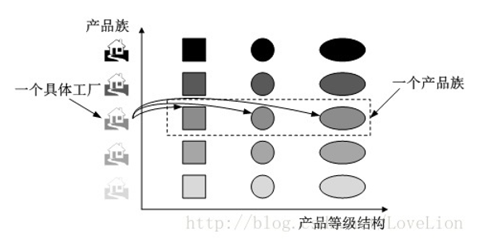

##### 抽象工厂模式概述及定义

- 概述：抽象工厂模式是所有形式的工厂模式中最为抽象和最具一般性的一种形式。抽象工厂模式和工厂方法模式最大的区别在于，工厂方法模式针对的一个产品等级结构，而抽象工厂模式需要面对多个产品等级结构。抽象工厂模式为**创建一组对象**提供了一种解决方案。

- 定义：提供一个创建一系列相关或相互依赖对象的接口，而无需指定它们的具体的类。

##### 抽象工厂模式的结构

在抽象工厂模式中，每一个具体工厂都提供了多个工厂方法用于产生多种不同类型的产品，这些产品构成了一个产品族，抽象工厂模式包含以下 4 个角色：

- **AbstractFactory（抽象工厂）**：它声明了一组用于创建一族产品的方法，每一个方法对应一种产品。

- **ConcreteFactory（具体工厂）**：它实现了在抽象工厂中声明的创建产品的方法，生成一组具体产品，这些产品构成了一个产品族，每一个产品都位于某个产品等级结构。

- **AbstractProduct（抽象产品）**：它为每种产品声明接口，在抽象产品中声明了产品所具有的业务方法。

- **ConcreteProduct（具体产品）**：它定义了具体工厂生产的具体产品对象，实现抽象产品接口中声明的业务方法。

  

  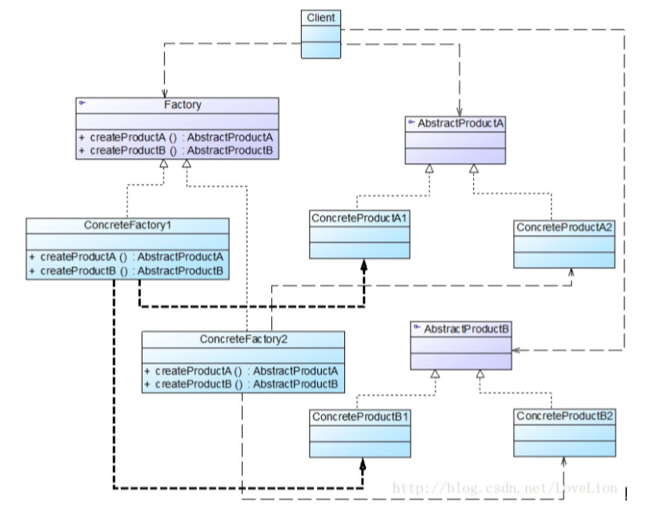

<center>抽象工厂模式结构图</center>

##### 抽象工厂模式的实现

实现场景：开发一套界面皮肤库，用户在使用时可以通过菜单来选择皮肤，不同的皮肤将提供视觉不同的按钮、文本框、组合框等界面元素，例如春天（Spring）风格的皮肤将提供浅绿色的按钮、绿色边框的文本框、绿色边框的组合框；而夏天（Summer）风格的皮肤将提供浅蓝色的按钮、蓝色边框的文本框、蓝色边框的组合框；要求皮肤库具备良好的灵活性和可扩展性，开发人员可以在不修改既有代码的基础上增加新的皮肤。

- Button 抽象产品接口

```java
/**
 * 按钮接口，充当抽象产品
 */
public interface Button {
    void display();
}
```

- xxxButton 具体产品

```java
/**
 * Spring 按钮类，充当具体产品
 */
public class SpringButton implements Button {
    @Override
    public void display() {
        System.out.println("显示浅绿色按钮");
    }
}

/**
 * Summer 按钮类，充当具体产品
 */
public class SummerButton implements Button {
    @Override
    public void display() {
        System.out.println("显示浅蓝色按钮");
    }
}
```

- TextField 抽象产品接口

```java
/**
 * 文本框接口，充当抽象产品
 */
public interface TextField {
    void display();
}
```

- xxxField 具体产品接口

```java
/**
 * Spring 文本框，充当具体产品
 */
public class SpringTextField  implements TextField{
    @Override
    public void display() {
        System.out.println("显示绿色边框文本框");
    }
}

/**
 * Summer 文本框，充当具体产品
 */
public class SummerTextField  implements TextField{
    @Override
    public void display() {
        System.out.println("显示蓝色边框文本框");
    }
}
```

- ComboBox 抽象产品接口

```java
/**
 * 组合框接口，充当抽象产品
 */
public interface ComboBox {
    void display();
}
```

- xxxComboBox 具体产品

```java
/**
 * Spring 组合框类，充当具体产品
 */
public class SpringComboBox implements ComboBox {
    @Override
    public void display() {
        System.out.println("显示绿色边框组合框");
    }
}

/**
 * Summer 组合框类，充当具体产品
 */
public class SummerComboBox implements ComboBox {
    @Override
    public void display() {
        System.out.println("显示蓝色边框组合框");
    }
}
```

- SkinFactory 抽象工厂

```java
/**
 * 界面皮肤工厂接口，充当抽象工厂（生产的产品组成一个产品族）
 */
public interface SkinFactory {
    Button createButton();
    TextField createTextField();
    ComboBox createComboBox();
}
```

- xxxSkinFactory 具体工厂

```java
/**
 * Spring 皮肤工厂，充当具体工厂
 */
public class SpringSkinFactory implements SkinFactory {
    @Override
    public Button createButton() {
        return new SpringButton();
    }
    @Override
    public TextField createTextField() {
        return new SpringTextField();
    }
    @Override
    public ComboBox createComboBox() {
        return new SpringComboBox();
    }
}

/**
 * Summer 皮肤工厂，充当具体工厂
 */
public class SummerSkinFactory implements SkinFactory {
    @Override
    public Button createButton() {
        return new SummerButton();
    }
    @Override
    public TextField createTextField() {
        return new SummerTextField();
    }
    @Override
    public ComboBox createComboBox() {
        return new SummerComboBox();
    }
}
```

- SkinClient 测试客户端

```java
/**
 * 皮肤客户端测试类
 */
public class SkinClient {
    public static void main(String[] args) {
        SkinFactory skinFactory = (SkinFactory) AbstractFactoryXmlUtil.getBean();
        if (skinFactory != null) {
            Button button = skinFactory.createButton();
            TextField textField = skinFactory.createTextField();
            ComboBox comboBox = skinFactory.createComboBox();

            button.display();
            textField.display();
            comboBox.display();
        }
    }
}
```

- xml 配置文件

```xml
<?xml version="1.0" encoding="utf-8" ?>
<!--抽象工厂模式的配置文件 xml-->
<config>
    <className>
        com.piano.creation.abstract_factory.SummerSkinFactory
    </className>
</config>
```

- xml 解析工具类

```java
/**
 * xml 工具类，用于获取 xml 配置的具体工厂类的对象
 */
class AbstractFactoryXmlUtil {
    //该方法用于从 xml 配置文件中提取具体类的类名，并返回一个实例对象
    static Object getBean() {
        try {
            //创建 DOM 文档对象
            DocumentBuilderFactory builderFactory = new DocumentBuilderFactoryImpl();
            DocumentBuilder documentBuilder = builderFactory.newDocumentBuilder();
            Document document = documentBuilder.parse(new File("src\\com\\piano\\creation\\abstract_factory\\abstract_factory.xml"));

            NodeList nodeList = document.getElementsByTagName("className");
            Node item = nodeList.item(0).getFirstChild();
            String className = item.getNodeValue();
            //通过反射创建对象
            return Class.forName(className.trim()).newInstance();
        } catch (Exception e) {
            e.printStackTrace();
            return null;
        }
    }
}
```

注意：可以通过引入配置文件和反射机制来配置皮肤的使用，如果需要增加新的皮肤，只需要增加一族新的具体产品组件并对应提供一个新的具体工厂，修改配置文件中的具体工厂类的类名即可使用新的皮肤，原有代码无需修改，符合开闭原则。

##### 开闭原则的倾斜性

上面的例子存在一个严重的问题，如果设计之初因为考虑不全面，忘记为某种类型的界面组件（以单选按钮 Radio 为例）提供不同皮肤下的风格化显示，那么再往系统添加单选按钮时将发现非常麻烦，**无法在满足开闭原则的前提下添加单选按钮。**原因是抽象工厂 SkinFactory 没有提供创建单选按钮的接口，如果需要的话，需要修改抽象工厂接口，然后逐个修改具体工厂类，此外还需要修改客户端类。

抽象工厂模式无法解决这类问题，这也是抽象工厂模式的最大缺点。**在抽象工厂模式中增加新的产品族很方便，但是增加新的产品等级结构很麻烦。**抽象工厂模式的这种性质称为开闭原则的倾斜性。
##### 抽象工厂模式的优缺点

优点：

- 抽象工厂模式隔离了具体类的生成，使得客户端并不需要知道什么被创建。由于这种隔离，更换一个具体工厂就变得相对容易，所有的具体工厂都实现了抽象工厂中定义的那些公共接口，因此只需要修改具体工厂的实例就可以在某种程度上改变整个软件系统的行为。
- 当一个产品族的多个对象被设计成一起工作时，它能够保证客户端始终只使用同一个产品族中的对象。
- 增加新的产品族很方便，无需修改已有系统，符合开闭原则。

缺点：

- 增加新的产品等级结构麻烦，需要对原有系统进行较大的修改，甚至需要修改抽象层代码，这显然会带来较大的不便，违背了开闭原则。

##### 抽象工厂模式的适用环境

- 系统中有多于一个产品族，而每次只使用其中一个产品族。可以通过配置文件等方式来使用户能够动态改变产品族，也可以很方便增加新的产品族。
- 产品等级结构稳定，在设计完成之后不会向系统增加新的产品等级结构或者删除已有的产品等级结构。


### 建造者模式

##### 建造者模式概述及定义

- 概述：构造者模式将客户端与包含多个部件的复杂对象的创建过程分离，客户端无须知道复杂对象的内部组成部分和装配方式，只需要知道所需构造者的类型即可。建造者模式关注如何一步一步地创建一个复杂对象，不同的构造者定义了不同的创建过程。
- 定义：讲一个复杂对象的构建与它的表示分离，使得同样的构建过程可以创建不同的表示。

##### 建造者模式的结构

建造者模式包含如下 4 个角色：

- **Builder（抽象构造者）**：它为创建一个产品对象的各个部件指定抽象接口，在该接口中一般声明两类方法，一类方法是 buildPartX() ，它们用于创建复杂对象的各个部件；另一类方法是 getResult() ，它们用于返回复杂对象。Builder 既可以是抽象类，也可以是接口。

- **ConcreteBuilder（具体构造者）**：它实现了 Builder 接口，实现各个部件的具体构造和装配方法，定义并明确所创建的复杂对象，还可以提供一个方法返回创建好的复杂产品对象（该方法也可以由抽象构造者实现）。

- **Product（产品）**：它是被构建的复杂对象，包含多个组成部件，具体构造者创建该产品的内部表示并定义它的装配过程。

- **Director（指挥者）**：指挥者又称为导演类，它负责安排复杂对象的构造次序，指挥者与抽象构造者直接存在关联关系，可以在其 construct() 构造方法中调用构造者对象的部件构造与装配方法，完成复杂对象的构造。客户端一般只需要与指挥者进行交互，在客户端确定具体构造者的类型，并实例化具体构造者对象（也可以通过配置文件和反射机制实现），然后通过指挥者类的构造函数或者 Setter 方法将该对象传入指挥者类。

  

  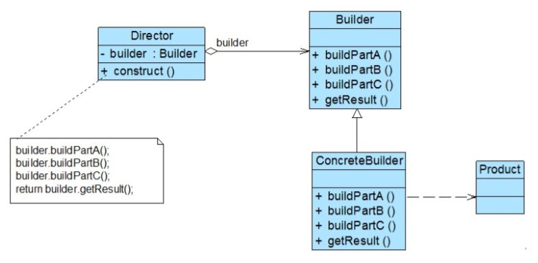

<center>建造者模式结构图</center>

##### 建造者模式的实现

实现场景：开发一款基于角色扮演的游戏，通过分析发现，游戏角色是一个复杂对象，它包含类型、性别、脸型、服装、发型等组成部分，不同类型的游戏角色的特性有所差异，例如“天使”拥有美丽的笑容和披肩的长发，“恶魔”极其丑陋，留着光头并穿一件刺眼的黑衣。无论哪种造型的角色，它的创建步骤都大同小异，都需要逐步创建其组成部分，再将各个组成部分装配成一个完整的游戏角色。

- 游戏角色类，充当复杂产品

```java
/**
 * 游戏角色类，充当负责产品对象
 */
public class Actor {
    private String type; //角色类型
    private String sex; //性别
    private String face; //脸型
    private String costume; //服装
    private String hairstyle; //发型
    //setter 和 getter方法省略
    }
```

- 游戏角色构造者，充当抽象构造者

```java
/**
 * 游戏角色构造者，充当抽象构造者
 */
public abstract class ActorBuilder {
    protected Actor actor = new Actor();

    abstract void buildType();
    abstract void buildSex();
    abstract void buildFace();
    abstract void buildCostume();
    abstract void buildHairstyle();

    //工厂方法，返回一个完整的游戏角色对象
    public Actor createActor() {
        return this.actor;
    }
}
```

- 具体构造者

```java
/**
 * 英雄角色构造者，充当具体构造者
 */
public class HeroActorBuilder extends ActorBuilder {
    @Override
    void buildType() {
        actor.setType("英雄");
    }
    @Override
    void buildSex() {
        actor.setSex("难");
    }
    @Override
    void buildFace() {
        actor.setFace("英俊");
    }
    @Override
    void buildCostume() {
        actor.setCostume("盔甲");
    }
    @Override
    void buildHairstyle() {
        actor.setHairstyle("飘逸");
    }
}

/**
 * 天使角色构造者，充当具体构造者
 */
public class AngelActorBuilder extends ActorBuilder {
    @Override
    void buildType() {
        actor.setType("天使");
    }
    @Override
    void buildSex() {
        actor.setSex("女");
    }
    @Override
    void buildFace() {
        actor.setFace("漂亮");
    }
    @Override
    void buildCostume() {
        actor.setCostume("白裙");
    }
    @Override
    void buildHairstyle() {
        actor.setHairstyle("披肩长发");
    }
}

/**
 * 恶魔角色构造者，充当具体构造者
 */
public class DevilActorBuilder extends ActorBuilder {
    @Override
    void buildType() {
        actor.setType("恶魔");
    }
    @Override
    void buildSex() {
        actor.setSex("妖");
    }
    @Override
    void buildFace() {
        actor.setFace("丑陋");
    }
    @Override
    void buildCostume() {
        actor.setCostume("黑衣");
    }
    @Override
    void buildHairstyle() {
        actor.setHairstyle("光头");
    }
}
```

- 角色控制类，充当指挥者

```java
/**
 * 角色控制器，充当指挥者
 */
public class ActorController {
    //逐步构建复杂产品对象
    public Actor construct(ActorBuilder actorBuilder) {
        Actor actor = null;

        actorBuilder.buildType();
        actorBuilder.buildSex();
        actorBuilder.buildFace();
        actorBuilder.buildCostume();
        actorBuilder.buildHairstyle();
        actor = actorBuilder.createActor();
        return actor;
    }
}
```

- 客户端测试类

```java
/**
 * 游戏角色客户端测试类
 */
public class ActorClient {
    public static void main(String[] args) {
        Actor actor = null;
        //反射生成具体构造者对象
        ActorBuilder actorBuilder = (ActorBuilder) BuilderXmlUtil.getBean();

        ActorController actorController = new ActorController();
        //通过指挥者创建完整的构造者对象
        actor = actorController.construct(actorBuilder);

        System.out.println(actor);
    }
}
```

注意：配置文件和抽象工厂模式的一样，所以省略。当需要增加新的具体角色构造者时只需要将新增的具体角色构造者作为抽象角色构造者的子类，然后修改配置文件，既有代码不用变，符合开闭原则。

##### 指挥者类的深入讨论

- 省略 Director 指挥者这个角色

  某些情况下，为了简化系统结构，可以将 Director 和 Builder 合并，在 Builder 中提供构造复杂对象的 construct() 方法，由于 Builder 通常为抽象类，因此可以将 construct() 方法定义为静态方法，以便客户端能够直接调用。此时 Builder 的代码如下：

```java
/**
 * 游戏角色构造者，充当抽象构造者
 */
public abstract class ActorBuilder {
    protected static Actor actor = new Actor();

    public static Actor construct(ActorBuilder actorBuilder) {
        actorBuilder.buildType();
        actorBuilder.buildSex();
        actorBuilder.buildFace();
        actorBuilder.buildCostume();
        actorBuilder.buildHairstyle();
        return actor;
    }
}
```

- 钩子方法的引入

  建造者模式除了可以逐步构建一个复杂产品对象外，还可以通过 Director 类更加精细地控制产品的创建过程，例如增加一类称为钩子方法（Hook Method）的特殊方法来控制是否对某个 buildPartX() 进行调用。**钩子方法的返回值通常是 Boolean 类型，方法名一般为 isXXX()** ，钩子方法定义在抽象构造者中。为了判断某个角色是否光头，在 ActorBuilder 为之提供一个默认实现，其返回值为 false

```java
/**
 * 游戏角色构造者，充当抽象构造者
 */
public abstract class ActorBuilder {
    protected Actor actor = new Actor();

    abstract void buildType();
    abstract void buildSex();
    abstract void buildFace();
    abstract void buildCostume();
    abstract void buildHairstyle();

    //钩子方法
    public boolean isBareheaded() {
        return false;
    }
    
    //工厂方法，返回一个完整的游戏角色对象
    public Actor createActor() {
        return this.actor;
    }
}
```

- 覆盖钩子方法

  假如“恶魔”角色无须构造头部部件，则对应的具体构造器 DevilActorBuilder 将覆盖 isBareheaded() 方法，并将返回值改为 true，相应的 ActorController 也要修改。代码如下：

```java
/**
 * 恶魔角色构造者，充当具体构造者
 */
public class DevilActorBuilder extends ActorBuilder {
    @Override
    void buildType() {
        actor.setType("恶魔");
    }
// .....
    //覆盖钩子方法
    @Override
    public boolean isBareheaded() {
        return true;
    }
}

/**
 * 角色控制器，充当指挥者
 */
public class ActorController {
    //逐步构建复杂产品对象
    public Actor construct(ActorBuilder actorBuilder) {
        Actor actor = null;

        actorBuilder.buildType();
        actorBuilder.buildSex();
        actorBuilder.buildFace();
        actorBuilder.buildCostume();
        //通过钩子方法来控制产品的构建
        if (!actorBuilder.isBareheaded()) {
            actorBuilder.buildHairstyle();
        }
        actor = actorBuilder.createActor();
        return actor;
    }
}
```

##### 建造者模式的优缺点

优点：

- 在建造者模式中，客户端不必知道产品内部组成的细节，将产品本身与产品的创建过程解耦，使得同样的创建过程可以创建不同的产品。
- 每一个具体构造者都相对独立，而与其他具体构造者无关，因此可以很方便地替换具体构造者或增加新的具体构造者。由于指挥者针对抽象构造者编程，增加新的具体构造者无须修改既有代码，系统扩展很方便。
- 可以更加精细地控制产品的创建过程。将复杂产品的创建步骤分解在不同的方法中，使得创建过程更加清晰，也更方便使用程序来控制创建过程。

缺点：

- 建造者模式所创建的产品一般具有较多的共同点，其组成部分相似，如果产品之间的差异性很大，则不太适用，例如很多组成部分不同，不适用建造者模式。
- 如果系统内部变化复杂，可能会导致需要定义很多具体构造者来实现这种变化，导致系统变得很庞大，增加系统的理解难度和运行成本。

##### 建造者模式的适用环境

- 需要生成的产品对象有复杂的内部结构，这些产品通常包含多个成员变量。
- 需要生成的产品对象的属性相互依赖，需要指定其生成的顺序。
- 对象的创建过程独立于创建该对象的类，在构造者模式中通过引入指挥类将创建过程封装在指挥者类中，而不在建造者类中和客户端中。
- 隔离复杂对象的创建和使用，并使得相同的创建过程可以创建不同的产品。


### 原型模式

##### 原型模式的概述及定义

- 概述：将一个原型对象传给要发动创建的对象（即客户端对象），这个要发动创建的对象通过请求原型对象复制自己来实现创建过程。创建新对象（也称为克隆对象）的工厂就是原型类自身，工厂方法由负责复制原型对象的克隆方法来实现，**克隆方法创建的对象是一个全新的对象，它们在内存中拥有新的地址，通常对克隆所产生的对象进行修改不会对原型对象造成任何影响，每一个克隆对象都是相互独立的。**
- 定义：使用原型实例指定待创建对象的类型，并且通过复制这个原型来创建新的对象。

##### 原型模式的结构

原型模式包含以下 3 个角色：

- **Prototype（原型抽象类）**：它是声明克隆方法的接口，是所有具体原型类的公共父类，它可以是抽象类也可以是接口，甚至可以是具体的实现类。
- **ConcretePrototype（具体抽象类）**：它实现在抽象原型类中声明的克隆方法，在克隆方法中返回自己的一个克隆对象。
- **Client（客户端）**：在客户端类中，让一个原型对象克隆自身从而创建一个新的对象，只需要直接实例化或通过工厂方法等方式创建一个原型对象，再通过调用该对象的克隆方法即可得到多个相同的对象。由于客户端针对抽象原型类编程，因此用户可以根据需要选择具体原型类。

##### 理解浅克隆和深克隆

根据在复制原型对象的同时是否复制包含在原型对象中引用类型的成员变量，原型模式的克隆机制分为两种，即浅克隆（Shadow Clone）和深克隆（Deep Clone）。

- 浅克隆：当原型对象被复制时只复制它本身和其中包含的值类型的成员变量，而引用类型（如类，接口，数组等复杂数据类型）的成员变量并没有复制，原型对象和克隆对象的引用类型的成员变量指向相同的内存地址。**对象可以通过实现一个标识接口 Cloneable，然后调用公共对象 Object 的 clone() 方法来实现浅克隆。**
- 深克隆：无论原型对象的成员变量是值类型还是引用类型，都将复制一份给克隆对象。**可以通过序列化（Serialization）等方式来实现深克隆。序列化就是将对象写到流的过程，写到流的对象是原有对象的一个复制，而原有对象仍然存在与内存中。能够实现序列化的对象其类必须实现 Serializable 接口。**

##### 原型模式的实现

实现场景：在使用某 OA 系统，员工发现他们每周的工作周报很多内容都是重复的，为了提高效率，大家迫切希望有一种机制能够快速创建相同或者相似的周报，包括创建周报的附件。

- 附件类

```java
/**
 * 附件类
 */
public class Attachment implements Serializable {
    private String name;
    public String getName() {
        return name;
    }
    public void setName(String name) {
        this.name = name;
    }
}
```

- 工作周报类，充当原型角色

```java
/**
 * 工作周报类，充当原型角色，浅克隆方式
 */
public class WeeklyLog implements Serializable, Cloneable {
    private String name; //周报名称
    private String date; //提交日期
    private String content; //内容
    private Attachment attachment; //附件
	//省略 getter和setter方法
    
    //深克隆方法
    public WeeklyLog deepClone() throws IOException, ClassNotFoundException {

        ByteArrayOutputStream outputStream = new ByteArrayOutputStream();
        ObjectOutputStream objectOutputStream = new ObjectOutputStream(outputStream);
        objectOutputStream.writeObject(this);

        ByteArrayInputStream arrayInputStream = new ByteArrayInputStream(outputStream.toByteArray());
        ObjectInputStream objectInputStream = new ObjectInputStream(arrayInputStream);
        Object object = objectInputStream.readObject();

        return (WeeklyLog) object;
    }
    //浅克隆方法
    @Override
    public WeeklyLog clone() {
        WeeklyLog weeklyLog = null;
        try {
            weeklyLog = (WeeklyLog) super.clone();
        } catch (CloneNotSupportedException e) {
            e.printStackTrace();
        }
        return weeklyLog;
    }
}
```

- 客户端测试类

```java
/**
 * 原型模式测试客户端
 */
public class WeeklyLogClient {
    public static void main(String[] args) throws Exception{
        //创建附件对象
        Attachment attachment = new Attachment();
        //创建原型对象
        WeeklyLog weeklyLog = new WeeklyLog();
        weeklyLog.setAttachment(attachment);
        //浅克隆的新对象
        WeeklyLog cloneWeeklyLog = weeklyLog.clone();

        System.out.println("浅克隆周报是否相同："+(weeklyLog==cloneWeeklyLog));
        System.out.println("浅克隆附件是否相同："+(weeklyLog.getAttachment()==cloneWeeklyLog.getAttachment()));

        //深克隆的新对象
        WeeklyLog deepClone = weeklyLog.deepClone();
        System.out.println("深克隆周报是否相同："+(weeklyLog==deepClone));
        System.out.println("深克隆附件是否相同："+(weeklyLog.getAttachment()==deepClone.getAttachment()));
    }
}
```

##### 原型管理器

原型管理器（Prototype Manager）将多个原型对象存储在一个集合中供客户端使用，它是一个专门负责克隆对象的工厂，其中定义了一个集合用于存储原型对象，如果需要某个原型对象的一个克隆，可以通过复制集合中对应的原型对象来获得。在原型管理器中针对抽象原型类进行编程，以便扩展。**原型管理器一般设置成单例类。**

```java
/**
 * 原型管理器，这个类一般设置成单例类
 */
public class PrototypeManager {
    //使用 Hashtable 存储原型对象
    private Hashtable prototypeTable = new Hashtable();
    
    public PrototypeManager() {
        prototypeTable.put("A", new Attachment());
        prototypeTable.put("B", new WeeklyLog());
    }
    
    public void add(String key, Prototype prototype) {
        prototypeTable.put(key, prototype);
    }
    
    public Prototype get(String key) {
        Prototype prototype = null;
        prototype = ((Prototype) prototypeTable.get(key)).clone();
        return prototype;
    }
}
```

##### 原型模式的优缺点

优点：

- 当创建新的对象实例较为复杂时，通过原型模式复制一个已有实例可以提高新实例的创建效率。
- 原型模式简化了创建结构，原型模式中产品的复制是通过封装在原型类中的克隆方法实现的，无须专门的工厂类来创建产品。
- 可以使用深克隆的方式保存对象的状态，使用原型模式将对象复制一份并将其状态保存起来，以便在需要的时候使用（例如恢复到某一历史状态），可辅助实现撤销操作。

缺点：

- 需要为每一个类配备一个克隆方法，而且该克隆方法位于一个类的内部，当对已有的类进行改造时需要修改源代码，违背了开闭原则。
- 在实现深克隆时需要编写较为复杂的代码，而且当对象之间存在多重的嵌套引用时，为了实现深克隆，每一层对象对应的类都必须支持深克隆，实现可能会比较麻烦。

##### 原型模式的适用环境

- 创建新对象成本较大，新对象可以用过复制已有对象来获得，如果是相似对象，则可以对其成员变量稍作修改。
- 系统要保存对象的状态，而对象的状态的变化很小。
- 需要避免使用分层次的工厂类来创建分层次的对象，并且类的实例对象只有一个或很少的几个组合状态，通过复制原型对象得到新实例可能比使用构造器函数创建一个新实例更加方便。


### 单例模式

##### 单例模式的概述及定义

- 概述：单例模式是结构最简单的一个设计模式，在它的核心结构中只包含一个被称为单例类的特殊类。通过单例模式可以确保系统中的一个类只有一个实例而且该实例易于被外界访问，从而方便对实例个数进行控制，节约系统资源。
- 定义：定义一个类只有一个实例，并提供一个**全局访问**点来访问这个唯一的实例。单例模式有三个要点：
  - **某个类只能有一个实例；**
  - **它必须自行创建这个实例；**
  - **它必须自行向整个系统提供这个实例；**

##### 单例模式的结构

单例模式只包含一个单例角色，也就是 Singleton。

对于 Singleton，在其内部创建它的唯一实例，并通过静态方法 getInstance() 让客户端可以使用它的唯一实例；为了防止在外部对单例类实例化，将其构造器函数的可见性设为 private，在单例类内部定义了一个 Singleton 类型的静态对象作为供外部共享访问的唯一实例。

##### 单例模式的实现

- 最简单的实现方案（线程不安全）

```java
/**
 * 最简单的单例模式(线程不安全)
 */
public class SimpleSingleton {
    private static SimpleSingleton singleton = null;

    private SimpleSingleton() {
    }
    public static SimpleSingleton getInstance() {
        if (singleton == null) {
            singleton = new SimpleSingleton();
        }
        return singleton;
    }
}
```

##### 饿汉式单例与懒汉式单例

- **饿汉式单例（线程安全）**，当类被加载时，静态变量 singleton 会被初始化，此时类的私有构造函数会被调用，单例类的唯一实例将被创建。

```java
/**
 * 饿汉式单例，线程安全
 */
public class EagerSingleton {
    private static final EagerSingleton singleton = new EagerSingleton();

    private EagerSingleton() {
    }

    public static EagerSingleton getInstance() {
        return singleton;
    }
}
```

- **懒汉式单例（线程安全）**

与饿汉式单例类相同的是，懒汉式单例类（Lazy Singleton）的构造函数也是私有的。与饿汉式单例类不同的是，懒汉式单例类在第一次被引用时将自己实例化，在懒汉式单例类被加载时不会被初始化，因为锁定了整个方法，代码效率不是很高。

```java
/**
 * 懒汉式单例类，锁定方法
 */
public class LazySingleton {
    private static LazySingleton singleton = null;
    private LazySingleton() {
        
    }
    // synchronized 关键字锁定方法
    public synchronized static LazySingleton getInstance() {
        if (singleton == null) {
            singleton = new LazySingleton();
        }
        return singleton;
    }
}
```

- **双重检查锁定的懒汉式单例（线程安全）**，静态变量必须加 volatile 关键字修饰，使多个线程之间的内存可见，通过锁定代码块的方式，提高了代码的执行效率。

```java
/**
 * 双重检查锁定的单例类
 */
public class DoubleCheckSingleton {
    //必须加 volatile 关键字，使多个线程之间的内存可见
    private static volatile DoubleCheckSingleton singleton = null;

    private DoubleCheckSingleton() {
    }

    //双重检查锁定
    public static DoubleCheckSingleton getInstance() {
        if (singleton == null) {
            //锁定代码块
            synchronized (DoubleCheckSingleton.class) {
                if (singleton == null) {
                    singleton = new DoubleCheckSingleton();
                }
            }
        }
        return singleton;
    }
}
```

- 饿汉式单例类和懒汉式单例类的比较

饿汉式单例类在类加载时就将自己实例化，它的优点在于考虑多个线程同时访问的问题，可以确保实例的唯一性；从调用速度和反应时间角度来讲，由于单例对象一开始就得以创建，因此要优于懒汉式；但是无论系统在运行时是否需要使用该单例对象，由于在类加载时该对象就需要创建，因此从资源利用效率角度来讲饿汉式不如懒汉式。

- 静态内部类实现单例模式

  饿汉式单例类不能实现延迟加载，不管将来用不用始终占据内存；懒汉式单例类线程安全控制烦琐，而且性能受影响。可见，无论是饿汉式还是懒汉式都存在一些问题。为了克服这些问题，**在 Java 语言中可以通过 Initialization on Demand Holder 技术来实现单例模式。**使用内部类的方式既可以实现延迟加载，又可以保证线程安全，不影响系统性能。

```java
/**
 * 静态内部类实现单例模式
 */
public class StaticInnerSingleton {
    private StaticInnerSingleton() {
    }

    //静态内部类
    private static class InnerSingleton {
        private static final StaticInnerSingleton singleton = new StaticInnerSingleton();
    }

    public StaticInnerSingleton getInstance() {
        return InnerSingleton.singleton;
    }
}
```

##### 单例模式的优缺点

优点：

- 单例模式提供了对唯一实例的受控访问，因为单例类封装了它的唯一实例，所以它可以严格控制客户怎样以及何时访问它。
- 由于在系统中只存在一个对象，因此可以节约系统资源，对于一些需要频繁创建和销毁的对象，单例模式无疑提高系统的性能。
- 允许可变数目的实例。基于单例模式可以进行扩展，使用与控制单例对象相似的方法来获得指定个数的实例对象，既节省系统资源，又解决了由于单例对象共享过多有损性能的问题。（注：自行提供指定数目实例对象的类可称为多例类）

缺点：

- 由于单例模式中没有抽象层，因此单例类的扩展有很大的困难。
- 单例类的职责过重，在一定程度上违背了单一职责原则。因为单例类既提供了业务方法，又提供了创建对象的方法。将对象的创建和对象本身的功能耦合在一起。
- 因为存在垃圾回收机制，因此如果实例化的共享对象长时间不被利用，系统会认为它是垃圾，会自动销毁并回收资源，下次利用时又将重新实例化，这将导致共享的单例对象状态的丢失。

##### 单例模式的适用环境

- 系统只需要一个实例对象，例如系统要求提供一个唯一的序列号生成器或资源管理器，或者因为资源消耗太大只允许创建一个对象。
- 客户调用类的单个实例只允许使用一个公共访问点，除了该公共访问点，不能通过其他途径访问该实例。

### 适配器模式

##### 结构型模式

结构型模式可以分为**类结构型模式**和**对象结构型模式**。类结构型模式关心类的组合，由多个类可以组合成一个更大的系统，在类结构型模式中一般只存在继承关系和实现关系；而对象结构型模式关心类与对象的组合，通过关联关系在一个类中定义另一个类的实例对象，然后通过该对象调用相应的方法，根据合成复用原则，在系统中尽量使用关联关系来替代继承关系，因此一部分结构型模式都是对象结构型模式。

##### 适配器模式的概述及定义

- 概述：适配器模式引入了一个被称为适配器（Adapter）的包装类，而它所包装的对象称为适配者（Adaptee），即被适配的类。适配器的实现就是把客户端的请求转化为对适配者的相关接口的调用。也就是说，当客户端调用**适配器的方法**时在适配器类的内部将调用**适配者类的方法**。
- 定义：**将一个类的接口转换成客户希望的另一个接口。适配器模式让那些接口不兼容的类可以一起工作。**

##### 适配器模式的结构

适配器模式包含以下 3 个角色：

- **Target（目标抽象类）**：目标抽象类定义客户所属的接口，可以是一个抽象类或接口，也可以是具体类。在类适配器中，由于 Java 不支持多重继承，它只能是接口。

- **Adapter（适配器类）**：它可以调用另一个接口，作为一个转化器，对 Adaptee 和 Target 进行适配。适配器 Adapter 是适配器模式的核心，在类适配器中，它通过**实现 Target 接口并继承 Adaptee 类**来使两者产生联系；在对象适配器中，它通过**继承 Target 并关联一个 Adaptee 对**象使二者产生联系。

- **Adaptee（适配者类）**：适配者即被适配的角色，它定义了一个已经存在的接口，这个接口需要适配，适配者类一般是具体类，包含了客户希望使用的业务方法，在某些情况下甚至没有适配者类的源代码。

  

  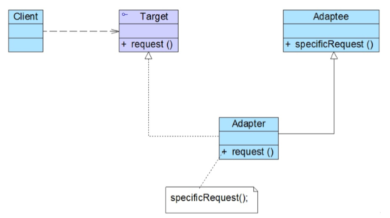

  <center>类适配器模式结构图</center>

  

  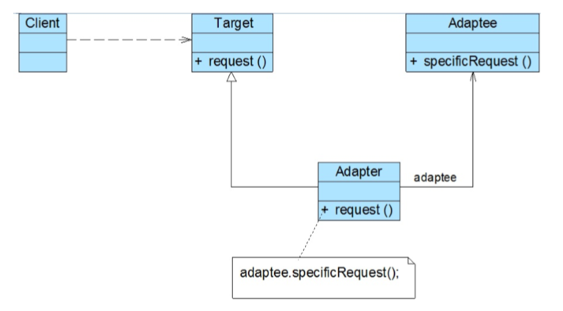

<center>对象适配器模式结构图</center>

适配器模式可以将一个类的接口和另一个类的接口匹配起来，使用的前提是不能或不想修改适配者接口和抽象目标类接口。适配器模式更多的是强调对代码的组织，而不是功能的实现。

##### 适配器模式的实现

实现场景：开发一款儿童玩具汽车，该玩具汽车在移动过程中伴随着灯光闪烁和声音提示。以往的产品已经实现了控制灯光闪烁和声音提示的程序，为了重用先前的代码并且使汽车控制软件具有更好的灵活性和扩展性，现使用适配器模式设计该玩具汽车控制软件。

- 目标抽象类

```java
/**
 * 汽车控制类，充当目标抽象类
 */
public abstract class CarController {
    public void move() {
        System.out.println("玩具汽车移动");
    }
    //发出声音
    abstract void phonate();
    //灯光闪烁
    abstract void twinkle();
}
```

- 适配者

```java
/**
 * 警笛类，充当适配者
 */
public class PoliceSound {
    public void alarmSound() {
        System.out.println("发出警笛声音");
    }
}

/**
 * 警灯类，充当适配者
 */
public class PoliceLamp {
    public void alarmLamp() {
        System.out.println("呈现警灯闪烁");
    }
}
```

- 适配器类

```java
/**
 * 警车适配器，充当适配器
 */
public class PoliceCarAdapter extends CarController{

    //定义适配者 PoliceSound 对象
    private PoliceSound policeSound;
    //定义适配者 PoliceLamp 对象
    private PoliceLamp policeLamp;

    public PoliceCarAdapter() {
        this.policeSound = new PoliceSound();
        this.policeLamp = new PoliceLamp();
    }

    //发出警笛声音
    @Override
    void phonate() {
        //调用适配者类 PoliceSound 的方法
        policeSound.alarmSound();
    }

    //呈现警灯闪烁
    @Override
    void twinkle() {
        //调用适配者类 PoliceLamp 的方法
        policeLamp.alarmLamp();
    }
}
```

- 客户端测试类

```java
/**
 * 适配器客户端测试类
 */
public class AdapterClient {
    public static void main(String[] args) {
        CarController carController = new PoliceCarAdapter();

        carController.move();
        carController.phonate();
        carController.twinkle();
    }
}
```

总结：本实例中目标抽象类是一个抽象类，而不是接口，并且实例中的适配器类 PoliceCarAdapter 同时适配了两个适配者，由于 Java 语言不支持多重类继承，因此本实例只能通过对象适配器来实现，而不能用类适配器。也可以参考前面的设计模式引入配置文件，并且通过反射机制获得适配器对象，那样如果需要使用其他声音类或灯光类，可以增加一个新的适配器类，使用新的适配器类来适配新的声音类或灯光类，原有代码无须改变。

##### 缺省适配器模式

**缺省适配器模式定义（Default Adapter Pattern）**：当不需要实现一个接口提供的所有方法时，可先设计一个抽象类实现该接口，并为接口中的每个方法提供一个默认实现（空方法），那么该抽象类的子类可以选择性地覆盖父类的某些方法来实现需求，它适用于不想使用一个接口中的所有方法的情况，又称为单接口适配器模式。

缺省适配器模式包含以下 3 个角色：

- **ServiceInterface（适配者接口）**：通常在该接口中声明了大量的方法。
- **AbstractServiceClass（缺省适配器类）**：它是缺省适配器模式的核心类，使用空方法的形式实现了在 ServiceInterface 接口中声明的方法。通常将它定义为抽象类，因为对它进行实例化没有意义。、
- **ConcreteServiceClass（具体业务类）**：它是缺省适配器类的子类，可以根据需要有选择性地覆盖在适配器类中定义的方法。

```java
/** 
 * 适配者接口
 */
public interface ServiceInterface {

    //定义了许多方法
    void serviceMethod(); 
    void serviceMethod2(); 
    void serviceMethod3(); 
}

/**
 * 缺省适配器类，实现接口，但是只是空方法
 */
public class AbstractServiceClass implements ServiceInterface {
    @Override
    public void serviceMethod() {

    }

    @Override
    public void serviceMethod2() {

    }

    @Override
    public void serviceMethod3() {

    }
}

/**
 * 具体业务类
 */
public class ConcreteServiceClass extends AbstractServiceClass {

    @Override
    public void serviceMethod() {
        System.out.println(" 有选择覆盖 serviceMethod ");
    }
}
```


##### 双向适配器

在对象适配器模式的使用过程中，如果在适配器中同时包含了对目标类和适配者的引用，适配者可以通过它调用目标类中的方法，目标类也可以通过它调用适配者类中的方法，那么该适配器就是一个双向适配器。

##### 适配器模式的优缺点

优点：

- 将目标类和适配者类解耦，通过引入一个适配器类来重用现有的适配者类，无须修改原有结构。
- 增加了类的透明性和复用性，将具体的业务实现过程封装在适配者类，对于客户端而言是透明的，而且提高了适配者的复用性，同一个适配者类可以在多个不同的系统中复用。
- 灵活性和可扩展性都非常好，通过使用配置文件可以很方便地更换适配器，也可以在不修改原有代码的基础上增加新的适配器类，符合开闭原则。
- 对于类适配器模式：
  - 由于适配器是适配者的子类，因此可以在适配器类置换一些适配者的方法，使得适配器的灵活性更强。
- 对于对象适配器：
  - 一个对象适配器可以把多个不同的适配者适配到同一个目标。
  - 可以适配一个适配者的子类，由于适配器和适配者是关联关系，根据里氏代换原则，适配者的子类也可通过该适配器进行适配。

缺点： 

- 对于类适配器：
  - 对于 Java 而言，它不支持多重继承，目标抽象类只能是接口，并且一次只能适配一个适配者。
  - 适配者类不能为 final 修饰的类。

- 对于对象适配器：
  - 要在适配器中置换适配者类的某些方法比较麻烦。如果一定要置换掉适配者类的一个或多个方法，可以先做一个适配者类的子类，将适配者类的方法置换掉，然后再把适配者类的子类当成真正的适配者进行适配，实现过程较为复杂。

##### 适配器模式的适用环境

- 系统需要使用一些现有的类，而这些类的接口（例如方法名）不符合系统的需要，甚至没有这些类的源代码。
- 想创建一个可以重复使用的类，用于和彼此之间没有太大关联的类（包含一些可能在将来引进的类）一起工作。


### 桥接模式

##### 桥接模式的概述及定义

- 概述：桥接模式是一种对象结构型模式，它用一种巧妙的方式处理多层继承存在的问题，**用抽象关联取代了传统的多层继承，将类之间的静态继承关系转换成动态的对象组合关系**，使得系统更加灵活，并易于扩展，同时有效地控制了系统中类的个数。
- 定义：将抽象部分与它的实现部分解耦，使得两者都能够独立变化。

##### 桥接模式的结构

桥接模式包含以下 4 个角色：

- **Abstraction（抽象类）**：通常是抽象类而不是接口，其定义了一个 Implementor（实现类接口）类型的对象并可以维护该对象，它与 Implementor 具有关联关系，它既可以包含抽象业务方法，也可以已包含具体业务方法。

- **RefinedAbstraction（扩充抽象类）**：它扩充了由 Abstraction 定义的接口，通常情况下不再是抽象类而是具体类，实现了在 Abstraction  中声明的抽象业务方法，在 RefinedAbstraction 中可以调用在 Implementor 中定义的业务方法。

- **Implementor（实现类接口）**：它是定义实现类的接口，这个接口不一定要与 Abstraction 的接口完全一致，事实上这两个接口可以完全不同。Implementor  接口仅提供基本操作，而 Abstraction 定义的接口可能会做更多更复杂的操作。Implementor  接口对这些基本操作进行了声明，而具体实现交给其子类。通过关联关系，在 Abstraction 中不仅拥有自己的方法，还可以调用到 Implementor  中定义的方法，使用关联关系来替代继承关系。

- **ConcreteImplementor（具体实现类）**：它具体实现了 Implementor  接口，在不同的 ConcreteImplementor  中提供基本操作的不同实现，在程序运行时 ConcreteImplementor  对象将替代其父类对象，提供给抽象类具体的业务操作方法。

  

  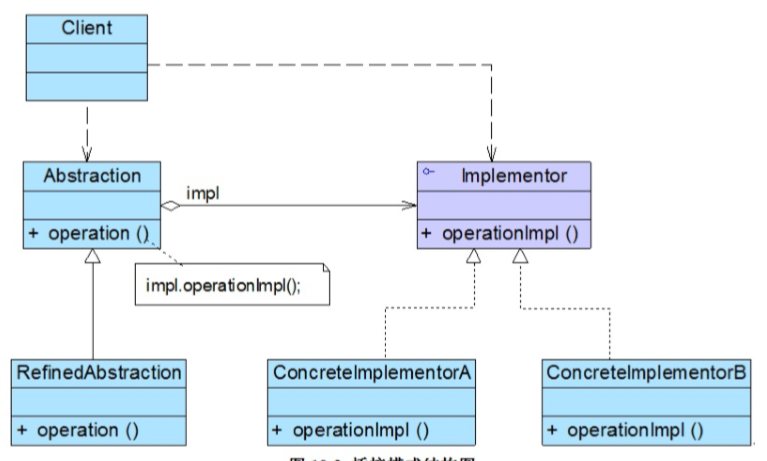

<center>桥接模式结构图</center>

##### 桥接模式的实现

实现情景：开发一款跨平台的图像浏览系统，要求能够显示 BMP、JPG、GIF、PNG 等多种格式的文件，并且能够在 Windows、Linux、Unix 等系统上运行。系统首先将各种格式的文件解析成像素矩阵（Matrix），然后将像素矩阵显示在屏幕上，在不同的操作系统中可以调用不同的绘制函数来绘制像素矩阵，系统需要有较好的扩展性，以便将来支持新的文件格式和操作系统。

- 像素矩阵类

```java
/**
 * 像素矩阵类，它是一个辅助类
 * 各种格式的图像文件最终都被转化为像素矩阵
 * 不同的操作系统提供不同的方式显示像素矩阵
 */
public class Matrix {
    //代码省略
}
```

- 抽象操作系统，充当实现类接口

```java
/**
 * 抽象操作系统，充当实现类接口
 */
public interface OSImg {
    //显示像素矩阵 matrix
    void doPaint(Matrix matrix);
}
```

- 具体操作系统，充当具体实现类

```java
/**
 * Unix 操作系统，充当具体实现类
 */
public class UnixImg implements OSImg {
    @Override
    public void doPaint(Matrix matrix) {
        //调用 Unix 系统的绘制函数绘制像素矩阵
        System.out.print("在 Unix 操作系统中显示图像：");
    }
}

/**
 * Windows 操作系统，充当具体实现类
 */
public class WindowsImg implements OSImg {
    @Override
    public void doPaint(Matrix matrix) {
        //调用 Windows 系统的绘制函数绘制像素矩阵
        System.out.print("在 Windows 操作系统中显示图像：");
    }
}

/**
 * Linux 操作系统，充当具体实现类
 */
public class LinuxImg implements OSImg {
    @Override
    public void doPaint(Matrix matrix) {
        //调用 Linux 系统的绘制函数绘制像素矩阵
        System.out.print("在 Linux 操作系统中显示图像：");
    }
}
```

- 抽象图像类，充当抽象类

```java
/**
 * 抽象图像类，充当抽象类
 */
public abstract class Image {
    //子类可以调用
    protected OSImg osImg;

    //注入 实现类接口 对象
    public void setOsImg(OSImg osImg) {
        this.osImg = osImg;
    }

    //解析图像并显示，由子类实现
    public abstract void parseFile(String fileName);
}
```

- 扩充抽象类

```java
/**
 * JPG 格式图像，充当扩充抽象类
 */
public class JPGImage extends Image {
    @Override
    public void parseFile(String fileName) {
        //模拟解析 JPG 文件并获得一个像素矩阵对象 matrix
        Matrix matrix = new Matrix();
        osImg.doPaint(matrix);
        System.out.println(fileName+"，格式为 JPG. ");
    }
}

/**
 * BMP 格式图像，充当扩充抽象类
 */
public class BMPImage extends Image {
    @Override
    public void parseFile(String fileName) {
        //模拟解析 BMP 文件并获得一个像素矩阵对象 matrix
        Matrix matrix = new Matrix();
        osImg.doPaint(matrix);
        System.out.println(fileName+"，格式为 BMP. ");
    }
}

/**
 * GIF 格式图像，充当扩充抽象类
 */
public class GIFImage extends Image {
    @Override
    public void parseFile(String fileName) {
        //模拟解析 GIF 文件并获得一个像素矩阵对象 matrix
        Matrix matrix = new Matrix();
        osImg.doPaint(matrix);
        System.out.println(fileName+"，格式为 GIF. ");
    }
}

/**
 * PNG 格式图像，充当扩充抽象类
 */
public class PNGImage extends Image {
    @Override
    public void parseFile(String fileName) {
        //模拟解析 PNG 文件并获得一个像素矩阵对象 matrix
        Matrix matrix = new Matrix();
        osImg.doPaint(matrix);
        System.out.println(fileName+"，格式为 PNG. ");
    }
}
```

- 测试客户端

```java
/**
 * 桥接模式测试客户端
 */
public class ImageClient {
    public static void main(String[] args) {
        //操作系统类
        OSImg osImg = new WindowsImg();
        //图像类
        Image image = new JPGImage();
        image.setOsImg(osImg);

        image.parseFile("smile");
        //打印： 在 Windows 操作系统中显示图像：smile，格式为 JPG.
    }
}
```


##### 桥接模式和适配器模式联用及实现

- **适配器模式**通常用于现有系统与第三方产品功能的集成，采用增加适配器的方式将第三方类集成到系统中。

- **桥接模式**则不同，用户可以通过实现接口或类继承的方式对系统进行扩展。

  

  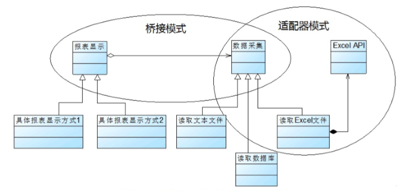

<center>桥接模式和适配器模式联合使用</center>

实现情景：在某系统的报表处理模块中需要将报表显示和数据输出分开，系统可以有多种报表显示方式也可以有多种数据输出方式，如将数据输出为文本文件，也可以输出为 Excel 文件，如果需要输出 Excel 文件，则需要调用与 Excel 相关的 API，而这个 API 是现有系统所不具备的，该 API 由厂商提供。使用桥接模式和类适配器模式来实现该系统：

- 抽象报表显示类

```java
/**
 * 报表显示，充当桥接模式抽象类
 */
public abstract class ReportDisplay {

    //数据输出 引用
    protected DataOutput dataOutput;

    public void setDataOutput(DataOutput dataOutput) {
        this.dataOutput = dataOutput;
    }

    //抽象显示方法
    abstract void display();
}
```

- 具体报表显示

```java
/**
 * 第一种报表显示方式，充当扩充抽象类
 */
public class FirstDisplay extends ReportDisplay {
    @Override
    void display() {
        System.out.println("第一种报表显示方式！");
        dataOutput.output();
    }
}

/**
 * 第二种报表显示方式，充当扩充抽象类
 */
public class SecondDisplay extends ReportDisplay {
    @Override
    void display() {
        System.out.println("第二种报表显示方式！");
        dataOutput.output();
    }
}
```

- 数据输出（桥接模式实现类接口和适配器模式目标类）

```java
/**
 * 数据输出，充当 桥接模式实现类接口、适配器模式目标抽象类
 */
public interface DataOutput {
    void output();
}
```

- 具体数据输出实现类

```java
/**
 * 文本类型数据输出，充当桥接模式具体实现类
 */
public class TextDataOutput implements DataOutput {
    @Override
    public void output() {
        System.out.println("输出文本类型数据");
    }
}

/**
 * Excel 类型数据输出，充当桥接模式具体实现类、适配器模式适配器类
 */
public class ExcelDataOutput extends ExcelAPI implements DataOutput {
    @Override
    public void output() {
        //调用第三方适配者
        super.deal();
        System.out.println("输出 Excel 类型数据");
    }
}
```

- ExcelAPI（适配者类）

```骄傲AV
/**
 * 第三方 ExcelAPI 类，充当适配器模式适配者类
 */
public class ExcelAPI {
    public void deal() {
        System.out.println("调用第三方 ExcelAPI 处理 Excel ");
    }
}
```

- 测试客户端

```java
/**
 * 桥接模式和适配器模式（类）测试客户端
 */
public class ReportClient {
    public static void main(String[] args) {
        //创建数据输出对象
//        DataOutput dataOutput = new TextDataOutput();
        DataOutput dataOutput = new ExcelDataOutput();

        //创建报表显示对象
        ReportDisplay reportDisplay = new FirstDisplay();
        reportDisplay.setDataOutput(dataOutput);

        reportDisplay.display();
    }
}
```

##### 桥接模式的优缺点

优点：

- 分离抽象接口及其实现部分。桥接模式使用“对象间的关联关系”解耦了抽象和实现之间固有的绑定关系，使得抽象和实现可以沿着各自的维度来变化。
- 在很多情况下，桥接模式可以替代多层继承方案，多层继承方案违背了单一职责原则，复用性较差，而且类的个数非常多。
- 桥接模式提高了系统的可扩展性，在两个变化维度中任意扩展一个维度都不需要修改原有系统，复合开闭原则。

缺点:

- 桥接模式的使用会增加系统的理解与设计难度，由于关联关系建立在抽象层，要求开发者一开始就针对抽象层进行设计和编程。
- 桥接模式要求正确地识别出系统中的两个独立变化的维度，因此其使用范围具有一定的局限性，如何正确识别两个独立维度也需要一定的经验积累。

##### 桥接模式的适用环境

- 如果一个系统需要在抽象化和具体化之间增加更多的灵活性，避免在两个层次之间建立静态的继承关系，通过桥接模式可以使它们在抽象层建立一个关联关系。
- 一个类存在两个（或多个）独立变化的维度，且这两个（或多个）维度都需要独立进行扩展。
- 对于那些不希望使用继承或因为多层继承导致系统类的个数急剧增加的系统，桥接模式尤为适用。


### 组合模式

##### 组合模式的概述及定义

- 概述：组合模式关注那些包含叶子构件和容器构件的结构以及它们的组织形式，在叶子构件中不包含成员对象，而容器构件中可以包含成员对象，这些对象通过递归组合可以构成一个树形结构。组合模式使用面向对象的方式来处理树形结构，它为叶子构件和容器构件提供了一个公共的抽象构建类，客户端可以针对抽象构建类编程，而无须关心操作的是叶子构件还是容器构件。
- 定义：组合多个对象形成树形结构以表示具有部分-整体关系的层次结构。组合模式让客户端可以统一对待单个对象和组合对象。

##### 组合模式的结构

组合模式包含以下 3 个角色：

- **Component（抽象构件）**：它可以是接口或抽象类，为叶子构件和容器构件对象声明接口，在该角色中可以包含所有子类共有行为的声明和实现。在抽象构件中定义了访问及管理它的子构件的方法，如增加、删除、获取子构件等。

- **Leaf（叶子构件）**：它在组合结构中表示叶子节点对象，叶子节点没有子节点，它实现了在抽象构件中定义的行为。对于那些访问及管理子构件的方法，可以通过抛异常、提示错误等方式进行处理。

- **Composite（容器构件）**：它在组合结构中表示容器节点对象，容器节点可以包含子节点，子节点可以是叶子节点也可以容器节点。它提供一个集合用于储存子节点，实现了在抽象构件中定义的行为，包含那些访问及管理子构件的方法，在其业务方法中可以递归调用其子节点的业务方法。

  

  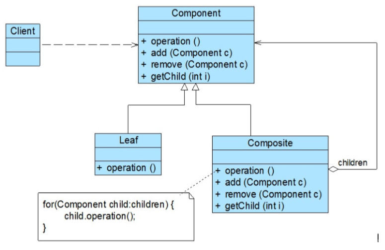

<center>组合模式结构图</center>

##### 组合模式的实现

**组合模式的关键是定义了抽象构件类，它既可以代表叶子，又可以代表容器**，客户端针对该抽象构件类进行编程，无须知道它到底表示的是叶子还是容器，可以对其进行统一处理。

实现情景：开发一个杀毒（AntiVirus）软件，该软件既可以对文件夹（Folder）杀毒又可以对文件（File）杀毒。还可以根据各类文件的特点为不同类型的文件提供不同的杀毒方式，例如图像文件（ImageFile）和文本文件（TextFile）的杀毒方式就有所差异。

- 抽象构件类

```java
/**
 * 抽象文件类，充当抽象构件类
 */
public abstract class AbstractFile {
    abstract void add(AbstractFile file);
    abstract void remove(AbstractFile file);
    abstract AbstractFile getChild(int i);
    abstract void killVirus();
}
```

- 叶子构件类

```java
/**
 * 文本文件类，充当叶子构件
 */
public class TextFile extends AbstractFile {
    private String name;

    public TextFile(String name) {
        this.name = name;
    }

    @Override
    void add(AbstractFile file) {
        System.out.println("对不起，不支持该方法！");
    }

    @Override
    void remove(AbstractFile file) {
        System.out.println("对不起，不支持该方法！");
    }

    @Override
    AbstractFile getChild(int i) {
        System.out.println("对不起，不支持该方法！");
        return null;
    }

    @Override
    void killVirus() {
        //模拟杀毒
        System.out.println(" --- 对文本文件 '"+name+"' 进行杀毒 ");
    }
}

/**
 * 图像文件类，充当叶子构件
 */
public class ImageFile extends AbstractFile {
    private String name;

    public ImageFile(String name) {
        this.name = name;
    }

    @Override
    void add(AbstractFile file) {
        System.out.println("对不起，不支持该方法！");
    }

    @Override
    void remove(AbstractFile file) {
        System.out.println("对不起，不支持该方法！");
    }

    @Override
    AbstractFile getChild(int i) {
        System.out.println("对不起，不支持该方法！");
        return null;
    }

    @Override
    void killVirus() {
        //模拟杀毒
        System.out.println(" --- 对图像文件 '"+name+"' 进行杀毒 ");
    }
}
```

- 容器构件类

```java
/**
 * 文件夹类，充当容器构件
 */
public class Folder extends AbstractFile {
    //定义集合 files，用于储存 AbstractFile 类型的成员
    private List<AbstractFile> files = new ArrayList<>();

    private String name;

    public Folder(String name) {
        this.name = name;
    }

    @Override
    void add(AbstractFile file) {
        files.add(file);
    }

    @Override
    void remove(AbstractFile file) {
        files.remove(file);
    }

    @Override
    AbstractFile getChild(int i) {
        return files.get(i);
    }

    @Override
    void killVirus() {
        System.out.println(" --- 对文件夹 '"+name+"' 进行杀毒 ");
        for (AbstractFile file : files) {
            file.killVirus();
        }
    }
}
```

- 测试客户端

```java
/**
 * 组合模式测试客户端
 */
public class AntivirusClient {
    public static void main(String[] args) {

        AbstractFile file, file1, file2, file3,
                folder, folder2, folder3;

        file = new TextFile("九阴真经.txt");
        file1 = new TextFile("葵花宝典.txt");
        file2 = new ImageFile("小龙女.JPG");
        file3 = new ImageFile("张无忌.JPG");

        folder = new Folder("我的电脑");
        folder2 = new Folder("文本文件");
        folder3 = new Folder("图片文件");

        folder2.add(file);
        folder2.add(file1);
        folder3.add(file2);
        folder3.add(file3);

        folder.add(folder2);
        folder.add(folder3);

        folder.killVirus();
    }
}
```

注意：在具体实现时可以创建图形化界面让用户来选择所需操作的根节点，无须修改源代码，复合开闭原则。用户也无须关心节点的层次结构。

##### 透明组合模式和安全组合模式

组合模式根据抽象构件类的定义形式又可以分为透明组合模式和安全组合模式。

- 透明组合模式

在透明组合模式中，抽象构件 Component 中声明了所有用于管理成员对象的方法，包括增删查，这样做的好处是确保所有的构件类都有相同的接口。在客户端看来，叶子对象和容器对象提供的方法是一致的，客户端可以一致的对待所有对象。缺点是不够安全，因为他们本质上是有区别的，叶子对象不可能有下一层次的对象，即不可能包含成员对象，因此为其提供 add()、remove() 等方法是没有意义的，在运行的时候可能会出错。

- 安全组合模式

在安全组合模式中，抽象构件 Component 中没有声明任何用于管理成员对象的方法，而是 Composite 类声明并实现这些方法。这样做是安全的，因为根本不向叶子对象提供这些管理成员对象的方法，对于叶子对象，客户端不可能调用到这些方法。它的缺点是不够透明，因为叶子构件和容器构件具有不同的方法，且容器构件中那些用于管理成员对象的方法没有在抽象构件类中定义，因此客户端不能完全针对抽象编程，必须有区别地对待叶子构件和容器构件。

##### 组合模式的优缺点

优点：

- 可以清楚地定义分层次的复杂对象，表示对象的全部或部分层次，它让客户端忽略了层次的差异，方便对整个层次结构进行控制。
- 客户端可以一致地使用一个组合结构或其中单个对象，不必关心处理的是单个对象还是整个组合结构，简化了客户端代码。
- 在组合模式中增加新的容器结构和叶子结构都很方便，无须对现有类库进行修改。
- 为树形结构的面向对象实现提供了一种灵活的解决方案，通过叶子对象和容器对象的递归组合可以形成复杂的树形结构，但对树形结构的控制缺非常简单。

缺点：

- 在增加新构件时很难对容器中的构件类型进行限制。例如文件夹中只能包含文本文件，在使用组合模式时不能通过依赖类型系统来施加这些约束，因为它们都来自于相同的抽象层，在这种情况下必须通过在运行时进行类型检查来实现。

##### 组合模式的适用环境

- 在具有整体和部分的层次结构中希望通过一种方式忽略整体与部分的差异，客户端可以一致地对待它们。
- 在一个使用面向对象语言开发的系统中需要处理一个树形结构。
- 在一个系统中能够分离出叶子对象和容器对象，而且它们的类型不固定，需要增加一些新的类型。


### 装饰模式

##### 装饰模式的概述及定义

- 概述：装饰模式是一种用于替代继承的技术，它通过一种无须定义子类的方式来给对象动态增加职责，并使需要装饰的具体构件类和用于装饰的具体装饰类都可以独立变化。
- 定义：动态地给一个对象增加一些额外的职责。就扩展功能而言，装饰模式提供了一种比使用子类更加灵活的替代方案。

##### 装饰模式的结构

装饰模式包含以下 4 中角色：

- **Component（抽象构件）**：它是具体构件和抽象装饰类的共同父类，声明了在具体构件中实现的业务方法，它的引入可以使客户端以一致的方式处理未被装饰的对象以及装饰之后的对象，实现客户端的透明操作。

- **ConcreteComponent（具体构件）**：它是抽象构件类的子类，用于定义具体的构建对象，实现了在抽象构件中声明的方法，装饰类可以给它增加额外二代职责（方法）。

- **Decorator（抽象装饰类）**：它也是抽象构件类的子类，用于给具体构件增加职责，但是具体职责在其子类中实现。它维护一个指向抽象构件对象的引用，通过该引用可以调用装饰之前构件对象的方法，并通过其子类扩展该方法，已达到装饰的目的。

- **ConcreteDecorator（具体装饰类）**：它是抽象装饰类的子类，负责向构件添加新的职责。每一个具体装饰类都定义了一些新的行为，它可以调用在抽象装饰类中定义的方法，并可以增加新的方法用于扩充对象的行为。

  

  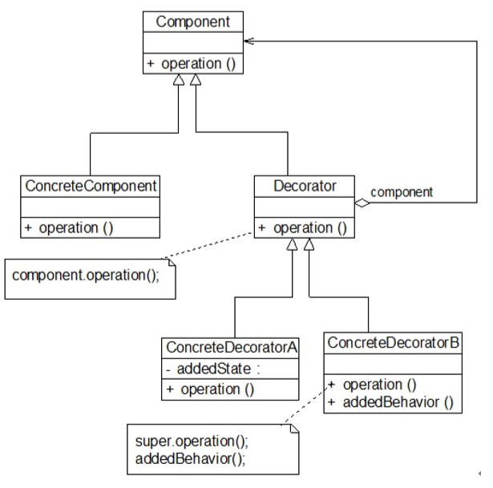

<center>装饰模式结构图</center>

##### 装饰模式的实现

实现情景：开发一套图形界面构件库 VisualComponent，该构件库提供了大量的基本构件，如窗体、文本框、列表框等，由于在使用该构件库时用户经常要求定制一些特殊的显示效果，如带滚动条的窗体。带黑色边框的文本框，既带滚动条又带黑色边框的列表框，因此经常需要对该构件库进行扩展以增强其功能。

- 抽象构件类

```java
/**
 * 抽象界面构件类
 */
public abstract class Component {
    public abstract void display();
}
```

- 具体构件类

```java
/**
 * 窗体类，充当具体构件类
 */
public class Window extends Component {
    @Override
    public void display() {
        System.out.println("显示窗体");
    }
}

/**
 * 文本框类，充当具体构件类
 */
public class TextBox extends Component {
    @Override
    public void display() {
        System.out.println("显示文本框");
    }
}

/**
 * 列表框类，充当具体构件类
 */
public class ListBox extends Component {
    @Override
    public void display() {
        System.out.println("显示列表框");
    }
}
```

- 抽象装饰类

```java
/**
 * 抽象构件装饰类
 */
public class ComponentDecorator extends Component {
    //维持对抽象构件类型对象的引用
    private Component component;

    //注入抽象构件类型的对象
    public ComponentDecorator(Component component) {
        this.component = component;
    }

    @Override
    public void display() {
        //调用原有业务方法
        component.display();
    }
}
```

- 具体装饰类

```JAVA
/**
 * 滚动条装饰类，充当具体装饰类
 */
public class ScrollBarDecorator extends ComponentDecorator {
    public ScrollBarDecorator(Component component) {
        super(component);
    }

    @Override
    public void display() {
        this.setScrollBar();
        super.display();
    }

    public void setScrollBar() {
        System.out.println("为构件增加滚动条");
    }
}

/**
 * 黑色边框装饰类，充当具体装饰类
 */
public class BlackBorderDecorator extends ComponentDecorator {
    public BlackBorderDecorator(Component component) {
        super(component);
    }

    @Override
    public void display() {
        this.setBlackBorder();
        super.display();
    }

    public void setBlackBorder() {
        System.out.println("为构件增加黑色边框");
    }
}
```

- 测试客户端

```java
/**
 * 装饰模式测试客户端
 */
public class DecoratorClient {
    public static void main(String[] args) {
        Component component,component1,component2;
        //创建具体构件对象
        component = new ListBox();
        //创建装饰后的构件对象
        component1 = new BlackBorderDecorator(component);
        //将装饰了一次的对象注入另一个装饰类中，进行第二次装饰
        component2 = new ScrollBarDecorator(component1);

        component2.display();
    }
}
```

**总结：可以将一个装饰过的构件对象再次装饰。**

##### 透明装饰模式和半透明装饰模式

- 透明装饰模式（Transparent）

  透明装饰模式要求客户端完全针对抽象编程，装饰模式的透明性要求客户端程序不应该将对象声明为具体构件类型或具体装饰类型，而应该全部声明为抽象构件类型。上面的例子就是透明装饰模式。

- 半透明装饰模式（Semi-transparent）

  有时需要单独调用新增的业务方法，为了能够调用到新增方法，不得不用具体装饰类型来定义装饰之后的对象，而具体构件类型仍然可以使用抽象构件类型来定义，这种装饰模式即为半透明装饰模式。它可以给系统带来更多的灵活性，设计相对简单，使用起来非常方便，**缺点是不能实现对同一个对象的多次装饰。**

##### 装饰模式的优缺点

优点：

- 对于扩展一个对象的功能，装饰模式比继承更加灵活，不会导致类的个数急剧增加。
- 可以对一个对象进行多次装饰，通过使用不同的具体装饰类以及这些装饰类的排列组合可以创造出很多不同行为的组合。
- 具体构件类与具体装饰类可以独立变化，用户可以根据需要增加新的具体构件类和具体装饰类，原有代码无须改变，复合开闭原则。

缺点：

- 在使用装饰模式进行系统设计时将产生很多小对象。
- 装饰模式提供了一种比继承更加灵活、机动的解决方案，但同时也意味着比继承更加易于出错，拍错也更困难，对于多次装饰的对象，在调试时寻找错误可能需要逐级排查，较为烦琐。

##### 装饰模式的适用环境

- 在不影响其他对象的情况下以动态、透明的方式给单个对象增加指责。
- 当不能采用继承的方式对系统进行扩展或者采用继承不利于系统扩展和维护时可以使用装饰模式。


### 外观模式

##### 外观模式的概述及定义

- 概述：当一个客户端需要和多个业务类交互（子系统 Subsystem），而这些需要交互的业务类经常会作为一个整体出现，由于涉及的类比较多，导致使用时较为复杂，此时特别需要一个类似“服务员”（外观类 Facade）的角色，由它来复杂和多个业务类进行交互，它为多个业务类的调用提供了一个统一的入口，而客户端只需要和该类交互。**外观模式的迪米特法则的一种具体实现。**
- 定义：为子系统中的一组接口提供一个统一的入口。外观模式定义了一个高层接口，这个接口使得这一子系统更加容易使用。

##### 外观模式的结构

外观模式包含以下两个角色：

- **Facade（外观角色）**：客户端可以调用它的方法，在外观角色中可以知道相关（一个或多个）子系统的功能和职责；它将所有从客户端发来的请求委派到相应的子系统，传递给相应的子系统对象处理。

- **SubSystem（子系统角色）**：在软件系统中可以有一个或多个子系统角色，每一个子系统可以不是一个单独的类，而是一个类的集合，它实现子系统的功能；每一个子系统都可以被客户端直接调用，或者被外观角色调用，它处理由外观类传过来的请求；子系统并不知道外观的存在，对于子系统而言，外观角色仅仅是另外一个客户端而已。

  

  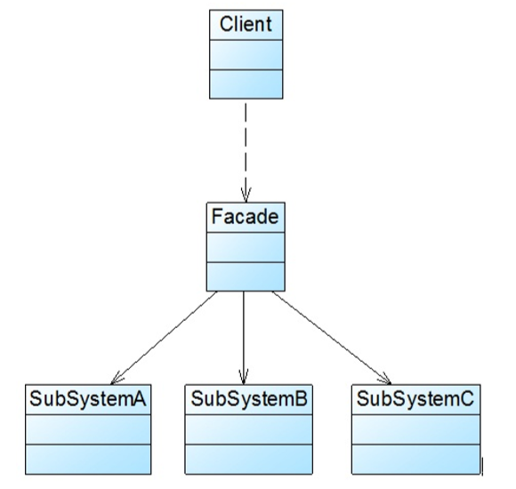

<center>外观模式结构图</center>

##### 外观模式的实现

实现场景：开发一个文件加密模块，该模块对文件内容加密后储存到一个新的文件中，具体流程包含 3 个部分，分别是读取源文件、加密、保存加密之后的文件，其中读取文件和保存文件使用流来实现，加密操作通过求模运算。这三个操作相互独立，让设计更符合单一职责原则，这 3 这个操作的业务代码封装在 3 个不同的类中。

- 子系统角色类

```java
/**
 * 文件读取类，充当子系统
 */
public class FileReader {
    public String read(String fileNameSrc) {
        System.out.print("读取文件，获取明文：");
        StringBuilder builder = new StringBuilder();
        try {
            FileInputStream inputStream = new FileInputStream(fileNameSrc);

            int data;
            // return -1 if the end of the file is reached.
            while ((data=inputStream.read()) != -1) {
                builder.append((char) data);
            }
            //读取完毕，关流
            inputStream.close();
            System.out.println(builder.toString());

        } catch (FileNotFoundException e) {
            System.out.println("文件不存在");
        } catch (IOException e) {
            System.out.println("读取文件失败");
        }
        return builder.toString();
    }
}

/**
 * 数据加密类，充当子系统
 */
public class CipherMachine {
    //求模运算
    public String encrypt(String plainText) {
        System.out.print("数据加密，将明文转换为密文：");
        StringBuilder es = new StringBuilder();
        for (int i = 0; i < plainText.length(); i++) {
            String s = String.valueOf(plainText.charAt(i) % 7);
            es.append(s);
        }
        System.out.println(es.toString());
        return es.toString();
    }
}

/**
 * 文件保存类，充当子系统
 */
public class FileWriter {
    public void write(String encryptStr, String fileNameDes) {
        System.out.println("保存密文，写入文件。");

        // try with resource 自动关闭流的语法
        try (FileOutputStream outputStream = new FileOutputStream(fileNameDes)) {

            outputStream.write(encryptStr.getBytes());
        } catch (FileNotFoundException e) {
            System.out.println("文件不存在！");
        } catch (IOException e) {
            System.out.println("保存文件出错！");
        }
    }
}
```

- 加密外观类

```java
/**
 * 加密外观类，充当外观类
 */
public class EncryptFacade {

    //维持对子系统的引用
    private FileReader fileReader;
    private CipherMachine cipherMachine;
    private FileWriter fileWriter;

    public EncryptFacade() {
        fileReader = new FileReader();
        cipherMachine = new CipherMachine();
        fileWriter = new FileWriter();
    }

    //调用子系统对象的业务方法
    public void fileEncrypt(String fileNameSrc,String fileNameDes) {
        //读取明文
        String plainText = fileReader.read(fileNameSrc);
        //加密后的密文
        String encryptStr = cipherMachine.encrypt(plainText);
        //保存文件
        fileWriter.write(encryptStr, fileNameDes);
    }
}
```

- 客户端测试类

```java
/**
 * 外观模式测试客户端
 */
public class FacadeClient {
    public static void main(String[] args) {
        EncryptFacade encryptFacade = new EncryptFacade();
        String src = "src\\com\\piano\\structure\\facade\\test.txt";
        String des = "src\\com\\piano\\structure\\facade\\test2.txt";

        encryptFacade.fileEncrypt(src, des);
    }
}
```

##### 抽象外观类

在标准的外观模式结构中，如果需要增加、删除或更换与外观类交互的子系统类，必须修改外观类或客户端代码，这将违反开闭原则。**引入抽象外观类，客户端可以针对抽象外观类编程，对于新的业务需求，不需要修改原有外观类，而对应增加一个新的具体外观类，由新的具体外观类来关联新的子系统对象，同时通过修改配置文件来达到不修改任何源代码并更换外观类的目的。**

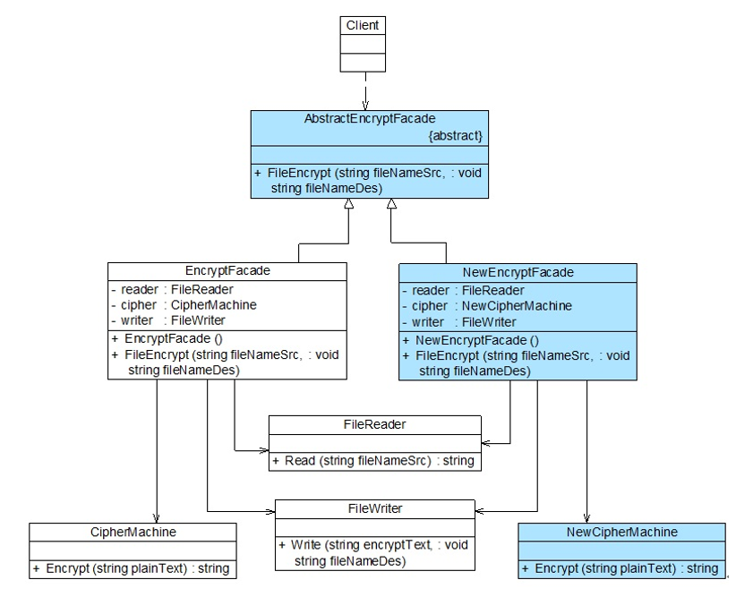

##### 外观模式的优缺点

优点：

- 它对客户端屏蔽了子系统组件，减少了客户端所需处理的对象数目，并使子系统使用起来更加容易。
- 它实现了子系统与客户端之间的松耦合关系，这使得子系统的变化不会影响到调用它的客户端，只需要调整外观类即可。
- 一个子系统的修改对其他子系统没有任何影响，而且子系统内部变化也不会影响到外观对象。

缺点：

- 不能很好的限制客户端直接使用子系统类，如果对客户端访问子系统类做太多限制则减少了可变性和灵活性。
- 如果设计不当，增加新的子系统可能需要修改外观类的源代码，违背了开闭原则。

##### 外观模式的适用环境

- 当要为访问一系列复杂的子系统提供一个简单入口时可以使用外观模式。
- 客户端程序与多个子系统之间存在很大的依赖性。引入外观类可以将子系统与客户端解耦，从而提高子系统的独立性和可移植性。
- 在层次化结构中可以使用外观模式定义系统中的每一层的入口，层与层之间不直接产生联系，而通过外观类建立联系，降低层之间的耦合度。


### 享元模式

##### 享元模式的概述及定义

- 概述：

  - 当系统中存在大量相同或者相似的对象时，享元模式是一种值得考虑的解决方案，它通过**共享技术**实现相同或相似的细粒度对象的复用，从而节约了内存、提高系统性能。

  - 享元模式能做到共享的关键是区分了内部状态（Intrinsic State）和外部状态（Extrinsic State）。**内部状态**是存在享元对象内部并且不会随环境改变而改变的状态，内部状态可以共享。**外部状态**是随环境改变而改变的、不可以共享的状态。享元对象的外部状态通常由客户端保存，并在享元对象被创建之后需要使用的时候再传入到享元对象内部。
  - 正因为区分了内部状态和外部状态，可以将具有相同内部状态的对象存储在享元池中，享元池中的对象是可以实现共享的，当需要的时候就将对象从享元池中取出，实现对象的复用。通过**向取出的对象注入不同的外部状态可以得到一系列相似的对象**，而这些对象在内存中只存储一份。

- 定义：运用**共享技术**有效地支持大量细粒度对象的复用。

##### 享元模式的结构

享元模式包含以下 4 个角色：

- **Flyweight（抽象享元类）**：抽象享元类通常是一个接口或抽象类，在抽象享元类中声明了具体享元类公共的方法，这些方法可以向外界提供享元对象的内部数据（内部状态），同时也可以通过这些方法来设置外部数据（外部状态）。

- **ConcreteFlyweight（具体享元类）**：具体享元类实现了抽象享元类，**它的实例称为享元对象；在具体享元类中为内部状态提供了存储空间。**通常可以结合单例模式设计具体享元类，为每一个具体享元类提供唯一的享元对象。

- **UnsharedConcreteFlyweight（非共享享元工厂类）**：并不是所有的抽象享元类的子类都需要被共享，不能被共享的子类可设计为非共享具体享元类；当需要一个非共享具体享元类的对象时可以直接实例化创建。

- **FlyweightFactory（享元工厂类）**：享元工厂类用于创建并管理享元对象，它针对抽象享元类编程，将各种类型的具体享元对象存储在一个享元池中，享元池中一般设计为一个存储“键值对‘的集合（也可以是其他类型的集合），可以结合工厂模式进行设计；当用户请求一个具体享元对象时，享元工厂提供一个存储在享元池中已创建好的实例或者创建一个新的实例（如果不存在），返回新创建的实例并将其存储在享元池中。

  

  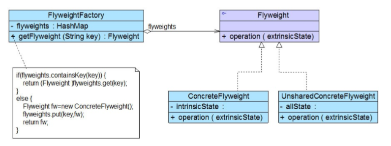

<center>享元模式结构图</center>

##### 享元模式的实现

实现情景：开发一个围棋软件，在围棋棋盘中包含大量的黑子和白子，它们的形状大小都一样，只是位置不同而已。如果将每一个棋子作为一个独立的对象存储在内存中，将导致该围棋软件在运行时所需的内存空间较大，那么如何降低运行代价、提高系统性能是需要解决的一个问题。

- 抽象享元类

```java
/**
 * 围棋棋子抽象类，充当抽象享元类
 */
public abstract class GoChessman {
    public abstract String getColor();

    public  void display() {
        System.out.println("棋子颜色：" + this.getColor());
    }
}
```

- 具体享元类

```java
/**
 * 黑色棋子类，充当具体享元类
 */
public class BlackGoChessman extends GoChessman {
    @Override
    public String getColor() {
        return "黑色";
    }
}

/**
 * 白色棋子类，充当具体享元类
 */
public class WhiteGoChessman extends GoChessman {
    @Override
    public String getColor() {
        return "白色";
    }
}
```

- 享元工厂类

```java
/**
 * 围棋棋子工厂类，充当享元工厂类，使用单例模式对其进行设计
 */
public class GoChessmanFactory {
    //饿汉式单例
    private static GoChessmanFactory instance = new GoChessmanFactory();
    //使用 Map 来存储享元对象，充当享元池
    private Map<String, GoChessman> chessmanMap = null;

    private GoChessmanFactory() {
        chessmanMap = new HashMap<>();
        System.out.println("初始化。。。");
        GoChessman black, white;
        black = new BlackGoChessman();
        white = new WhiteGoChessman();
        chessmanMap.put("black", black);
        chessmanMap.put("white", white);
    }

    //返回享元工厂类的唯一实例
    public static GoChessmanFactory getInstance() {
        return instance;
    }

    //通过 key 获取存储在 map 中的享元对象
    public GoChessman getGoChessman(String key) {
        return chessmanMap.get(key);
    }
}
```

- 测试客户端

```java
/**
 * 享元模式测试客户端
 */
public class FlyweightClient {
    public static void main(String[] args) {
        //获取享元工厂对象
        GoChessmanFactory chessmanFactory = GoChessmanFactory.getInstance();

        GoChessman back = chessmanFactory.getGoChessman("black");
        GoChessman back2 = chessmanFactory.getGoChessman("black");
        GoChessman white = chessmanFactory.getGoChessman("white");
        GoChessman white2 = chessmanFactory.getGoChessman("white");

        System.out.println("判断两个黑子是否相同：" + (back == back2));
        System.out.println("判断两个白子是否相同：" + (white == white2));
        back.display();
        back2.display();
        white.display();
        white2.display();
    }
}
```

##### 有外部状态的享元模式

分析上面实现可以发现，虽然黑色棋子和白色棋子可以共享，但是它们将显示在棋盘的不同位置，如何让相同的黑子或者白子能够多次重复显示且位于一个棋盘的不同地方？解决方案之一就是将位置定义为外部状态，在需要时再进行设置。将原有代码修改如下：

- 坐标类

```java
/**
 * 坐标类，充当外部状态
 */
public class Coordinates {

    private int x;
    private int y;
	//省略 getter和setter方法
    public Coordinates(int x, int y) {
        this.x = x;
        this.y = y;
    }
}
```

- 抽象享元类

```java
/**
 * 围棋棋子抽象类，充当抽象享元类
 */
public abstract class GoChessman {
    public abstract String getColor();

    public void display(Coordinates coordinates) {
        System.out.println("棋子颜色：" + this.getColor() +
                "，棋子位置：" + coordinates.getX() + "，" + coordinates.getY());
    }
}
```

- 测试类

```java
/**
 * 享元模式测试客户端
 */
public class FlyweightClient {
    public static void main(String[] args) {
        //获取享元工厂对象
        GoChessmanFactory chessmanFactory = GoChessmanFactory.getInstance();

        GoChessman back = chessmanFactory.getGoChessman("black");
        GoChessman back2 = chessmanFactory.getGoChessman("black");

        GoChessman white = chessmanFactory.getGoChessman("white");
        GoChessman white2 = chessmanFactory.getGoChessman("white");

        System.out.println("判断两个黑子是否相同：" + (back == back2));
        System.out.println("判断两个白子是否相同：" + (white == white2));
        back.display(new Coordinates(1,2));
        back2.display(new Coordinates(10,12));
        white.display(new Coordinates(7,8));
        white2.display(new Coordinates(4,15));
    }
}
```

总结：**外部状态在需要的时候再传入。**

##### 单纯享元模式和符合享元模式

- 单纯享元模式

  在单纯享元模式中，所有的具体享元类都是可以共享的，不存在非共享具体享元类。结构如图：

  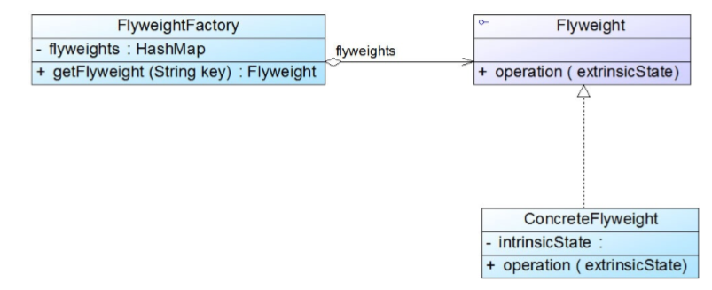

- 复合享元模式

  将一些单纯享元对象使用组合模式加以组合，还可以形成复合享元对象，这样的复合享元对 象本身不能共享，但是它们可以分解成单纯享元对象，而后者则可以共享。结构如图：

  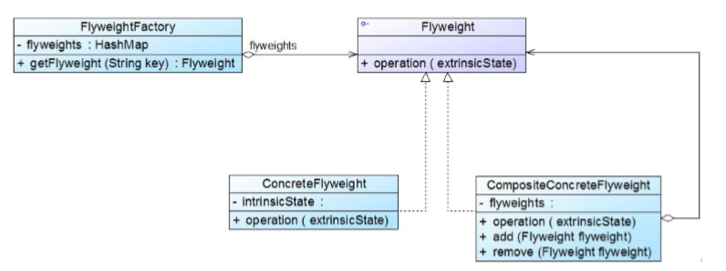

  通过复合享元模式，可以确保复合享元类 CompositeConcreteFlyweight 中所包含的每个单纯享 元类 ConcreteFlyweight 都具有相同的外部状态，而这些单纯享元的内部状态往往可以不同。如果希望为多个内部状态不同的享元对象设置相同的外部状态，可以考虑使用复合享元模式。

##### 享元模式的优缺点

优点：

- 可以极大减少内存中对象的数量，使得相同或相似对象在内存中只保存一份，从而可以节约系统资源，提高系统性能。
- 享元模式的外部状态相对独立，而且不会影响其内部状态，从而使得享元对象可以在不同的环境中被共享。

缺点：

- 享元模式使得系统变得复杂，需要分离出内部状态和外部状态，这使得程序的逻辑复杂化。
- 为了使对象可以共享，享元模式需要将享元对象的部分状态外部化，而读取外部状态将使得运行时间变长。

##### 享元模式的适用环境

- 一个系统有大量相同或者相似的对象，造成内存的大量耗费。
- 对象的大部分状态都可以外部化，可以将这些外部状态传入对象中。
- 在使用享元模式时需要维护一个存储享元对象的享元池，而这需要耗费一定的系统资源， 因此，应当在需要多次重复使用享元对象时才值得使用享元模式。


### 代理模式

##### 代理模式的概述及定义

- 概述：代购网站为消费者提供在线的代购服务，顾客如果看中某国外购物网站上的商品，可以登录代购网站填写代购单并付款， 代购网站会帮助进行购买然后通过快递公司将商品发送给消费者。这种模式在软件设计中称为代理模式（Proxy Pattern），代理模式变化形式非常多，常见的代理形式包括远程代理、保护代理、虚拟代理、缓存代理、智能引用代理。
- 定义：给某一个对象提供一个代理或占位符，并由代理对象来控制对原对象的访问。 

##### 代理模式的结构

- **Subject（抽象主题角色）**：它声明了真实主题和代理主题的共同接口，这样一来在任何使用真实主题的地方都可以使用代理主题，**客户端通常需要针对抽象主题角色进行编程**。

- **Proxy（代理主题角色）**：它包含了对真实主题的引用，从而可以在任何时候操作真实主题对象；在代理主题角色中提供一个与真实主题角色相同的接口，以便在任何时候都可以替代真实主题；通常，在代理主题角色中，客户端在调用所引用的真实主题操作之前或之后还需要执行其他操作，而不仅仅是单纯调用真实主题对象中的操作。

- **RealSubject（真实主题角色）**：它定义了代理角色所代表的真实对象，在真实主题角色中实现了真实的业务操作，客户端可以通过代理主题角色间接调用真实主题角色中定义的操作。

  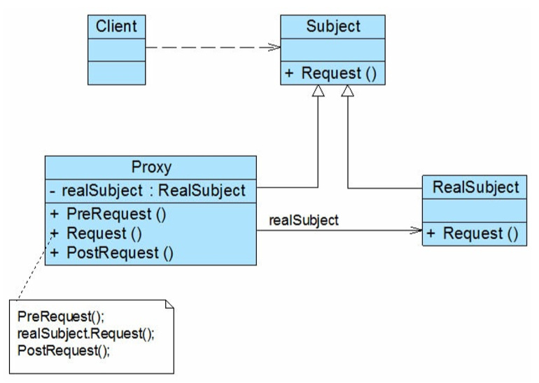

<center>静态代理模式结构图</center>

##### 代理模式的分类

- **远程代理（Remote Proxy）**：为一个位于不同的地址空间的对象提供一个本地的代理对象，这 个不同的地址空间可以是在同一台主机中，也可是在另一台远程主机中。远程代理类封装了底层网络通信和对远程对象的调用，其实现较为复杂。
- **虚拟代理（Virtual Proxy）**：对于一些占用系统资源较多或者加载时间较长的对象，可以给这些对象提供一个虚拟代理。在真实对象创建成功之前虚拟代理扮演真实对象的替身，而当真实对象创建之后，虚拟代理将用户的请求转发给真实对象。
- **保护代理（Protect Proxy）**：控制对一个对象的访问，可以给不同的用户提供不同级别的使用
  权限。
- **缓存代理（Cache Proxy）**：它为某一个操作的结果提供临时的缓存存储空间，以便在后续使用中能够共享这些结果，从而可以避免某些方法的重复执行，优化系统性能。
- **智能引用代理（Smart Reference Proxy）**：当一个对象被引用时，提供一些额外的操作，例如将对象被调用的次数记录下来等。

##### 代理模式的实现

实现情景：开发一款收费商务信息查询系统。要求如下：在进行商务信息**查询之前**用户需要通过身份验证，只有合法用户才能够使用该查询系统；在进行商务信息**查询时**系统需要记录查询日志，以便根据查询次数收取查询费用。目前已完成了商务信息查询模块的开发任务，现希望能够以一种松耦合的方式向原有系统增加身份验证和日志记录功能，客户端代码可以无区别地对待原始的商务信息查询模块和增加新功能之后的商务信息查询模块，而且可能在将来还要在该信息查询模块中增加一些新的功能。

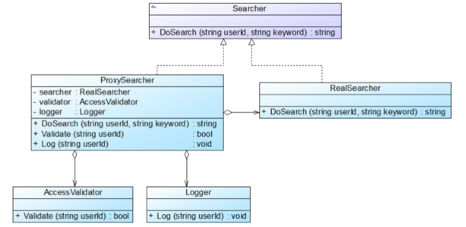

<center>商务信息系统结构图</center>

- 身份验证类（业务类）

```java
/**
 * 身份验证类
 */
public class AccessValidator {

    public boolean validate(String userId) {
        System.out.println("在数据库中验证用户’" + userId + "'是否为合法用户？");
        if (userId.equalsIgnoreCase("杨过")) {
            System.out.println("'" + userId + "'登录成功！");
            return true;
        } else {
            System.out.println("'" + userId + "'登录失败！");
            return false;
        }
    }
}
```

- 日志记录类

```java
/**
 * 日志记录类（业务类）
 */
public class Logger {
    //模拟日志记录
    public void log(String userId) {
        System.out.println("更新数据库，用户'"+userId+"'查询次数+1");
    }
}
```

- 抽象主题角色

```java
/**
 * 抽象查询类，充当抽象主题角色
 */
public interface Searcher {
    String doSearch(String userId, String keyword);
}
```

- 具体主题角色

```java
/**
 * 具体查询类，充当真是主题角色，它实现查询功能
 */
public class RealSearcher implements Searcher {
    @Override
    public String doSearch(String userId, String keyword) {
        System.out.println("用户'"+userId+"'使用关键字"+keyword+"'查询商务信息！");
        return "返回查询信息";
    }
}
```

- 代理角色

```java
/**
 * 代理查询类，充当代理主题角色，它是查询代理
 * 维持了对 RealSearcher、AccessValidator 和 Logger 对象的引用
 */
public class ProxySearcher implements Searcher{
    //维持了对真实主题的引用
    private RealSearcher realSearcher = new RealSearcher();
    private AccessValidator accessValidator;
    private Logger logger;

    public String doSearch(String userId, String keyword) {

        //如果验证成功，则执行查询
        if (this.validate(userId)) {
            String result = realSearcher.doSearch(userId, keyword);
            this.log(userId);
            return result;
        }
        return null;
    }

    public boolean validate(String userId) {
        accessValidator = new AccessValidator();
        boolean validate = accessValidator.validate(userId);
        return validate;
    }

    public void log(String userId) {
        logger = new Logger();
        logger.log(userId);
    }
}
```

- 测试客户端

```java
/**
 * 代理模式测试客户端
 */
public class ProxyClient {

    public static void main(String[] args) {
        Searcher searcher = new ProxySearcher();
        String search = searcher.doSearch("杨过", "小龙女");
        /*
        在数据库中验证用户'杨过'是否为合法用户？
        '杨过'登录成功！
        用户'杨过'使用关键字'小龙女'查询商务信息！
        更新数据库，用户'杨过'查询次数+1
        */
    }
}
```

总结：本实例是保护代理和智能引用代理的应用实例，在代理类 ProxySearcher 中实现对真实主题类的权限控制和引用计数，如果需要在访问真实主题时增加新的访问控制机制和新功能，只需增加一个新的代理类。

##### Java 动态代理

动态代理（Dynamic Proxy）可以让系统在运行时根据实际需要来动态创建代理类，让同一个代理类能够代理多个不同的真实主题类而且可以代理不同的方法。动态代理是一种较为高级的代理模式，它在事务管理、AOP（面向切面编程）等领域发挥了重要作用。从 Java 1.3 开始，Java 语言在 java.lang.reflect 包下提供了用于支持动态代理的相关类。

###### Proxy 类

Proxy 类提供了用于创建动态代理类和实例对象的方法，它是所创建的动态代理类的父类，它最常用的方法：

- public static Class<?> **getProxyClass**(ClassLoader loader, Class<? > … interfaces) ：该方法用于返回一个 Class 类型的代理类，在参数中需要提供类加载器并需要指定代理的接口数组（与真实主题类的接口列表一致）。
- public static Object **newProxyInstance**(ClassLoader loader, Class<?>[ ] interfaces, InvocationHandler h) ：该方法用于返回一个动态创建的代理类的实例，方法中第一个参数 loader 表示代理类的类加载器，第二个参数 interfaces 表示代理类所实现的接口列表，第三个参数 h 表示所指派的调用处理程序类。

###### InvocationHandler 接口

InvocationHandler 接口是代理处理程序类的实现接口，该接口作为代理实例的调用处理者的公共父类，每一个代理类的实例都可以提供一个相关的具体调用处理者（此接口的实现类），该接口中声明了如下方法：

- public Object **invoke**(Object proxy, Method method, Object[ ] args)：该方法用于处理对代理实例类的方法调用并返回相应的结果，当一个代理实例中的业务方法被调用时将自动调用该方法。invoke() 方法包含 3 个参数，其中第一个参数 proxy 表示代理类的实例，第二个参数 method 表示需要代理的方法，第三个参数 args 表示代理方法的参数数组。

动态代理类需要在运行时指定所代理真实主题类的接口，客户端在调用动态代理对象的方法时调用请求会将请求自动转发给 InvocationHandler 对象的 invoke() 方法，由 invoke() 方法来实现对请求的统一处理。

###### Java 动态代理实现

实现情景：某公司要为公司 OA 系统数据访问层 DAO 增加方法调用日志，记录每一个方法被调用的时间和调用结果，现使用动态代理进行设计和实现：

- 抽象主题角色

```java
/**
 * 抽象用户 DAO 类，充当抽象主题角色
 */
public interface AbstractUserDAO {
    Boolean findUserById(String userId);
}
```

- 具体主题角色

```java
/**
 * 用户 DAO 类，充当具体主题角色
 */
public class UserDAO implements AbstractUserDAO {
    @Override
    public Boolean findUserById(String userId) {
        if (userId.equalsIgnoreCase("张无忌")) {
            System.out.println("查询 ID 为'" + userId + "'的用户信息成功！");
            return true;
        } else {
            System.out.println("查询 ID 为'" + userId + "'的用户信息失败！");
            return null;
        }
    }
}
```

- 自定义请求处理程序类

```java
/**
 * 自定义请求处理程序类
 */
public class DAOLogHandler implements InvocationHandler {
    private Object object;
    //注入一个需要提供代理的真实主题对象
    public DAOLogHandler(Object object) {
        this.object = object;
    }
    @Override
    public Object invoke(Object proxy, Method method, Object[] args) throws Throwable {
        //调用之前增强
        beforeInvoke();
        Object result = method.invoke(this.object, args);
        //调用之后增强
        afterInvoke();
        return result;
    }
    private void beforeInvoke() {
        System.out.println("调用时间：" + LocalDateTime.now());
    }
    private void afterInvoke() {
        System.out.println("方法调用结束！");
    }
}
```

- 测试客户端

```java
/**
 * 动态代理测试客户端
 */
public class DynamicProxyClient {

    public static void main(String[] args) {
        //创建真实主题类
        AbstractUserDAO userDAO = new UserDAO();
        //创建请求处理程序类
        InvocationHandler handler = new DAOLogHandler(userDAO);

        AbstractUserDAO proxy = (AbstractUserDAO)Proxy.newProxyInstance(
                AbstractUserDAO.class.getClassLoader(),
                new Class[]{AbstractUserDAO.class},
                handler);

        proxy.findUserById("张无忌");
    }
}
```

总结：**JDK 中提供的动态代理只能代理一个或多个接口**，如果需要动态代理具体类或抽象类，可以使用 CGLib（Code Generation Library）等工具。

##### 代理模式的优缺点

优点：

- 能够协调调用者和被调用者，在一定程度上降低了系统的耦合度。
- 可以对被代理对象的方法进行增强（包含调用前增强和调用后增强）。

缺点：

- 由于在客户端和真实主题之间增加了代理对象，因此有些类型的代理模式可能会造成请求的处理速度变慢，例如保护代理。
- 实现代理模式需要额外的工作，而且有些代理模式的实现过程较为复杂，例如远程代理。

##### 代理模式的适用环境

- 当客户端对象需要访问远程主机中的对象时可以使用远程代理。
- 当需要用一个消耗资源较少的对象来代表一个消耗资源较多的对象，从而降低系统开销、 缩短运行时间时可以使用虚拟代理，例如一个对象需要很长时间才能完成加载时。
- 当需要为某一个被频繁访问的操作结果提供一个临时存储空间，以供多个客户端共享访问这些结果时可以使用缓冲代理。通过使用缓冲代理，系统无须在客户端每一次访问时都重新执行操作，只需直接从临时缓冲区获取操作结果即可。
- 当需要控制对一个对象的访问，为不同用户提供不同级别的访问权限时可以使用保护代理。
- 当需要为一个对象的访问（引用）提供一些额外的操作时可以使用智能引用代理。


### 职责链模式

##### 职责链模式概述及定义

- 概述：职责链可以是一条直线、一个环或者一个树形结构，最常见的职责链是直线型，即沿着一条单向的链来传递请求。链上的每一个对象都是请求处理者，职责链模式可以将请求的处理者组织成一条链，并让请求沿着链传递，由链上的处理者对请求进行相应的处理，客户端无须关心请求的处理细节以及请求的传递，只需将请求发送到链上即可，实现请求发送者和请求处理者解耦。
- 定义：避免请求发送者与接收者耦合在一起，让多个对象都有可能接收请求，将这些对象连接成一条链，并且沿着这条链传递请求，直到有对象处理它为止。职责链模式是一种对象行为型模式。

##### 职责链模式的结构

职责链模式有如下 2 个角色：

- Handler（抽象处理者）：它定义了一个处理请求的接口，一般设计为抽象类，由于不同的具体处理者处理请求的方式不同，因此在其中定义了抽象请求处理方法。因为每一个处理者的下家还是一个处理者，因此在抽象处理者中定义了一个抽象处理者类型的对象，作为其对下家的引用。通过该引用，处理者可以连成一条链。
- ConcreteHandler（具体处理者）：它是抽象处理者的子类，可以处理用户请求，在具体处理 者类中实现了抽象处理者中定义的抽象请求处理方法，在处理请求之前需要进行判断，看是否有相应的处理权限，如果可以处理请求就处理它，否则将请求转发给后继者；在具体处理者中可以访问链中下一个对象，以便请求的转发。

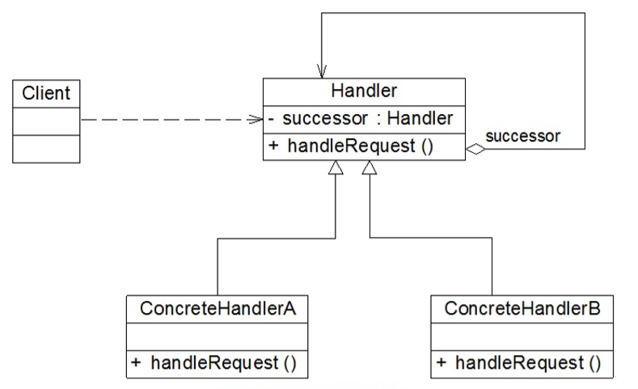

<center>职责链模式的结构图</center>

##### 职责链模式的实现

实现情景：某企业的 SCM（Supply Chain Management）供应链管理系统中包含一个采购单审批子系统。该采购审批是分级进行的，根据采购金额的不同由不同层次的人员来审批。主任 [ 0,5万 )、副董事长 [ 5 万, 10 万 )、董事长 [ 10 万, 50 万 ) 和董事会 [ 50 万, n ) 都可以处理采购单。

- 采购单类，充当请求类

```java
/**
 * 采购单类，充当请求类
 */
public class PurchaseRequest {
    //采购金额
    private double amount;
    //采购目的
    private String purpose;
    //采购单编号
    private int number;
	//省略 getter 和 setter
    public PurchaseRequest(double amount, int number, String purpose) {
        this.amount = amount;
        this.purpose = purpose;
        this.number = number;
    }
}
```

- 抽象处理者

```java
/**
 * 审批者类，充当抽象处理者
 */
public abstract class Approver {

    //定义后继对象
    protected Approver successor;
    //审批者名称
    protected String name;

    public Approver(String name) {
        this.name = name;
    }

    //设置后继者
    public void setSuccessor(Approver successor) {
        this.successor = successor;
    }

    //抽象请求处理方法
    public abstract void processRequest(PurchaseRequest request);
}
```

- 具体处理者

```java
/**
 * 主任类，充当具体处理者
 */
public class Director extends Approver {
    public Director(String name) {
        super(name);
    }

    //具体请求处理方法
    public void processRequest(PurchaseRequest request) {
        if (request.getAmount() < 50000) {
            System.out.println(
                    "主任" + this.name +
                            "审批采购单：" + request.getNumber() +
                            "，金额：" + request.getAmount() +
                            "元，采购目的：" + request.getPurpose() + ". ");
        } else {
            //转发请求
            this.successor.processRequest(request);
        }
    }
}

/**
 * 副董事长，充当具体处理者
 */
public class VicePresident extends Approver {
    public VicePresident(String name) {
        super(name);
    }

    //具体请求处理方法
    public void processRequest(PurchaseRequest request) {
        if (request.getAmount() < 100000) {
            System.out.println(
                    "副董事长" + this.name +
                            "审批采购单：" + request.getNumber() +
                            "，金额：" + request.getAmount() +
                            "元，采购目的：" + request.getPurpose() + ". ");
        } else {
            //转发请求
            this.successor.processRequest(request);
        }
    }
}

/**
 * 董事长，充当具体处理者
 */
public class President extends Approver {
    public President(String name) {
        super(name);
    }

    //具体请求处理方法
    public void processRequest(PurchaseRequest request) {
        if (request.getAmount() < 500000) {
            System.out.println(
                    "董事长" + this.name +
                            "审批采购单：" + request.getNumber() +
                            "，金额：" + request.getAmount() +
                            "元，采购目的：" + request.getPurpose() + ". ");
        } else {
            //转发请求
            this.successor.processRequest(request);
        }
    }
}

/**
 * 董事会，充当具体处理者
 */
public class Congress extends Approver {
    public Congress(String name) {
        super(name);
    }

    //具体请求处理方法
    public void processRequest(PurchaseRequest request) {
        System.out.println(this.name +
                "审批采购单：" + request.getNumber() +
                "，金额：" + request.getAmount() +
                "元，采购目的：" + request.getPurpose() + ". ");
    }
}
```

- 测试客户端

```java
/**
 * 职责链模式测试客户端
 */
public class ApproveRClient {

    public static void main(String[] args) {
        Approver wjzhang, gyang, jguo, meeting;
        wjzhang = new Director("张无忌");
        gyang = new VicePresident("杨过");
        jguo = new President("郭靖");
        meeting = new Congress("董事会");
        
        //创建职责链
        wjzhang.setSuccessor(gyang);
        gyang.setSuccessor(jguo);
        jguo.setSuccessor(meeting);
        
        //创建采购单
        PurchaseRequest pr1 = new PurchaseRequest(45000, 01, "购买倚天剑");
        wjzhang.processRequest(pr1);
        PurchaseRequest pr2 = new PurchaseRequest(60000, 02, "购买《葵花宝典》");
        wjzhang.processRequest(pr2);
        PurchaseRequest pr3 = new PurchaseRequest(160000, 03, "购买《金刚经》");
        wjzhang.processRequest(pr3);
        PurchaseRequest pr4 = new PurchaseRequest(800000, 04, "购买桃花岛");
        wjzhang.processRequest(pr4);
    }
}
```

总结：**职责链模式并不负责创建职责链，一般是在使用该职责链的客户端中创建职责链**。职责链模式通过建立一条链来组织请求的处理者，请求将沿着链进行传递。在软件开发中，如果遇到有多个对象可以处理同一请求时可以应用职责链模式，例如在 Web 应用开发中创建一个过滤器（Filter）链来对请求数据进行过滤，在工作流系统中实现公文的分级审批等。

##### 纯与不纯的职责链模式

- 纯的职责链模式

  它要求一个具体处理者对象只能在两个行为中选择一个：要么承担全部责 任，要么将责任推给下家，不允许出现某一个具体处理者对象在承担了一部分或全部责任后又将责任向下传递的情况。此外，还要求一个请求必须被某一个处理者对象所接收，不能出现某个请求未被任何一个处理者对象处理的情况。在前面实例就是纯的职责链模式。

- 不纯的职责链模式

  它允许某个请求被一个具体处理者部分处理后再向下传递，或者一 个具体处理者处理完某请求后其后继处理者可以继续处理该请求，而且一个请求可以最终不被任何处理者对象所接收。

##### 职责链模式的优缺点

优点：

- 职责链模式使得一个对象无须知道是其他哪一个对象处理其请求，对象仅需知道该请求会被处理即可，且链中的对象不需要知道链的结构， **由客户端负责链的创建**，降低了系统耦合度。
- 请求处理对象仅需维持一个指向其后继者的引用，而不需要维持它对所有的候选处理者的引用，可简化对象的相互连接。
- 在给对象分派职责时，职责链可以给我们更多的灵活性，可以通过在运行时对该链进行动态的增加或修改来增加或改变处理一个请求的职责。

缺点：

- 由于一个请求没有明确的接收者，那么就不能保证它一定会被处理，该请求可能一直到链的末端都得不到处理；一个请求也可能因职责链没有被正确配置而得不到处理。
- 对于比较长的职责链，请求的处理可能涉及到多个处理对象，系统性能将受到一定影响， 而且在进行代码调试时不太方便。
- 如果建链不当，可能会造成循环调用，将导致系统陷入死循环。

##### 职责链模式的适用环境

- 有多个对象可以处理同一个请求，具体哪个对象处理该请求待运行时刻再确定，客户端只需将请求提交到链上，而无须关心请求的处理对象是谁以及它是如何处理的。
- 在不明确指定接收者的情况下，向多个对象中的一个提交一个请求。
- 可动态指定一组对象处理请求，客户端可以动态创建职责链来处理请求，还可以改变链中处理者之间的先后次序。


### 命令模式

##### 命令模式概述及定义

- 概述：在软件开发中，我们经常需要向某些对象发送请求，但是并不知道请求的接收者是谁，也不知道被请求的操作是哪个，此时，我们特别希望能够以一种松耦合的方式来设计软件，使得请求发送者与请求接收者能够消除彼此之间的耦合，让对象之间的调用关系更加灵活，可以灵活地指定请求接收者以及被请求的操作。
- 定义：将一个请求封装为一个对象，从而让我们可用不同的请求对客户进行参数化；对请求排队或者记录请求日志，以及支持可撤销的操作。命令模式是一种对象行为型模式。

##### 命令模式的结构

- Command（抽象命令类）：抽象命令类一般是一个抽象类或接口，在其中声明了用于执行请求的 execute() 等方法，通过这些方法可以调用请求接收者的相关操作。
- ConcreteCommand（具体命令类）：具体命令类是抽象命令类的子类，实现了在抽象命令类 中声明的方法，它对应具体的接收者对象，将接收者对象的动作绑定其中。在实现 execute() 方 法时，将调用接收者对象的相关操作（Action）。
- Invoker（调用者）：调用者即请求发送者，它通过命令对象来执行请求。一个调用者并不需要在设计时确定其接收者，因此它只与抽象命令类之间存在关联关系。在程序运行时可以将一个具体命令对象注入其中，再调用具体命令对象的 execute() 方法，从而实现间接调用请求接收者的相关操作。
- Receiver（接收者）：接收者执行与请求相关的操作，它具体实现对请求的业务处理。

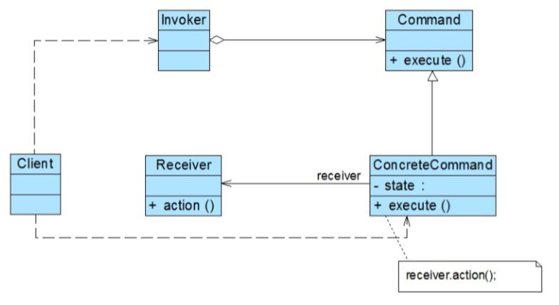

<center>命令模式的结构图</center>

##### 命令模式的实现

实现情景：为了方便用户使用，某系统提供了一系列功能键，用户可以自定义功能键的功能，例如功能键 FunctionButton 可以用于退出系统（由 SystemExit 类实现），也可以用于显示帮助文档（由 DisplayHelp 类实现）。

- 请求调用者

```java
/**
 * 功能键类，充当请求调用者
 */
public class FunctionButton {
    //维持一个抽象命令对象的引用
    private Command command;

    //将功能键注入命令
    public FunctionButton(Command command) {
        this.command = command;
    }

    public void click() {
        System.out.println("单击功能键！");
        command.execute();
    }
}
```

- 抽象命令类

```java
/**
 * 抽象命令类
 */
public abstract class Command {

    public abstract void execute();
}
```

- 具体命令类

```java
/**
 * 退出命令类，充当具体命令类
 */
public class ExitCommand extends Command {
    //维持对请求接收者的引用
    private SystemExit systemExit;

    public ExitCommand() {
        this.systemExit = new SystemExit();
    }

    //命令执行方法，将调用请求接收者的业务方法
    @Override
    public void execute() {
        systemExit.exit();
    }
}

/**
 * 帮助命令类，充当具体命令类
 */
public class HelpCommand extends Command {
    //维持对请求接收者的引用
    private DisplayHelp displayHelp;

    public HelpCommand() {
        this.displayHelp = new DisplayHelp();
    }

    //命令执行方法，将调用请求接收者的业务方法
    @Override
    public void execute() {
        displayHelp.display();
    }
}
```

- 请求接收者

```java
/**
 * 退出系统，充当请求接收者
 */
public class SystemExit {
    public void exit() {
        System.out.println("退出系统！");
    }
}

/**
 * 显示帮助文档，充当请求接收者
 */
public class DisplayHelp {
    public void display() {
        System.out.println("显示帮助文档！");
    }
}
```

- 测试客户端

```java
/**
 * 命令模式测试客户端
 */
public class CommandClient {
    public static void main(String[] args) {
        //可以通过配置文件配置具体命令类
        Command command = new HelpCommand();
        FunctionButton functionButton = new FunctionButton(command);

        functionButton.click();
        //单击功能键！
        //显示帮助文档！
    }
}
```

总结：如果需要增加新的功能，只需要对应增加一个新的具体命令类，在新的具体命令类中调用新功能类的业务方法。

##### 命令队列的实现

有时候我们需要将多个请求排队，当一个请求发送者发送一个请求时，将不止一个请求接收者产生响应，这些请求接收者将逐个执行业务方法，完成对请求的处理。此时，我们可以通过命令队列来实现。

命令队列最常用、灵活性最好的一种实现方式是增加一个 CommandQueue 类，由该类来负责存储多个命令对象，而不同的命令对象可以对应不同的请求接收者，CommandQueue 类的典型代码如下所示： 

```java
/**
 * CommandQueue 负责存储多个命令对象
 */
public class CommandQueue {
    //定义一个 List 来存储命令队列
    private List<Command> commandList = new ArrayList<>();

    public void addCommand(Command command) {
        commandList.add(command);
    }

    public void removeCommand(Command command) {
        commandList.remove(command);
    }

    //循环调用每一个命令对象的 execute() 方法
    public void execute() {
        for (Command command : commandList) {
            command.execute();
        }
    }
}
```

在增加了命令队列类 CommandQueue 以后，请求发送者类 Invoker 将针对 CommandQueue 编程， 代码修改如下：

```java
/**
 * Invoker 调用者
 */
public class Invoker {
    //维持一个 CommandQueue 对象的引用
    private CommandQueue commandQueue;

    //构造注入
    public Invoker(CommandQueue commandQueue) {
        this.commandQueue = commandQueue;
    }

    //调用 CommandQueue 类的 execute() 方法
    public void call() {
        commandQueue.execute();
    }
}
```

总结：命令队列与我们常说的“批处理”有点类似，可以对一组对象（命令）进行批量处理，当一个发送者发送请求后，将有一系列接收者对请求作出响应，命令队列可以用于设计批处理应用程序，如果请求接收者的接收次序没有严格的先后次序，我们还可以使用多线程技术来并发调用命令对象的 execute() 方法，从而提高程序的执行效率。

##### 撤销操作的实现

在命令模式中，我们可以通过调用一个命令对象的 execute() 方法来实现对请求的处理，如果需要撤销（Undo）请求，可通过在命令类中增加一个逆向操作来实现。

实现情景：开发一个简易的计算器，它可以实现简单的数学运算，还可以对运算实施撤销操作。

- 请求发送者

```java
/**
 * 充当请求发送者
 */
public class CalculatorForm {
    private AbstractCommand command;

    public void setCommand(AbstractCommand command) {
        this.command = command;
    }

    //调用命令对象的 execute() 方法执行运算
    public void compute(int value) {
        int i = command.execute(value);
        System.out.println("执行运算，运算结果为：" + i);
    }

    //调用命令对象的 undo() 方法执行撤销
    public void undo() {
        int i = command.undo();
        System.out.println("执行撤销，运算结果为：" + i);
    }
}
```

- 抽象命令类

```java
/**
 * 抽象命令类
 */
public abstract class AbstractCommand {
    //声明命令执行方法execute()
    public abstract int execute(int value);

    //声明撤销方法 undo()
    public abstract int undo();
}
```

- 具体命令类

```java
/**
 * 具体命令类
 */
public class ConcreteCommand extends AbstractCommand {
    private Adder adder = new Adder();
    private int value;

    //实现抽象命令类中声明的 execute() 方法，调用加法类的加法操作
    public int execute(int value) {
        this.value = value;
        return adder.add(value);
    }

    //实现抽象命令类中声明的 undo() 方法，通过加一个相反数来实现加法的逆向操作
    public int undo() {
        return adder.add(-value);
    }
}
```

- 请求接收者

```java
/**
 * 加法类，充当请求接收者
 */
public class Adder {
    //定义初始值为0
    private int num = 0;

    //加法操作，每次将传入的值与 num 作加法运算
    public int add(int value) {
        num += value;
        return num;
    }
}
```

- 测试客户端

```java
/**
 * 计算器测试客户端
 */
public class CalculatorClient {
    public static void main(String args[]) {
        CalculatorForm form = new CalculatorForm();
        AbstractCommand command;
        command = new ConcreteCommand();
        //向发送者注入命令对象
        form.setCommand(command);

        form.compute(10);
        form.compute(5);
        form.compute(20);
        form.undo();
    }
}
```

##### 宏命令

宏命令（Macro Command）又称为组合命令，它是组合模式和命令模式联用的产物。宏命令是一 个具体命令类，它拥有一个集合属性，在该集合中包含了对其他命令对象的引用。通常宏命令不直接与请求接收者交互，而是通过它的成员来调用接收者的方法。当调用宏命令的 execute() 方法时，将递归调用它所包含的每个成员命令的 execute() 方法，一个宏命令的成员可以是简单命令，还可以继续是宏命令。其结构图如下：

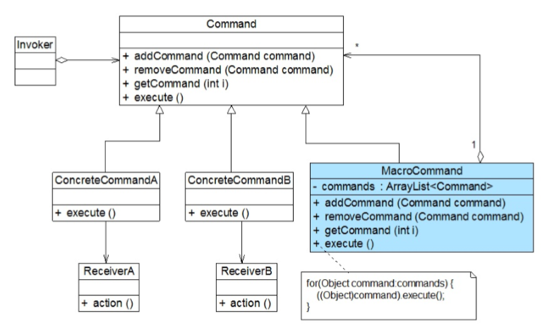

##### 命令模式的优缺点

优点：

- 降低系统的耦合度。由于请求者与接收者之间不存在直接引用，因此请求者与接收者之间实现完全解耦，相同的请求者可以对应不同的接收者，同样，相同的接收者也可以供不同的请求者使用，两者之间具有良好的独立性。、
- 可以比较容易地设计一个命令队列或宏命令（组合命令）。
- 为请求的撤销（Undo）和恢复（Redo）操作提供了一种设计和实现方案。

缺点：

- 使用命令模式可能会导致某些系统有过多的具体命令类。因为针对每一个对请求接收者的调用操作都需要设计一个具体命令类，因此在某些系统中可能需要提供大量的具体命令类。

##### 命令模式的适用环境

- 系统需要将请求调用者和请求接收者解耦，使得调用者和接收者不直接交互。请求调用者无须知道接收者的存在，也无须知道接收者是谁，接收者也无须关心何时被调用。
- 系统需要在不同的时间指定请求、将请求排队和执行请求。一个命令对象和请求的初始调用者可以有不同的生命期，换言之，最初的请求发出者可能已经不在了，而命令对象本身仍然是活动的，可以通过该命令对象去调用请求接收者，而无须关心请求调用者的存在性，可以通过请求日志文件等机制来具体实现。
- 系统需要支持命令的撤销（Undo）操作和恢复（Redo）操作。
- 系统需要将一组操作组合在一起形成宏命令。


### 解释器模式

##### 解释器模式概述及定义

- 概述：它用于描述如何使用面向对象语言构成一个简单的语言解释器。在某些情况下，为了更好地描述某一些特定类型的问题，我们可以创建一种新的语言，这种语言拥有自己的表达式和结构，即文法规则，这些问题的实例将对应为该语言中的句子。此时，可以使用解释器模式来设计这种新的语言。对解释器模式的学习能够加深我们对面向对象思想的理解，并且掌握编程语言中文法规则的解释过程。
- 定义：定义一个语言的文法，并且建立一个解释器来解释该语言中的句子，这里的“语言”是指使用规定格式和语法的代码。解释器模式是一种类行为型模式。

##### 文法规则和抽象语法树

如“1+2+3–4+1”，包含了三个语言单位，可以使用如下文法规则来定义：

```java
expression ::= value | operation
operation ::= expression '+' expression | expression '-' expression 
value ::= an integer //一个整数值
```

该文法规则包含三条语句，第一条表示表达式的组成方式，其中 value 和 operation 是后面两个语言单位的定义，每一条语句所定义的字符串如 operation 和 value 称为语言构造成分或语言单位，符号“::=”表示“定义为”的意思，其左边的语言单位通过右边来进行说明和定义，语言单位对应终结符表达式和非终结符表达式。如本规则中的 operation 是非终结符表达式，它的组成元素仍然可以是表达式，可以进一步分解，而 value 是终结符表达式，它的组成元素是最基本的语言单位，不能再进行分解。

在解释器模式中还可以通过一种称之为抽象语法树（Abstract Syntax Tree，AST）的图形方式来直观地表示语言的构成，每一棵抽象语法树对应一个语言实例。语句“1+2+3–4+1”可以用下图表示：

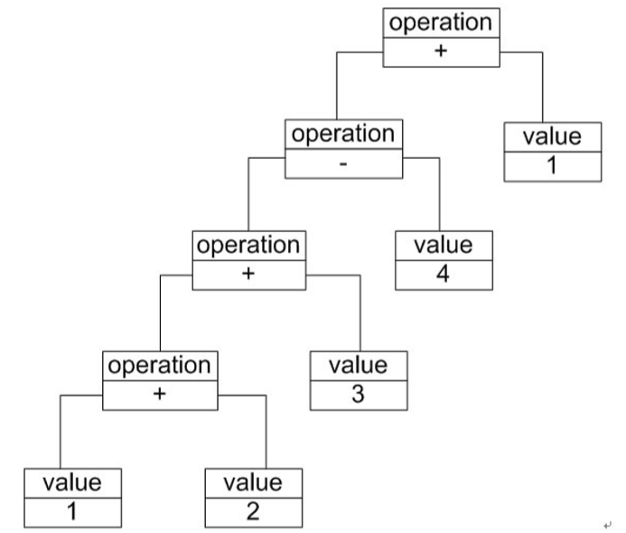

在该抽象语法树中，可以通过终结符表达式 value 和非终结符表达式 operation 组成复杂的语句，在图中终结符表达式类的实例作为树的叶子节点，而非终结符表达式类的实例作为非叶子节点，它们可以将终结符表达式类的实例以及包含终结符和非终结符实例的子表达式作为其子节点。抽象语法树描述了如何构成一个复杂的句子，通过对抽象语法树的分析，可以识别出语言中的终结符类和非终结符类。

##### 解释器模式的结构

解释器模式包含如下 4 个角色：

- AbstractExpression（抽象表达式）：在抽象表达式中声明了抽象的解释操作，它是所有终结 符表达式和非终结符表达式的公共父类。
- TerminalExpression（终结符表达式）：终结符表达式是抽象表达式的子类，它实现了与文法 中的终结符相关联的解释操作，在句子中的每一个终结符都是该类的一个实例。通常在一个解释器模式中只有少数几个终结符表达式类，它们的实例可以通过非终结符表达式组成较为复杂的句子。
- NonterminalExpression（非终结符表达式）：非终结符表达式也是抽象表达式的子类，它实现了文法中非终结符的解释操作，由于在非终结符表达式中可以包含终结符表达式，也可以继续包含非终结符表达式，因此其解释操作一般通过递归的方式来完成。
- Context（环境类）：环境类又称为上下文类，它用于存储解释器之外的一些全局信息，通常它临时存储了需要解释的语句。

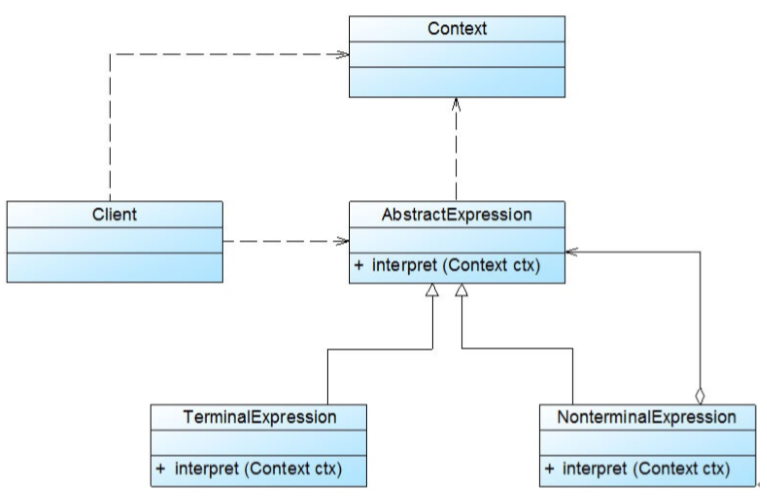

<center>解释器模式结构图</center>

##### 解释器模式的实现

实现场景：开发一套机器人控制程序，在该机器人控制程序中包含一些简单的英文控制指令，每一个指令对应一个表达式（expression），该表达式可以是简单表达式也可以是复合表达式，**每一个简单表达式由移动方向（direction），移动方式（action）和移动距离 （distance）三部分组成**，其中移动方向包括上（up）、下（down）、左（left）、右（right）；移动方式包括移动（move）和快速移动（run）；移动距离为一个正整数。**两个表达式之间可以通过与（and）连接，形成复合（composite）表达式。**

用户通过对图形化操作实现输入一个机器人控制指令，机器人在收到指令后将按照指令的设置进行移动。例如输入控制指令：down run 10 and left move 20，则“向下快速移动 10 个单位再向左移动 20 个单位”。文法规则如下：

```java
expression ::= direction action distance | composite //表达式 
composite ::= expression 'and' expression //复合表达式 
direction ::= 'up' | 'down' | 'left' | 'right' //移动方向 
action ::= 'move' | 'run' //移动方式 
distance ::= an integer	//移动距离
```


上述语言一共定义了五条文法规则，对应五个语言单位，这些语言单位可以分为两类，一类为终结符，例如 direction、action 和 distance，它们是语言的最小组成单位；另一类为非终结符，例如 expression 和 composite，它们都是一个完整的句子，包含一系列终结符或非终结符。

针对这五条文法规则，分别提供五个类来实现，其中终结符表达式 direction、action 和 distance 对应DirectionNode 类、ActionNode 类和 DistanceNode 类，非终结符表达式 expression 和 composite 对应 SentenceNode 类和 AndNode 类。我们可以通过抽象语法树来表示具体解释过程，例如机器人控制指令 “down run 10 and left move 20” 对应的抽象语法树如下图所示：

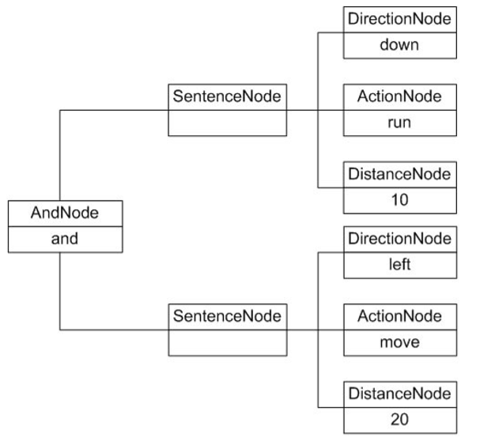

机器人控制程序实例基本结构如下图所示：

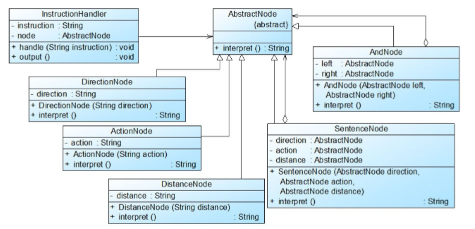

- 抽象表达式角色

```java
/**
 * 抽象结点类，充当抽象表达式角色
 */
public abstract class AbstractNode {
    public abstract String interpret();
}
```

- 终结符表达式角色

```java
/**
 * 方向结点类，充当终结符表达式角色
 */
public class DirectionNode extends AbstractNode {
    //移动方向
    private String direction;

    public DirectionNode(String direction) {
        this.direction = direction;
    }
    //方向表达式的解释操作
    @Override
    public String interpret() {
        if (direction.equalsIgnoreCase("up")) {
            return " 向上 ";
        } else if (direction.equalsIgnoreCase("down")) {
            return " 向下 ";
        } else if (direction.equalsIgnoreCase("left")) {
            return " 向左 ";
        } else if (direction.equalsIgnoreCase("right")) {
            return " 向右 ";
        } else {
            return " 未知方向 ";
        }
    }
}

/**
 * 动作结点类，充当终结符表达式角色
 */
public class ActionNode extends AbstractNode {
    //移动方式
    private String action;

    public ActionNode(String action) {
        this.action = action;
    }
    //动作表达式的解释操作
    @Override
    public String interpret() {
        if (action.equalsIgnoreCase("move")) {
            return " 移动 ";
        } else if (action.equalsIgnoreCase("run")) {
            return " 快速移动 ";
        } else {
            return " 未知动作 ";
        }
    }
}

/**
 * 距离结点类，充当终结符表达式角色
 */
public class DistanceNode extends AbstractNode {

    //移动距离
    private String distance;

    public DistanceNode(String distance) {
        this.distance = distance;
    }

    //距离表达式的解释操作
    @Override
    public String interpret() {
        return distance;
    }
}
```

- 非终结符表达式角色

```java
/**
 * 简单表达式结点类，充当非终结符表达式角色
 */
public class SentenceNode extends AbstractNode {
    private AbstractNode direction;
    private AbstractNode action;
    private AbstractNode distance;

    public SentenceNode(AbstractNode direction, AbstractNode action, AbstractNode 			distance) {
        this.direction = direction;
        this.action = action;
        this.distance = distance;
    }

    //简单表达式句子的解释操作
    @Override
    public String interpret() {
        return direction.interpret() + action.interpret() + distance.interpret();
    }
}

/**
 * 复合表达式结点类，充当非终结符表达式角色
 */
public class AndNode extends AbstractNode{
    //左结点
    private AbstractNode leftNode;
    //右结点
    private AbstractNode rightNode;

    public AndNode(AbstractNode leftNode, AbstractNode rightNode) {
        this.leftNode = leftNode;
        this.rightNode = rightNode;
    }

    @Override
    public String interpret() {
        return leftNode.interpret() + "再"+rightNode.interpret();
    }
}
```

- 指令处理类

```java
/**
 * 指令处理类，提供相应的方法对输入的指定进行处理
 */
public class InstructionHandler {

    private AbstractNode node;

    public void handle(String instruction) {
        AbstractNode left = null, right = null;
        AbstractNode direction = null, action = null, distance = null;
        //声明一个栈对象用于存储抽象语法树
        Stack<AbstractNode> stack = new Stack<>();

        //以空格分隔指令字符串
        String[] words = instruction.split(" ");
        for (int i = 0; i < words.length; i++) {
            //本实例采用栈的方式来处理指令，如果遇到“and”，则将其后的三个单词作为三个终结符表达式连成一个
            if (words[i].equalsIgnoreCase("and")) {

                // 弹出栈顶表达式作为左表达式
                left = stack.pop();
                String word1 = words[++i];
                direction = new DirectionNode(word1);
                String word2 = words[++i];
                action = new ActionNode(word2);
                String word3 = words[++i];
                distance = new DistanceNode(word3);

                //右表达式
                right = new SentenceNode(direction, action, distance);
                //将新表达式压入栈中
                stack.push(new AndNode(left, right));
            } else {
                //如果是从头开始进行解释
                // 则将前三个单词组成一个简单句子 SentenceNode 并将该句
                String word1 = words[i];
                direction = new DirectionNode(word1);
                String word2 = words[++i];
                action = new ActionNode(word2);
                String word3 = words[++i];
                distance = new DistanceNode(word3);

                left = new SentenceNode(direction, action, distance);
                //将新表达式压入栈中
                stack.push(left);
            }
        }
        //将全部表达式从栈中弹出
        this.node = stack.pop();
    }

    public String output() {
        return node.interpret();
    }
}
```

- 测试客户端

```java
/**
 * 解释器模式测试客户端
 */
public class InterpreterClient {
    public static void main(String[] args) {
        String instruction = "down run 10 and left move 20";
        //创建指定处理类
        InstructionHandler handler = new InstructionHandler();
        handler.handle(instruction);
        String output = handler.output();

        //输入指令对应的操作
        System.out.println(output);
    }
}
```

总结：

##### 解释器模式的优缺点

优点：

- 易于改变和扩展文法。由于在解释器模式中使用类来表示语言的文法规则，因此可以通过继承等机制来改变或扩展文法。
- 每一条文法规则都可以表示为一个类，因此可以方便地实现一个简单的语言。
- 实现文法较为容易。在抽象语法树中每一个表达式节点类的实现方式都是相似的，这些类的代码编写都不会特别复杂，还可以通过一些工具自动生成节点类代码。
- 增加新的解释表达式较为方便。如果用户需要增加新的解释表达式只需要对应增加一个新的终结符表达式或非终结符表达式类，原有表达式类代码无须修改，符合“开闭原则”。

缺点：

- 对于复杂文法难以维护。在解释器模式中，每一条规则至少需要定义一个类，因此如果一个语言包含太多文法规则，类的个数将会急剧增加，导致系统难以管理和维护，此时可以考虑使用语法分析程序等方式来取代解释器模式。
- 执行效率较低。由于在解释器模式中使用了大量的循环和递归调用，因此在解释较为复杂的句子时其速度很慢，而且代码的调试过程也比较麻烦。

##### 解释器模式的适用环境

- 可以将一个需要解释执行的语言中的句子表示为一个抽象语法树。
- 一些重复出现的问题可以用一种简单的语言来进行表达。
- 一个语言的文法较为简单。
- 执行效率不是关键问题。（注：高效的解释器通常不是通过直接解释抽象语法树来实现的，而是需要将它们转换成其他形式，使用解释器模式的执行效率并不高。）


### 迭代器模式

##### 迭代器模式概述及定义

概述：在软件开发中，我们经常需要使用聚合对象来存储一系列数据。聚合对象拥有两个职责：一 是**存储数据**；二是**遍历数据**。从依赖性来看，前者是聚合对象的基本职责；而后者既是可变化的，又是可分离的。因此，可以将遍历数据的行为从聚合对象中分离出来，封装在一个被称之为“迭代器”的对象中，由迭代器来提供遍历聚合对象内部数据的行为，这将简化聚合对象的设计，更符合“单一职责原则”的要求。

定义：提供一种方法来访问聚合对象，而不用暴露这个对象的内部表示，其别名为游标（Cursor）。迭代器模式是一种对象行为型模式。

##### 迭代器模式的结构

迭代器模式包含如下 4 个角色：

- **Iterator（抽象迭代器）**：它定义了访问和遍历元素的接口，声明了用于遍历数据元素的方法，例如：用于获取第一个元素的 first() 方法，用于访问下一个元素的 next() 方法，用于判断是否还有下一个元素的 hasNext() 方法，用于获取当前元素的 currentItem() 方法等，在具体迭代器中将实现这些方法。
- **ConcreteIterator（具体迭代器）**：它实现了抽象迭代器接口，完成对聚合对象的遍历，同时在具体迭代器中通过游标来记录在聚合对象中所处的当前位置，在具体实现时，游标通常是一个表示位置的非负整数。
- **Aggregate（抽象聚合类）**：它用于存储和管理元素对象，声明一个 createIterator() 方法用于 创建一个迭代器对象，充当抽象迭代器工厂角色。
- **ConcreteAggregate（具体聚合类）**：它实现了在抽象聚合类中声明的 createIterator() 方法，该 方法返回一个与该具体聚合类对应的具体迭代器 ConcreteIterator 实例。

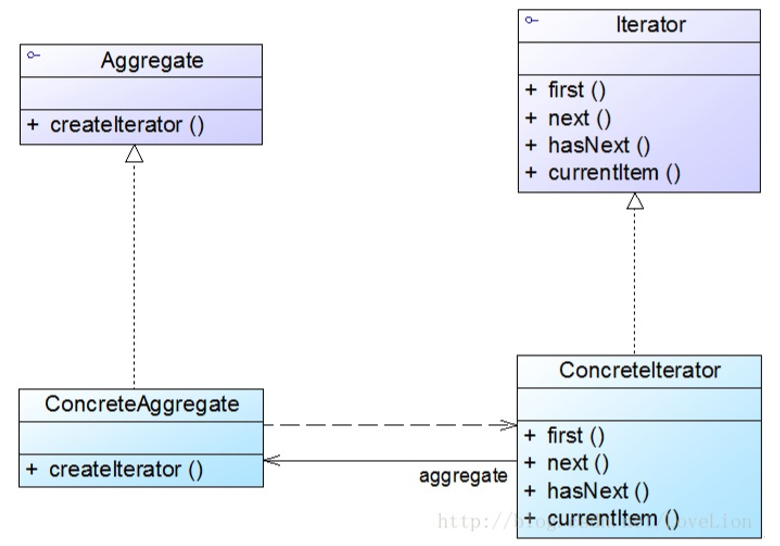

<center>迭代器模式结构图</center>

##### 迭代器模式的实现

实现场景：为某商场开发一套销售管理系统，对该系统进行分析和设计时，开发人员发现需要经常对系统中的商品数据进行遍历，为了复用这些遍历代码，开发人员设计了一个抽象的数据集合类 AbstractObjectList ，而将存储商品数据的类作为其子类。

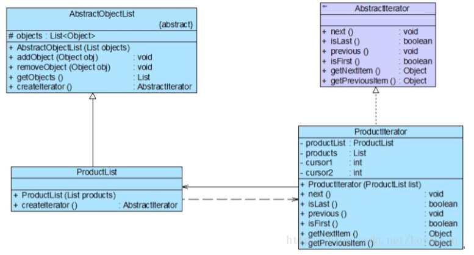

<center>数据遍历结构图</center>

- 抽象聚合类

```java
/**
 * 抽象聚合类
 */
public abstract class AbstractObjectList {
    protected List<Object> objects;

    public AbstractObjectList(List<Object> objects) {
        this.objects = objects;
    }

    public void addObject(Object obj) {
        this.objects.add(obj);
    }

    public void removeObject(Object obj) {
        this.objects.remove(obj);
    }

    public List<Object> getObjects() {
        return this.objects;
    }

    //声明创建迭代器对象的抽象工厂方法
    public abstract AbstractIterator createIterator();
}
```

- 具体聚合类

```java
/**
 * 具体聚合类
 */
public class ProductList extends AbstractObjectList {

    public ProductList(List<Object> objects) {
        super(objects);
    }

    @Override
    public AbstractIterator createIterator() {
        return new ProductIterator(this);
    }
}
```

- 抽象迭代器

```java
/**
 * 抽象迭代器
 */
public interface AbstractIterator {
    //移至下一个元素
    void next();
    //判断是否为最后一个元素
    boolean isLast();
    //移至上一个元素
    void previous();
    //判断是否为第一个元素
    boolean isFirst();
    //获取下一个元素
    Object getNextItem();
    //获取上一个元素
    Object getPreviousItem();
}
```

- 具体迭代器

```java
/**
 * 具体迭代器
 */
public class ProductIterator implements AbstractIterator {
    private List<Object> products;
    //记录正向遍历的游标
    private int cursor;
    //记录逆向遍历的游标
    private int cursor2;

    public ProductIterator(ProductList productList) {
        //获取集合对象
        this.products = productList.getObjects();
        //设置正向遍历游标的初始值
        this.cursor = 0;
        //设置逆向遍历游标的初始值
        this.cursor2 = products.size() - 1;
    }
    @Override
    public void next() {
        if (cursor < products.size()) {
            cursor++;
        }
    }
    @Override
    public boolean isLast() {
        return cursor == products.size();
    }
    @Override
    public void previous() {
        if (cursor2 > -1) {
            cursor2--;
        }
    }
    @Override
    public boolean isFirst() {
        return cursor2 == -1;
    }
    @Override
    public Object getNextItem() {
        return products.get(cursor);
    }
    @Override
    public Object getPreviousItem() {
        return products.get(cursor2);
    }
}
```

- 测试客户端

```java
/**
 * 迭代器模式测试客户端
 */
public class IteratorClient {

    public static void main(String[] args) {
        List<Object> products = Arrays.asList("11","22","33","44","55");

        ProductList productList = new ProductList(products);
        AbstractIterator iterator = productList.createIterator();

        System.out.println("正向遍历");
        while (!iterator.isLast()) {
            System.out.println(iterator.getNextItem());
            iterator.next();
        }
        System.out.println("逆向遍历");
        while (!iterator.isFirst()) {
            System.out.println(iterator.getPreviousItem());
            iterator.previous();
        }
    }
}
```

##### 迭代器模式的优缺点

优点：

- 它支持以不同的方式遍历一个聚合对象，在同一个聚合对象上可以定义多种遍历方式。
- 迭代器简化了聚合类。由于引入了迭代器，在原有的聚合对象中不需要再自行提供数据遍历等方法，这样可以简化聚合类的设计。
- 由于引入了抽象层，增加新的聚合类和迭代器类都很方便，无须修改原有代码，满足“开闭原则”的要求。

缺点：

- 由于迭代器模式将存储数据和遍历数据的职责分离，增加新的聚合类需要对应增加新的迭代器类，类的个数成对增加，这在一定程度上增加了系统的复杂性。
- 抽象迭代器的设计难度较大，需要充分考虑到系统将来的扩展，例如 JDK 内置迭代器 Iterator 就无法实现逆向遍历，如果需要实现逆向遍历，只能通过其子类 ListIterator 等来实现， 而 ListIterator 迭代器无法用于操作 Set 类型的聚合对象。

##### 迭代器模式的适用环境

- 访问一个聚合对象的内容而无须暴露它的内部表示。将聚合对象的访问与内部数据的存储分离，使得访问聚合对象时无须了解其内部实现细节。
- 需要为一个聚合对象提供多种遍历方式。
- 为遍历不同的聚合结构提供一个统一的接口，在该接口的实现类中为不同的聚合结构提供不同的遍历方式，而客户端可以一致性地操作该接口。

### 中介者模式

##### 中介者模式的概述及定义

概述：如果在一个系统中对象之间存在多对多的相互关系，我们可以将对象之间的一些交互行为从 各个对象中分离出来，并集中封装在一个中介者对象中，并由该中介者进行统一协调，这样对象之间多对多的复杂关系就转化为相对简单的一对多关系。通过引入中介者来简化对象之间的复杂交互，中介者模式是“迪米特法则”的一个典型应用。

定义：用一个中介对象（中介者）来封装一系列的对象交互，中介者使各对象不需要显式地相互引用，从而使其耦合松散，而且可以独立地改变它们之间的交互。中介者模式又称为调停者模式，它是一种对象行为型模式。

##### 中介者模式的结构

中介者模式包含如下 4 个角色：

- **Mediator（抽象中介者）**：它定义一个接口，该接口用于与各同事对象之间进行通信。
- **ConcreteMediator（具体中介者）**：它是抽象中介者的子类，通过协调各个同事对象来实现协作行为，它维持了对各个同事对象的引用。
- **Colleague（抽象同事类）**：它定义各个同事类公有的方法，并声明了一些抽象方法来供子类 实现，同时它维持了一个对抽象中介者类的引用，其子类可以通过该引用来与中介者通信。
- **ConcreteColleague（具体同事类）**：它是抽象同事类的子类；每一个同事对象在需要和其他 同事对象通信时，先与中介者通信，通过中介者来间接完成与其他同事类的通信；在具体同事类中实现了在抽象同事类中声明的抽象方法。

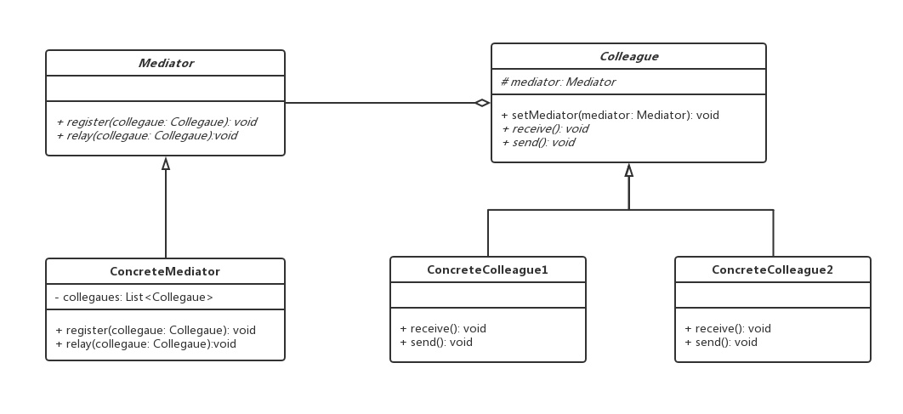

<center>中介者模式结构图</center>

##### 中介者模式的实现

- 抽象中介者

```java
/**
 * 抽象中介者类
 */
public abstract class Mediator {
    //注册同事对象
    abstract void register(Colleague colleague);
    //通知中介者，发送消息
    abstract void relay(Colleague colleague);
}
```

- 具体中介者

```java
/***
 * 具体中介者类
 */
public class ConcreteMediator extends Mediator {

    /**
     * 被中介者协调的同事对象
     */
    private List<Colleague> colleagues;

    public ConcreteMediator() {
        colleagues = new ArrayList<>();
    }

    //注册同事对象到中介者对象的集合中
    public void register(Colleague colleague) {
        if (!colleagues.contains(colleague)) {
            //添加同事对象
            this.colleagues.add(colleague);
            //同事对象维持一个中介者对象
            colleague.setMediator(this);
        }
    }

    //转发请求
    public void relay(Colleague colleague) {
        for (Colleague c : colleagues) {
            if (!c.equals(colleague)) {
                c.receive();
            }
        }
    }
}
```

- 抽象同事类

```java
/**
 * 抽象同事类
 */
public abstract class Colleague {

    //维持一个中介者对象的引用
    protected Mediator mediator;

    //接受消息
    public abstract void receive();

    //发送消息
    public abstract void send();

    public void setMediator(Mediator mediator) {
        this.mediator = mediator;
    }
}
```

- 具体同事类

```java
/**
 * 具体同事类1
 */
public class ConcreteColleague1 extends Colleague {
    @Override
    public void receive() {
        System.out.println("colleague1 receive message.");
    }

    @Override
    public void send() {
        System.out.println("colleague1 send message.");
        //请求中介者转发
        this.mediator.relay(this);
    }
}

/**
 * 具体同事类2
 */
public class ConcreteColleague2 extends Colleague {
    @Override
    public void receive() {
        System.out.println("colleague2 receive message.");
    }

    @Override
    public void send() {
        System.out.println("colleague2 send message.");
        //请求中介者转发
        this.mediator.relay(this);
    }
}
```

- 测试客户端

```java
/**
 * 中介者模式测试客户端
 */
public class MediatorClient {
    public static void main(String[] args) {
        //构建中介者对象
        Mediator mediator = new ConcreteMediator();

        //构建具体同事对象
        Colleague colleague1 = new ConcreteColleague1();
        Colleague colleague2 = new ConcreteColleague2();

        //注册同事
        mediator.register(colleague1);
        mediator.register(colleague2);

        //发送消息
        colleague1.send();
        colleague2.send();
    }
}
```

##### 中介者模式的优缺点

优点：

- 中介者模式简化了对象之间的交互，它用中介者和同事的一对多交互代替了原来同事之间的多对多交互，一对多关系更容易理解、维护和扩展，将原本难以理解的网状结构转换成相对简单的星型结构。
- 中介者模式可将各同事对象解耦。中介者有利于各同事之间的松耦合，我们可以独立的改变和复用每一个同事和中介者，增加新的中介者和新的同事类都比较方便，更好地符合“开闭原则”。
- 可以减少子类生成，中介者将原本分布于多个对象间的行为集中在一起，改变这些行为只需生成新的中介者子类即可，这使各个同事类可被重用，无须对同事类进行扩展。

缺点：

- 在具体中介者类中包含了大量同事之间的交互细节，可能会导致具体中介者类非常复杂，使得系统难以维护。

##### 中介者模式的适用环境

- 系统中对象之间存在复杂的引用关系，系统结构混乱且难以理解。
- 一个对象由于引用了其他很多对象并且直接和这些对象通信，导致难以复用该对象。
- 想通过一个中间类来封装多个类中的行为，而又不想生成太多的子类。可以通过引入中介者类来实现，在中介者中定义对象交互的公共行为，如果需要改变行为则可以增加新的具体中介者类。

### 备忘录模式


### 观察者模式


### 状态模式


### 策略模式


### 模板方法模式


### 访问者模式

